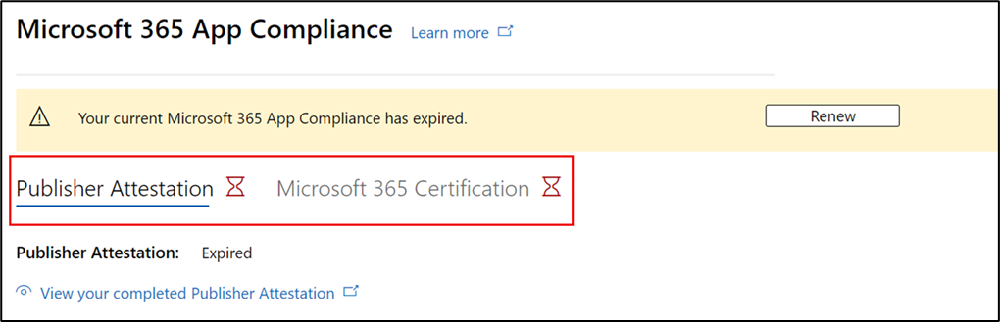

# Guía del usuario del asociado para Microsoft 365 programa de cumplimiento de aplicaciones: SaaS

|Fase|Título|
|---|---|
|Fase 1| Atestación del editor|
|Fase 2| Certificación Microsoft 365|

## 1. Información general 

Este documento actúa como una guía de usuario paso a paso para nuestros asociados, inscritos para Microsoft 365 programa de cumplimiento de aplicaciones con el objetivo de someterse a Publisher atestación y certificación para sus aplicaciones SaaS, a través del portal del Centro de partners.

>[!IMPORTANT]
>Esta guía solo se aplica a las aplicaciones SaaS aprobadas y en la lista blanca por el equipo de cumplimiento de aplicaciones Microsoft 365. Si la aplicación no está en la lista blanca, no podrá continuar en el Centro de partners. Para obtener la lista blanca de SaaS, póngase en contacto con appcert@microsoft.com.

## 2. Acrónimos & definiciones
|Acrónimo | Definición |
|----|----|
|[PC (Centro de partners)](https://partner.microsoft.com/)|Un portal para todos los asociados de Microsoft. Un asociado inicia sesión en el Centro de partners y envía un cuestionario de autoevaluación. Centro de partners para [el cumplimiento de aplicaciones Microsoft 365](https://partner.microsoft.com/dashboard/home)|
|ISV | Proveedor de software independiente a.k.a. Partner o Developer |
|Origen de la aplicación | Catálogo de aplicaciones |
|Ejemplo |[Ahora agente virtual](https://appsource.microsoft.com/product/office/WA104381816)|

## 3. flujo de trabajo de atestación de Publisher

**Página principal**: esta es la página de aterrizaje una vez que un asociado inicia sesión en el Centro de partners.

  
**Paso 1** : Seleccionar ofertas de Marketplace

  
**Paso 2**: Después de seleccionar "Ofertas de Marketplace", cambie a "Marketplace comercial".

Seleccione una aplicación de la lista y aparecerá otra barra de navegación con la opción "Cumplimiento de la aplicación".
  
**Paso 3**: Seleccionar "Cumplimiento de aplicaciones"
  

  
**Paso 4**: Rellene el cuestionario de autoevaluación para Publisher Atestación.

  
**NOTA Si vuelve a actualizar o volver a enviar la aplicación, haga clic en la lista desplegable "Elegir el producto", seleccione la aplicación y haga clic en "Clonar".**

**También puede aprovechar la característica Import/Export para completar el formulario sin conexión e importarlo una vez completado.**

 
**Paso 5**: Una vez completado, haga clic en "Enviar", la evaluación será ahora "En revisión".
 
  
  
**Escenarios de aprobación o rechazo:**
  
R. rechazo de atestación de Publisher
- En caso de rechazo, un asociado puede:
     - Ver informe de errores
          - El asociado recibirá una notificación por correo electrónico y puede ver el informe de errores en el Centro de partners.
     - Actualizar y volver a enviar el cuestionario de autoevaluación.
        

B.  Publisher aprobación de atestación
- Tras la aprobación, el asociado puede:
     - Actualizar y volver a enviar la atestación
     - Ver la atestación Publisher completada
     - Iniciar el proceso de certificación de Microsoft 365
        
        
  
 
  
**Aprobación posterior Publisher atestación: ejemplo de vínculo en AppSource para aplicaciones atestiguadas por el publicador.**
  

   
## 4. Flujo de trabajo de certificación de Microsoft 365
  
Un asociado puede iniciar el proceso de certificación seleccionando la casilla y haciendo clic en "Enviar"
  
 
  
**Paso 1**: Envío inicial de documentos

Rellene todos los detalles, cargue los documentos pertinentes y haga clic en "Enviar".
  
 

  
Al hacer clic en Enviar, el envío inicial del documento se revisará.

  
Un analista solicita una revisión en caso de que los documentos iniciales no sean suficientes o pertinentes. El analista trabajará con el asociado para ayudar a obtener los documentos adecuados para su aprobación.

Una vez que el analista aprueba el envío inicial del documento, el asociado debe enviar los requisitos de control.
  
**Paso 2**: Control del envío de requisitos
  
Rellene todos los detalles, cargue los documentos pertinentes y haga clic en "Enviar".

  

 
Al hacer clic en Enviar, el envío inicial del documento se revisará.

  
Un analista solicita una revisión en caso de que los documentos de requisito de control no sean suficientes o pertinentes. El analista trabajará con el asociado para ayudar a obtener los documentos adecuados para su aprobación.

  
 
 
En caso de que el envío no cumpla los estándares de aprobación, el analista rechazará el envío.
  
El asociado puede trabajar con el analista para proporcionar la información y los documentos pertinentes.

  
Una vez que se cumplan todos los estándares de seguridad, el analista aprobará el envío y el asociado se Microsoft 365 certificado.

  
**Aprobación posterior a la certificación: ejemplo de Microsoft 365 distintivo de certificación en AppSource.** 

 
## 5. flujo de trabajo de renovación de Microsoft 365:
  
**Microsoft 365Publisher flujo de trabajo de atestación y renovación de certificación:**  

Microsoft 365 programa de cumplimiento de aplicaciones ahora ofrece un proceso de renovación anual. Durante este proceso, los desarrolladores de aplicaciones pueden actualizar sus cuestionarios de atestación de Publisher existentes y los documentos necesarios para la certificación de Microsoft 365. 
 
**Ventajas:** 

- Mantenga el distintivo de certificación en AppSource, la Tienda Office, la Tienda Teams y varios portales de administración para diferenciar la aplicación de otras. 
- Aumente la confianza del cliente en el uso de la aplicación certificada. 
- Ayude a los administradores de TI a tomar decisiones informadas con información de certificación actualizada.

El nuevo proceso de renovación está disponible en el [Centro de partners](https://partner.microsoft.com/dashboard/home) para proporcionar una experiencia perfecta. Se mostrará un recordatorio de renovación en el Centro de partners a partir de 90 días antes de la fecha de expiración. Los avisos periódicos también se enviarán por correo electrónico a los 90, 60 y 30 días antes de la expiración. 
 
**Fase 1: renovación de atestación Publisher:**
  
Las respuestas Publisher atestación de la aplicación tendrán que volver a enviarse anualmente. Cuando la atestación se acerque a la marca de 1 año, se enviará un recordatorio por correo electrónico animando a volver a enviar la atestación. 
 
**Paso 1**: Seleccione **Renovar** para renovar la atestación de Publisher.
  

  
**Paso 2**: Revise las respuestas Publisher atestación anteriores y actualice con la información más reciente según sea necesario. 
  
Envíe Publisher atestación para su renovación cuando esté listo. Será revisado por un analista de cumplimiento de aplicaciones M365.

  
**Publisher Renovación de atestación aprobada:**
  

  
**Publisher Atestación expirada:**
  
La información de la aplicación debe renovarse antes de la fecha de expiración para mantener la página de atestación Publisher de la aplicación en los documentos de Microsoft. La renovación oportuna también garantizará la continuación de los errores e iconos de la aplicación en varios escaparates. 
 

**Nota**: Una vez expirado, Publisher proceso de renovación de atestación se puede iniciar en cualquier momento haciendo clic en "Renovar".
 
**Fase 2: renovación de certificación Microsoft 365**
  
La información de certificación de la aplicación debe volver a enviarse anualmente. Esto requerirá la revalidación de los controles en el ámbito del entorno actual. Cuando la certificación se aproxima a 1 año, se enviará una notificación por correo electrónico animando a volver a enviar los documentos y las pruebas.
 
 

**Escenarios de aprobación o rechazo de renovación de certificación:**

**Escenario 1:** 

Se ha iniciado la renovación de la certificación y se está revisando.
 
 

Escenario 1A: 

Rechazo de renovación de certificación: 
- La certificación puede rechazarse si: 
     - La aplicación no tiene las herramientas, procesos o configuraciones necesarias y no podrá implementar los cambios necesarios en la ventana de certificación. 
     - La aplicación tiene vulnerabilidades pendientes en su lugar y no se puede corregir en la ventana de certificación. 
 

Escenario 1B: 

Se aprueba la renovación de certificación

**Expiración de la certificación:**

La información de la aplicación debe renovarse antes de la fecha de expiración para mantener la página Certificación de la aplicación en los documentos de Microsoft. La renovación oportuna también garantizará la continuación de los errores e iconos de la aplicación en AppSource y Team Store.

  
Nota: Una vez expirado, Publisher proceso de atestación y certificación se puede iniciar en cualquier momento haciendo clic en "Renovar". 
