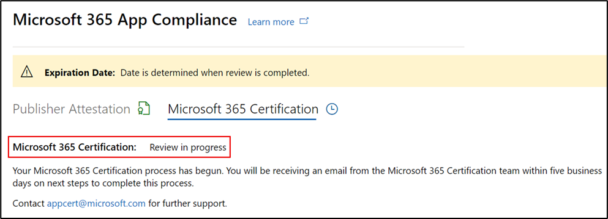

# Guía del usuario del partner para el Microsoft 365 cumplimiento de aplicaciones : SaaS

|Fase|Título|
|---|---|
|Fase 1| Atestación del editor|
|Fase 2| Certificación Microsoft 365|

## 1. Información general 

Este documento actúa como una guía de usuario paso a paso para nuestros partners, inscritos en un programa de cumplimiento de aplicaciones de Microsoft 365 con el objetivo de someterse Publisher una certificación y certificación para sus aplicaciones SaaS, a través del portal del Centro de partners.

## 2. Acrónimos & definiciones
|Acrónimo | Definición |
|----|----|
|[PC (Centro de partners)](https://partner.microsoft.com/)|Un portal para todos los partners de Microsoft. Un partner inicia sesión en el Centro de partners y envía un cuestionario de autoevaluación. Centro de partners [para Microsoft 365 cumplimiento de aplicaciones](https://partner.microsoft.com/dashboard/home)|
|ISV | Proveedor de software independiente a.k.a. Partner o Developer |
|Origen de la aplicación | Catálogo de aplicaciones |
|Ejemplo |[Agente virtual ahora](https://appsource.microsoft.com/product/office/WA104381816)|

## 3. Publisher flujo de trabajo de atestación

**Página principal:** esta es la página de aterrizaje cuando un partner inicia sesión en el Centro de partners.

  
**Paso 1** : En el lado izquierdo de la página, en la barra de navegación:

- Select Commercial Marketplace
- Seleccionar información general

  
Al seleccionar "Información general", el partner puede ver la lista de aplicaciones disponibles para iniciar el programa Microsoft 365 cumplimiento.
  
**Paso 2:** Seleccione una aplicación de la lista para comenzar el proceso Publisher atestación.

Al seleccionar una aplicación, aparecerá otra barra de navegación con la opción "Cumplimiento de la aplicación".
  
**Paso 3:** Seleccionar "Cumplimiento de aplicaciones"
  

  
**Paso 4:** Rellenar el cuestionario de autoevaluación para la Publisher atestación.

  
**NOTA Si vuelve a actualizar o volver a enviar la aplicación, haga clic en la lista desplegable para "Elegir el producto", seleccione la aplicación y haga clic en "Clonar".**

**También puede aprovechar la característica Import/Export para completar el formulario sin conexión e importarlo una vez completado.**

 
**Paso 5:** Una vez completado, haga clic en "Enviar", la evaluación será ahora "En revisión".
 
  
  
**Escenarios de aprobación o rechazo:**
  
R: Publisher Rechazo de atestación
- En caso de rechazo, un partner puede:
     - Ver informe de errores
          - El partner recibirá una notificación por correo electrónico y podrá ver el informe de errores en el Centro de partners
     - Actualizar y volver a enviar el cuestionario de autoevaluación.
        

B.  Publisher Aprobación de atestación
- Tras la aprobación, el partner puede:
     - Actualizar y volver a enviar la atestación
     - Ver atestación Publisher completa
     - Iniciar el proceso de Microsoft 365 de certificación
        
        
  
 
  
**Post Publisher aprobación de atestación: Ejemplo de vínculo en AppSource para aplicaciones atestiguadas por el editor.**
  

   
## 4. Microsoft 365 de certificación
  
Un partner puede comenzar el proceso de certificación seleccionando la casilla y haciendo clic en "Enviar"
  
 
  
**Paso 1:** Envío inicial de documentos

Rellene todos los detalles, cargue documentos relevantes y haga clic en 'Enviar'
  
 
 
  
Al hacer clic en enviar, se revisará el envío inicial del documento.

  
Un analista solicita una revisión en caso de que los documentos iniciales no sean suficientes o relevantes. El analista trabajará con el partner para obtener los documentos adecuados para su aprobación.

Una vez que el analista aprueba el envío inicial del documento, el partner debe enviar los requisitos de control.
  
**Paso 2:** Envío de requisitos de control
  
Rellene todos los detalles, cargue documentos relevantes y haga clic en 'Enviar'

  

 
Al hacer clic en Enviar, se revisará el envío inicial del documento.

  
Un analista solicita una revisión en caso de que los documentos de requisitos de control no sean suficientes o relevantes. El analista trabajará con el partner para obtener los documentos adecuados para su aprobación.

  
 
 
En caso de que el envío no cumpla los estándares de aprobación, el analista rechazará el envío.
  
El partner puede trabajar con el analista para proporcionar la información y los documentos pertinentes.

  
Una vez que se hayan cumplido todos los estándares de seguridad, el analista aprobará el envío y el partner se Microsoft 365 certificado.

  
**Aprobación posterior a la certificación: ejemplo Microsoft 365 distintivo de certificación en AppSource.** 

 
## 5. Microsoft 365 de renovación:
  
**Microsoft 365Publisher flujo de trabajo de renovación de certificación y certificación:**  

Microsoft 365 El programa de cumplimiento de aplicaciones ahora ofrece un proceso de renovación anual. Durante este proceso, los desarrolladores de aplicaciones pueden actualizar sus Publisher cuestionario de atestación y los documentos necesarios para la Microsoft 365 certificación. 
 
**Ventajas:** 

- Mantenga el distintivo de certificación en AppSource, la tienda Office, la Tienda Teams y varios portales de administración para diferenciar la aplicación de otras. 
- Aumente la confianza del cliente en el uso de la aplicación certificada. 
- Ayude a los administradores de TI a tomar decisiones fundamentadas con información de certificación actualizada.

El nuevo proceso de renovación está disponible en el [Centro de partners](https://partner.microsoft.com/dashboard/home) para proporcionar una experiencia perfecta. Se mostrará un aviso de renovación en el Centro de partners a partir de 90 días antes de la fecha de expiración. Los avisos periódicos también se enviarán por correo electrónico 90, 60 y 30 días antes de la expiración. 
 
**Fase 1: Publisher renovación de atestación:**
  
Las respuestas Publisher atestación de la aplicación tendrán que volver a enviarse anualmente. Cuando la atestación se acerca a la marca de 1 año, se enviará un aviso por correo electrónico animando a volver a enviar la atestación. 
 
**Paso 1:** Seleccione **Renovar** para renovar la Publisher atestación.
  

  
**Paso 2:** Revise las respuestas Publisher atestación y actualice con la información más reciente según sea necesario. 
  
Envíe Publisher atestación para su renovación cuando esté listo. Un analista de cumplimiento de aplicaciones M365 lo revisará.

  
**Publisher Renovación de atestación aprobada:**
  

  
**Publisher Atestación expirada:**
  
La información de la aplicación debe renovarse antes de la fecha de expiración para mantener la página de atestación Publisher la aplicación en los documentos de Microsoft. La renovación a tiempo también garantizará la continuación de los problemas y los iconos de la aplicación en varios escaparates. 
 

**Nota:** Una vez expirado, Publisher proceso de renovación de atestación puede iniciarse en cualquier momento haciendo clic en "Renovar".
 
**Fase 2: renovación Microsoft 365 certificación**
  
La información de certificación de la aplicación debe volver a enviarse anualmente. Esto requerirá la revalidación de los controles en el ámbito del entorno actual. Cuando la certificación se acerque a la marca de 1 año, se enviará una notificación por correo electrónico animando a que se vuelvan a enviar los documentos y las pruebas.
 
 

**Escenarios de aprobación o rechazo de renovación de certificación:**

**Escenario 1:** 

La renovación de certificación ha comenzado y está en revisión.
 
 

Escenario 1A: 

Rechazo de renovación de certificación: 
- La certificación puede rechazarse si: 
     - La aplicación no tiene las herramientas, procesos o configuraciones necesarias y no podrá implementar los cambios necesarios en la ventana de certificación. 
     - La aplicación tiene vulnerabilidades pendientes en su lugar y no se puede corregir en la ventana de certificación. 
 

Escenario 1B: 

Se aprueba la renovación de certificación

**Expiración de certificación:**

La información de la aplicación debe renovarse antes de la fecha de expiración para mantener la página de certificación de la aplicación en los documentos de Microsoft. La renovación a tiempo también garantizará la continuación de los iconos y los iconos de la aplicación en AppSource y la Tienda de equipos.

  
Nota: Una vez expirado, Publisher proceso de certificación y certificación puede iniciarse en cualquier momento haciendo clic en "Renovar". 
