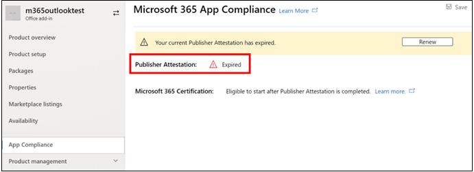

# Guía del usuario del partner para el Microsoft 365 cumplimiento de aplicacionesPartner's User Guide for Microsoft 365 App Compliance Program

|||
|---|---|
|Nivel 1Tier 1| Atestación del editorPublisher Attestation|
|Nivel 2Tier 2| Certificación Microsoft 365Microsoft 365 Certification|

## 1. Información general1. Overview
Este documento actúa como una guía de usuario paso a paso para nuestros partners, inscritos en el Programa de cumplimiento de aplicaciones de Microsoft 365 con el objetivo de someterse Publisher la certificación y la certificación a través del portal del Centro de partners.This document acts as a step-by-step user guide for our Partners, enrolled for Microsoft 365 App Compliance Program aiming to undergo Publisher Attestation and Certification though Partner Center portal.

## 2. Acrónimos & definiciones2. Acronyms & Definitions
| | |
|---|----|
|AcrónimoAcronym | DefiniciónDefinition |
|PC (Centro de partners)PC (Partner Center)|Un portal para todos los partners de Microsoft.A portal for all Microsoft Partners. Un partner inicia sesión en el Centro de partners y envía Self-Assessment cuestionario https://partner.microsoft.com/A Partner logs in to Partner Center and submits Self-Assessment Questionnaire https://partner.microsoft.com/|
|ISVISV|Proveedor de software independiente A.k.a.Independent Software Vendor A.k.a. Partner o DeveloperPartner or Developer|
|Origen de la aplicaciónApp Source| Catálogo de aplicaciones (https://appsource.microsoft.com/)Catalog of apps (https://appsource.microsoft.com/)
||Ejemplo: Ahora agente virtual (https://appsource.microsoft.com/en-us/product/office/WA104381816)Example: Now virtual agent (https://appsource.microsoft.com/en-us/product/office/WA104381816)|

## 3. Publisher flujo de trabajo de atestación3.   Publisher Attestation Workflow

Página principal: esta es la página de aterrizaje una vez que un partner inicia sesión en el Centro de partners.Home Page: This is the landing page once a partner logs in to Partner Center.

**Paso 1**   : En el lado izquierdo de la página, en la barra de navegación:**Step 1**   : On the left side of the page, in the navigation bar:
1. Seleccionar Office storeSelect Office store
1. Seleccionar información generalSelect Overview

Al seleccionar "Información general", el partner puede ver la lista de aplicaciones enviadas a través del Centro de partners y disponibles para el Microsoft 365 cumplimiento.Upon selecting ‘Overview’, partner can see list of apps submitted through Partner Center and available for the Microsoft 365 Compliance program.

**Paso 2:** Seleccione una aplicación de la lista para comenzar el proceso Publisher atestación.**Step 2** : Select an app from the list to begin the Publisher Attestation process.

Al seleccionar una aplicación, aparecerá otra barra de navegación con la opción "Cumplimiento de la aplicación"On selecting an app, another navigation bar will pop up with option ‘App Compliance’

**Paso 3:** Seleccionar "Cumplimiento de aplicaciones"**Step 3**: Select ‘App Compliance’

**Paso 4:** Rellenar el cuestionario Self-Assessment para Publisher atestación**Step 4**: Fill out the Self-Assessment Questionnaire for Publisher Attestation

**Nota**:Si vuelves a actualizar o volver a enviar la aplicación, haz clic en desplegable para "Elegir el producto", selecciona la aplicación y haz clic en "clonar".**Note**:If you are coming back to update/re-submit your application, click dropdown for ‘Choose the product’, select the app and click ‘clone’.

 

También puede aprovechar la característica Import/Export para completar el formulario sin conexión e importarlo una vez completado.You can also leverage the Import/Export feature to complete the form offline and import it once completed. 

**Paso 5:** Una vez completado, haga clic en "Enviar", la evaluación será ahora "en revisión".**Step 5**: Once completed, click on ‘Submit’, the assessment will now be ‘under review’.

### Escenarios de aprobación o rechazo:Approve/Reject Scenarios:

**A.Publisher rechazo de atestación****A.Publisher Attestation Rejection**

En caso de rechazo en esta fase, un partner puede:In case of rejection at this stage, an partner can:
-   Ver informe de errores.View failure report.
    - Se notificará al partner en el Centro de partners y por correo electrónico.Partner will be notified in Partner Center and via email.
-   Actualice Self-Assessment respuestas.Update Self-Assessment responses.
-   Volver a enviar autoevaluación.Re-submit Self-Assessment.

**B.Publisher Attestation Re-submission****B.Publisher Attestation Re-submission**

**C.Publisher aprobación de atestación****C.Publisher Attestation Approval**

-   Tras la aprobación, el partner puede:Upon approval partner can:
    - Actualizar y volver a enviar la atestaciónUpdate and resubmit attestation
    - Ver y compartir contenido Publisher atestaciónView and share completed Publisher Attestation
    - Iniciar proceso de certificación M365Start M365 Certification Process

**Aprobación Publisher de verificación de publicación: ejemplo de vínculo en AppSource para aplicaciones atestiguadas por el editor****Post Publisher Verification Approval: Example of link in AppSource for publisher attested apps**

## 4. Microsoft 365 de certificación4. Microsoft 365 Certification Workflow

Una vez que el partner hace clic en "Enviar" y envía todos los documentos y pruebas para su revisión:Once partner clicks on ‘Submit’ and submits all documents and evidence for review: 

### Microsoft 365 Certificación: enviadoMicrosoft 365 Certification - Submitted

**Microsoft 365 de certificación: rechazada****Microsoft 365 certification - Rejected**

**Microsoft 365 Certificación: aprobada****Microsoft 365 Certification - Approved**

**Aprobación posterior a la certificación: ejemplo Microsoft 365 distintivo de certificación en AppSource****Post Certification Approval: Example of Microsoft 365 certification badge in AppSource**

## 5. Flujo de trabajo para ISV existentes5. Workflow for Existing ISVs

Si es un ISV existente y desea actualizar la Publisher atestación.If you are an existing ISV and want to Update Publisher Attestation.

**Paso 1:** Haga clic en "Actualizar y volver a enviar su Publisher Atestación".**Step 1**: Click on ‘Update and re-submit your Publisher Attestation’ link.

**Nota:**: Si vuelve a actualizar o volver a enviar la aplicación, haga clic en la lista desplegable para "Elegir el producto", seleccione la aplicación y haga clic en "Importar".**Note:**: If you are coming back to update/re-submit your application, click dropdown for ‘Choose the product’, select the app and click ‘Import’.

**Paso 2:** Realizar actualizaciones en el formulario y haga clic en Guardar/Enviar.**Step 2**: Make updates to your form and click Save/Submit.

Una vez enviado, se revisará.Once submitted, it will be under review.

## 6. Microsoft 365 Re-Certification de trabajo:6.   Microsoft 365 Re-Certification Workflow:

**Microsoft 365Publisher flujo de trabajo de renovación de certificación y certificación:****Microsoft 365 Publisher Attestation and Certification Renewal Workflow:** 

Microsoft 365 El Programa de cumplimiento de aplicaciones ahora ofrece un proceso de renovación anual.Microsoft 365 App Compliance Program now offers an annual renewal process. Durante este proceso, los desarrolladores de aplicaciones pueden actualizar sus Publisher cuestionario de atestación y los documentos necesarios para la Microsoft 365 certificación.During this process, app developers can update their existing Publisher Attestation questionnaire and documents required for Microsoft 365 Certification. 

**Ventajas:****Benefits:**

- Mantenga el distintivo de certificación en AppSource para diferenciar la aplicación de otras.Maintain your certification badge in AppSource to differentiate your app from others. 
- Aumente la confianza del cliente en el uso de la aplicación certificada.Increase customer confidence in using your certified app. 
- Ayude a los administradores de TI a tomar decisiones fundamentadas con información de certificación actualizada.Help IT admins make informed decisions with updated certification information. 

**Nivel 1: Publisher renovación de atestación:****Tier 1: Publisher Attestation Renewal:** 

Las respuestas Publisher atestación de la aplicación tendrán que volver a enviarse anualmente.The app’s Publisher Attestation answers will need to be resubmitted on an annual basis. Cuando la atestación se acerca a la marca de 1 año, se enviará un aviso por correo electrónico animando a volver a enviar la atestación.When the attestation nears 1-year mark, an email reminder will be sent encouraging a resubmission of the attestation. 

**Paso 1:** Seleccione **Renovar** para renovar la Publisher atestación.**Step 1**: Select **Renew** to renew the Publisher Attestation. 

**Paso 2:** Revise las respuestas Publisher atestación y actualice con la información más reciente según sea necesario.**Step 2**: Review the previous Publisher Attestation answers and update with the latest information as needed. Envíe Publisher atestación para su renovación cuando esté listo.Submit Publisher Attestation for renewal when ready. Un analista de cumplimiento de aplicaciones M365 lo revisará.It will be reviewed by an M365 App Compliance Analyst.

**Publisher atestación expirada:** La información de la aplicación debe renovarse antes de la fecha de expiración para mantener la página de atestación Publisher la aplicación en los documentos de Microsoft. La renovación a tiempo también garantizará la continuación de los iconos y los iconos de la aplicación en AppSource y la Tienda de equipos.**Publisher Attestation Expired:** The app’s information needs to be renewed before the expiration date to maintain the app’s Publisher Attestation page on the Microsoft docs. Timely renewal will also ensure continued badging and icons for the app in AppSource and Team Store.

Nota: Una vez expirado, Publisher proceso de renovación de atestación se puede iniciar en cualquier momento haciendo clic en "Renovar".Note: Once expired, Publisher Attestation renewal process can be started anytime by clicking ‘Renew’. 

**Nivel 2: renovación Microsoft 365 certificación****Tier 2: Microsoft 365 Certification Renewal** 

La información de certificación de la aplicación debe volver a enviarse anualmente.The app’s certification information needs to be resubmitted on an annual basis. Esto requerirá la revalidación de los controles en el ámbito del entorno actual.This will require revalidation of the in-scope controls of your current environment. Cuando la certificación se acerque a la marca de 1 año, se enviará una notificación por correo electrónico animando a que se vuelvan a enviar los documentos y las pruebas.When the Certification nears 1-year mark an email notification will be sent encouraging a resubmission of the documents and evidence. 

**Escenarios de aprobación o rechazo de renovación de certificación:****Certification Renewal Approve/Reject Scenarios:**

**Escenario 1:****Scenario 1:** 

Publisher La atestación se ha completado.Publisher Attestation  is complete. La renovación de la certificación ha comenzado y está en revisión.Certification renewal has started and under review. 

**Escenario 1A:****Scenario 1A:**

Rechazo de renovación de certificación: la certificación puede rechazarse si:Certification renewal rejection: Certification may be rejected if: 

 - La aplicación no tiene las herramientas, procesos o configuraciones necesarias y no podrá implementar los cambios necesarios en la ventana de certificación.The app does not have the required tooling, processes, or configurations in place and will not be able to implement required changes within the certification window. 
 - La aplicación tiene vulnerabilidades pendientes en su lugar y no se puede corregir en la ventana de certificación.The app has outstanding vulnerabilities in place and cannot be fixed within the certification window. 

    
**Escenario 1B:****Scenario 1B:** 

Se aprueba la renovación de certificaciónCertification renewal is approved  

**Expiración de certificación:****Certification Expiration:**

La información de la aplicación debe renovarse antes de la fecha de expiración para mantener la página de certificación de la aplicación en los documentos de Microsoft. La renovación a tiempo también garantizará la continuación de los iconos y los iconos de la aplicación en AppSource y la Tienda de equipos.The app’s information needs to be renewed before the expiration date to maintain app’s Certification page on the Microsoft docs. Timely renewal will also ensure continued badging and icons for the app in AppSource and Team Store. 

    
**Nota:** Una vez expirado, Publisher proceso de certificación y certificación puede iniciarse en cualquier momento haciendo clic en "Renovar".**Note**: Once expired, Publisher Attestation and Certification process can be started anytime by clicking ‘Renew’. 

