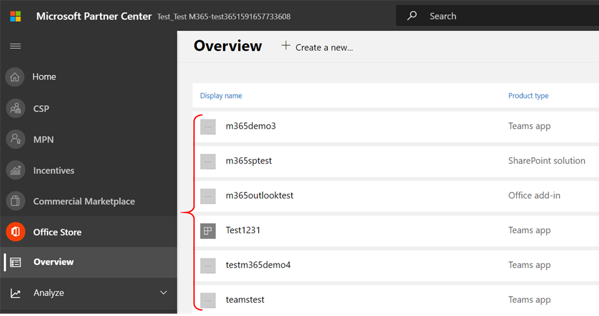

# Guía del usuario del partner para el Microsoft 365 cumplimiento de aplicacionesPartner's User Guide for Microsoft 365 App Compliance Program

|FasePhase|TítuloTitle|
|---|---|
|Fase 1Phase 1| Atestación del editorPublisher Attestation|
|Fase 2Phase 2| Certificación Microsoft 365Microsoft 365 Certification|

## 1. Información general1. Overview
Este documento actúa como una guía de usuario paso a paso para nuestros partners inscritos en el programa de cumplimiento de aplicaciones de Microsoft 365 con el objetivo de someterse Publisher la certificación y la certificación Publisher través del portal del Centro de partners.This document acts as a step-by-step user guide for our partners enrolled in the Microsoft 365 App Compliance program aiming to undergo Publisher Attestation and Certification though the Partner Center portal.

## 2. Acrónimos & definiciones2. Acronyms & Definitions
| AcrónimoAcronym |DefiniciónDefinition |
|---|----|
|PC [(Centro de partners)](https://partner.microsoft.com/)PC [(Partner Center)](https://partner.microsoft.com/)|Un portal para todos los partners de Microsoft.A portal for all Microsoft partners. Un partner inicia sesión en el Centro de partners y envía un cuestionario de autoevaluación.A partner logs in to Partner Center and submits self-assessment questionnaire. [Centro de partners](https://partner.microsoft.com/dashboard/home) para Microsoft 365 cumplimiento de aplicaciones[Partner Center](https://partner.microsoft.com/dashboard/home) for Microsoft 365 App Compliance|
|ISVISV|Proveedor de software independiente.Independent Software Vendor. A.k.a.A.k.a. partner o desarrolladorpartner or developer|
|Origen de la aplicaciónApp Source| [Catálogo de aplicacionesCatalog of apps](https://appsource.microsoft.com/)
|EjemploExample|[Agente virtual ahoraNow virtual agent](https://appsource.microsoft.com/product/office/WA104381816)|

## 3. Publisher flujo de trabajo de atestación3.   Publisher Attestation Workflow

**Página principal:** esta es la página de aterrizaje cuando un partner inicia sesión en el Centro de partners.**Home Page** : This is the landing page once a partner logs in to Partner Center.

**Paso 1**   : En el lado izquierdo de la página, en la barra de navegación:**Step 1**   : On the left side of the page, in the navigation bar:
- Seleccionar Office storeSelect Office store
- Seleccionar información generalSelect Overview

Al seleccionar "Información general", el partner puede ver la lista de aplicaciones enviadas a través del Centro de partners y disponibles para el Microsoft 365 cumplimiento.Upon selecting ‘Overview’, partner can see list of apps submitted through Partner Center and available for the Microsoft 365 Compliance program.

**Paso 2:** Seleccione una aplicación de la lista para comenzar el proceso Publisher atestación.**Step 2** : Select an app from the list to begin the Publisher Attestation process.

Al seleccionar una aplicación, aparecerá otra barra de navegación con la opción "Cumplimiento de la aplicación".On selecting an app, another navigation bar will pop up with option ‘App Compliance.’

**Paso 3:** Seleccionar "Cumplimiento de aplicaciones"**Step 3**: Select ‘App Compliance’

**Paso 4:** Rellenar el cuestionario de autoevaluación para Publisher atestación**Step 4**: Fill out the self-assessment questionnaire for Publisher Attestation

**Nota Si vuelve a actualizar o volver a enviar la aplicación, haga clic en desplegable para "Elegir el producto", seleccione la aplicación y haga clic en "Clonar".****Note If you are coming back to update/re-submit your application, click dropdown for ‘Choose the product’, select the app and click ‘Clone.’**

También puede aprovechar la característica Import/Export para completar el formulario sin conexión e importarlo una vez completado.You can also leverage the Import/Export feature to complete the form offline and import it once completed.

**Paso 5:** Una vez completado, haga clic en "Enviar", la evaluación será ahora "En revisión".**Step 5**: Once completed, click on ‘Submit’, the assessment will now be ‘Under Review.'

### Escenarios de aprobación o rechazo:Approve/Reject Scenarios:

**A. Publisher de atestación****A. Publisher Attestation Rejection**

- En caso de rechazo en esta fase, un partner puede:In case of rejection at this stage, an partner can:
    - Ver informe de erroresView failure report
         - El partner recibirá una notificación por correo electrónico y podrá ver el informe de errores en el Centro de partnersPartner will be notified via email, and they can view the failure report in Partner Center
    - Actualizar y volver a enviar Publisher atestaciónUpdate and re-submit Publisher Attestation

**B. Publisher aprobación de atestación****B. Publisher Attestation Approval**

- Tras la aprobación, el partner puede:Upon approval partner can:
    - Actualizar y volver a enviar la atestaciónUpdate and resubmit attestation
    - Ver y compartir contenido Publisher atestaciónView and share completed Publisher Attestation
    - Iniciar Microsoft 365 proceso de certificaciónStart Microsoft 365 Certification process

**Publicación Publisher aprobación de atestación: ejemplo de vínculo en AppSource para aplicaciones atestiguadas por editores****Post Publisher Attestation Approval: Example of link in AppSource for publisher attested apps**

## 4. Microsoft 365 de certificación4. Microsoft 365 Certification Workflow

Un partner puede comenzar el proceso de certificación seleccionando la casilla y haciendo clic en "Enviar"A partner can begin the Certification process by selecting the checkbox and clicking ‘Submit’ 

**Paso 1:** Envío inicial de documentos Rellene todos los detalles, cargue documentos relevantes y haga clic en "Enviar"**Step 1:** Initial Document Submission Fill out all the details, upload relevant documents and Click ‘Submit’

 

Al hacer clic en enviar, se revisará el envío de atestación.On clicking submit, the attestation submission will be under review. 

Un analista solicita una revisión en caso de que los documentos iniciales no sean suficientes o relevantes.An analyst requests a revision in case the initial documents are not sufficient or relevant. El analista trabajará con el partner para obtener los documentos adecuados para su aprobación.The analyst will work with the partner to help get the right documents for approval. 

Una vez que el analista aprueba el envío inicial del documento, el partner debe enviar los requisitos de control.Once the analyst approves the initial document submission, the partner needs to submit the control requirements. 

**Paso 2:** Envío de requisitos de control Rellene todos los detalles, cargue documentos relevantes y haga clic en "Enviar"**Step 2:** Control Requirement Submission Fill out all the details, upload relevant documents and Click ‘Submit’ 

 
 

Al hacer clic en Enviar, el envío de certificación se revisará.On clicking Submit, the certification submission will be under review. 

Un analista solicita una revisión en caso de que los documentos de requisitos de control no sean suficientes o relevantes.An analyst requests a revision in case the control requirement documents are not sufficient or relevant. El analista trabajará con el partner para obtener los documentos adecuados para su aprobación.The analyst will work with the partner to help get the right documents for approval. 

 
 

En caso de que el envío no cumpla los estándares de aprobación, el analista rechazará el envío.In case the submission does not satisfy the approval standards, the analyst will reject the submission. El partner puede trabajar con el analista para proporcionar la información y los documentos pertinentes.The partner can work with the analyst to provide the relevant information and documents. 

Una vez que se hayan cumplido todos los estándares de seguridad, el analista aprobará el envío y el partner se Microsoft 365 certificado.Once all the security standards have been met, the analyst will approve the submission and the partner will be Microsoft 365 Certified. 

**Aprobación posterior a la certificación: ejemplo Microsoft 365 distintivo de certificación en AppSource****Post Certification Approval: Example of Microsoft 365 certification badge in AppSource**

## 5. Microsoft 365 de renovación:5.   Microsoft 365 Renewal Workflow:
  
**Microsoft 365 Publisher flujo de trabajo de renovación de** certificación y certificación: Microsoft 365 programa de cumplimiento de aplicaciones ahora ofrece un proceso de renovación anual.**Microsoft 365 Publisher Attestation and Certification Renewal Workflow:** Microsoft 365 App Compliance Program now offers an annual renewal process. Durante este proceso, los desarrolladores de aplicaciones pueden actualizar sus Publisher cuestionario de atestación y los documentos necesarios para la Microsoft 365 certificación.During this process, app developers can update their existing Publisher Attestation questionnaire and documents required for Microsoft 365 Certification. 
 
**Ventajas:****Benefits:** 

- Mantenga el distintivo de certificación en AppSource, la Tienda Teams, la Tienda Office store y otros escaparates para diferenciar la aplicación.Maintain your certification badge in AppSource, the Teams Store, the Office Store and other storefronts to differentiate the app. 
- Aumente la confianza del cliente en el uso de la aplicación certificada.Increase customer confidence in using your certified app. 
- Ayude a los administradores de TI a tomar decisiones fundamentadas con información de certificación actualizada.Help IT admins make informed decisions with updated certification information. 

El proceso de renovación está disponible en el [Centro de partners](https://partner.microsoft.com/dashboard/home) para proporcionar una experiencia perfecta.The renewal process is available in [Partner Center](https://partner.microsoft.com/dashboard/home) to provide a seamless experience. Se mostrará un aviso de renovación en el Centro de partners a partir de 90 días antes de la fecha de expiración.A renewal reminder will be shown in Partner Center starting 90 days before the expiration date. Los avisos periódicos también se enviarán por correo electrónico 90, 60 y 30 días antes de la expiración.Periodic reminders will also be sent via email at 90, 60 and 30 days before expiration.

**Fase 1: Publisher renovación de atestación:****Phase 1: Publisher Attestation Renewal:** 

El nuevo proceso de renovación está disponible en el [Centro de partners](https://partner.microsoft.com/dashboard/home) para proporcionar una experiencia perfecta.The new renewal process is available in [Partner Center](https://partner.microsoft.com/dashboard/home) to provide a seamless experience. Se mostrará un aviso de renovación en el Centro de partners a partir de 90 días antes de la fecha de expiración.A renewal reminder will be shown in Partner Center starting 90 days before the expiration date. Los avisos periódicos también se enviarán por correo electrónico 90, 60 y 30 días antes de la expiración.Periodic reminders will also be sent via email at 90, 60 and 30 days before expiration. 

**Paso 1:** Seleccione **Renovar** para renovar la Publisher atestación.**Step 1**: Select **Renew** to renew the Publisher Attestation. 

**Paso 2:** Revise las respuestas Publisher atestación y actualice con la información más reciente según sea necesario.**Step 2**: Review the previous Publisher Attestation answers and update with the latest information as needed. Envíe Publisher atestación para su renovación cuando esté listo.Submit Publisher Attestation for renewal when ready. Un analista de cumplimiento de aplicaciones Microsoft 365 revisarlo.It will be reviewed by an Microsoft 365 app compliance analyst.

**Publisher Renovación de atestación aprobada****Publisher Attestation Renewal Approved**

**Publisher atestación expirada:** La información de la aplicación debe renovarse antes de la fecha de expiración para mantener la página de atestación Publisher la aplicación en los documentos de Microsoft. La renovación a tiempo también garantizará la continuación de los iconos y los iconos de la aplicación en AppSource, Teams Store, Office Store y otros escaparates.**Publisher Attestation Expired:** The app’s information needs to be renewed before the expiration date to maintain the app’s Publisher Attestation page on the Microsoft docs. Timely renewal will also ensure continued badging and icons for the app in AppSource, Teams Store, Office Store and other storefronts.

Nota: Una vez expirado, Publisher proceso de renovación de atestación se puede iniciar en cualquier momento haciendo clic en "Renovar".Note: Once expired, Publisher Attestation renewal process can be started anytime by clicking ‘Renew’. 

**Fase 2: renovación Microsoft 365 certificación****Phase 2: Microsoft 365 Certification Renewal** 

La información de certificación de la aplicación debe volver a enviarse anualmente.The app’s certification information needs to be resubmitted on an annual basis. Esto requerirá la revalidación de los controles en el ámbito del entorno actual.This will require revalidation of the in-scope controls of your current environment. Cuando la certificación se acerque a la marca de 1 año, se enviará una notificación por correo electrónico animando a que se vuelvan a enviar los documentos y las pruebas.When the Certification nears 1-year mark an email notification will be sent encouraging a resubmission of the documents and evidence. 

**Escenarios de aprobación o rechazo de renovación de certificación:****Certification Renewal Approve/Reject Scenarios:**
 
**Escenario 1:****Scenario 1:** 

La renovación de certificación ha comenzado y está en revisión.Certification renewal has started and is under review.

**Escenario 1A:****Scenario 1A:**

Rechazo de renovación de certificación: la certificación puede rechazarse si:Certification renewal rejection: Certification may be rejected if: 
- La aplicación no tiene las herramientas, procesos o configuraciones necesarias y no podrá implementar los cambios necesarios en la ventana de certificación.The app does not have the required tooling, processes, or configurations in place and will not be able to implement required changes within the certification window. 
- La aplicación tiene vulnerabilidades pendientes en su lugar y no se puede corregir en la ventana de certificación.The app has outstanding vulnerabilities in place and cannot be fixed within the certification window. 
 

    
**Escenario 1B:****Scenario 1B:** 

Se aprueba la renovación de certificaciónCertification renewal is approved  

**Expiración de certificación:****Certification Expiration:**
 
La información de la aplicación debe renovarse antes de la fecha de expiración para mantener la página de certificación de la aplicación en los documentos de Microsoft. La renovación a tiempo también garantizará la continuación de los iconos y los iconos de la aplicación en AppSource y la Tienda de equipos.The app’s information needs to be renewed before the expiration date to maintain app’s Certification page on the Microsoft docs. Timely renewal will also ensure continued badging and icons for the app in AppSource and Team Store.

La información de la aplicación debe renovarse antes de la fecha de expiración para mantener la página de certificación de la aplicación en los documentos de Microsoft. La renovación a tiempo también garantizará la continuación de los iconos y los iconos de la aplicación en AppSource, Teams Store, Office Store y otros escaparates.The app’s information needs to be renewed before the expiration date to maintain app’s Certification page on the Microsoft docs. Timely renewal will also ensure continued badging and icons for the app in AppSource, Teams Store, Office Store and other storefronts. 

    
**Nota:** Una vez expirado, Publisher proceso de certificación y certificación puede iniciarse en cualquier momento haciendo clic en "Renovar".**Note**: Once expired, Publisher Attestation and Certification process can be started anytime by clicking ‘Renew’. 

