# Microsoft 365 de pruebas: Guía de pruebas de ejemplo

## Información general

Esta guía se ha creado para proporcionar a los ISV ejemplos del tipo de evidencia y el nivel de detalle necesario para cada uno de los Microsoft 365 certificación. Los ejemplos compartidos en este documento no representan la única evidencia que se puede usar para demostrar que se cumplen los controles, sino que actúan solo como una guía para el tipo de evidencia necesaria. 

Tenga en cuenta: las interfaces, capturas de pantalla y documentación reales que se usan para satisfacer los requisitos variarán según el uso del producto, la configuración del sistema y los procesos internos. Además, tenga en cuenta que, cuando se requiera documentación de directiva o procedimiento, el ISV tendrá que enviar los documentos REALES y no capturas de pantalla como se muestra en algunos de los ejemplos. 

Hay dos secciones en la certificación que requieren envíos:
1. [**El envío inicial de documentos:**](https://docs.microsoft.com/en-us/microsoft-365-app-certification/docs/initialdocumentsubguide) un pequeño conjunto de documentos de alto nivel necesarios para el ámbito de la evaluación.
1. **El envío de pruebas:** el conjunto completo de pruebas necesarias para cada control en el ámbito de la evaluación de certificación. 

## Estructura 

Este documento se asigna directamente a los controles que se mostrarán durante la certificación en el centro de partners. Las instrucciones proporcionadas en este documento se detallan de la siguiente manera:
- Dominio de seguridad: los tres dominios de seguridad en los que se agrupan todos los controles: Seguridad de aplicaciones, Seguridad operativa y Seguridad de datos y Privacidad.
- Control(s): = Descripción de la actividad de evaluación: estos controles y el número asociado (No) se toman directamente de la lista de comprobación de certificación Microsoft 365 evaluación.  
- Intent: = The intent of why the security control is included within the program and the specific risk that it is aimed to mitigate.  La esperanza es que esta información proporcione a los ISV el razonamiento que hay detrás del control para comprender mejor los tipos de evidencias que deben recopilarse y qué ISV deben prestar atención y tener conciencia y comprensión al producir sus pruebas.
- Directrices de evidencia de ejemplo: = Dados para ayudar a guiar las tareas de recopilación de evidencias en la hoja de cálculo de lista de comprobación de certificación de Microsoft 365, esto permite a los ISV ver claramente ejemplos del tipo de evidencia que puede usar el analista de certificación que la usará para determinar con confianza que un control está en su lugar y se mantiene, ya que no es de ninguna manera exhaustivo en la naturaleza.
- Ejemplo de evidencia: = Esta sección proporciona capturas de pantalla de ejemplo e imágenes de posibles evidencias capturadas en cada uno de los controles de la hoja de cálculo de lista de comprobación de certificación de Microsoft 365, específicamente para los dominios de seguridad operativa y seguridad de datos y privacidad (pestañas dentro de la hoja de cálculo). Tenga en cuenta que cualquier información con flechas y cuadros rojos dentro de los ejemplos es para ayudar a comprender aún más los requisitos necesarios para cumplir con cualquier control.

## Dominio de seguridad: Seguridad de aplicaciones

**Control 1 - Control 16**:

Los controles de dominio seguridad de aplicaciones se pueden satisficieron con un informe de prueba de penetración emitido en los últimos 12 meses que muestra que la aplicación no tiene vulnerabilidades pendientes. El único envío necesario es un informe limpio de una compañía independiente de confianza. 

## Dominio de seguridad: Seguridad operativa /Desarrollo seguro

El dominio de seguridad "Seguridad operativa/desarrollo seguro" está diseñado para garantizar que los ISV implementen un conjunto sólido de técnicas de mitigación de seguridad frente a una gran variedad de amenazas enfrentadas por actores de amenazas.  Esto está diseñado para proteger el entorno operativo y los procesos de desarrollo de software para crear entornos seguros.

#### Protección contra malware: antivirus

**Control no 1:** Proporcionar documentación de directivas que rige procedimientos y prácticas antivirus.
- Intención: el objetivo de este control es evaluar la comprensión de un ISV de los problemas a los que se enfrentan al considerar la amenaza de virus informáticos. Al establecer y usar procedimientos recomendados del sector para desarrollar una directiva y procesos antivirus, un ISV proporciona un recurso adaptado a la capacidad de su organización para mitigar los riesgos que enfrenta el malware, enumerar los procedimientos recomendados en la detección y eliminación de virus, y proporciona pruebas de que la directiva documentada proporciona instrucciones de seguridad sugeridas para la organización y sus empleados. Al documentar una directiva y un procedimiento de cómo el ISV implementa las decencies antimalware, esto garantiza la implementación y el mantenimiento coherentes de esta tecnología para reducir el riesgo de malware en el entorno.

- Directrices de evidencia de ejemplo: proporcione una copia de la directiva antivirus/antimalware que detalle los procesos y procedimientos implementados en la infraestructura para promover los procedimientos recomendados de Antivirus/Malware.
Ejemplo de evidencia

- Ejemplo de evidencia:

**Nota:** Esta captura de pantalla muestra un documento de directiva o proceso, la expectativa es que los ISV compartan la documentación real de la directiva o procedimiento de soporte técnico y no simplemente proporcionen una captura de pantalla.

**Control No. 2:** Proporcione pruebas demostrables de que el software antivirus se está ejecutando en todos los componentes del sistema muestreados.

- Intención: es importante tener antivirus (ANTIVIRUS) (o defensas antimalware) ejecutándose en su entorno para protegerse de los riesgos de seguridad cibernética que puede o no ser consciente de que aumentan los ataques potencialmente perjudiciales, tanto en la sofisticación como en los números. Tener antivirus implementado en todos los componentes del sistema que admiten su uso, ayudará a mitigar algunos de los riesgos de que se introduzca antimalware en el entorno. Solo se necesita un único punto de conexión para estar desprotegido para proporcionar potencialmente un vector de ataque para que un actor de amenazas obtenga un punto de conexión en el entorno. Por lo tanto, el ANTIVIRUS debe usarse como una de varias capas de defensa para proteger contra este tipo de amenaza.

- Directrices de evidencia de ejemplo: para demostrar que se está ejecutando una instancia activa de AV en el entorno evaluado. Proporcione una  captura de pantalla para todos los dispositivos de la muestra que admitan el uso de antivirus que muestra el proceso antivirus en ejecución, el software antivirus está activo o si tiene una consola de administración centralizada para antivirus, puede demostrarlo desde esa consola de administración. Si usa la consola de administración, asegúrese de probar en una captura de pantalla que los dispositivos muestreados están conectados y funcionando.

- Ejemplo 1 de evidencia: la captura de pantalla siguiente se ha tomado del Centro de seguridad de Azure; muestra que se ha implementado una extensión antimalware en la máquina virtual denominada &quot; MSPGPRODAZUR01 &quot; .

- Ejemplo 2 de evidencia

La siguiente captura de pantalla se ha tomado desde un dispositivo Windows 10, que muestra que la protección en tiempo real está activa para el nombre de &quot; &quot; host &quot; CLARANET-SBU-WM &quot; .

**Control No. 3:** Proporcione pruebas demostrables de que las firmas antivirus están actualizadas en todos los entornos (en un plazo de 1 día).

- Intención: cada día se identifican cientos de miles de malware y aplicaciones potencialmente no deseadas (PUA). Para proporcionar una protección adecuada contra malware recién publicado, las firmas de ANTIVIRUS deben actualizarse periódicamente para tener en cuenta el malware recién publicado.

- Este control existe para asegurarse de que el ISV ha tenido en cuenta la seguridad del entorno y el efecto que el ANTIVIRUS obsoleto puede tener en la seguridad.

- Directrices de evidencia de ejemplo: proporcione archivos de registro antivirus de cada dispositivo muestreado, que muestran que las actualizaciones se aplican diariamente.

- Ejemplo de evidencia: la siguiente captura de pantalla muestra la actualización de Microsoft Defender al menos diariamente mostrando &#39;Evento 2000, Windows Defender&#39; que es la actualización. Se muestra el nombre de host, que muestra que se tomó del sistema en el ámbito &quot; CLARANET-SBU-WM &quot; .

**Nota:** La evidencia proporcionada tendría que incluir una exportación de los registros para mostrar actualizaciones diarias durante un período de tiempo mayor. Algunos productos antivirus generarán archivos de registro de actualización para que estos archivos se suministre o exporte los registros desde el Visor de eventos.

**Control No. 4:** Proporcione pruebas demostrables de que antivirus está configurado para realizar análisis en tiempo real o examen periódico en todos los componentes del sistema muestreados.

**Nota:** Si el examen en tiempo real no está habilitado, se debe habilitar un mínimo de análisis diario y alerting_ **debe** _be.

- Intención: la intención de este control es garantizar que el malware se identifique rápidamente para minimizar el efecto que esto puede tener en el entorno. Cuando se realiza el examen en tiempo real y se combina con el bloqueo automático de malware, esto ayudará a detener las infecciones de malware conocidas por el software antivirus. Cuando el examen en tiempo&#39;no es deseable debido a los riesgos de falsos positivos que causan interrupciones en el servicio, es necesario implementar mecanismos de análisis y alertas diarios adecuados (o más) para garantizar una respuesta rápida a las infecciones de malware para minimizar los daños.

- Directrices de evidencia de ejemplo: proporcione una captura de pantalla para cada dispositivo de la muestra que admita antivirus, que muestre  que el antivirus se está ejecutando en el dispositivo y está configurado  para el examen en tiempo real o proporcione una captura de pantalla que muestre que el examen periódico está habilitado para el examen diario, las alertas están configuradas y la última fecha de examen para cada dispositivo de la muestra. 

- Ejemplo de evidencia: la siguiente captura de pantalla muestra que la protección en tiempo real está habilitada para el host, &quot; CLARANET-SBU-WM &quot; .

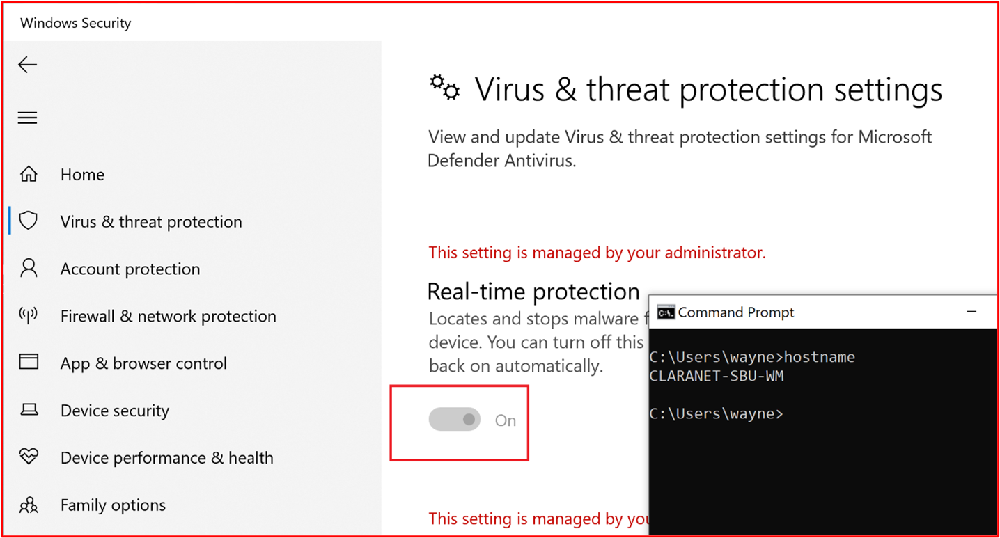

**Control No. 5:** Proporcione pruebas demostrables de que el antivirus está configurado para bloquear automáticamente malware o cuarentena y alertar en todos los componentes del sistema muestreados.

- Intención: la sofisticación del malware está evolucionando todo el tiempo junto con los distintos grados de desolación que pueden aportar. El objetivo de este control es detener la ejecución de malware y, por lo tanto, impedir que ejecute su carga potencialmente demoledora, o si el bloqueo automático no es una opción, limitar la cantidad de tiempo que el malware puede causar estragos al alertar y responder inmediatamente a la posible infección de malware.

- Directrices de evidencia de  ejemplo: proporcione una captura de pantalla para cada dispositivo de la muestra que admita antivirus, que muestra que el antivirus se está ejecutando en la máquina y está configurado para bloquear automáticamente malware, alertar o poner en cuarentena y alertar.

- Ejemplo evidencia 1: la siguiente captura de pantalla muestra que el host &quot; CLARANET-SBU-WM está configurado con protección en tiempo &quot; real para Antivirus de Microsoft Defender. Como indica la configuración, esto localiza y impide que el malware se instale o se ejecute en el dispositivo.

**Control No.6:** Proporcione pruebas demostrables de que las aplicaciones están aprobadas antes de implementarse.

- Intención: con el control de aplicaciones, la organización aprobará cada aplicación o proceso que se pueda ejecutar en el sistema operativo. El objetivo de este control es asegurarse de que hay un proceso de aprobación para autorizar qué aplicaciones o procesos se pueden ejecutar.

- Directrices de evidencia de ejemplo: se pueden proporcionar pruebas que muestren que se está siguiendo el proceso de aprobación. Esto puede proporcionarse mediante documentos firmados, seguimiento en sistemas de control de cambios o mediante algo como Azure DevOps o JIRA para realizar un seguimiento de estas solicitudes y autorización.

- Ejemplo de evidencia: la siguiente captura de pantalla muestra una aprobación por parte de la administración de que cada aplicación puede ejecutarse en el entorno después de un proceso de aprobación. Se trata de un proceso basado en papel en Contoso, pero se pueden usar otros mecanismos.

**Control No.7:** Proporcionar pruebas demostrables de que existe una lista completa de aplicaciones aprobadas con justificación empresarial y se mantiene.

- Intención: es importante que las organizaciones mantengan una lista de todas las aplicaciones que se han aprobado, junto con información sobre por qué se ha aprobado la aplicación o el proceso. Esto ayudará a garantizar que la configuración permanece actualizada y se puede revisar en una línea base para garantizar que no se configuran aplicaciones o procesos no autorizados.

- Directrices de evidencia de ejemplo: proporcione la lista documentada de aplicaciones o procesos aprobados junto con la justificación empresarial.

- Ejemplo de evidencia: en la siguiente captura de pantalla se enumeran las aplicaciones aprobadas con justificación empresarial.

**Nota:** Esta captura de pantalla muestra un documento, la expectativa es que los ISV compartan el documento de soporte real y no proporcionen simplemente una captura de pantalla.

**Control No.8:** Proporcione documentación de soporte técnico que detalle que el software de control de aplicaciones está configurado para cumplir con mecanismos de control de aplicaciones específicos.

- Intención: la configuración de la tecnología de control de aplicaciones debe documentarse junto con un proceso de cómo mantener la tecnología, es decir, agregar y eliminar aplicaciones o procesos. Como parte de esta documentación, se debe detallar el tipo de mecanismo usado para cada aplicación o proceso. Esto se alimentará en el siguiente control para garantizar que la tecnología esté configurada como documentada.

- Directrices de evidencia de ejemplo: proporcionar documentación de soporte técnico que detalle cómo se ha configurado el control de aplicaciones y cómo se ha configurado cada aplicación o proceso dentro de la tecnología.

- Ejemplo de evidencia: en la siguiente captura de pantalla se muestra el mecanismo de control usado para implementar el control de aplicación. A continuación, puedes ver que 1 aplicación usa controles de certificado y otras que usan la ruta de acceso del archivo.

**Nota:** Esta captura de pantalla muestra un documento, la expectativa es que los ISV compartan el documento de soporte real y no proporcionen simplemente una captura de pantalla.

**Control No. 9:** Proporcione pruebas demostrables de que el control de aplicaciones está configurado como documentado desde todos los componentes del sistema muestreados.

- Intención: el objetivo de esto es validar que el control de aplicación esté configurado en el ejemplo según la documentación.

- Directrices de evidencia de ejemplo: proporcione una captura de _pantalla_ para todos los dispositivos de la muestra para mostrar que tiene controles de aplicación configurados y activados. Esto debe mostrar los nombres de las máquinas, los grupos a los que pertenecen y las directivas de control de aplicaciones aplicadas a esos grupos y máquinas.

- Ejemplo de evidencia: la siguiente captura de pantalla muestra un objeto de directiva de grupo con directivas de restricción de software habilitadas.

Esta siguiente captura de pantalla muestra la configuración en línea con el control anterior.

Esta siguiente captura de pantalla muestra el entorno M365 y los equipos incluidos en el ámbito que se aplica a este objeto GPO &#39;equipo de dominio Configuración&#39;.

Esta captura de pantalla final muestra que el servidor &quot; de ámbito DBServer1 se encuentra dentro de la ou en la captura de pantalla &quot; anterior.

### Administración de revisiones: clasificación de riesgos

La rápida identificación y corrección de vulnerabilidades de seguridad ayuda a minimizar los riesgos de un actor de amenazas que compromete el entorno o la aplicación. La administración de revisiones se divide en dos secciones: clasificación de riesgos y revisión. Estos tres controles cubren la identificación de vulnerabilidades de seguridad y las clasifican según el riesgo que representan.

Este grupo de control de seguridad está en el ámbito de los entornos de hospedaje de Plataforma como servicio (PaaS), ya que las bibliotecas de software y la base de código de terceros de aplicación o complemento deben estar parcheadas en función de la clasificación de riesgos.

**Control No. 10:** Proporcionar documentación de directiva que rige cómo se identifican y asignan nuevas vulnerabilidades de seguridad a una puntuación de riesgo.

- Intención: el objetivo de este control es tener documentación de soporte técnico para garantizar que las vulnerabilidades de seguridad se identifiquen rápidamente para reducir la ventana de oportunidad que los actores de amenazas tienen para aprovechar estas vulnerabilidades. Debe haber un mecanismo sólido para identificar vulnerabilidades que cubran todos los componentes del sistema que usan las organizaciones; por ejemplo, sistemas operativos (Windows Server, Ubuntu, etc.), aplicaciones (Tomcat, MS Exchange, SolarWinds, etc.), dependencias de código (AngularJS, jQuery, etc.). Las organizaciones no solo deben garantizar la identificación a tiempo de las vulnerabilidades dentro del estado, sino también clasificar las vulnerabilidades en consecuencia para garantizar que la corrección se lleva a cabo en un período de tiempo adecuado en función del riesgo que presente la vulnerabilidad.

**Nota** Incluso si se está ejecutando en un entorno de plataforma puramente como servicio, todavía tiene la responsabilidad de identificar vulnerabilidades dentro de su base de código: es decir, bibliotecas de terceros.

- Directrices de evidencia de ejemplo: proporcionar la documentación de soporte técnico (no capturas de pantalla)

- Ejemplo de evidencia: esta captura de pantalla muestra un fragmento de código de una directiva de clasificación de riesgos.

**Nota:** Esta captura de pantalla muestra un documento de directiva o proceso, la expectativa es que los ISV compartan la documentación real de la directiva o procedimiento de soporte técnico y no simplemente proporcionen un screenshot._

**Control No. 11:** Proporcionar evidencia de cómo se identifican las nuevas vulnerabilidades de seguridad.

- Intención: el objetivo de este control es asegurarse de que se está siguiendo el proceso y de que&#39;suficientemente sólido para identificar nuevas vulnerabilidades de seguridad en todo el entorno. Puede que no se trata solo de los sistemas operativos; puede incluir aplicaciones que se ejecutan en el entorno y cualquier dependencia de código.

- Directrices de evidencia de ejemplo: la evidencia puede proporcionarse mediante la presentación de suscripciones a listas de correo, la revisión manual de orígenes de seguridad para las vulnerabilidades recién publicadas (tendría que realizar un seguimiento adecuado con marcas de tiempo de las actividades, es decir, con JIRA o Azure DevOps), herramientas que encuentren software desatensado (por ejemplo, podría ser Snyk al buscar bibliotecas de software no actualizadas o podría ser Nessus mediante exámenes autenticados que identifiquen los exámenes autenticados que identifiquen las bibliotecas de software no actualizadas o que Nessus use exámenes autenticados que identifiquen las bibliotecas de software no actualizadas).  software desaprotebado).

**Nota** Si se usa Nessus, esto tendría que ejecutarse regularmente para identificar vulnerabilidades rápidamente. Se recomienda al menos semanalmente.

- Evidencia de ejemplo: esta captura de pantalla muestra que se está utilizando un grupo de correo para recibir notificaciones de vulnerabilidades de seguridad.

**Control No. 12:** Proporcionar pruebas que demuestren que a todas las vulnerabilidades se les asigna una clasificación de riesgos una vez identificadas.

- Intent: Patching needs to be based upon risk, the riskier the vulnerability, the quicker it needs to be remediated. La clasificación de riesgos de vulnerabilidades identificadas es una parte integral de este proceso. El objetivo de este control es asegurarse de que hay un proceso de clasificación de riesgos documentado que se está siguiendo para garantizar que todas las vulnerabilidades identificadas se clasifican adecuadamente en función del riesgo. Las organizaciones suelen usar la clasificación CVSS (Common Vulnerability Score System) proporcionada por proveedores o investigadores de seguridad. Se recomienda que si la organización se basa en CVSS, se incluya un mecanismo de reevaluación en el proceso para permitir que la organización cambie la clasificación en función de una evaluación interna de riesgos. En ocasiones, es posible que la vulnerabilidad no sea una aplicación debido a la forma en que se ha implementado la aplicación en el entorno. Por ejemplo, se puede liberar Java vulnerabilidad que afecta a una biblioteca específica que no usa la organización.

- Directrices de evidencia de ejemplo: proporcionar pruebas mediante captura de pantalla u otros medios, por ejemplo, DevOps/Jira, que demuestra que las vulnerabilidades pasan por el proceso de clasificación de riesgos y la organización le asigna una clasificación de riesgos adecuada.

- Evidencia de ejemplo: esta captura de pantalla muestra la clasificación de riesgos que se produce dentro de la columna D y la reevaluación en las columnas F y G, en caso de que la organización realice una evaluación de riesgos y determine que el riesgo puede reducirse. La evidencia de las evaluaciones de riesgo de reevaluación tendría que proporcionarse como evidencia de apoyo

### Administración de revisiones: revisión

Los controles siguientes son para el elemento de revisión de administración de revisiones. Para mantener un entorno operativo seguro, las aplicaciones/complementos y los sistemas de soporte deben estar adecuadamente parcheados. Es necesario administrar un período de tiempo adecuado entre la identificación (o la versión pública) y la revisión para reducir la ventana de oportunidad para que un actor de amenazas pueda aprovechar una vulnerabilidad. La Microsoft 365 de certificación no estipula un &#39;de revisión&#39;, sin embargo, los analistas de certificación rechazarán los períodos de tiempo que no sean razonables.

Este grupo de control de seguridad está en el ámbito de los entornos de hospedaje de Plataforma como servicio (PaaS), ya que las bibliotecas de software y la base de código de terceros de aplicación o complemento deben estar parcheadas en función de la clasificación de riesgos.

**Control No. 13:** Proporcionar documentación de directivas para la revisión de componentes del sistema en el ámbito que incluya un período de tiempo mínimo adecuado para vulnerabilidades de riesgo crítico, alto y medio; y retirar cualquier software y sistemas operativos no compatibles.

- Intención: muchos marcos de cumplimiento de seguridad requieren la administración de revisiones, es decir, PCI-DSS, ISO 27001, NIST (SP) 800-53. La importancia de una buena administración de revisiones no puede ser excesivamente estresada, ya que puede corregir problemas de seguridad y funcionalidad en software, firmware y mitigar vulnerabilidades, lo que ayuda a reducir las oportunidades de explotación. El objetivo de este control es minimizar la ventana de oportunidad que un actor de amenazas tiene para aprovechar las vulnerabilidades que pueden existir en el entorno del ámbito.

- Directrices de evidencia de ejemplo: proporcione una copia de todas las directivas y procedimientos que detallan el proceso para la administración de revisiones. Esto debe incluir una sección en una ventana de revisión mínima y que los sistemas operativos y el software no admitidos no se deben usar en el entorno.

- Ejemplo de evidencia: a continuación se muestra un documento de directiva de ejemplo.

**Nota:** Esta captura de pantalla muestra un documento de directiva o proceso, la expectativa es que los ISV compartan la documentación real de la directiva o procedimiento de soporte técnico y no simplemente proporcionen un screenshot._

**Control No. 14:** Proporcione pruebas demostrables de que se están parcheando todos los componentes del sistema muestreados.

**Nota:** Incluir cualquier biblioteca de software o de terceros.

- Intent: Patching vulnerabilities ensures that the differing modules that form part of the information technology infrastructure (hardware, software, and services) are kept up to date and free from known vulnerabilities. La revisión debe llevarse a cabo tan pronto como sea posible para minimizar el potencial de un incidente de seguridad entre la publicación de detalles de vulnerabilidad y la revisión. Esto es aún más crítico cuando se sabe que la explotación de vulnerabilidades está en la naturaleza.

- Directrices de evidencia de  ejemplo: proporcione una captura de pantalla para todos los dispositivos de la muestra y los componentes de software de soporte que muestran que las revisiones se instalan en línea con el proceso de revisión documentado.

- Ejemplo de evidencia: la siguiente captura de pantalla muestra que el componente del sistema de ámbito CLARANET-SBU-WM está llevando Windows actualizaciones en línea con la directiva &quot; &quot; de revisión.

**Nota:** La revisión de todos los componentes del sistema en el ámbito debe ser una evidencia. Esto incluye cosas como; Actualizaciones del sistema operativo, actualizaciones de aplicaciones o componentes (i.e__.,_ _Apache Tomcat, OpenSSL, etc.), dependencias de software (por ejemplo, JQuery, AngularJS, etc.), etc.)._

**Control No. 15:** Proporcione pruebas demostrables de que los sistemas operativos y componentes de software no compatibles no se usan en el entorno.

- Intención: el software que no está siendo mantenido por los proveedores sufrirá, horas extra, vulnerabilidades conocidas que no se han corregido. Por lo tanto, el uso de sistemas operativos no compatibles y componentes de software no debe usarse en entornos de producción.

- Directrices de evidencia de  ejemplo: proporcione una captura de pantalla para cada dispositivo del ejemplo que muestre la versión del sistema operativo en ejecución (incluido el nombre del servidor&#39;en la captura de pantalla). Además de esto, proporcione pruebas de que los componentes de software que se ejecutan en el entorno ejecutan versiones compatibles. Esto puede hacerse proporcionando el resultado de los informes de análisis de vulnerabilidad interna (se incluye el análisis autenticado) o el resultado de herramientas que comprueban bibliotecas de terceros, como [Snyk,](https://snyk.io/) [Trivy](https://github.com/aquasecurity/trivy) o [NPM Audit](https://docs.npmjs.com/cli/v7/commands/npm-audit). Si solo se ejecuta en PaaS, los grupos de control de revisión solo deben cubrir la revisión de bibliotecas de terceros.

- Evidencia de ejemplo: la siguiente evidencia muestra que el componente del sistema en el ámbito THOR está ejecutando software compatible con el proveedor, ya que Nessus&#39;ha marcado ningún problema.

**Nota:** El informe completo debe compartirse con los analistas de certificación.

- Pruebas de ejemplo 2

Esta captura de pantalla muestra que el componente del sistema en el ámbito &quot; CLARANET-SBU-WM se ejecuta en una versión Windows &quot; compatible.

- Pruebas de ejemplo 3

La siguiente captura de pantalla es la [salida de Trivy,](https://github.com/aquasecurity/trivy) que el informe completo&#39;no enumera las aplicaciones no admitidas.

**Nota:** El informe completo debe compartirse con los analistas de certificación.

### Detección de vulnerabilidades

Al introducir evaluaciones periódicas de vulnerabilidades, las organizaciones pueden detectar debilidades e inseguridades en sus entornos, lo que puede proporcionar un punto de entrada para que un actor malintencionado comprometa el entorno. El análisis de vulnerabilidades puede ayudar a identificar las revisiones o configuraciones erróneas que faltan en el entorno. Al realizar periódicamente estos exámenes, una organización puede proporcionar una corrección adecuada para minimizar el riesgo de un riesgo debido a problemas que estas herramientas de análisis de vulnerabilidades recogen con frecuencia.

**Control No. 16:** Proporcione los informes trimestrales de análisis de vulnerabilidades de la infraestructura y las aplicaciones web. El examen debe realizarse en toda la superficie pública (direcciones IP y direcciones URL) y los intervalos IP internos.

**Nota:** Esto **DEBE** incluir el ámbito completo del entorno.

- Intención: el examen de vulnerabilidades busca posibles debilidades en un sistema informático, redes y aplicaciones web de organizaciones para identificar agujeros que podrían provocar vulneraciones de seguridad y la exposición de datos confidenciales. El examen de vulnerabilidades suele ser requerido por los estándares del sector y las normativas gubernamentales, por ejemplo, el PCI DSS (Payment Card Industry Data Security Standard).

- Un informe de Métrica de seguridad titulado &quot; [2020 Security Metrics Guide to PCI DSS Compliance](https://info.securitymetrics.com/pci-guide-2020) indica que &#39;, en promedio, tardó 166 días desde el momento en que se vio que una organización tenía vulnerabilidades para que un atacante pone en peligro el &quot; sistema. Una vez en peligro, los atacantes tuvieron acceso a datos confidenciales durante un promedio de 127 días&#39; por lo tanto, este control está dirigido a identificar posibles debilidades de seguridad en el entorno del ámbito.

- Directrices de evidencia de ejemplo: proporcione los informes de examen completos para cada trimestre&#39;análisis de vulnerabilidad que se han llevado a cabo en los últimos 12 meses. Los informes deben definir claramente los destinos para validar que se incluye la superficie pública completa y, en su caso, cada subred interna. Proporcione **TODOS los** informes de examen para **CADA** trimestre.

- Ejemplo de evidencia: ejemplo de evidencia sería proporcionar los informes de examen de la herramienta de análisis que se está utilizando. Cada trimestre&#39;los informes de análisis deben suministrarse para su revisión. El examen debe incluir todos los componentes del sistema de entornos; todas las subredes internas y todas las direcciones IP públicas/URL disponibles para el entorno.

**Control No. 17:** Proporcione pruebas demostrables de que la corrección de las vulnerabilidades identificadas durante el examen de vulnerabilidades se corrige en línea con el período de tiempo de revisión documentado.

- Intención: si no se identifican, administran y corrigen rápidamente vulnerabilidades y configuraciones erróneas pueden aumentar el riesgo de que una organización&#39;un riesgo que prometa posibles vulneraciones de datos. La identificación y corrección correctas de problemas se ve como importante para la posición de seguridad general y el entorno de una organización&#39;, que está en línea con los procedimientos recomendados de varios marcos de seguridad para; ejemplo, la ISO 27001 y la PCI DSS.

- Directrices de evidencia de ejemplo: proporcione artefactos adecuados (es decir, capturas de pantalla) que muestren que una muestra de vulnerabilidades detectadas del examen de vulnerabilidades se corrige en línea con las ventanas de revisión ya suministradas en el control 13 anterior.

- Evidencia de ejemplo: la siguiente captura de pantalla muestra un examen de Nessus del entorno en el ámbito (una sola máquina en este ejemplo denominada THOR ) que muestra las vulnerabilidades el 2 de agosto de &quot; &quot; 2021.

La siguiente captura de pantalla muestra que los problemas se resolvieron, dos días más tarde, que se encuentra dentro de la ventana de revisión definida dentro de la directiva de revisión.

**Nota:** Para este control, los analistas de certificación deben ver los informes de análisis de vulnerabilidades y la corrección de cada trimestre en los últimos doce meses.

### Firewalls

Los firewalls suelen proporcionar un límite de seguridad entre los entornos de confianza (red interna), no de confianza (Internet) y semiconfiado (DMZ). Por lo general, estas serán la primera línea de defensa dentro de una estrategia de seguridad de defensa en profundidad de organizaciones, diseñada para controlar los flujos de tráfico de los servicios de entrada y salida y para bloquear el tráfico no deseado. Estos dispositivos deben estar estrechamente controlados para garantizar que funcionan de forma eficaz y no tienen una configuración incorrecta que pueda poner en riesgo el entorno.

**Control No. 18:** Proporcionar documentación de directivas que rige los procedimientos y prácticas de administración de firewall.

- Intent: Firewalls are an important first line of defense in a layered security (defense in-depth) strategy, protecting environments against less trusted network zones. Los firewalls normalmente controlarán los flujos de tráfico en función de las direcciones IP y los protocolos/puertos, los firewalls enriquecidos con más características también pueden proporcionar defensas adicionales de la capa de aplicaciones inspeccionando el tráfico de aplicaciones para protegerse contra el uso incorrecto, las vulnerabilidades y las amenazas en función de las aplicaciones a las que se &quot; &quot; accede. Estas protecciones son tan buenas como la configuración del firewall, por lo que es necesario contar con directivas de firewall sólidas y procedimientos de soporte técnico para garantizar que estén configurados para proporcionar una protección adecuada de los activos internos. Por ejemplo, un firewall con una regla para permitir todo el tráfico de CUALQUIER origen a CUALQUIER destino solo actúa como enrutador.

- Directrices de evidencia de ejemplo: proporcione la documentación de soporte técnico de la directiva o procedimiento de firewall completo. Este documento debe abarcar todos los puntos siguientes y los procedimientos recomendados adicionales aplicables a su entorno.

- Ejemplo de evidencia: a continuación se muestra un ejemplo del tipo de documento de directiva de firewall que necesitamos (es una demostración y puede que no esté completa).

**Control No. 19:** Proporcione pruebas demostrables de que las credenciales administrativas predeterminadas se cambian antes de la instalación en entornos de producción.

- Intención: las organizaciones deben tener en cuenta que el proveedor proporciona credenciales administrativas predeterminadas que se configuran durante la configuración del dispositivo o software. Las credenciales predeterminadas suelen estar disponibles públicamente por los proveedores y pueden proporcionar a un actor de amenazas externo la oportunidad de poner en peligro un entorno. Por ejemplo, una búsqueda sencilla en Internet de las credenciales predeterminadas de iDrac (controlador de acceso remoto de Dell integrado) resaltará _root::calvin_ como el nombre de usuario y la contraseña predeterminados. Esto le dará a alguien acceso remoto a la administración remota del servidor. El objetivo de este control es garantizar que los entornos no sean susceptibles de ataque a través de credenciales de proveedor predeterminadas que no se han cambiado durante el endurecimiento de dispositivos o aplicaciones.

- Directrices de evidencia de ejemplo

- Esto se puede evidenciar en una sesión de screensharing donde el analista de certificación puede intentar autenticarse en los dispositivos en el ámbito con credenciales predeterminadas.

- Ejemplo de evidencia

La siguiente captura de pantalla muestra lo que vería el analista de certificación de un nombre de usuario o contraseña no válido de un Firewall de WatchGuard.

**Control No. 20:** Proporcione pruebas demostrables de que los firewalls están instalados en el límite del entorno en el ámbito e instalados entre la red perimetral (también conocida como DMZ, zona desmilitarizada y subred con pantalla) y las redes internas de confianza.

- Intent: Firewalls provide the ability to control traffic between different network zones of different security levels. Dado que todos los entornos están conectados a Internet, los firewalls deben instalarse en el límite, es decir, entre Internet y el entorno en el ámbito. Además, los firewalls deben instalarse entre las redes dmz (zona desmilitarizada) de menor confianza y las redes internas de confianza. Las DMZ se usan normalmente para atender el tráfico de Internet y, por lo tanto, es un objetivo de ataque. Al implementar una DMZ y usar un firewall para controlar los flujos de tráfico, un riesgo de la DMZ&#39;significará necesariamente un riesgo de las redes internas de confianza y los datos corporativos/clientes. Debe haber un registro y alerta adecuados para ayudar a las organizaciones a identificar rápidamente un compromiso para minimizar la oportunidad de que el actor de amenazas pueda comprometer aún más las redes internas de confianza. El objetivo de este control es asegurarse de que hay un control adecuado entre redes de confianza y de menos confianza.

- Directrices de evidencia de ejemplo: la evidencia debe proporcionarse mediante archivos de configuración de firewall o capturas de pantalla que demuestren que hay una DMZ en su lugar. Esto debe coincidir con los diagramas de arquitectura proporcionados que muestran las distintas redes que admiten el entorno. Una captura de pantalla de las interfaces de red en el firewall, junto con el diagrama de red ya suministrado como parte del envío inicial de documentos, debe proporcionar esta evidencia.

- Ejemplo de evidencia: a continuación se muestra una captura de pantalla de un firewall de WatchGuard que muestra dos DMZ, una es para los servicios entrantes (denominada DMZ) y la otra sirve al jumpbox (Host de Bastian).

**Control No. 21:** Proporcionar pruebas demostrables de que todo el acceso público finaliza en la zona desmilitarizada (DMZ).

- Intención: los recursos accesibles públicamente están abiertos a una gran cantidad de ataques. Como ya se ha mencionado anteriormente, la intención de una DMZ es segmentar redes de menos confianza desde redes internas de confianza que pueden contener datos confidenciales. Una DMZ se considera menos de confianza, ya que existe un gran riesgo de que los hosts a los que los actores de amenazas externos puedan acceder públicamente puedan verse comprometidos. El acceso público siempre debe terminar en estas redes de menos confianza que el firewall segmenta adecuadamente para ayudar a proteger los datos y los recursos internos. El objetivo de este control es garantizar que todo el acceso público finalice dentro de estas DMZ de menos confianza, como si los recursos de las redes internas de confianza fueran públicos, un riesgo de estos recursos proporciona un actor de amenazas a la red donde se retienen datos confidenciales.

- Directrices de evidencia de ejemplo

- Las pruebas proporcionadas pueden ser configuraciones de firewall que muestran las reglas entrantes y dónde finalizan estas reglas, ya sea enrutando direcciones IP públicas a los recursos o proporcionando la NAT (Traducción de direcciones de red) del tráfico entrante.

- Ejemplo de evidencia

En la siguiente captura de pantalla, hay tres reglas entrantes, cada una de las cuales muestra nat a las subredes 10.0.3.x y 10.0.4.x, que son las subredes DMZ

**Control No. 22:** Proporcionar pruebas demostrables de que todo el tráfico permitido a través del firewall pasa por un proceso de aprobación.

- Intención: dado que los firewalls son una barrera defensivo entre el tráfico que no es de confianza y los recursos internos, y entre redes de diferentes niveles de confianza, los firewalls deben configurarse de forma segura y asegurarse de que solo se habilita el tráfico necesario para las operaciones empresariales. Al permitir un flujo de tráfico innecesario o un flujo de tráfico que sea muy permisivo, esto puede introducir debilidades dentro de la defensa en el límite de estas distintas zonas de red. Al establecer un proceso de aprobación sólido para todos los cambios de firewall, se reduce el riesgo de introducir una regla que introduce un riesgo significativo para el entorno. El informe de investigación de infracciones de datos [de 2020](https://enterprise.verizon.com/en-gb/resources/reports/dbir/) de Verizon&#39;destaca que error&#39;, que incluye configuraciones &quot; erróneas, es el único tipo de acción que aumenta constantemente año a &quot; año.

- Directrices de evidencia de ejemplo: la evidencia puede estar en forma de documentación que muestra una solicitud de cambio de firewall que se está autorizando, lo que puede ser minutos después de una reunión cab (Junta de asesores de cambios) o mediante un sistema de control de cambios que realice un seguimiento de todos los cambios.

- Evidencia de ejemplo: la siguiente captura de pantalla muestra un cambio de regla de firewall que se solicita y se autoriza mediante un proceso basado en papel. Esto podría lograrse a través de algo DevOps o Jira, por ejemplo.

**Control No. 23:** Proporcione pruebas demostrables de que la base de reglas de firewall está configurada para quitar el tráfico no definido explícitamente.

- Intención: la mayoría de los firewalls procesarán las reglas en un enfoque de arriba abajo para intentar encontrar una regla de coincidencia. Si una regla coincide, se aplicará la acción de esa regla y se detendrá todo el procesamiento posterior de las reglas. Si no se encuentran reglas que coincidan, de forma predeterminada se deniega el tráfico. El objetivo de este control es que, si el firewall no&#39;descarta el tráfico de forma predeterminada si no se encuentra ninguna regla de coincidencia, la base de reglas debe incluir una regla Denegar todo al final de TODAS las listas de &quot; &quot; firewall.  Esto es para garantizar que el firewall no&#39;predeterminado en un estado de permiso predeterminado al procesar las reglas, lo que permite el tráfico que&#39;no se ha definido explícitamente.

- Directrices de evidencia de ejemplo: la evidencia se puede proporcionar mediante la configuración del firewall, o mediante capturas de pantalla que muestran todas las reglas de firewall que muestran una regla Denegar todo al final, o si el firewall deja de tener tráfico que&#39;no coincide con una regla de forma predeterminada, proporcione una captura de pantalla de todas las reglas de firewall y un vínculo a las guías administrativas del proveedor resaltando que, de forma predeterminada, el firewall quitará todo el tráfico que no &quot; &quot; coincida.

- Ejemplo de evidencia: a continuación se muestra una captura de pantalla de la base de reglas de firewall de WatchGuard que muestra que no hay reglas configuradas para permitir todo el tráfico. No hay ninguna regla de denegación al final porque WatchGuard quitará el tráfico que no&#39;coincida de forma predeterminada.

El siguiente vínculo del Centro de ayuda de WatchGuard; [https://www.watchguard.com/help/docs/help-center/en-US/Content/en-US/Fireware/policies/policies\_about\_c.html](https://www.watchguard.com/help/docs/help-center/en-US/Content/en-US/Fireware/policies/policies_about_c.html) incluye la siguiente información:

**Control No. 24:** Proporcione pruebas demostrables de que el firewall solo admite criptografía segura en todas las interfaces administrativas que no son de consola.

- Intención: para mitigar los ataques de tráfico administrativo de tipo man-in-the-middle, todas las interfaces administrativas que no son de consola solo deben admitir criptografía segura. El objetivo principal de este control es proteger las credenciales administrativas mientras se configura la conexión que no es de consola. Además, esto también puede ayudar a proteger contra escuchas en la conexión, intentando reproducir funciones administrativas para reconfigurar el dispositivo o como parte del reconocimiento.

- Directrices de evidencia de ejemplo: proporcione la configuración del firewall, si la configuración proporciona la configuración criptográfica de las interfaces administrativas que no son de consola (no todos los dispositivos lo incluirán como opciones configurables). Si esto no&#39;dentro de la configuración, es posible que puedas emitir comandos al dispositivo para mostrar lo que está configurado para estas conexiones. Algunos proveedores pueden publicar esta información dentro de los artículos, por lo que también puede ser una forma de evidenciar esta información. Por último, es posible que necesite ejecutar herramientas para generar lo que se admite el cifrado.

- Ejemplo de evidencia: la siguiente captura de pantalla muestra el resultado de [SSLScan](https://github.com/rbsec/sslscan) en la interfaz de administración web del firewall watchguard en el puerto TCP 8080. Esto muestra TLS 1.2 o posterior con un cifrado de cifrado mínimo de AES-128bit.

**Nota:** Los firewalls de WatchGuard también admiten funciones administrativas con SSH (puerto TCP 4118) y WatchGuard System Manager (puertos TCP 4105 &amp; 4117). También es necesario proporcionar pruebas de estas interfaces administrativas que no son de consola.

**Control No. 25:** Proporcione pruebas demostrables de que está realizando revisiones de reglas de firewall al menos cada 6 meses.

- Intención: con el tiempo, existe el riesgo de que se desafiese la configuración en los componentes del sistema con el entorno del ámbito. Esto a menudo puede introducir inseguridades o configuraciones erróneas que pueden aumentar el riesgo de peligro para el entorno. La falta de configuración se puede introducir por numerosas razones, como los cambios temporales en la solución de problemas de ayuda, los cambios temporales para los cambios funcionales ad hoc, para introducir correcciones rápidas a problemas que a veces pueden ser demasiado permisivos debido a las presiones de introducir una corrección rápida. Por ejemplo, puede introducir una regla de firewall temporal Permitir que &quot; todo &quot; supere un problema urgente. El objetivo de este control es doble, en primer lugar identificar dónde hay errores de configuración que pueden introducir inseguridades y, en segundo lugar, ayudar a identificar las reglas de firewall que ya no son necesarias y, por lo tanto, se pueden quitar, es decir, si se ha retirado un servicio pero se ha dejado atrás la regla de firewall.

- Directrices de evidencia de ejemplo: la evidencia debe poder demostrar que se han producido reuniones de revisión. Esto se puede hacer compartiendo minutos de reunión de la revisión del firewall y cualquier evidencia adicional de control de cambios que muestre las acciones realizadas desde la revisión. Asegúrese de que las fechas estén presentes&#39;tendríamos que ver un mínimo de dos de estas reuniones (es decir, cada seis meses)

- Pruebas de ejemplo: la siguiente captura de pantalla muestra evidencia de una revisión de firewall que tiene lugar en enero de 2021.

La siguiente captura de pantalla muestra pruebas de una revisión de Firewall que tiene lugar en julio de 2021.

### Firewalls: WAFs

Es opcional implementar un Firewall de aplicaciones web (WAF) en la solución. Si se usa UNASSO, esto contará como créditos adicionales para la matriz de puntuación dentro del &#39;seguridad operativa&#39; de seguridad. Los WAF pueden inspeccionar el tráfico web para filtrar y supervisar el tráfico web entre Internet y las aplicaciones web publicadas para identificar ataques específicos de aplicaciones web. Las aplicaciones web pueden sufrir muchos ataques específicos de aplicaciones web, como la inyección de SQL (SQLi), el scripting entre sitios (XSS), la falsificación de solicitudes entre sitios (CSRF/XSRF), etc., y los WAF están diseñados para proteger contra estos tipos de cargas malintencionadas para ayudar a proteger las aplicaciones web de ataques y posibles riesgos.

**Control No. 26:** Proporcione pruebas demostrables de que el Firewall de aplicaciones web (WAF) está configurado para supervisar, alertar y bloquear el tráfico malintencionado de forma activa.

- Intención: este control está en su lugar para confirmar que el SISTEMABLE está en su lugar para todas las conexiones web entrantes y que está configurado para bloquear o alertar al tráfico malintencionado. Para proporcionar una capa adicional de defensa para el tráfico web, las WAF deben configurarse para todas las conexiones web entrantes, de lo contrario, los actores de amenazas externos podrían omitir las WAF diseñadas para proporcionar esta capa adicional de protección. Si el SISTEMABLE no&#39;configurado para bloquear activamente el tráfico malintencionado, el SISTEMA DEA debe ser capaz de proporcionar una alerta inmediata al personal que pueda reaccionar rápidamente ante el tráfico malintencionado potencial para ayudar a mantener la seguridad del entorno y detener los ataques.

- Directrices de evidencia de ejemplo: proporcione resultados de configuración de LAG que resalte las conexiones web entrantes que se están ateniendo y que la configuración bloquee activamente el tráfico malintencionado o esté supervisando y alertando. Como alternativa, se pueden compartir capturas de pantalla de la configuración específica para demostrar que una organización está con este control.

- Ejemplo de evidencia: las siguientes capturas de pantalla muestran que la directiva DESA de Contoso Production Azure Application Gateway está habilitada y que está configurada para el modo &#39;Prevention&#39;, que colocará activamente tráfico malintencionado.

La siguiente captura de pantalla muestra la configuración de IP front-end

**Nota:** La evidencia debe demostrar todas las IP públicas usadas por el entorno para garantizar que se cubren todos los puntos de entrada, por lo que esta captura de pantalla también se incluye.

En la siguiente captura de pantalla se muestran las conexiones web entrantes que usan este COMANDO.

En la siguiente captura de pantalla se muestra el CoreRules de AppGW de Contoso que muestra que se trata del \_ \_ servicio api.contoso.com cliente.

**Control No. 27:** Proporcione pruebas demostrables de que el SISTEMABLE admite la descarga de SSL.

- Intención: es importante la capacidad de que el ARCHIVO DEBLE esté configurado para admitir la descarga de SSL, de lo contrario, el SISTEMABLE no podrá inspeccionar el tráfico HTTPS. Dado que estos entornos necesitan admitir el tráfico HTTPS, esta es una función crítica para el SISTEMA OPERATIVO para garantizar que las cargas malintencionadas dentro del tráfico HTTPS se puedan identificar y detener.

- Directrices de evidencia de ejemplo: proporcionar pruebas de configuración a través de una exportación de configuración o capturas de pantalla que muestran que la descarga de SSL es compatible y configurada.

- Ejemplo de evidencia: dentro de Azure Application Gateway, la configuración de una descarga SSL habilitada para escucha SSL, consulte la página Información general sobre la finalización de TLS y TLS de extremo a extremo con documentos de Microsoft application [Gateway.](https://docs.microsoft.com/en-us/azure/application-gateway/ssl-overview) La siguiente captura de pantalla muestra esta configuración para contoso Production Azure Application Gateway.

**Control No. 28:** 'Proporcionar pruebas demostrables de que ELSA protege contra algunas o todas las siguientes clases de vulnerabilidades según el conjunto de reglas principales de OWASP (3.0 o 3.1):
- problemas de protocolo y codificación,
- inserción de encabezado, contrabando de solicitudes y división de respuesta,
- ataques de recorrido de archivos y rutas de acceso,
- ataques de inclusión remota de archivos (RFI),
- ataques de ejecución remota de código,
- Ataques de inyección de PHP,
- ataques de scripting entre sitios,
- SQL de inserción,
- ataques de fijación de sesión.

- Intención: los WAF deben configurarse para identificar cargas de ataque para las clases comunes de vulnerabilidades. Este control tiene la intención de garantizar que la detección adecuada de clases de vulnerabilidad se cubre aprovechando el conjunto de reglas principales de OWASP.

- Directrices de evidencia de ejemplo: proporcionar pruebas de configuración mediante una exportación de configuración o capturas de pantalla muestran que la mayoría de las clases de vulnerabilidad identificadas anteriormente están siendo cubiertas por el examen.

- Evidencia de ejemplo: la siguiente captura de pantalla muestra que la directiva DESA de Contoso Production Azure Application Gateway está configurada para examinarse con el conjunto de reglas principal de OWASP versión 3.2.

### Control De cambios

Un proceso de control de cambios establecido y comprendido es esencial para garantizar que todos los cambios pasen por un proceso estructurado que sea repetible. Al garantizar que todos los cambios pasan por un proceso estructurado, las organizaciones pueden garantizar que los cambios se administran de forma eficaz, se revisan del mismo nivel y se prueban adecuadamente antes de que se firme la sesión. Esto no solo ayuda a minimizar el riesgo de interrupciones del sistema, sino que también ayuda a minimizar el riesgo de posibles incidentes de seguridad a través de cambios incorrectos que se introducen.

**Control No. 29:** Proporcionar documentación de directiva que rige los procesos de control de cambios.

- Intención: para mantener un entorno seguro y una aplicación segura, debe establecerse un proceso de control de cambios sólido para garantizar que todos los cambios de infraestructura y código se realicen con una supervisión sólida y procesos definidos. Esto garantiza que los cambios estén documentados, que se tengan en cuenta las implicaciones de seguridad, que se haya pensado en el impacto de seguridad que tendrá el cambio, etc. El objetivo es garantizar que el proceso de control de cambios esté documentado para garantizar que se realice un enfoque seguro y coherente de todos los cambios tanto en el entorno como en las prácticas de desarrollo de aplicaciones.

- Directrices de evidencia de ejemplo: las directivas y procedimientos de control de cambios documentados deben compartirse con los analistas de certificación.

- Ejemplo de evidencia: a continuación se muestra el inicio de una directiva de administración de cambios de ejemplo. Proporcione sus directivas y procedimientos completos como parte de la evaluación.

**Nota:** Esta captura de pantalla muestra un documento de directiva o proceso, la expectativa es que los ISV compartan la documentación real de la directiva o procedimiento de soporte técnico y no simplemente proporcionen una captura de pantalla.

**Control No. 30:** Proporcionar pruebas demostrables de que los entornos de desarrollo y pruebas aplican la separación de tareas del entorno de producción.

- Intención: la mayoría&#39;entornos de desarrollo y prueba de la organización no están configurados con el mismo vigor que los entornos de producción y, por lo tanto, son menos seguros. Además, las pruebas no deben realizarse en el entorno de producción, ya que esto puede introducir problemas de seguridad o puede ser perjudicial para la entrega de servicios para los clientes. Al mantener entornos independientes que imponen una separación de funciones, las organizaciones pueden garantizar que los cambios se aplican a los entornos correctos, lo que reduce el riesgo de errores al implementar cambios en entornos de producción cuando se destinan al entorno de desarrollo o prueba.

- Directrices de evidencia de ejemplo: se pueden proporcionar capturas de pantalla que demuestren diferentes entornos que se usan para entornos de desarrollo y prueba y entornos de producción. Normalmente, tendría diferentes personas o equipos con acceso a cada entorno, o cuando esto no es posible, los entornos usarían diferentes servicios de autorización para garantizar que los usuarios no puedan iniciar sesión erróneamente en el entorno incorrecto para aplicar cambios.

- Evidencia de ejemplo: la siguiente captura de pantalla muestra una suscripción de Azure para el&#39;test de Contoso.

En esta siguiente captura de pantalla se muestra una suscripción de Azure independiente para el&#39;de Contoso &#39;production&#39; entorno.

**Control No. 31:** Proporcionar pruebas demostrables de que los datos de producción confidenciales no se usan en los entornos de desarrollo o pruebas.

- Intención: como ya se ha mencionado anteriormente, las organizaciones no implementarán medidas de seguridad de un entorno de desarrollo y pruebas con el mismo vigor que el entorno de producción. Por lo tanto, al usar datos de producción confidenciales en estos entornos de desarrollo y prueba, aumenta el riesgo de un riesgo y debe evitar el uso de datos activos/confidenciales en estos entornos de desarrollo y prueba.

**Nota:** Puede usar datos directos en entornos de desarrollo y prueba, siempre que el desarrollo o la prueba se incluyan en el ámbito de la evaluación para que la seguridad se pueda evaluar con respecto a los controles de certificación Microsoft 365 prueba.

- Directrices de evidencia de ejemplo: la evidencia se puede proporcionar mediante el uso compartido de capturas de pantalla del resultado de la misma consulta SQL en una base de datos de producción (redacta cualquier información confidencial) y la base de datos de desarrollo y pruebas. El resultado de los mismos comandos debe producir distintos conjuntos de datos. Donde se almacenan los archivos, la visualización del contenido de las carpetas en ambos entornos también debe mostrar distintos conjuntos de datos.

- Evidencia de ejemplo: la siguiente captura de pantalla muestra los 3 registros principales (para el envío de pruebas, proporcione los 20 primeros) de la base de datos de producción.

La siguiente captura de pantalla muestra la misma consulta de la base de datos de desarrollo, que muestra diferentes registros.

Esto demuestra que los conjuntos de datos son diferentes.

**Control No. 32:** Proporcione pruebas demostrables de que las solicitudes de cambio documentadas contienen el impacto del cambio, los detalles de los procedimientos de back-out y las pruebas que se deben llevar a cabo.

- Intención: el objetivo de este control es asegurarse de que el pensamiento ha entrado en el cambio que se solicita. El impacto que el cambio tiene en la seguridad del sistema/entorno debe considerarse y documentarse claramente, los procedimientos de back-out deben ser documentos para ayudar en la recuperación en caso de que algo salga mal y, por último, los detalles de las pruebas necesarias para validar que el cambio se ha realizado correctamente también deben considerarse y documentarse.

- Directrices de evidencia de ejemplo: la evidencia se puede proporcionar exportando una muestra de solicitudes de cambio, proporcionando solicitudes de cambio en papel o proporcionando capturas de pantalla de las solicitudes de cambio que muestran estos tres detalles contenidos dentro de la solicitud de cambio.

- Evidencia de ejemplo: la imagen siguiente muestra una nueva vulnerabilidad de scripting entre sitios (XSS) que se asigna y un documento para la solicitud de cambio.

Los siguientes vales muestran la información que se ha establecido o agregado al vale en su viaje para que se resuelva.

 

Los dos vales siguientes muestran el impacto del cambio en el sistema y los procedimientos de back-out que pueden ser necesarios en caso de un problema. You can see impact of changes and back out procedures have gone through an approval process and have been approved for testing.

A la izquierda de la pantalla, puede ver que las pruebas de los cambios se han aprobado, a la derecha verá que los cambios ya se han aprobado y probado.

Durante todo el proceso, tenga en cuenta que la persona que realiza el trabajo, la persona que informa sobre él y la persona que aprueba el trabajo que se va a realizar son personas diferentes.

 

El vale anterior muestra que los cambios ya se han aprobado para su implementación en el entorno de producción. El cuadro derecho muestra que la prueba funcionó correctamente y que los cambios se han implementado ahora en Prod Environment.

**Control No. 33:** Proporcione pruebas demostrables de que las solicitudes de cambio se someten a un proceso de autorización y de cierre de sesión.

- Intención: el proceso debe implementarse, lo que prohíbe que los cambios se realicen sin la autorización adecuada y la firma. El cambio debe autorizarse antes de implementarse y el cambio debe estar desactivado una vez completado. Esto garantiza que las solicitudes de cambio se hayan revisado correctamente y que alguien de la autoridad haya firmado el cambio.

- Directrices de evidencia de ejemplo: la evidencia se puede proporcionar exportando una muestra de solicitudes de cambio, proporcionando solicitudes de cambio en papel o proporcionando capturas de pantalla de las solicitudes de cambio que muestran que el cambio se ha autorizado, antes de la implementación, y que el cambio se ha firmado después de completarse.

- Pruebas de ejemplo: la siguiente captura de pantalla muestra un vale de Jira de ejemplo que muestra que el cambio debe autorizarse antes de ser implementado y aprobado por otra persona que no sea el desarrollador o solicitante. Puede ver que los cambios aquí son aprobados por alguien con autoridad. Dp ha firmado a la derecha una vez completada.

En el ticket siguiente puede ver que el cambio se ha cerrado una vez completado y muestra el trabajo completado y cerrado.

### Desarrollo e implementación de software seguro

Las organizaciones implicadas en actividades de desarrollo de software suelen enfrentarse a las prioridades de la competencia entre la seguridad y las presiones de TTM (tiempo de mercado), sin embargo, la implementación de actividades relacionadas con la seguridad a lo largo del ciclo de vida de desarrollo de software (SDLC) no solo puede ahorrar dinero, sino que también puede ahorrar tiempo. Cuando la seguridad se deja como una succión posterior, los problemas normalmente solo se identifican durante la fase de prueba de la (DSLC), que a menudo puede ser más lento y costoso de solucionar. El objetivo de esta sección de seguridad es garantizar que se sigan prácticas de desarrollo de software seguras para reducir el riesgo de que se introduzcan defectos de codificación en el software que se desarrolla. Además, en esta sección se busca incluir algunos controles para ayudar en la implementación segura de software.

**Control No. 34:** Proporcione directivas y procedimientos que admitan el desarrollo e implementación de software seguros, incluida la guía de procedimientos recomendados de codificación segura contra clases de vulnerabilidad comunes, como OWASP Top 10 o SANS Top 25 CWE.

- Intención: las organizaciones deben hacer todo lo que esté en su poder para garantizar que el software esté desarrollado de forma segura y libre de vulnerabilidades. Para lograr esto, se debe establecer un ciclo de vida de desarrollo de software seguro sólido (SDLC) y procedimientos recomendados de codificación seguros para promover técnicas de codificación seguras y un desarrollo seguro a lo largo de todo el proceso de desarrollo de software. El objetivo es reducir el número y la gravedad de las vulnerabilidades del software.

- Directrices de evidencia de ejemplo: proporcione la documentación de soporte técnico y SDLC documentada que demuestra que se está utilizando un ciclo de vida de desarrollo seguro y que se proporcionan instrucciones para que todos los desarrolladores promuevan prácticas recomendadas de codificación segura. Echa un vistazo a [OWASP en SDLC](https://owasp.org/www-project-integration-standards/writeups/owasp_in_sdlc/) y al Modelo de madurez de Software Assurance (SAMM) de [OWASP.](https://owaspsamm.org/model/)

- Ejemplo de evidencia: a continuación se muestra un extracto del procedimiento de desarrollo de software seguro de Contoso&#39;, que muestra prácticas seguras de desarrollo y codificación.

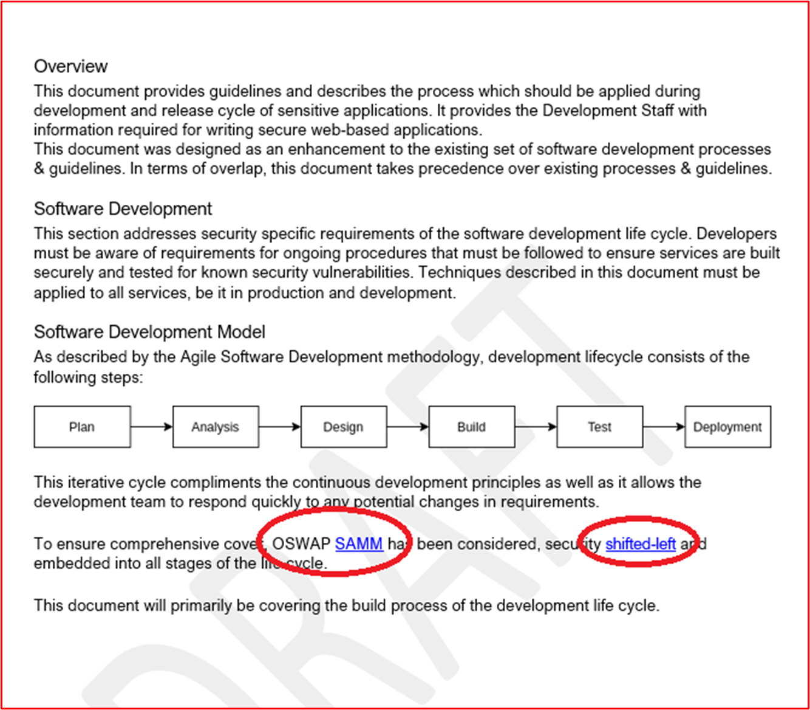

**Nota:** Estas capturas de pantalla muestran el documento de desarrollo de software seguro, la expectativa es que los ISV compartan la documentación de soporte real y no simplemente proporcionen una captura de pantalla.

**Control No. 35:** Proporcionar pruebas demostrables de que los cambios de código se someten a un proceso de revisión y autorización por parte de un segundo revisor.

- Intención: el objetivo de este control es realizar una revisión de código por parte de otro desarrollador para ayudar a identificar los errores de codificación que podrían introducir una vulnerabilidad en el software. Se debe establecer la autorización para garantizar que se llevan a cabo revisiones de código, se realizan pruebas, etc. antes de la implementación. El paso de autorización puede validar que se han seguido los procesos correctos que apuntalan el SDLC definido anteriormente.

- Directrices de evidencia de ejemplo: proporcione pruebas de que el código se somete a una revisión del mismo nivel y debe estar autorizado para poder aplicarse al entorno de producción. Esta evidencia puede ser a través de una exportación de vales de cambio, lo que demuestra que se han realizado revisiones de código y los cambios autorizados, o podría ser a través de software de revisiones de código como Crucible ( [https://www.atlassian.com/software/crucible](https://www.atlassian.com/software/crucible) ).

- Ejemplo de evidencia

A continuación se muestra un vale que muestra que los cambios de código se someten a un proceso de revisión y autorización por parte de otra persona que no sea el desarrollador original. Muestra que el usuario ha solicitado una revisión de código y que se asignará a otra persona para la revisión de código.

La siguiente imagen muestra que la revisión de código se asignó a otra persona que no sea el desarrollador original, como se muestra en la sección resaltada en el lado derecho de la imagen siguiente. En el lado izquierdo, puede ver que el revisor de código ha revisado el código y ha recibido un &#39;PASSED CODE REVIEW&#39; estado.

El vale ahora debe obtener la aprobación de un administrador antes de que los cambios se puedan colocar en sistemas de producción en directo.

 La imagen anterior muestra que el código revisado ha recibido la aprobación para implementarse en los sistemas de producción en directo.

 Una vez que se han realizado los cambios de código, el trabajo final obtiene la firma como se muestra en la imagen anterior.

Tenga en cuenta que durante todo el proceso hay tres personas implicadas, el desarrollador original del código, el revisor de código y un administrador para dar aprobación y cerrar sesión. Para cumplir los criterios de este control, se espera que los tickets sigan este proceso. De un mínimo de tres personas implicadas en el proceso de control de cambios para las revisiones de código.

**Control No. 36:** Proporcionar pruebas demostrables de que los desarrolladores se someten a un aprendizaje de desarrollo de software seguro anualmente.

- Intención: existen procedimientos recomendados y técnicas de codificación para todos los lenguajes de programación para garantizar que el código se desarrolla de forma segura. Hay cursos de formación externos diseñados para enseñar a los desarrolladores los diferentes tipos de clases de vulnerabilidades de software y las técnicas de codificación que se pueden usar para dejar de introducir estas vulnerabilidades en el software. La intención de este control es enseñar estas técnicas a todos los desarrolladores y garantizar que estas técnicas no se olviden, o que las técnicas más recientes se aprenden llevando a cabo esta técnica anualmente.

- Directrices de evidencia de ejemplo: proporcionar pruebas a través de certificados si se llevan a cabo por una empresa de formación externa, o proporcionando capturas de pantalla de los diarios de aprendizaje u otros artefactos que demuestren que los desarrolladores han asistido a la formación. Si este aprendizaje se lleva a cabo a través de recursos internos, proporcione también pruebas del material de aprendizaje.

- Ejemplo de evidencia: a continuación se muestra el correo electrónico que solicita al personal del equipo DevOps estar inscrito en la formación anual de los diez mejores cursos de OWASP

A continuación se muestra que la formación se ha solicitado con justificación y aprobación empresarial. A continuación, se muestran capturas de pantalla tomadas del entrenamiento y un registro de finalización que muestra que la persona ha terminado el entrenamiento anual.

**Control No. 37:** Proporcionar pruebas demostrables de que los repositorios de código están protegidos con la autenticación multifactor (MFA).

- Intent: If a threat actor can access and modify a software&#39;'s code base, he/she could introduce vulnerabilities, backdoors, or malicious code into the code base and therefore into the application. Ya ha habido varios casos de esto, probablemente el más publicizado sea el ataque NotPetya Ransomware, que al parecer está infectado a través de una actualización comprometida del software fiscal ucraniano denominado M.E.Doc (vea [What is NotPetya](https://www.itpro.co.uk/malware/34381/what-is-notpetya)).

- Directrices de evidencia de ejemplo: proporcionar pruebas mediante capturas de pantalla desde el repositorio de código que **todos** los usuarios tienen MFA habilitada.

- Ejemplo de evidencia: la siguiente captura de pantalla muestra que MFA está habilitada en los 8 usuarios de GitLab.

**Control No. 38:** Proporcione pruebas demostrables de que los controles de acceso están en su lugar para proteger repositorios de código.

- Intent: Leading on from the previous control, access controls should be implemented to limit access to only individual users who are working on particular projects. Al limitar el acceso, se limita el riesgo de que se realicen cambios no autorizados y, por lo tanto, se introducen cambios de código no seguros. Se debe adoptar un enfoque con privilegios mínimos para proteger el repositorio de código.

- Directrices de evidencia de ejemplo: proporcionar pruebas a través de capturas de pantalla desde el repositorio de código de que el acceso está restringido a las personas necesarias, incluidos los privilegios diferentes.

- Ejemplo de evidencia: la siguiente captura de pantalla muestra los miembros del proyecto &quot; Customers &quot; en GitLab, que es contoso &quot; Customer Portal &quot; . Como se puede ver en la captura de pantalla, los usuarios tienen &quot; roles diferentes para limitar el acceso al &quot; proyecto.

### Administración de cuentas

Las prácticas de administración de cuentas seguras son importantes, ya que las cuentas de usuario forman la base para permitir el acceso a sistemas de información, entornos del sistema y datos. Las cuentas de usuario deben protegerse correctamente como un riesgo de las credenciales del usuario&#39;puede proporcionar no solo un punto de apoyo en el entorno y acceso a datos confidenciales, sino que también puede proporcionar control administrativo sobre todo el entorno o sistemas clave si las credenciales del usuario&#39;tienen privilegios administrativos.

**Control No. 39:** Proporcionar documentación de directivas que rige los procedimientos y prácticas de administración de cuentas.

- Intención: las cuentas de usuario siguen siendo dirigidas por actores de amenazas y, a menudo, serán el origen de un riesgo de datos. Al configurar cuentas excesivamente permisivas &#39;, las organizaciones no solo aumentarán el grupo de cuentas de&#39; con privilegios que un actor de amenazas puede aprovechar para realizar una vulneración de datos, sino que también pueden aumentar el riesgo de la explotación correcta de una vulnerabilidad que requeriría privilegios específicos para tener éxito.

-  BeyondTrust produce un informe de vulnerabilidades de Microsoft cada año que analiza las vulnerabilidades de seguridad de Microsoft del año anterior y detalla los porcentajes de estas vulnerabilidades que dependen de que la cuenta de usuario tenga derechos de &quot; &quot; administrador. En una publicación reciente del blog Nuevo informe de vulnerabilidades de Microsoft, se muestra un aumento del 48 % de vulnerabilidades yoY cómo podrían mitigarse con privilegios mínimos , el 90 % de las vulnerabilidades críticas en Internet Explorer, el 85 % de las vulnerabilidades críticas en Microsoft Edge y el &quot; [ &amp; ](https://www.beyondtrust.com/blog/entry/microsoft-vulnerabilities-report)100 % de las vulnerabilidades críticas en Microsoft Outlook se habrían mitigado quitando derechos de &quot; administrador. Para admitir la administración segura de cuentas, las organizaciones deben asegurarse de que las directivas y procedimientos de soporte técnico que promueven los procedimientos recomendados de seguridad se han establecido y seguido para mitigar estas amenazas.

- Directrices de evidencia de ejemplo: proporcione las directivas documentadas y los documentos de procedimientos que cubren las prácticas de administración de cuentas. Como mínimo, los temas tratados deben alinearse con los controles de la Microsoft 365 certificación.

- Ejemplo de evidencia: la siguiente captura de pantalla muestra un ejemplo de directiva de administración de cuentas para Contoso.

**Nota:** Esta captura de pantalla muestra un documento de directiva o proceso, la expectativa es que los ISV compartan la documentación real de la directiva o procedimiento de soporte técnico y no simplemente proporcionen una captura de pantalla.

**Control No. 40:** Proporcione pruebas demostrables de que las credenciales predeterminadas se deshabilitan, quitan o cambian en todos los componentes del sistema muestreados.

- Intención: aunque esto es cada vez menos popular, todavía hay instancias en las que los actores de amenazas pueden aprovechar las credenciales de usuario predeterminadas y bien documentadas para poner en peligro los componentes del sistema de producción. Un ejemplo popular de esto es dell iDRAC (controlador de acceso remoto dell integrado). Este sistema se puede usar para administrar de forma remota un servidor Dell, que podría aprovechar un actor de amenazas para obtener el control sobre el sistema operativo del servidor&#39;servidor. La credencial predeterminada de root::calvin está documentada y a menudo los actores de amenazas pueden aprovecharla para obtener acceso a los sistemas usados por las organizaciones. El objetivo de este control es asegurarse de que estas credenciales predeterminadas están deshabilitadas o eliminadas.

- Directrices de evidencia de ejemplo: hay varias formas en que se pueden recopilar pruebas para admitir este control. Las capturas de pantalla de los usuarios configurados en todos los componentes del sistema pueden ayudar, es decir, las capturas de pantalla de los archivos Linux /etc/shadow y /etc/passwd ayudarán a demostrar si las cuentas se han deshabilitado. Tenga en cuenta que el archivo /etc/shadow sería necesario para demostrar que las cuentas están realmente deshabilitadas al observar que el hash de contraseña comienza con un carácter no válido como &#39;!&#39; que indica que la contraseña no se puede usar. El consejo sería deshabilitar solo algunos caracteres de la contraseña y redactar el resto. Otras opciones serían para sesiones de screensharing en las que el evaluador podía probar manualmente las credenciales predeterminadas, por ejemplo, en la discusión anterior sobre Dell iDRAC, el evaluador debe intentar autenticarse en todas las interfaces de Dell iDRAC con las credenciales predeterminadas.

- Ejemplo de evidencia: la siguiente captura de pantalla muestra las cuentas de usuario configuradas para el componente del sistema en el ámbito &quot; CLARANET-SBU-WM &quot; . Muestra varias cuentas predeterminadas; Sin embargo, las siguientes capturas de pantalla muestran que estas cuentas están deshabilitadas.

En esta siguiente captura de pantalla se muestra que la cuenta de administrador está deshabilitada en el componente del sistema en el ámbito &quot; CLARANET-SBU-WM &quot; .

Esta siguiente captura de pantalla muestra que la cuenta de invitado está deshabilitada en el componente del sistema en el ámbito &quot; CLARANET-SBU-WM &quot; .

Esta siguiente captura de pantalla muestra que DefaultAccount está deshabilitada en el componente del sistema en el ámbito &quot; CLARANET-SBU-WM &quot; .

**Control No. 41:** Proporcione pruebas demostrables de que la creación, modificación y eliminación de cuentas pasa por un proceso de aprobación establecido.

- Intención: el objetivo es tener un proceso establecido para garantizar que todas las actividades de administración de cuentas se aprueben asegurando que los privilegios de cuenta mantengan los principios de privilegios mínimos y que las actividades de administración de cuentas se puedan revisar y realizar un seguimiento adecuado.

- Directrices de evidencia de ejemplo: las pruebas suelen estar en forma de vales de solicitud de cambio, las solicitudes ITSM (administración de servicios de TI) o los documentos que muestran solicitudes de cuentas para crear, modificar o eliminar han pasado por un proceso de aprobación.

- Ejemplo de evidencia: las imágenes siguientes muestran la creación de cuentas para un nuevo inicio para el equipo de DevOps que debe tener una configuración RBAC basada en los permisos del entorno de producción sin acceso al entorno de desarrollo y acceso estándar sin privilegios a todo lo demás.

La creación de la cuenta ha pasado por el proceso de aprobación y el proceso de cierre de sesión una vez que se creó la cuenta y se cerró el vale.

**Control No. 42:** Proporcione pruebas demostrables de que hay un proceso para deshabilitar o eliminar cuentas que no se usan en un plazo de 3 meses.

- Intención: a veces, las cuentas inactivas pueden verse comprometidas porque están dirigidas a ataques de fuerza bruta que pueden no estar marcados porque el usuario no va a intentar iniciar sesión en las cuentas, o bien por una infracción de la base de datos de contraseñas en la que la contraseña de un usuario&#39;se ha reutilizado y está disponible en un volcado de nombre de usuario/contraseña en Internet. Las cuentas no usadas deben deshabilitarse o quitarse para reducir la superficie de ataque que un actor de amenazas tiene para llevar a cabo actividades de riesgo de cuenta. Estas cuentas pueden deberse a un proceso de leavers que no se está llevando a cabo correctamente, a un miembro del personal que pasa por enfermedad de larga duración o a un miembro del personal que va a licencia de paternidad/maternidad. Al implementar un proceso trimestral para identificar estas cuentas, las organizaciones pueden minimizar la superficie de ataque.

- Directrices de evidencia de ejemplo: la evidencia debe ser doble. En primer lugar, una captura de pantalla o exportación de archivos que muestra el último inicio de sesión de todas las cuentas de &quot; usuario dentro del entorno del &quot; ámbito. Pueden ser cuentas locales, así como cuentas dentro de un servicio de directorio centralizado, como AAD (Azure Active Directory). Esto demostrará que no hay cuentas de más de 3 meses habilitadas. En segundo lugar, evidencia del proceso de revisión trimestral que puede ser una prueba documental de la tarea que se está completando en ADO (Azure DevOps) o en los vales jira, o a través de registros en papel que deben estar firmados.

- Evidencia de ejemplo: esta primera captura de pantalla muestra el resultado del script que se ejecuta trimestralmente para ver el último atributo de inicio de sesión para los usuarios de AAD.

Como se puede ver en la captura de pantalla anterior, dos usuarios muestran que no han iniciado sesión durante algún tiempo. Las dos capturas de pantalla siguientes muestran que estos dos usuarios están deshabilitados.

**Control No. 43:** Proporcione pruebas demostrables de que hay una directiva de contraseña segura u otras mitigaciones adecuadas para proteger las credenciales de usuario.  Lo siguiente debe usarse como una directriz mínima:
- Longitud mínima de contraseña de 8 caracteres
- Umbral de bloqueo de cuentas de no más de 10 intentos
- Historial de contraseñas de un mínimo de 5 contraseñas
- Aplicación del uso de contraseña segura

- Intención: como ya se ha comentado, las credenciales de usuario suelen ser el objetivo de ataques por parte de actores de amenazas que intentan obtener acceso a un entorno de&#39;organización. El objetivo de una directiva de contraseñas seguras es intentar forzar a los usuarios a elegir contraseñas seguras para mitigar las posibilidades de que los actores de amenazas puedan forzarlas brutamente. La intención de agregar las mitigaciones adecuadas es reconocer que las organizaciones pueden implementar otras medidas de seguridad para ayudar a proteger las credenciales de usuario en función de los desarrollos del sector, como la publicación especial &quot; &quot; &quot; [800-63B de NIST.](https://pages.nist.gov/800-63-3/sp800-63b.html) &quot;

- Directrices de evidencia de ejemplo: evidencia para demostrar una directiva de contraseña segura puede estar en forma de una captura de pantalla de un objeto de directiva de grupo de organizaciones o directivas de cuenta de directiva de seguridad local à Directiva de contraseña y directivas de cuenta à Configuración de directiva de bloqueo de &quot; &quot; &quot; &quot; cuentas. La evidencia depende de las tecnologías que se usan; Es decir, para Linux podría ser el archivo de configuración /etc/pam.d/common-password, para BitBucket la sección Directivas de autenticación en el Portal de &quot; &quot; administración ( ), [https://support.atlassian.com/security-and-access-policies/docs/manage-your-password-policy/](https://support.atlassian.com/security-and-access-policies/docs/manage-your-password-policy/) etc.

- Ejemplo de evidencia: la evidencia siguiente muestra la directiva de contraseña configurada en la directiva de seguridad local del componente del sistema en el ámbito &quot; &quot; &quot; CLARANET-SBU-WM &quot; .

La captura de pantalla siguiente muestra la configuración de bloqueo de cuenta para un Firewall de WatchGuard.

A continuación se muestra un ejemplo de una longitud mínima de frase de contraseña para el Firewall de WatchGaurd.

**Control No. 44:** Proporcionar pruebas demostrables de que las cuentas de usuario únicas se emiten a todos los usuarios.

- Intención: el objetivo de este control es la responsabilidad. Al emitir usuarios con sus propias cuentas de usuario únicas, los usuarios serán responsables de sus acciones, ya que se puede realizar un seguimiento de la actividad del usuario a un usuario individual.

- Directrices de evidencia de ejemplo: la evidencia sería mediante capturas de pantalla que muestran cuentas de usuario configuradas en los componentes del sistema en el ámbito, que pueden incluir servidores, repositorios de código, plataformas de administración en la nube, Active Directory, Firewalls, etc.

- Ejemplo de evidencia: la siguiente captura de pantalla muestra las cuentas de usuario configuradas para el componente del sistema en el ámbito &quot; CLARANET-SBU-WM &quot; .

En esta siguiente captura de pantalla se muestra que la cuenta de administrador está deshabilitada en el componente del sistema en el ámbito &quot; CLARANET-SBU-WM &quot; .

Esta siguiente captura de pantalla muestra que la cuenta de invitado está deshabilitada en el componente del sistema en el ámbito &quot; CLARANET-SBU-WM &quot; .

Esta siguiente captura de pantalla muestra que DefaultAccount está deshabilitada en el componente del sistema en el ámbito &quot; CLARANET-SBU-WM &quot; .

**Control No. 45:** Proporcionar pruebas demostrables de que se siguen los principios de privilegios mínimos en el entorno.

- Intención: solo se debe proporcionar a los usuarios los privilegios necesarios para cumplir con su función de trabajo. Esto es para limitar el riesgo de que un usuario acceda intencionada o involuntaramente a los datos que&#39;o llevar a cabo un acto malintencionado. Al seguir este principio, también reduce la superficie de ataque potencial (es decir, cuentas con privilegios) que puede ser dirigida por un actor de amenazas malintencionadas.

- Directrices de evidencia de ejemplo: la mayoría de las organizaciones usarán grupos para asignar privilegios basados en equipos dentro de la organización. Las pruebas podrían ser capturas de pantalla que muestran los distintos grupos con privilegios y solo las cuentas de usuario de los equipos que requieren estos privilegios. Normalmente, esto se copiaría con directivas o procesos de soporte técnico que definen cada grupo definido con los privilegios necesarios y la justificación empresarial y una jerarquía de miembros del equipo para validar la pertenencia a grupos está configurada correctamente.

- Por ejemplo: en Azure, el grupo Propietarios debe ser muy limitado, por lo que debe estar documentado y tener un número limitado de personas asignadas a ese grupo. Otro ejemplo podría ser un número limitado de personal con la capacidad de realizar cambios de código, un grupo puede configurarse con este privilegio con los miembros del personal que se consideran que necesitan este permiso configurado. Esto debe documentarse para que el analista de certificación pueda hacer referencia cruzada al documento con los grupos configurados, etc.

- Ejemplo de evidencia: la siguiente captura de pantalla muestra que el entorno está configurado con grupos asignados según la función de trabajo.

La siguiente captura de pantalla muestra que los usuarios se asignan a grupos en función de su función de trabajo.

**Control No. 46:** Proporcione pruebas demostrables de que hay un proceso para proteger o proteger cuentas de servicio y se está siguiendo el proceso.

- Intención: las cuentas de servicio suelen ser dirigidas por actores de amenazas, ya que a menudo se configuran con privilegios elevados. Es posible que estas cuentas no sigan las directivas de contraseña estándar porque la expiración de las contraseñas de cuenta de servicio suele romper la funcionalidad. Por lo tanto, pueden configurarse con contraseñas o contraseñas débiles que se reutilizan dentro de la organización. Otro posible problema, especialmente en un entorno Windows, puede ser que el sistema operativo almacena en caché el hash de contraseña. Esto puede ser un gran problema si: la cuenta de servicio está configurada dentro de un servicio de directorio, ya que esta cuenta puede usarse en varios sistemas con el nivel de privilegios configurado o la cuenta de servicio es local, lo más probable es que se utilice la misma cuenta o contraseña en varios sistemas del entorno. Los problemas anteriores pueden provocar que un actor de amenazas obtenga acceso a más sistemas dentro del entorno y pueda llevar a una mayor elevación de privilegios o movimiento lateral. Por lo tanto, la intención es asegurarse de que las cuentas de servicio estén protegidas y protegidas correctamente para ayudar a protegerlas de ser tomadas por un actor de amenazas, o limitando el riesgo en caso de que una de estas cuentas de servicio se vea comprometida.

- Directrices de evidencia de ejemplo: hay muchas guías en Internet que ayudan a endurecer las cuentas de servicio. La evidencia puede estar en forma de capturas de pantalla que muestran cómo la organización ha implementado el endurecimiento seguro de la cuenta. Algunos ejemplos (la expectativa es que se usarían varias técnicas) incluyen:
- Restringir las cuentas a un conjunto de equipos de Active Directory,
- Establecer la cuenta de modo que no&#39;inicio de sesión interactivo,
- Establecer una contraseña extremadamente compleja,
- Para Active Directory, habilitar la &quot; cuenta es confidencial y no se puede delegar la &quot; marca. Estas técnicas se de abordan en el siguiente artículo &quot; [Segmentation y Shared Active Directory for a Cardholder Data Environment](https://pciramblings.com/2019/12/13/segmentation-and-shared-active-directory-of-a-cardholder-data-environment/) &quot; .

- Evidencia de ejemplo: hay varias maneras de endurecer una cuenta de servicio, que dependerá de cada entorno individual. Los mecanismos adecuados para su entorno, que se usan, se documentarían en el documento de procedimiento o directiva de administración de cuentas anteriormente, lo que ayudará a revisar esta evidencia. A continuación se muestran algunos de los mecanismos que se pueden emplear:

En la siguiente captura de pantalla se muestra &#39;cuenta es confidencial y se debe delegar la conexión&#39; opción está seleccionada en la cuenta de servicio &quot; \_ Prod SQL Cuenta de servicio &quot; .

Esta siguiente captura de pantalla muestra que la cuenta de servicio Prod SQL Cuenta de servicio está bloqueada en el SQL Server y solo puede iniciar sesión &quot; \_ en ese &quot; servidor.

Esta siguiente captura de pantalla muestra que la cuenta de servicio Prod SQL cuenta de servicio solo puede iniciar &quot; \_ sesión como &quot; servicio.

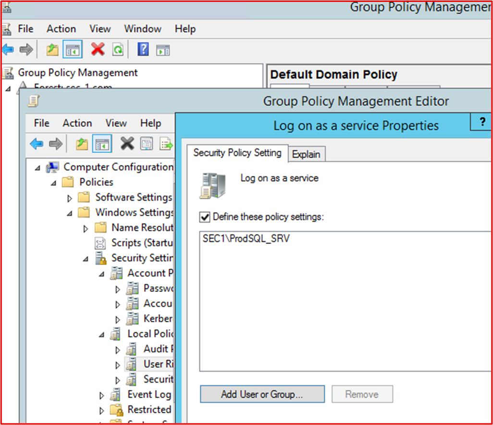

**Control No. 47:** Proporcione pruebas demostrables de que MFA está configurado para todas las conexiones de acceso remoto y todas las interfaces administrativas que no son de consola.

Términos definidos como:
- **Acceso remoto:** normalmente, se refiere a las tecnologías usadas para obtener acceso al entorno de soporte técnico. Por ejemplo, VPN IPSec de acceso remoto, VPN SSL o Host Jumpbox/Bastian.
- **Interfaces administrativas que** no son de consola: normalmente, esto hace referencia a las conexiones administrativas de red a los componentes del sistema. Esto podría ser a través de Escritorio remoto, SSH o una interfaz web.

- Intención: el objetivo de este control es proporcionar mitigaciones contra la fuerza bruta de cuentas con privilegios y cuentas con acceso seguro al entorno. Al proporcionar la autenticación multifactor (MFA), una contraseña comprometida debe protegerse contra un inicio de sesión correcto, ya que el mecanismo mfa todavía debe protegerse. Esto ayuda a garantizar que todos los accesos y acciones administrativas solo se llevan a cabo por miembros del personal autorizados y de confianza.

- Directrices de evidencia de ejemplo: la evidencia debe mostrar que MFA está habilitada en todas las tecnologías que se ajustan a las categorías anteriores. Esto puede ser a través de una captura de pantalla que muestra que MFA está habilitado en el nivel del sistema. Por nivel del sistema, necesitamos evidencia de que está habilitada para todos los usuarios y no solo un ejemplo de una cuenta con MFA habilitada. Cuando la tecnología se copia de seguridad en una solución MFA, necesitamos la evidencia para demostrar que está habilitada y en uso. Lo que esto significa es; donde la tecnología está configurada para la autenticación de radius, que apunta a un proveedor de MFA, también debe evidenciar que el servidor Radius al que apunta, es una solución MFA y que las cuentas están configuradas para usarla.

- Pruebas de ejemplo 1: Las siguientes capturas de pantalla muestran los dominios de autenticación configurados en Pulse Secure, que se usa para el acceso remoto al entorno. El servicio SaaS duo para el soporte de MFA respalda la autenticación.

Esta captura de pantalla muestra que está habilitado un servidor de autenticación adicional que apunta a Duo-LDAP para el dominio de autenticación &quot; &quot; &#39;Duo- Default Route&#39; authentication.

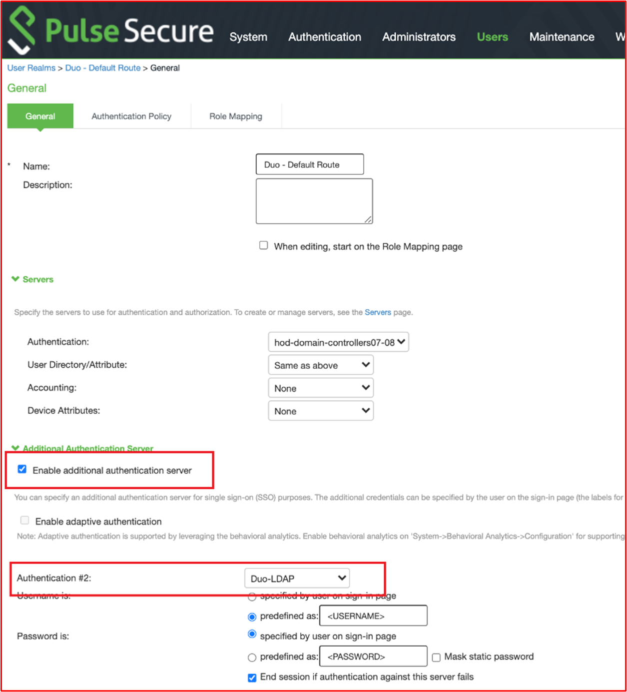

Esta captura de pantalla final muestra la configuración del servidor de autenticación Duo-LDAP, que muestra que esto apunta al servicio SaaS duo para MFA.

Ejemplo evidencia 2: Las siguientes capturas de pantalla muestran que todos los usuarios de Azure tienen MFA habilitada.

**Nota:** Deberá proporcionar pruebas de todas las conexiones que no son de consola para demostrar que MFA está habilitada para ellas. Por lo tanto, por ejemplo, si rdp o SSH a servidores u otros componentes del sistema (es decir, firewalls).

**Control No. 48:** Proporcione pruebas demostrables de que el cifrado seguro está configurado para todas las conexiones de acceso remoto y todas las interfaces administrativas que no son de consola, incluido el acceso a los repositorios de código e interfaces de administración en la nube.

Términos definidos como:
- **Repositorios de** código: la base de código de la aplicación debe protegerse contra modificaciones malintencionadas que podrían introducir malware en la aplicación. Mfa debe configurarse en el repositorio de código.
- **Interfaces de administración en** la nube: donde parte o todo el entorno está hospedado en el proveedor de servicios en la nube (CSP), aquí se incluye la interfaz administrativa para la administración en la nube.

- Intención: la intención de este control es garantizar que todo el tráfico administrativo esté cifrado adecuadamente para protegerse contra ataques de tipo man-in-the-middle.

- Directrices de evidencia de ejemplo: las capturas de pantalla que muestran la configuración de cifrado para las tecnologías de acceso remoto, RDP, SSH y las interfaces de administración web podrían proporcionar pruebas. Para las interfaces de administración web, podría usarse el escáner qualys SSL Labs (si es accesible públicamente, es decir, interfaces de administración en la nube, repositorios de código SaaS o conexiones VPN SSL).

- Evidencia de ejemplo: la evidencia siguiente muestra el nivel de cifrado RDP en Webserver01 que se configura con una configuración de &quot; &quot; &#39;nivel alto &quot; . Como se muestra en el texto de ayuda, se usa un cifrado seguro de 128 bits (que es el nivel más alto para Microsoft Windows RDP.

La siguiente evidencia también muestra que la seguridad de transporte RDP está configurada para usar TLS 1.0 en &quot; Webserver01 (que es la más alta &quot; para Windows Server).

**Control No. 49:** Proporcione pruebas demostrables de que MFA se usa para proteger el portal de administración que usa para administrar y mantener todos los registros del servicio de nombres de dominio público (DNS).

- Intención: si un actor de amenazas malintencionadas puede obtener acceso a los registros DNS públicos, existe el riesgo de que puedan modificar las direcciones URL usadas por la aplicación, o cuando el archivo de manifiesto apunte a introducir código malintencionado o dirigir el tráfico de usuario a un punto de conexión bajo el control de actores. Esto podría provocar una pérdida de datos de usuario o infecciones de malware o ransomware en toda la base de usuarios de la aplicación.

- Directrices de evidencia de ejemplo: proporcionar pruebas que demuestren que los portales administrativos de DNS público están protegidos por MFA. Incluso si dns público se hospeda en servidores dentro del entorno de ámbito (es decir, control y operado por la organización), puede haber un Portal de administración en algún lugar donde se registró el nombre de dominio y los registros DNS se &#39;managed&#39; para apuntar los servidores DNS a su propia infraestructura. Si este es el caso, MFA debe habilitarse en la interfaz administrativa del registrador de dominios si se pueden modificar los registros DNS de dominios. Se debe proporcionar una captura de pantalla que muestre que la interfaz administrativa está habilitada para MFA en el nivel del sistema (es decir, todas las cuentas con privilegios).

- Ejemplo de evidencia: la siguiente captura de pantalla muestra el contoso.com DNS se administra en Microsoft Azure para Contoso Corporation.

**Nota:** Las direcciones IP son direcciones RFC 1918 privadas y no se enrutadas públicamente. Esto es solo con fines de demostración.

Las capturas de pantalla siguientes muestran que todos los usuarios de Azure tienen MFA habilitada.

### Detección y prevención de intrusiones (opcional)

Los sistemas de detección y prevención de intrusiones (IDPS) en la puerta de enlace pueden proporcionar una capa adicional de protección contra una gran cantidad de amenazas internas y basadas en Internet. Estos sistemas pueden ayudar a evitar que estas amenazas tengan éxito y pueden proporcionar capacidades de alerta cruciales para alertar a las organizaciones de los intentos de peligro directos para permitir que las organizaciones implementen estrategias de defensa adicionales para proteger aún más el entorno contra estas amenazas activas.

**Esta sección es para crédito adicional y, por lo tanto, es opcional. No es un requisito, pero si lo completa, la evaluación mostrará una imagen más completa de su entorno y los controles y estándares que ha establecido.**

**Control No. 50:** Proporcione pruebas demostrables de que los sistemas de detección y prevención de intrusiones (IDPS) se implementan en el perímetro de los entornos del ámbito.

- Intención: aunque algunas fuentes describen que las amenazas internas superan ahora las amenazas de los actores de amenazas externas, las amenazas internas también incluyen la negligencia, con un error humano que aumenta en porcentaje año tras año. La intención de instalar IDPS en el perímetro de los entornos en el ámbito es que las amenazas externas a menudo se pueden detectar a través de mecanismos IDPS debido a la naturaleza y las técnicas usadas por este tipo de amenazas.

- Directrices de evidencia de ejemplo: se deben proporcionar pruebas que demuestren que IDPS está instalado en el perímetro, esto podría estar directamente en el Firewall si se ejecuta un firewall de NextGen o podría ser mediante sensores IDPS de implementación configurados en puertos de conmutador de reflejo para garantizar que los sensores implementados vean todo el tráfico. Si se usan sensores IDPS, es posible que deba proporcionarse evidencia adicional para demostrar que los sensores pueden ver todos los flujos de tráfico externo.

- Ejemplo de evidencia: la siguiente captura de pantalla muestra que la funcionalidad idps está habilitada en el Firewall de WatchGuard.

La captura de pantalla adicional siguiente muestra que IDPS está habilitado en todas las reglas dentro del firewall de WatchGuard&#39;de configuración.

**Control No. 51:** Proporcione pruebas demostrables de que las firmas de IDPS se mantienen actualizadas (en un plazo de 24 horas).

- Intención: hay varios modos de operación para IDPS, el más común es usar firmas para identificar el tráfico de ataques. A medida que evolucionan los ataques y se identifican las vulnerabilidades más recientes, es importante que las firmas de IDPS estén actualizadas para proporcionar una protección adecuada. El objetivo de este control es garantizar que se mantengan los IDPS.

- Directrices de evidencia de ejemplo: es probable que la evidencia sea mediante una captura de pantalla que muestre que el IDPS está configurado para actualizar firmas al menos diariamente y mostrar la última actualización.

- Evidencia de ejemplo: aunque esta captura de pantalla no muestra&#39;que las firmas idps se han actualizado en las últimas 24 horas, sí muestra que la versión más reciente está instalada, que era de hace una semana ( Evidencia recopilada en el _18__th_ _de_ mayo ). Esto, combinado con la captura de pantalla siguiente, muestra que las firmas estarán actualizadas en un período de 24 horas.

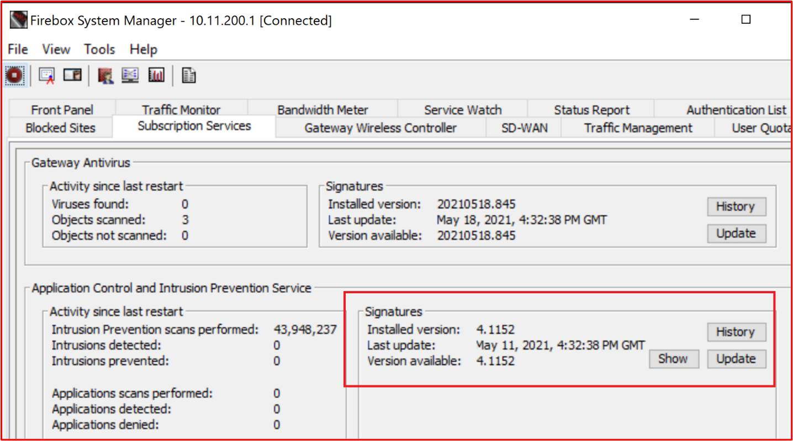

**Control No. 52:** Proporcione pruebas demostrables de que IDPS está configurado para admitir la inspección TLS de todo el tráfico web entrante.

- Intención: dado que IDPS se basa en firmas, debe poder inspeccionar todos los flujos de tráfico para identificar el tráfico de ataques. El tráfico TLS está cifrado y, por lo tanto, IDPS no podría inspeccionar correctamente el tráfico. Esto es fundamental para el tráfico HTTPS, ya que hay una gran variedad de amenazas que son comunes a los servicios web. El objetivo de este control es garantizar que los flujos de tráfico cifrados también se puedan inspeccionar en busca de IDPS.

- Directrices de evidencia de ejemplo: la solución IDPS debe proporcionar pruebas mediante capturas de pantalla, lo que demuestra que el tráfico TLS cifrado también está siendo inspeccionado por la solución IDPS.

- Evidencia de ejemplo: esta captura de pantalla muestra las reglas HTTPS en el Firewall

Esta siguiente captura de pantalla muestra que IDPS está habilitado en estas reglas.

En la siguiente captura de pantalla se muestra una acción de proxy que se aplica a la regla de &#39;entrada de tráfico de &quot; &quot; \_ bots&#39;, que se usa para activar la inspección \_ de contenido.

La siguiente captura de pantalla muestra que la inspección de contenido está habilitada.

**Control No. 53:** Proporcione pruebas demostrables de que IDPS está configurado para supervisar todos los flujos de tráfico entrante.

- Intención: como ya se ha comentado, es importante que el IDPS supervise todos los flujos de tráfico entrante para identificar cualquier forma de tráfico de ataque.

- Directrices de evidencia de ejemplo: se deben proporcionar pruebas a través de capturas de pantalla para demostrar que se supervisan todos los flujos de tráfico entrantes. Esto puede ser usar el firewall de NextGen, que muestra que todas las reglas entrantes están habilitadas para IDPS, o puede ser mediante el uso de sensores IDPS y demostrar que todo el tráfico está configurado para llegar al sensor IDPS.

- Ejemplo de evidencia: esta captura de pantalla muestra que IDPS está configurado en todas las reglas (directivas) del Firewall&#39;WatchGuard.

**Control No. 54:** Proporcione pruebas demostrables de que IDPS está configurado para supervisar todos los flujos de tráfico saliente.

- Intención: como ya se ha comentado, es importante que el IDPS supervise todos los flujos de tráfico saliente para identificar cualquier forma de tráfico de ataque. Algunos sistemas IDPS también pueden identificar posibles infracciones internas mediante la supervisión de todo el tráfico saliente. Esto se puede hacer identificando el tráfico destinado a &#39;comandos y controles&#39; extremos.

- Directrices de evidencia de ejemplo: se deben proporcionar pruebas a través de capturas de pantalla para demostrar que se supervisan todos los flujos de tráfico saliente. Esto puede ser usar el firewall de NextGen, que muestra que todas las reglas salientes están habilitadas para IDPS, o puede ser mediante el uso de sensores IDPS y demostrar que todo el tráfico está configurado para llegar al sensor IDPS.

- Ejemplo de evidencia: esta captura de pantalla muestra que IDPS está configurado en todas las reglas (directivas) del Firewall&#39;WatchGuard.

- Ejemplo evidencia 2: Azure ofrece IDPS a través de aplicaciones de terceros. En el ejemplo siguiente, la captura de paquetes de Netwatcher se ha usado para capturar paquetes y se ha usado junto con Suricata, que es una herramienta Open-Source IDS.

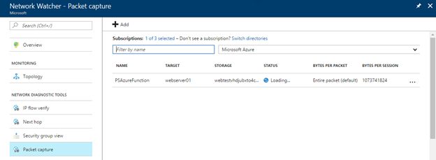

Al combinar la captura de paquetes proporcionada por Network Watcher y las herramientas de IDS de código abierto, como Suricata, puede realizar la detección de intrusiones de red para una amplia variedad de amenazas. La imagen siguiente muestra la interfaz Suricata.

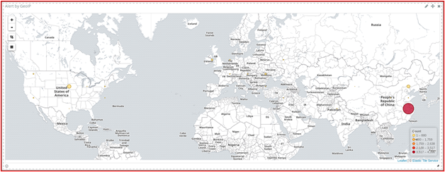

Las firmas se usan para desencadenar alertas y se pueden instalar y actualizar fácilmente. La imagen siguiente muestra una instantánea de algunas de las firmas.

En la imagen siguiente se muestra cómo supervisaría la configuración de IDPS de netwatcher y software de terceros de Suricata con Sentinel SIEM/SOAR.

- Pruebas de ejemplo 3: la imagen siguiente muestra cómo agregar una firma de intrusión de reemplazo o una regla de omisión para la detección de intrusiones. Uso de CLI

En la imagen siguiente se muestra cómo enumerar toda la configuración de detección de intrusiones mediante la CLI

- Ejemplo evidencia 4: Azure empezó recientemente a ofrecer IDPS denominado Azure Firewall Premium que permitirá la configuración de TLS, Inteligencia de amenazas, IDPS a través de directivas, sin embargo, tenga en cuenta que tendrá que seguir usando puerta principal o puerta de enlace de aplicación para la descarga de SSL del tráfico entrante, ya que Firewall de Azure Premium no admite IDPS en las conexiones SSL entrantes.

En el ejemplo siguiente, la configuración premium predeterminada se ha usado para la configuración de reglas de directiva e inspección tls, el modo IDPS, la inteligencia de amenazas se han habilitado junto con la protección de la red virtual.

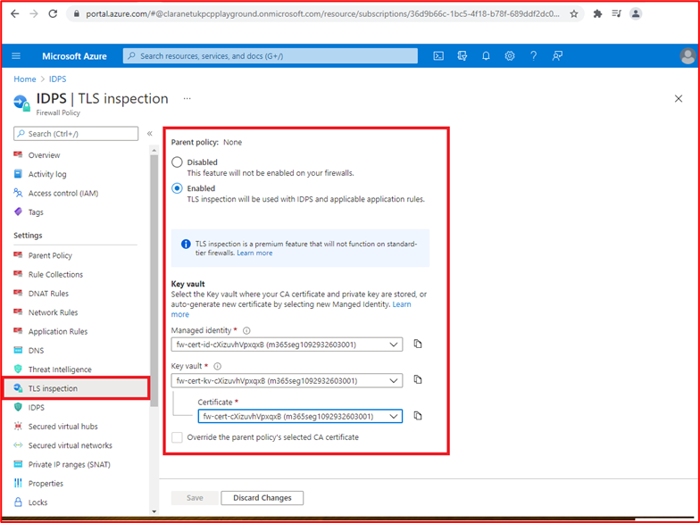

### Registro de eventos de seguridad

El registro de eventos de seguridad es una parte integral de un programa de&#39;de seguridad. El registro adecuado de eventos de seguridad junto con procesos de alertas y revisión ajustados ayudan a las organizaciones a identificar infracciones o intentos de infracciones que puede usar la organización para mejorar las estrategias de seguridad y seguridad defensivo. Además, el registro adecuado será fundamental para una capacidad de respuesta a incidentes de organizaciones que puede alimentarse en otras actividades, como la capacidad de identificar con precisión qué datos de&#39;se han visto comprometidos y quiénes, el período de compromiso, proporcionar informes de análisis detallados a las agencias gubernamentales, etc.

**Control No. 55:** Proporcionar documentación de directivas para procedimientos y procedimientos recomendados que rigen el registro de eventos de seguridad.

- Intención: El registro de eventos de seguridad es una función importante de cualquier programa de seguridad&#39;organización. Las directivas y procedimientos deben estar implementados para proporcionar claridad y coherencia para ayudar a garantizar que las organizaciones implementen controles de registro de acuerdo con las prácticas recomendadas por el proveedor y el sector. Esto ayudará a garantizar que se consuman registros relevantes y detallados que no solo son útiles para identificar eventos de seguridad potenciales o reales, sino que también pueden ayudar a una actividad de respuesta a incidentes a identificar el alcance de una infracción de seguridad.

- Directrices de evidencia de ejemplo: proporcionar a las organizaciones documentos de procedimientos y directivas que cubren los procedimientos recomendados para el registro de eventos de seguridad.

- Ejemplo de evidencia: a continuación se muestra un extracto de la directiva o procedimiento de registro.

**Nota:** Esta captura de pantalla muestra un documento de directiva o proceso, la expectativa es que los ISV compartan la documentación real de la directiva o procedimiento de soporte técnico y no simplemente proporcionen una captura de pantalla.

**Control No. 56:** Proporcione pruebas demostrables que muestran que el registro de eventos de seguridad está configurado en todos los componentes del sistema muestreados para registrar los siguientes eventos:
- Acceso de usuario a componentes del sistema y la aplicación
- Todas las acciones realizadas por un usuario con privilegios altos
- Intentos de acceso lógico no válidos
- Creación o modificación de cuentas con privilegios
- Manipulación del registro de eventos
- Deshabilitación de herramientas de seguridad, como antimalware o registro de eventos
- Registro de antimalware, como actualizaciones, detección de malware y errores de examen
- Eventos IDPS y WAF, si están configurados

- Intención: para identificar las infracciones reales e intentadas, es importante que todos los sistemas que conste el entorno estén recopilando los registros de eventos de seguridad adecuados. El objetivo de este control es asegurarse de que se capturan los tipos correctos de eventos de seguridad que, a continuación, pueden alimentarse en procesos de revisión y alerta para ayudar a identificar y responder a estos eventos.

- Directrices de evidencia de ejemplo: se deben proporcionar pruebas a través de capturas de pantalla o opciones de configuración en todos los dispositivos muestreados y en todos los componentes del sistema de relevancia para demostrar cómo se configura el registro para garantizar que se capturan estos tipos de eventos de seguridad.

- Ejemplo evidencia 1: la siguiente captura de pantalla muestra las opciones de configuración de uno de los dispositivos muestreados denominado &quot; VICTIM1-WINDOWS &quot; . La configuración muestra varias configuraciones de auditoría habilitadas dentro de la directiva de seguridad local &#39;directivas locales , directivas locales , directiva de auditoría&#39; configuración.

Esta siguiente captura de pantalla muestra un evento en el que un usuario ha borrado un registro de eventos de uno de los dispositivos muestreados denominado &quot; VICTIM1-WINDOWS &quot; .

Esta captura de pantalla final muestra el mensaje de registro que aparece dentro de la solución de registro centralizado.

**Nota:** Las capturas de pantalla son  necesarias en todos los componentes del sistema muestreados Y **DEBEN** evidenciar todos los eventos de seguridad detallados anteriormente.

**Control No. 57:** Proporcione pruebas demostrables de que los eventos de seguridad registrados contienen la siguiente información mínima:
- Usuario
- Tipo de evento
- Fecha y hora
- Indicadores de éxito o error
- Etiqueta que identifica el sistema afectado

- Intención: los eventos de seguridad registrados necesitan proporcionar información suficiente para ayudar a determinar si el tráfico de ataques se ha realizado correctamente, qué información se ha accedido, a qué nivel, quién era responsable, dónde se originó, etc.

- Directrices de evidencia de ejemplo: la evidencia debe mostrar muestras de registros de todos los componentes del sistema que muestran estos tipos de eventos de seguridad. Los registros deben incluir toda la información mencionada anteriormente.

- Ejemplo de evidencia: la siguiente captura de pantalla muestra la información de los eventos de seguridad dentro de Windows Visor de eventos del componente del sistema en el ámbito &quot; SEGSVR02 &quot; .

**Nota:** Las capturas de pantalla son necesarias en todos los componentes del sistema muestreados Y **DEBEN** evidenciar todos los eventos de seguridad detallados en el control anterior. Es probable que las pruebas recopiladas para el control anterior también satisfagan este control, proporcionando los detalles adecuados de la información de registro que se proporcionó.

**Control No. 58:** Proporcione pruebas demostrables de que todos los componentes del sistema muestreados están sincronizados con el mismo servidor principal y secundario.

- Intención: un componente crítico del registro es garantizar que los registros de todos los sistemas tengan relojes del sistema sincronizados. Esto es importante cuando se necesita una investigación para realizar un seguimiento de un compromiso o una vulneración de datos. El seguimiento de los eventos a través de varios sistemas puede ser casi imposible si los registros tienen distintos grados de marcas de tiempo, ya que se podrían perder registros importantes y será difícil realizar un seguimiento.

- Directrices de evidencia de ejemplo: lo ideal es mantener una topología de sincronización de tiempo que muestre cómo se sincroniza el tiempo en toda la propiedad. A continuación, se pueden proporcionar pruebas mediante capturas de pantalla de la configuración de sincronización de tiempo en los componentes del sistema muestreados. Esto debe mostrar que toda la sincronización de tiempo es en el mismo servidor principal (o si está en su lugar secundario).

- Ejemplo de evidencia: este diagrama muestra la topología de sincronización de tiempo en uso.

La siguiente captura de pantalla muestra el WatchGuard configurado como servidor NTP y que apunta a time.windows.com a medida que&#39;de tiempo.

Esta captura de pantalla final muestra el componente del sistema en el ámbito, CLARANET-SBU-WM está configurado para QUE NTP apunte al servidor principal, que es el Firewall de &quot; &quot; WatchGuard (10.0.1.1).

**Control No. 59:** Proporcione pruebas demostrables cuando los sistemas orientados al público están en uso de que los registros de eventos de seguridad se envían a una solución de registro centralizada que no se encuentra dentro de la red perimetral.

- Intención: el objetivo de este control es garantizar una separación lógica o física entre la DMZ y el extremo de registro. Con la DMZ pública, esto se expone a actores de amenazas externas y, por lo tanto, con más riesgo que otros componentes del entorno. Si se pone en peligro un componente dmz, se debe mantener la integridad de los datos de registro para no solo impedir que el actor de la amenaza manipule los registros para ocultar el compromiso, sino también para ayudar en cualquier trabajo de investigación forense que sea necesario. Al iniciar sesión en sistemas fuera de la DMZ, los controles de seguridad empleados para restringir el tráfico de la DMZ a estos sistemas de seguridad deben ayudar a protegerlos de actividades malintencionadas e intentos de manipulación.

- Directrices de evidencia de ejemplo: la evidencia debe proporcionarse mediante capturas de pantalla o opciones de configuración, lo que demuestra que los registros están configurados para enviarse inmediatamente (o cerca de inmediato) a una solución de registro centralizada que esté fuera de la DMZ. Estamos buscando el trasvase casi inmediato de registros porque cuanto más tiempo se tarda en enviar los registros a la solución de registro centralizada, más tiempo tendría un actor de tratamiento manipular los registros locales antes de que se produzca el envío.

- Ejemplo de evidencia: los sistemas contoso DMZ usan NXLog para el trasvase de archivos de registro. En la siguiente captura de pantalla se muestra el servicio&#39; nxlog &#39;que se ejecuta en el &quot; jumpbox DE DMZ de DESKTOP-7S65PN que se usa para administrar todos los servidores &quot; DMZ.

La siguiente captura de pantalla muestra un extracto del archivo nxlog.conf, que muestra que el destino es un recopilador de registros interno dentro de la subred de aplicación en 10.0.1.250 que se usa para enviar a AlienVault.

La siguiente dirección URL de NXLog ( ) muestra que el trasvase de registros está en tiempo real a través [https://nxlog.co/documentation/nxlog-user-guide/modes.html](https://nxlog.co/documentation/nxlog-user-guide/modes.html) de la siguiente extracción:

**Control No. 60:** Proporcione pruebas demostrables para mostrar que la solución de registro centralizado está protegida contra la manipulación no autorizada de los datos de registro.

- Intención: aunque la separación lógica/física suele tener lugar entre dispositivos de registro y la solución de registro centralizada, existe el riesgo de que alguien intente manipular los registros para ocultar sus actividades. El objetivo de este control es asegurarse de que existen mecanismos de autorización adecuados para limitar el número de usuarios que pueden realizar acciones administrativas en la solución de registro centralizada.

- Directrices de evidencia de ejemplo: la evidencia suele ser mediante capturas de pantalla que muestran la autorización y la configuración de autenticación de la solución de registro centralizado, lo que demuestra que los usuarios están limitados a los que son necesarios para su función o función de trabajo.

- Ejemplo de evidencia: el SOC subcontratado de Contoso usa AlienVault como herramientas SIEM centralizadas. AlienVault fue comprado por AT &amp; T en 2018 y ahora pasa por USM Anywhere. En la siguiente página web ( ) se describe cómo USM Anywhere protege los datos contra manipulaciones [https://cybersecurity.att.com/documentation/usm-anywhere/deployment-guide/admin/usm-anywhere-data-security.htm](https://cybersecurity.att.com/documentation/usm-anywhere/deployment-guide/admin/usm-anywhere-data-security.htm) no autorizadas. El siguiente vínculo ( ) resalta cómo el producto USM Anywhere también garantiza [https://cybersecurity.att.com/documentation/usm-appliance/raw-logs/raw-log-management.htm](https://cybersecurity.att.com/documentation/usm-appliance/raw-logs/raw-log-management.htm) la integridad de los registros archivados.

**Nota:** Si siem es interno, se necesitarán pruebas para demostrar que el acceso a los datos de registro está restringido a un número selecto de usuarios según su necesidad de trabajo y que la propia plataforma está protegida contra la manipulación (la mayoría de las soluciones lo compilarán en la funcionalidad de la solución de registro).

**Control No. 61:** Proporcione pruebas demostrables de que hay disponible un mínimo de 30 días de datos de registro de eventos de seguridad, con 90 días de registros de eventos de seguridad retenido.

- Intención: a veces, hay una diferencia de tiempo entre un compromiso o evento de seguridad y una organización que lo identifica. El objetivo de este control es garantizar que la organización tenga acceso a datos de eventos históricos para ayudar con la respuesta a incidentes y cualquier trabajo de investigación forense que sea necesario.

- Directrices de evidencia de ejemplo: la evidencia suele ser mediante la presentación de las opciones de configuración de&#39;de registro centralizado que muestran cuánto tiempo se mantienen los datos. Los datos de registro de eventos de seguridad de 30 días deben estar disponibles inmediatamente en la solución, pero cuando se archivan los datos, esta necesidad debe demostrar que el valor de 90 días está disponible. Esto podría ser mostrando carpetas de archivo con fechas de datos exportados.

- Pruebas de ejemplo 1: Las siguientes capturas de pantalla muestran que 30 días de registros están disponibles en AlienVault.

**Nota:** Dado que se trata de un documento de acceso público, el número de serie del firewall se ha redactado, sin embargo, no&#39;que los ISV admitan capturas de pantalla redactadas, a menos que contenga información de identificación personal.

En esta siguiente captura de pantalla se muestra que los registros están disponibles mostrando un extracto de registro que se remonta a 5 meses.

**Nota:** Dado que se trata de un documento orientado al público, las direcciones IP públicas se han redactado, sin embargo, no&#39;que los ISV admitan capturas de pantalla redactadas, a menos que contenga información de identificación personal.

- Ejemplo evidencia 2: la siguiente captura de pantalla muestra que los eventos de registro se mantienen durante 30 días disponibles en directo y 90 días en almacenamiento en frío dentro de Azure.

### Revisión (datos de registro de eventos de seguridad)

Revisar los registros de seguridad es una función importante para ayudar a las organizaciones a identificar eventos de seguridad que pueden ser indicativos de una infracción de seguridad o actividades de reconocimiento que pueden ser una indicación de algo que está por venir. Esto se puede hacer a través de un proceso manual a diario o mediante el uso de una solución SIEM (Administración de eventos y información de seguridad) que ayuda analizando registros de auditoría, buscando correlaciones y anomalías que se pueden marcar para una inspección manual.

**Control No. 62:** Proporcionar documentación de directivas que rige los procedimientos y procedimientos de revisión de registros.

- Intent: A report by IBM entitled &quot; [Cost of a data breach Report 2020](https://www.ibm.com/security/digital-assets/cost-data-breach-report/#/) &quot; highlights that the average time to identify and contain a data breach can take 280days, this is greater where the breach is by a malicious threat actor which is reported as 315days. Dado que el costo promedio de una infracción de datos se ha notificado en millones de dólares, es fundamental que este ciclo de vida de vulneración de datos se reduzca no solo para minimizar la ventana de exposición a los datos, sino también para reducir el período de tiempo que un actor de amenazas tiene que filtrar datos del entorno. Al reducir esta ventana, las organizaciones pueden reducir el costo general de una infracción de datos.

- Al implementar un proceso sólido de revisión y alertas, las organizaciones están mucho mejor equipadas para identificar infracciones mucho antes en el ciclo de vida de la vulneración de datos para minimizar su impacto en la organización. Además, un proceso sólido puede ayudar a identificar los intentos de infracción, lo que permite a las organizaciones reforzar los mecanismos defensivos de seguridad para mitigar esta amenaza creciente para reducir aún más las posibilidades de un riesgo por parte de la campaña de ataque.

- Directrices de evidencia de ejemplo: proporcionar a las organizaciones documentos de procedimientos y directivas que cubren los procedimientos recomendados de revisión de registros.

- Ejemplo de evidencia: a continuación se muestra un extracto de la directiva o procedimiento de revisión de registros.

**Nota:** Esta captura de pantalla muestra un documento de directiva o proceso, la expectativa es que los ISV compartan la documentación real de la directiva o procedimiento de soporte técnico y no simplemente proporcionen una captura de pantalla.

**Control No. 63:** Proporcionar pruebas demostrables de que los registros se revisan diariamente mediante herramientas humanas o automatizadas para identificar posibles eventos de seguridad.

- Intención: el objetivo de este control es asegurarse de que se están llevando a cabo revisiones diarias de registros. Esto es importante para identificar cualquier anomalía que puedan no ser detectadas por los scripts o consultas de alerta que están configurados para proporcionar alertas de eventos de seguridad.

- Directrices de evidencia de ejemplo: la evidencia normalmente se proporciona mediante captura de pantalla o un uso compartido de pantalla, lo que demuestra que se están llevando a cabo revisiones de registros. Esto puede ser a través de formularios que se completan cada día, o a través de una JIRA o un vale de DevOps con comentarios relevantes que se publican para mostrar que esto se lleva a cabo diariamente. Por ejemplo, se puede crear un vale JIRA semanal para revisión de registro diario W/C el 26 de junio de &quot; 2021 , cada día que alguien publica los resultados de la revisión del registro &quot; diario. Si se marca alguna anomalía, se puede documentar en este mismo vale para demostrar el siguiente control todo en un solo JIRA.

- Si se usan herramientas automatizadas, se pueden proporcionar pruebas de captura de pantalla para demostrar la automatización configurada y proporcionar pruebas adicionales para mostrar que la automatización se está ejecutando y alguien está revisando el resultado automatizado.

- Ejemplo de evidencia: Contoso usa un proveedor soc de terceros, Claranet Cyber Security, para la correlación de registros y las revisiones. El proveedor SOC usa AlienVault, que tiene la capacidad de proporcionar análisis de registros automatizados para registros anómalos y eventos encadenados que podrían resaltar un posible evento de seguridad. Las tres capturas de pantalla siguientes muestran reglas de correlación dentro de AlienVault.

En esta primera captura de pantalla se identifica dónde se ha agregado un usuario al &#39;administradores de dominio&#39; grupo.

En esta siguiente captura de pantalla se identifica dónde varios intentos de inicio de sesión fallidos van seguidos de un inicio de sesión correcto que puede resaltar un ataque de fuerza bruta correcta.

Esta captura de pantalla final identifica dónde se ha producido un cambio de directiva de contraseña al establecer la directiva, por lo que las contraseñas de&#39;no expiran.

Esta siguiente captura de pantalla muestra que un vale se genera automáticamente dentro de la herramienta ServiceNow de soc&#39;, desencadenando la regla anterior.

**Control No. 64:** Proporcionar pruebas demostrables de que se investigan y corrigen posibles eventos de seguridad y anomalías.

- Intención: la intención es que se investiguen las anomalías que se identifiquen durante el proceso de revisión del registro diario y se llevan a cabo las correcciones o acciones adecuadas. Esto normalmente implicará un proceso de evaluación para identificar si las anomalías requieren acción y, a continuación, es posible que deba invocar el proceso de respuesta a incidentes.

- Directrices de evidencia de ejemplo: la evidencia debe proporcionarse mediante captura de pantalla, lo que demuestra que se sigue el seguimiento de las anomalías identificadas como parte de la revisión diaria del registro. Como ya se ha comentado anteriormente, esto puede ser a través de los vales jira que muestran una anomalía que se marca y, a continuación, se detallan las actividades que se llevaron a cabo después. Esto puede preguntar a un vale JIRA específico que se genera para realizar un seguimiento de todas las actividades que se llevan a cabo, o simplemente se puede documentar en el vale de revisión del registro diario. Si se requiere una acción de respuesta a incidentes, debe documentarse como parte del proceso de respuesta a incidentes y debe proporcionarse evidencia para demostrarlo.

- Ejemplo de evidencia: en el siguiente ejemplo de captura de pantalla se muestra una alerta de seguridad que el SOC de Claranet Cyber Security MDR (Managed Detection and Response) realiza un seguimiento en ServiceNow.

Esta siguiente captura de pantalla muestra la confirmación de que David Ashton @ Contoso ha resuelto esto a través de una actualización en el portal de clientes de ServiceNow.

### Alertas de eventos de seguridad

Los eventos de seguridad críticos deben investigarse inmediatamente para minimizar el impacto en los datos y el entorno operativo. Alertar ayuda a resaltar inmediatamente posibles infracciones de seguridad al personal para garantizar una respuesta a tiempo para que la organización pueda contener el evento de seguridad lo antes posible. Al garantizar que las alertas funcionan de forma eficaz, las organizaciones pueden minimizar el impacto de una infracción de seguridad, lo que reduce la posibilidad de una infracción grave que podría dañar la marca de las organizaciones e imponer pérdidas financieras a través de multas y daños a la reputación.

**Control No. 65:** Proporcionar documentación de directiva que rige los procedimientos y procedimientos de alerta de eventos de seguridad.

- Intención: las alertas deben usarse para eventos de seguridad clave que requieran una respuesta inmediata de una organización, ya que existe el potencial de que el evento sea indicativo de una vulneración del entorno o una vulneración de datos. Se debe documentar un proceso sólido alrededor del proceso de alerta para garantizar que se lleva a cabo de forma coherente y repetible. Con suerte, esto ayudará a reducir la escala de tiempo del ciclo de vida de la &quot; vulneración de &quot; datos.

- Directrices de evidencia de ejemplo: proporcionar a las organizaciones documentos de procedimientos y directivas que cubren los eventos de seguridad que alertan las prácticas recomendadas.

- Ejemplo de evidencia: a continuación se muestra un extracto de la directiva o procedimiento de alerta de eventos de seguridad. Proporcione los documentos de directiva y procedimiento completos para admitir su evaluación.

 

**Nota:** Esta captura de pantalla muestra un documento de directiva o proceso, la expectativa es que los ISV compartan la documentación real de la directiva o procedimiento de soporte técnico y no simplemente proporcionen una captura de pantalla.

**Control No. 66:** Proporcionar pruebas demostrables de que las alertas se desencadenan para el triaje inmediato para los siguientes tipos de eventos de seguridad:
- Creación o modificaciones de cuentas con privilegios
- Eventos de virus o malware
- Manipulación del registro de eventos
- Eventos IDPS o WAF, si están configurados

- Intent: Above are a list of some types of security events which could highlight a security event has occurred which may point to an environment breach and/or data breach.

- Directrices de evidencia de ejemplo: la evidencia debe proporcionarse mediante capturas de pantalla de la configuración de alertas **Y** pruebas de las alertas que se reciben. Las capturas de pantalla de configuración deben mostrar la lógica que desencadena las alertas y cómo se envían las alertas. Las alertas se pueden enviar a través de SMS, correo electrónico, Teams canales, canales de Slack, etc....

- Ejemplo de evidencia: Contoso usa un SOC de terceros proporcionado por [Claranet Cyber Security](https://www.claranet.co.uk/services/cybersecurity/managed-detection-and-response). En el ejemplo siguiente se muestra que las alertas dentro de AlienVault, que usa el SOC, están configuradas para enviar una alerta a un miembro del equipo soc, Dan Turner en Claranet Cyber Security.

Esta siguiente captura de pantalla muestra una alerta que recibe Dan.

**Control No. 67:** Proporcione pruebas demostrables que muestren que el personal siempre está disponible, todo el día, todos los días, para responder a las alertas de seguridad.

- Intención: es importante que las alertas de seguridad se triagen tan pronto como sea posible para limitar la exposición al entorno y/o a los datos. El personal siempre debe estar disponible para responder a las alertas y proporcionar un trabajo de investigación crítico si se identifica una infracción. Cuanto más rápido se inicie este proceso, más rápido se puede contener el incidente de seguridad para proteger los datos o limitar el impacto de la infracción.

- Directrices de evidencia de ejemplo: se deben proporcionar pruebas que demuestren que los miembros del personal están disponibles las 24 horas del día para responder a las alertas de seguridad. Esto puede ser mediante una rota de llamada.

- Ejemplo de evidencia: la siguiente captura de pantalla muestra una rota de llamada para diciembre de 2020 para Contoso. El equipo soc de Seguridad cibernética de Claranet alertaría a los miembros del equipo de llamadas de Contoso.

### Administración de riesgos de seguridad de la información

La administración de riesgos de seguridad de la información es una actividad importante que todas las organizaciones deben llevar a cabo al menos anualmente. Las organizaciones deben comprender sus amenazas y riesgos para mitigar eficazmente estas amenazas. Sin una administración eficaz de riesgos, las organizaciones pueden implementar procedimientos recomendados de seguridad en áreas que consideran importantes y, por lo tanto, invertir recursos, tiempo y dinero en estas áreas, cuando otras amenazas son mucho más probables y, por lo tanto, deben mitigarse. Una administración de riesgos eficaz ayudará a las organizaciones a centrarse en los riesgos que representan la mayor amenaza para la empresa. Esto debe realizarse anualmente a medida que el panorama de seguridad está cambiando y, por lo tanto, las amenazas y los riesgos pueden cambiar las horas extra. Un buen ejemplo de esto se puede ver con COVID-19, que vio un aumento masivo de los ataques de phishing y el lanzamiento masivo (y rápido) de trabajo remoto para cientos o miles de trabajadores.

**Control No. 68:** Proporcionar pruebas demostrables de que se ha establecido un proceso formal de administración de riesgos de seguridad de la información.

- Intención: como ya hemos comentado anteriormente, es importante un proceso sólido de administración de riesgos de seguridad de la información para ayudar a las organizaciones a administrar los riesgos de forma eficaz. Esto ayudará a las organizaciones a planear mitigaciones eficaces contra las amenazas al entorno.

**Es importante que la evaluación de riesgos incluya el riesgo de seguridad de la información y no solo los riesgos &quot; empresariales &quot; generales.**

- Directrices de evidencia de ejemplo: se debe proporcionar el proceso de administración de evaluación de riesgos documentado formalmente.

- Evidencia de ejemplo: la siguiente evidencia es una captura de pantalla de parte del proceso de evaluación&#39;de riesgos de Contoso.

**Nota:** Esta captura de pantalla muestra un documento de directiva o proceso, la expectativa es que los ISV compartan la documentación real de la directiva o procedimiento de soporte técnico y no simplemente proporcionen una captura de pantalla.

**Control No. 69:** Proporcionar pruebas demostrables de que una evaluación formal de riesgos se produce anualmente, como mínimo.

- Intención: las amenazas de seguridad cambian constantemente en función de los cambios en el entorno, los cambios en los servicios ofrecidos, las influencias externas, la evolución del panorama de amenazas de seguridad, etc. Las organizaciones deben pasar por este proceso al menos anualmente. Se recomienda que este proceso también se realice en cambios significativos, ya que las amenazas pueden cambiar.

- Directrices de evidencia de ejemplo: la evidencia puede ser mediante el seguimiento de versiones o pruebas fechadas. Se deben proporcionar pruebas que muestran el resultado de la evaluación de riesgos de seguridad de la información y las fechas **NOT** en el propio proceso de evaluación de riesgos de seguridad de la información.

- Pruebas de ejemplo: esta captura de pantalla muestra una reunión de evaluación de riesgos que se programa cada seis meses.
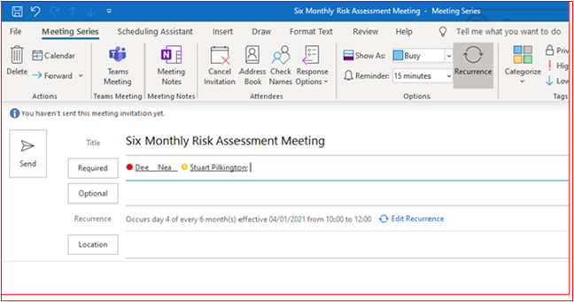

Estas dos capturas de pantalla muestran los minutos de reunión de dos reuniones de evaluación de riesgos.

**Control No. 70:** Proporcione pruebas demostrables de que la evaluación de riesgos de seguridad de la información incluye amenazas, vulnerabilidades o el equivalente.

- Intención: las evaluaciones de riesgos de seguridad de la información deben realizarse frente a amenazas contra el entorno y los datos, y contra posibles vulnerabilidades que puedan estar presentes. Esto ayudará a las organizaciones a identificar la gran cantidad de amenazas o vulnerabilidades que pueden suponer un riesgo significativo.

- Directrices de evidencia de ejemplo: las pruebas deben proporcionarse no solo mediante el proceso de evaluación de riesgos de seguridad de la información ya suministrado, sino también el resultado de la evaluación de riesgos (mediante un registro de riesgos/plan de tratamiento de riesgos) que debe incluir riesgos y vulnerabilidades.

- Evidencia de ejemplo: la siguiente captura de pantalla muestra el registro de riesgos que muestra las amenazas y vulnerabilidades que se incluyen.

**Nota:** La documentación completa de evaluación de riesgos debe proporcionarse en lugar de una captura de pantalla.

**Control No. 71:** Proporcione pruebas demostrables de que la evaluación del riesgo de seguridad de la información incluye impacto, matriz de riesgo de probabilidad o equivalente.

- Intención: las evaluaciones de riesgos de seguridad de la información deben documentar las clasificaciones de impacto y probabilidad. Estas matrices normalmente se usarán para ayudar a identificar un valor de riesgo que puede usar la organización para priorizar el tratamiento de riesgos para ayudar a reducir el valor de riesgo.

- Directrices de evidencia de ejemplo: las pruebas deben proporcionarse no solo mediante el proceso de evaluación de riesgos de seguridad de la información ya suministrado, sino también el resultado de la evaluación de riesgos (mediante un registro de riesgos/plan de tratamiento de riesgos) que debe incluir clasificaciones de impacto y probabilidad.

- Evidencia de ejemplo: la siguiente captura de pantalla muestra el registro de riesgos que muestra el impacto y las probabilidades de que se incluyan.

**Nota:** Se debe proporcionar assessment_ _document__ation riesgo completo en lugar de una captura de pantalla.

**Control No. 72:** Proporcionar pruebas demostrables de que la evaluación de riesgos de seguridad de la información incluye un registro de riesgos y un plan de tratamiento.

- Intención: las organizaciones deben administrar los riesgos de forma eficaz. Esto debe realizarse correctamente para proporcionar un registro de uno de los cuatro tratamientos de riesgo que se aplican. Los tratamientos de riesgo son:

- **Avoid/Terminate:** la empresa puede determinar que el costo de lidiar con el riesgo es mayor que los ingresos generados por el servicio. Por lo tanto, la empresa puede optar por dejar de realizar el servicio.
- **Transferencia/uso compartido:** la empresa puede elegir transferir el riesgo a un tercero moviendo el procesamiento a un tercero.
- **Accept/Tolerate/Retain:** la empresa puede decidir que el riesgo es aceptable. Esto depende en gran medida del riesgo de las empresas y puede variar según la organización.
- **Treat/Mitigate/Modify:** la empresa decide implementar controles de mitigación para reducir el riesgo a un nivel aceptable.

- El objetivo de este control es garantizar que la organización realiza la evaluación de riesgos y actúa en consecuencia.

- Directrices de evidencia de ejemplo: se debe proporcionar el plan de tratamiento de riesgos o el registro de riesgos (o algo equivalente) para demostrar que el proceso de evaluación de riesgos se está llevando a cabo correctamente.

- Ejemplo de evidencia: a continuación se muestra un registro de riesgos para Contoso.

**Nota:** La documentación completa de evaluación de riesgos debe proporcionarse en lugar de una captura de pantalla.

En la siguiente captura de pantalla se muestra un plan de tratamiento de riesgos.

### Respuesta a incidentes de seguridad

Una respuesta a incidentes de seguridad es importante para todas las organizaciones, ya que esto puede reducir el tiempo invertido por una organización para contener un incidente de seguridad y limitar el nivel de exposición de las organizaciones a la exfiltración de datos. Al desarrollar un plan de respuesta a incidentes de seguridad completo y detallado, esta exposición puede reducirse significativamente desde el momento de la identificación hasta el momento de la contención.

Un informe de IBM titulado &quot; [Cost of a data breach Report 2020](https://www.ibm.com/security/digital-assets/cost-data-breach-report/#/) destaca que, en promedio, el tiempo que se ha tomado para contener una infracción fue &quot; de 73 días. Además, el mismo informe identifica el mayor ahorro de costos para las organizaciones que sufrieron una infracción, fue la preparación de respuesta a incidentes, lo que proporciona un ahorro promedio de 2.000.000 usd.

Las organizaciones deben seguir procedimientos recomendados para el cumplimiento de la seguridad con marcos estándar del sector como ISO 27001, NIST, SOC 2, PCI DSS, etc.

**Control No. 73:** Proporcionar el plan de respuesta a incidentes de seguridad (IRP).

- Intención: como ya se ha comentado, el objetivo de este control es requerir un plan de respuesta a incidentes documentado formalmente. Esto ayudará a administrar una respuesta a incidentes de seguridad más eficiente que, en última instancia, puede limitar la exposición a la pérdida de datos de las organizaciones y reducir los costos del compromiso.

- Directrices de evidencia de ejemplo: proporcione la versión completa del plan o procedimiento de respuesta a incidentes. Esto debe incluir un proceso de comunicaciones documentado que se trata en el siguiente control.

- Evidencia de ejemplo: la siguiente captura de pantalla muestra el inicio del plan de respuesta a incidentes&#39;contoso. Como parte del envío de pruebas, debe proporcionar todo el plan de respuesta a incidentes.

**Nota:** Esta captura de pantalla muestra un documento de directiva o proceso, la expectativa es que los ISV compartan la documentación real de la directiva o procedimiento de soporte técnico y no simplemente proporcionen una captura de pantalla.

**Control No. 74:** Proporcione pruebas demostrables de que la IRP de seguridad incluye un proceso de comunicación documentado para garantizar la notificación a tiempo a las partes interesadas clave, como las marcas de pago y los adquirentes, los organismos reguladores, las autoridades de supervisión, los directores y los clientes.

- Intención: las organizaciones pueden tener obligaciones de notificación de infracciones en función del país o países en los que operan (por ejemplo, el Reglamento general de protección de datos; RGPD) o en función de la funcionalidad que se ofrece (por ejemplo, PCI DSS si se controlan los datos de pago). El error de notificación a tiempo puede tener consecuencias graves, por lo tanto, para garantizar que se cumplen las obligaciones de notificación, los planes de respuesta a incidentes deben incluir un proceso de comunicación que incluya la comunicación con todas las partes interesadas, los procesos de comunicación de medios y quién puede y no puede hablar con los medios.

- Directrices de evidencia de ejemplo: proporcione la versión completa del plan o procedimiento de respuesta a incidentes, que debe incluir una sección que cubra el proceso de comunicación.

- Evidencia de ejemplo: la siguiente captura de pantalla muestra un extracto del plan de respuesta a incidentes que muestra el proceso de comunicación

**Control No. 75:** Proporcione pruebas demostrables de que todos los miembros del equipo de respuesta a incidentes han completado el entrenamiento anual o un ejercicio superior de tabla.

- Intención: como ya se ha comentado anteriormente, cuanto más tiempo tarde una organización en contener un compromiso, mayor será el riesgo de exfiltración de datos, lo que potencialmente provocará un mayor volumen de datos exfiltrados y mayor será el costo global de la transacción. Es importante que los equipos de&#39;de respuesta a incidentes de la organización estén equipados para responder a los incidentes de seguridad de forma oportuna. Al realizar entrenamientos regulares y realizar ejercicios de mesa, esto permite al equipo controlar los incidentes de seguridad de forma rápida y eficaz.

- La recomendación es llevar a cabo tanto la  formación interna de respuesta a incidentes para el equipo de respuesta a incidentes como para llevar a cabo ejercicios regulares sobre tabla, que deben vincularse a la evaluación de riesgos de seguridad de la información para identificar los incidentes de seguridad que son más probables que se produzcan. De esta forma, el equipo sabrá qué pasos tomar para contener e investigar rápidamente los incidentes de seguridad más probables.

- Directrices de evidencia de ejemplo: se deben proporcionar pruebas que demuestren que la formación se ha llevado a cabo mediante el uso compartido del contenido de aprendizaje y registros que muestran quién asistió (que debe incluir todo el equipo de respuesta a incidentes). Como alternativa, o también, registros que muestran que se ha realizado un ejercicio sobre tabla. Todo esto debe haber finalizado en un período de 12 meses desde el momento en que se envía la evidencia.

- Ejemplo de evidencia: Contoso realizó un ejercicio de tabla de respuesta a incidentes con una compañía de seguridad externa denominada Claranet Cyber Security. A continuación se muestra una muestra del informe generado como parte de la consultoría.

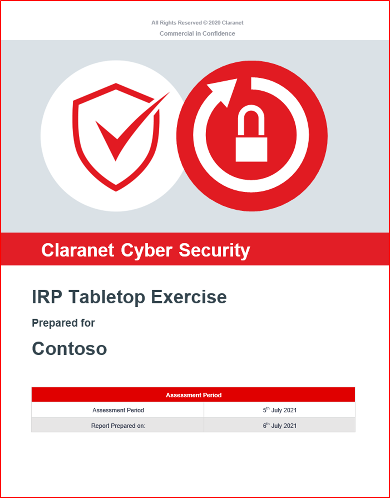

**Nota:** El informe completo tendría que compartirse. Este ejercicio también se podría llevar a cabo internamente, ya que no Microsoft 365 requisito para que una empresa de terceros lo llevara a cabo.

**Control No. 76:** Proporcionar pruebas demostrables para mostrar que la IRP de seguridad se actualiza en función de las lecciones aprendidas o los cambios organizativos.

- Intención: con el tiempo, el plan de respuesta a incidentes (IRP) debe evolucionar en función de los cambios organizativos o en función de las lecciones aprendidas al aplicar la IRP. Los cambios en el entorno operativo pueden requerir cambios en la IRP, ya que las amenazas pueden cambiar o pueden cambiar los requisitos normativos. Además, a medida que se llevan a cabo ejercicios de tabla y respuestas a incidentes de seguridad reales, esto a menudo puede identificar áreas de la IRP que se pueden mejorar. Esto debe estar integrado en el plan y el objetivo de este control es garantizar que este proceso se incluya en la IRP.

- Directrices de evidencia de ejemplo: esto suele evidenciarse revisando los resultados de incidentes de seguridad o ejercicios de mesa donde las lecciones aprendidas se identificaron y resultaron en una actualización de la IRP. La IRP debe mantener un registro de cambios, que también debe hacer referencia a los cambios que se implementaron en función de las lecciones aprendidas o de los cambios organizativos.

- Ejemplo de evidencia: las siguientes capturas de pantalla se incluyen en la IRP proporcionada, que incluye una sección sobre cómo actualizar la IRP en función de las lecciones aprendidas y los cambios de la organización.

El registro de cambios de IRP muestra una actualización que se realiza en la parte posterior del ejercicio de tabla realizado en julio de 2021.

## Dominio de seguridad: control de datos Seguridad y privacidad

Este dominio de seguridad se incluye para garantizar que los datos consumidos de M365 estén protegidos adecuadamente tanto en tránsito como en reposo. Este dominio también garantiza a los consumidores (interesados) que el ISV está atemperado a los problemas de privacidad, de acuerdo con el Reglamento general de protección de datos (RGPD), que se refiere a la privacidad de los ciudadanos de la UE.

### Datos en tránsito

Debido a los requisitos de conectividad de las aplicaciones y complementos desarrollados por M365, la comunicación se producirá a través de redes públicas, es decir, Internet. Por este motivo, los datos en tránsito deben protegerse adecuadamente. En esta sección se trata la protección de las comunicaciones de datos a través de Internet.

**Control No. 1:** Proporcionar pruebas demostrables de que la configuración de TLS cumple o supera los requisitos de cifrado dentro de los requisitos de configuración [de perfil tls](https://docs.microsoft.com/en-us/microsoft-365-app-certification/docs/certification-submission-guide#appendix-a).

- Intención: la intención de este control es garantizar que los datos M365 que consume su organización se transmitan de forma segura. La configuración de perfil tls define los requisitos específicos de TLS para ayudar a garantizar que el tráfico es seguro frente a ataques de tipo man en el medio.

- Directrices de evidencia de ejemplo: la forma más sencilla de probar esto es ejecutar la herramienta de prueba del servidor SSL de [Qualys](https://www.ssllabs.com/ssltest/) en TODOS los agentes de escucha **web,** incluidos los que se ejecutan en puertos no estándar.

- Recuerde marcar la opción No mostrar los resultados en los paneles, lo que impide que la dirección URL se &quot; &quot; agregó al sitio web.

- También puede proporcionar pruebas para demostrar las comprobaciones individuales dentro de los requisitos de configuración de perfil tls. Se pueden usar opciones de configuración, junto con scripts y herramientas de software para ayudar a proporcionar pruebas de algunas de las configuraciones específicas, es decir, la compresión TLS está deshabilitada.

- Ejemplo de evidencia: la siguiente captura de pantalla muestra los resultados de [la](http://www.clara.net:443/) escucha www.clara.net:443 web.

**Nota:** Los analistas de certificación revisarán el resultado completo para confirmar que se cumplen todos los requisitos de los requisitos de configuración de perfil TLS (proporcione capturas de pantalla del resultado del examen completo). Depending_ _en_ _what se han proporcionado pruebas, los analistas pueden ejecutar su propio examen de Qualys.

- Ejemplo evidencia 2: la siguiente captura de pantalla muestra que TLS 1.2 está configurado en el almacenamiento.

**Nota:** Esta captura de pantalla por sí sola no podría satisfacer este requisito.

- Prueba de ejemplo 3: Las siguientes capturas de pantalla muestran que TLS V1.3 solo está habilitado en el servidor.

En este ejemplo se usan las claves del Registro para deshabilitar o habilitar un protocolo ajustando los valores de la siguiente manera:

Binario: 0 - desactivado 1 - on

Hexadecimal: 0x00000000 - off 0xffffffff - on

**Nota:** - No use esta metodología si no la comprende, ya que nosotros (Microsoft) no somos responsables de que use o siga este ejemplo o cualquier efecto que su uso pueda tener en sus sistemas. Está aquí para simplemente ilustrar otra forma de mostrar si TLS está habilitado o deshabilitado.

**Nota:** Estas capturas de pantalla por sí solas no podrían cumplir este requisito.

**Control No. 2:** Proporcione pruebas demostrables de que la compresión TLS está deshabilitada en todos los servicios públicos que administran solicitudes web.

- Intent: There is a specific TLS vulnerability, CRIME ([CVE-2012-4929](https://nvd.nist.gov/vuln/detail/CVE-2012-4929)), which affects TLS Compression. Por este motivo, las recomendaciones del sector son desactivar esta funcionalidad.

- Directrices de evidencia de ejemplo: esto puede ser evidencia a través de la herramienta Qualys SSL Labs.

- Ejemplo de evidencia: la siguiente captura de pantalla muestra esto a través de la herramienta Qualys SSL Labs.

**Control No. 3:** Proporcionar pruebas demostrables de que TLS HTTP estricta seguridad de transporte está habilitada y configurada para >= 15552000 en todos los sitios.

- Intent: HTTP Strict Transport Security (HSTS) is a security mechanism designed to protect websites against man-in-the-middle attacks by forcing TLS connections by way of a HTTPS response header field &quot; named Strict-Transport-Security &quot; .

- Directrices de evidencia de ejemplo: esto puede ser evidencia a través de la herramienta Qualys SSL Labs u otras herramientas y complementos de explorador web.

- Pruebas de ejemplo: la siguiente captura de pantalla muestra esto a través de un complemento del explorador web denominado &#39;de espionaje de encabezado HTTP&#39; para el [sitio](http://www.microsoft.com/) web www.microsoft.com web.

### Datos en rest

Cuando los ISV almacenan los datos Microsoft 365 la plataforma, los datos deben protegerse adecuadamente. En esta sección se tratan los requisitos de protección de los datos almacenados en bases de datos y almacenes de archivos.

**Control No. 4:** Proporcione pruebas demostrables de que los datos en reposo se cifran en línea con los requisitos de perfil de cifrado, mediante algoritmos de cifrado como AES, Blowfish, TDES y tamaños de clave de cifrado de 128 bits y 256 bits.

- Intención: se sabe que algunos algoritmos de cifrado antiguos contienen algunas debilidades criptográficas que aumentan las posibilidades de que un actor de amenazas pueda descifrar los datos sin tener conocimiento de la clave. Por este motivo, el objetivo de este control es garantizar que solo se usan algoritmos de cifrado aceptados por el sector para proteger los datos almacenados de M365.

- Directrices de evidencia de ejemplo: se pueden proporcionar pruebas mediante capturas de pantalla, que muestran el cifrado que se emplea para proteger los datos M365 dentro de bases de datos y otras ubicaciones de almacenamiento. La evidencia debe demostrar que la configuración de cifrado está en línea con los [requisitos](https://docs.microsoft.com/en-us/microsoft-365-app-certification/docs/certification-submission-guide#appendix-b) de configuración de perfiles de cifrado de la certificación Microsoft 365 cifrado.

- Ejemplo de evidencia: la siguiente captura de pantalla muestra que TDE (Cifrado de datos transparente) está habilitado en la base de datos de Contoso. La segunda captura de pantalla muestra la página de documentos de Microsoft &#39;Cifrado de datos transparente para SQL Database, instancia administrada de SQL y azure [Synapse Analytics](https://docs.microsoft.com/en-us/azure/azure-sql/database/transparent-data-encryption-tde-overview?view=sql-server-ver15&amp;tabs=azure-portal)&#39; que muestra que el cifrado de AES 256 se usa para TDE de Azure.

- Ejemplo evidencia 2: la siguiente captura de pantalla muestra Azure Storage configurado con cifrado para blobs y archivos. La siguiente captura de pantalla muestra la página de documentos de Microsoft Azure Storage cifrado de datos en reposo que muestra &quot;  &quot; Azure Storage usa AES-256 para el cifrado.

**Control No. 5:** Proporcione pruebas demostrables de que la función hash o autenticación de mensajes (HMAC-SHA1) solo se usa para proteger los datos en reposo en línea con los requisitos de perfil de cifrado.

- Intención: al igual que con los algoritmos de cifrado, algunas funciones hash y algoritmos de autenticación de mensajes se basan en algoritmos con debilidades criptográficas. El objetivo de este control es garantizar que los datos M365 estén protegidos con funciones hash seguras si el hash se usa como mecanismo de protección de datos. Si el entorno o la aplicación no lo usan, es necesario proporcionar pruebas que puedan corroborarlo.

- Directrices de evidencia de ejemplo: la evidencia puede estar en forma de capturas de pantalla que muestran fragmentos de código donde funciona la función hash.

- Ejemplo de evidencia: Contoso usa la funcionalidad de hash dentro de su aplicación. La siguiente captura de pantalla muestra que SHA256 se usa como parte de la función hash.

**Control No. 6:** Proporcionar un inventario de todos los datos almacenados, incluida la ubicación de almacenamiento y el cifrado usados para proteger los datos.

- Intención: para proteger correctamente los datos, las organizaciones deben ser conscientes de los datos que su entorno o sistemas consumen y dónde se almacenan los datos. Una vez que esto se comprende y documenta completamente, las organizaciones no solo pueden implementar una protección de datos adecuada, sino que también pueden consolidar dónde se encuentran los datos para implementar la protección de forma más eficaz. Además, cuando los datos se consolidan en el menor número posible de lugares, es mucho más fácil implementar rbac adecuado (control de acceso basado en roles) para limitar el acceso a tan pocos empleados como sea necesario.

- Directrices de evidencia de ejemplo: la evidencia debe proporcionarse mediante un documento o exportar desde un sistema interno, es decir, SharePoint o Confluencia, detallando todos los datos consumidos, todas las ubicaciones de almacenamiento y el nivel de cifrado que se implementa.

- Ejemplo de evidencia: la siguiente captura de pantalla muestra un ejemplo de cómo podría ser un documento que muestra tipos de datos.

### Retención y eliminación de datos

Cuando los ISV consumen y almacenan datos de M365, esto correrá el riesgo de que se comprometan los datos en caso de que un actor de amenazas comprometa el entorno de ISV. Para minimizar este riesgo, las organizaciones solo deben mantener los datos que necesitan para entregar servicios y no los datos que puedan ser de &quot; &quot; uso en el futuro. Además, los datos solo deben conservarse durante el tiempo que sea necesario para proporcionar los servicios para los que se capturaron los datos. La retención de datos debe definirse y comunicarse con los usuarios. Una vez que los datos superan el período de retención definido, debe eliminarse de forma segura para que los datos no se puedan reconstruir ni recuperar.

**Control No. 7:** Proporcionar pruebas demostrables de que se ha establecido formalmente un período de retención de datos aprobado y documentado.

- Intención: una directiva de retención documentada y seguida es importante no solo para cumplir algunas obligaciones legales, como, por ejemplo, la legislación de privacidad de datos, como, entre otras, el Reglamento general de protección de datos (RGPD de la UE) y la Ley de protección de datos (UK DPA 2018), sino también para limitar un riesgo para las organizaciones. Al comprender los requisitos de datos de las organizaciones y el tiempo que se necesitan los datos para que la empresa realice sus funciones, las organizaciones pueden asegurarse de que los datos se desechan correctamente una vez que expira su utilidad. Al reducir los volúmenes de datos almacenados, las organizaciones están reduciendo la cantidad de datos que se exponen en caso de que se produzca un riesgo de datos. Esto limitará el impacto general.

- A menudo, las organizaciones almacenarán datos simplemente porque&#39;es bueno tener por si acaso , sin embargo, si la organización&#39;no necesita los datos para realizar su función de servicio o de negocio, los datos no deben almacenarse, ya que esto aumenta los riesgos de las organizaciones &quot; &quot; innecesariamente.

- Directrices de evidencia de ejemplo: proporcione la directiva de retención de datos completa que detalle claramente cuánto tiempo deben conservarse los datos (deben abarcar todos los tipos de datos) para que la empresa pueda realizar sus funciones empresariales.

- Evidencia de ejemplo: la captura de pantalla siguiente muestra la directiva de retención&#39;de datos de Contoso.

**Nota:** Esta captura de pantalla muestra un documento de directiva o proceso, la expectativa es que los ISV compartan la documentación real de la directiva o procedimiento de soporte técnico y no simplemente proporcionen una captura de pantalla.

**Control No. 8:** Proporcionar pruebas demostrables de que los datos retenidos coinciden con el período de retención definido.

- Intención: el objetivo de este control es simplemente validar que se cumplen los períodos de retención de datos definidos. Como ya se ha comentado, las organizaciones pueden tener la obligación legal de cumplir con esto, pero también mantener los datos necesarios y durante el tiempo que sea necesario ayuda a reducir el riesgo para la organización en caso de que se produzca una vulneración de datos.

- Directrices de evidencia de ejemplo: proporcionar pruebas de captura de pantalla (o a través de screenshare) que muestren que los datos almacenados (en todas las distintas ubicaciones de datos, es decir, bases de datos, recursos compartidos de archivos, archivos, etc.)&#39;no superan la directiva de retención de datos definida. Algunos ejemplos pueden ser capturas de pantalla de registros de base de datos con un campo de fecha, búsquedas en el orden de registro más antiguo o ubicaciones de almacenamiento de archivos que muestran marcas de tiempo que están dentro del período de retención.

**Nota:** Los datos personales o confidenciales de los clientes deben redactarse en la captura de pantalla.

- Evidencia de ejemplo: la siguiente evidencia muestra una consulta SQL que muestra el contenido de la tabla de base de datos ordenada en orden ascendente en el campo&#39; FECHA TRANSACCIÓN &#39;para mostrar los registros más antiguos de la base de \_ datos. Estos datos deben tener dos meses de antigüedad que no&#39;el período de retención definido.

**Nota:** Esta es una base de datos de prueba, por lo que&#39;una gran cantidad de datos históricos dentro de ella.

**Control No. 9:** Proporcione pruebas demostrables de que hay procesos para eliminar datos de forma segura después de su período de retención.

- Intención: el objetivo de este control es garantizar que el mecanismo usado para eliminar datos que superen el período de retención lo esté haciendo de forma segura. Los datos eliminados a veces se pueden recuperar; por lo tanto, el proceso de eliminación debe ser lo suficientemente sólido como para garantizar que los datos no se puedan recuperar una vez eliminados.

- Directrices de evidencia de ejemplo: si el proceso de eliminación se realiza mediante programación, proporcione una captura de pantalla del script que se usa para realizar esto. Si se&#39;se ejecuta en una programación, proporcione una captura de pantalla que muestre la programación. Por ejemplo, un script para eliminar archivos dentro de un recurso compartido de archivos puede configurarse como un trabajo CRON, hacer una captura de pantalla del trabajo CRON que muestra la programación y el script que se ejecuta y proporcionar el script que muestra el comando usado.

- Ejemplo de evidencia 1: se trata de un script simple que podría usarse para eliminar todos los registros de datos retenido en función de la fecha -WHERE DateAdd es -30 días que purgará todos los registros retenido con más de 30 días más allá de la fecha de retención de datos seleccionada. Tenga en cuenta que necesitamos el script, pero también evidencia del trabajo que se está ejecutando y los resultados.

- Prueba de ejemplo 2: la siguiente se ha tomado del Plan de retención de datos de Contoso desde el Control 7: muestra los procedimientos usados para la destrucción de datos.

**Nota:** Esta captura de pantalla muestra un documento de directiva o proceso, la expectativa es que los ISV compartan la documentación real de la directiva o procedimiento de soporte técnico y no simplemente proporcionen una captura de pantalla.

- Ejemplo evidencia 3: en este ejemplo se ha creado un Runbook y una programación correspondiente en Azure para eliminar de forma segura los registros que tienen una fecha de finalización creada a partir de los 30 días posteriores a la expiración de la directiva de retención de registros de datos. Este trabajo se establece para ejecutarse cada mes el último día del mes.

En la ventana siguiente se muestra que el Runbook se ha editado para buscar registros y tiene comandos de eliminación que no están en la vista, como el script. Tenga en cuenta que la dirección URL completa y el nombre de usuario deben estar a la vista para estas capturas de pantalla y los&#39;de ISV serán necesarios para mostrar una captura de pantalla de antes del recuento de registros de eliminación y una captura de pantalla después del recuento de registros de eliminación. Estas capturas de pantalla son puramente ejemplos de las distintas formas en que se puede abordar esto.

### Administración de acceso a datos

El acceso a datos debe limitarse a tan pocas personas como sea necesario para reducir las posibilidades de que los datos se comprometan de forma malintencionada o accidental. El acceso a los datos y las claves de cifrado debe limitarse a los usuarios con una necesidad empresarial legítima de tener acceso para desempeñar su función de trabajo. Esto debe estar bien documentado y se debe implementar un proceso bien establecido para solicitar acceso. El acceso a datos y claves de cifrado debe seguir el principio de privilegios mínimos.

**Control No. 10:** Proporcione una lista de todas las personas con acceso a datos o claves de cifrado, incluida la justificación empresarial.

- Intención: las organizaciones deben limitar el acceso a datos y claves de cifrado a tan pocos empleados como sea posible. El objetivo de este control es garantizar que el acceso de los empleados a los datos y/o las claves de cifrado esté restringido a los empleados con una necesidad empresarial clara de dicho acceso.

- Directrices de evidencia de ejemplo: se debe proporcionar documentación o capturas de pantalla de sistemas internos que documentan a todos los empleados con acceso a datos o claves de cifrado junto con la justificación empresarial de por qué estas personas tienen acceso. El analista de certificación usará esta lista para mostrar los usuarios de los siguientes controles.

- Ejemplo de evidencia: el siguiente documento muestra la lista documentada de usuarios con acceso a datos y la justificación empresarial.

**Control No. 11:** Proporcionar pruebas demostrables de que las personas muestreadas que tienen acceso a datos o claves de cifrado se aprobaron formalmente, detallando los privilegios necesarios para su función de trabajo.

- Intención: el proceso para conceder acceso a datos y/o claves de cifrado debe incluir la aprobación, lo que garantiza que el acceso de un usuario&#39;para su función de trabajo. Esto garantiza que los empleados sin un motivo original para el acceso no&#39;acceso innecesario.

- Directrices de evidencia de ejemplo: normalmente, las pruebas proporcionadas para el control anterior pueden ayudar a admitir este control. Si no&#39;una aprobación formal en la documentación suministrada, la evidencia puede consistir en una solicitud de cambio que se está generando y aprobado para el acceso dentro de una herramienta como, Azure DevOps o Jira.

- Ejemplo de evidencia: este conjunto de imágenes muestra jira Tickets creados y aprobados para la lista anterior en el Control 10 para conceder o denegar el acceso a datos confidenciales o claves de cifrado.

Esta imagen muestra que se ha creado una solicitud en Jira para obtener la aprobación de Sam Daily para las claves de cifrado en el entorno back-end de sistemas. Esto se hace como el siguiente paso para controlar 10 arriba donde se ha obtenido autorización escrita.

Esto muestra que la solicitud para dar acceso a Sam Daily ha sido aprobada por Jon Smith una persona de la administración que se puede ver en el control 10. (Tenga en cuenta que la aprobación debe venir de alguien con autoridad suficiente para permitir la solicitud de cambio, no puede ser otro desarrollador).

Lo anterior muestra un flujo de trabajo en Jira para este proceso tenga en cuenta que no se puede agregar nada como Hecho a menos que haya pasado por el proceso de aprobación que está automatizado, por lo tanto, no se puede pasar.

El Project anterior muestra ahora que se ha dado la aprobación para sam daily&#39;acceso a claves de cifrado. Debajo del registro de reserva se muestra sam daily&#39;la aprobación de la solicitud y la persona asignada para realizar el trabajo.

Para cumplir los requisitos de este control, debe mostrar todas estas capturas de pantalla o similares con una explicación para demostrar que ha cumplido con el requisito de control.

- Prueba de ejemplo 2: En el ejemplo siguiente, se han solicitado permisos de acceso de administrador y control total para un usuario a la base de datos de producción. La solicitud se ha enviado para su aprobación como se puede ver a la derecha de la imagen y se ha aprobado como puede ver a la izquierda.

Arriba puede ver que el acceso se ha aprobado y se ha desactivado tal como se ha hecho.

**Control No. 12:** Proporcione pruebas demostrables de que las personas muestreadas que tienen acceso a datos o claves de cifrado solo tienen los privilegios incluidos en la aprobación.

- Intención: el objetivo de este control es confirmar que el acceso a datos o claves de cifrado está configurado según lo documentado.

- Directrices de evidencia de ejemplo: la evidencia se puede proporcionar a través de una captura de pantalla que muestra los privilegios de acceso de clave de cifrado o datos concedidos a los individuos muestreados. La evidencia debe cubrir todas las ubicaciones de datos.

- Evidencia de ejemplo: esta captura de pantalla muestra los permisos concedidos al usuario John Smith que se cruzarían con la solicitud de aprobación para este mismo usuario según las pruebas del &quot; &quot; control anterior.

**Control No. 13:** Proporcione una lista de todos los terceros con los que se comparten los datos del cliente.

- Intención: cuando se usan terceros para almacenar o procesar datos de M365, estas entidades pueden suponer un riesgo significativo. Las organizaciones deben desarrollar un buen proceso de administración y diligencia debida de terceros para garantizar que estos terceros almacenen o procese datos de forma segura y para asegurarse de que cumplirán las obligaciones legales que puedan tener, por ejemplo, como procesador de datos en virtud del RGPD.

- Las organizaciones deben mantener una lista de todos los terceros con los que comparten datos con algunos o todos los siguientes elementos:

- qué servicios se proporcionan,
- qué datos se comparten,
- por qué se comparten los datos,
- información de contacto clave (es decir, contacto principal, contacto de notificación de infracciones, DPO, etc.),
- renovación/expiración del contrato
- obligaciones legales y de cumplimiento (por ejemplo, RGPD, HIPPA, PCI DSS, FedRamp, etc.)

- Directrices de evidencia de ejemplo: proporcione documentación que detalle **todos** los terceros con los que se comparten los datos de M365.

**Nota:** Si terceros no están en uso, un miembro del equipo directivo deberá confirmarlo por escrito (correo electrónico).

- Pruebas de ejemplo 1

- Ejemplo evidencia 2: esta captura de pantalla muestra un ejemplo de correo electrónico de un miembro del equipo de liderazgo sénior que confirma que no se usa ningún tercero para procesar datos de M365.

**Control No. 14:** Proporcionar pruebas demostrables de que todos los terceros que consumen datos de clientes tienen acuerdos de uso compartido en su lugar.

- Intent: Where M365 data is shared with third parties, it is important that data is being handled appropriately and securely. Los acuerdos de uso compartido de datos deben estar en marcha para garantizar que terceros estén procesando datos solo según sea necesario y que comprendan sus obligaciones de seguridad. La seguridad de una organización es tan fuerte como el vínculo más débil. El objetivo de este control es garantizar que los terceros no se conviertan en un vínculo débil de las organizaciones.

- Directrices de evidencia de ejemplo: compartir los acuerdos de uso compartido de datos que se han puesto en marcha con terceros.

- Ejemplo de evidencia: la siguiente captura de pantalla muestra un acuerdo de uso compartido de datos de ejemplo simplista.

**Nota:** El acuerdo completo debe compartirse y no una captura de pantalla.

### RGPD

La mayoría de las organizaciones procesarán datos potencialmente&#39;(interesados). Cuando se **procesen** los datos de CUALQUIER interesado, las organizaciones tendrán que cumplir con el Reglamento general de protección de datos (RGPD). Esto se aplica tanto a los responsables de datos (está capturando directamente estos datos) como a los encargados de los datos (está procesando estos datos en nombre de un responsable del tratamiento). Aunque esta sección no&#39;la totalidad de la reglamentación, aborda algunos de los elementos clave del RGPD para ayudar a obtener cierta seguridad de que la organización se está tomando en serio el RGPD.

**Control No. 15:** Proporcione un proceso de solicitud de acceso de sujeto documentado (SAR) y proporcione pruebas que demuestren que los interesados pueden obtener SSA.

- Intención: el RGPD incluye obligaciones específicas que deben cumplir las organizaciones que procesan los interesados&#39; datos. La obligación de las organizaciones de administrar solicitudes de acceso de sujetos (SSA) se incluye en el artículo 12 que, en virtud del artículo 12.3, concede a un responsable de los datos un mes de recibo de la RAE para responder a la solicitud. Se permite una extensión durante otros dos meses si es necesario. Incluso si su organización actúa como procesador de datos, esto seguirá siendo necesario para ayudar a sus clientes (el responsable del tratamiento de datos) a cumplir con sus obligaciones DEA.

- Directrices de evidencia de ejemplo: proporcionar el proceso documentado para el tratamiento de LOSA.

- Ejemplo de evidencia: en el ejemplo siguiente se muestra un proceso documentado para el tratamiento de LOSA.

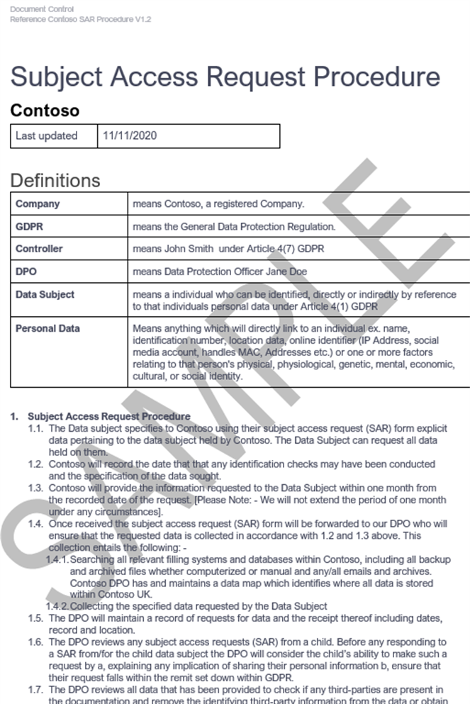

**Nota:** Esta captura de pantalla muestra un documento de directiva o proceso, la expectativa es que los ISV compartan la documentación real de la directiva o procedimiento de soporte técnico y no simplemente proporcionen una captura de pantalla.

**Control No. 16:** Proporcione pruebas demostrables de que puede identificar todas las ubicaciones de los datos de los interesados al responder a un SAR.

- Intención: el objetivo de este control es garantizar que la organización tenga un mecanismo sólido para identificar todos los interesados&#39; datos. Puede ser un proceso manual porque todo el almacenamiento de datos está bien documentado u otras herramientas pueden usarse para garantizar que todos los datos se encuentran como parte del proceso de los SSA.

- Directrices de evidencia de ejemplo: la evidencia puede proporcionarse mediante una lista de todas las ubicaciones de datos y un proceso documentado para buscar datos en todas las ubicaciones de datos. Esto incluiría los comandos necesarios para buscar datos, es decir, si se incluyen ubicaciones SQL, se detallarán instrucciones SQL específicas para garantizar que los datos se encuentran correctamente.

- Evidencia de ejemplo: la siguiente captura de pantalla es un fragmento de código del procedimiento&#39;sar anterior que muestra cómo se encontrarán los datos.

Las cuatro imágenes siguientes muestran cómo las ubicaciones de datos de ISV en las que se consultaban y, Storage continuación, se usaban para explorar en profundidad los archivos o blobs que deban quitarse del almacenamiento para cumplir con la solicitud de SSA.

Esta consulta confirma las cuentas de almacenamiento en uso. Puede consultar y quitar almacenamiento, blobs y/o archivos mediante el Explorador de Graph recursos (Kusto) o PowerShell (vea a continuación).

La imagen anterior muestra los datos que se han encontrado en el contenedor de blobs para el cliente que debe quitarse y a continuación se muestra la acción para eliminar o eliminar de forma suave la información del blob.

**Control No. 17:** Proporcione un vínculo al aviso de privacidad que debe contener todos los elementos necesarios de la siguiente manera:

- Detalles de las empresas (Nombre, Dirección, etc.).
- Detalla los tipos de datos personales que se están procesando.
- Detalla la legalización del procesamiento de datos personales.
- Detalles derechos del interesado&#39;derechos:
  - - Derecho a estar informado,
  - - Derecho de acceso del interesado,
  - - Derecho a borrar,
  - - Derecho a la restricción de procesamiento,
  - - Derecho a la portabilidad de datos,
  - - Derecho al objeto,
  - - Derechos en relación con la toma de decisiones automatizada, incluida la generación de perfiles.
- Detalla cuánto tiempo se conservarán los datos personales.

- Intención: el artículo 13 del RGPD incluye información específica que debe proporcionarse a los interesados en el momento en que se obtienen los datos personales. El objetivo de este control es garantizar que el aviso de privacidad de datos de organizaciones proporciona a los interesados parte de la información clave incluida en el artículo 13.

- Directrices de evidencia de ejemplo: esto normalmente se proporcionaría al proporcionar el aviso de privacidad de datos. Los analistas de certificación revisarán esto para garantizar que toda la información proporcionada en el control se incluya en el aviso de privacidad de datos.

- Ejemplo de evidencia

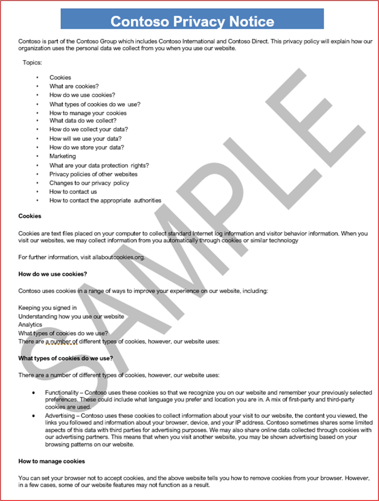

Las imágenes de un Aviso de privacidad anteriores y adyacentes muestran un ejemplo de una directiva de privacidad en línea con el artículo 13 del RGPD incluido.

A continuación se muestra una directiva de protección de datos que se puede usar junto con el aviso de privacidad mostrado anteriormente.

La imagen anterior de Azure muestra cómo Azure se ha configurado para cumplir los requisitos de cumplimiento del RGPD para los datos almacenados en un entorno back-end. La directiva (que se puede personalizar o crear a partir de planos de Azure) permite al ISV asegurarse de que los datos del cliente&#39;se almacenan correctamente y de que solo se puede acceder a ellos mediante las métricas y _alertas establecidas_ para garantizar el cumplimiento y mostrar datos no compatibles o acceso de usuario en el panel del Administrador de cumplimiento.

Libros

Murdoch D. (2018) Blue Team Handbook: Incident Response Edition: A condensed field guide for the Cyber Security Incident Responder. 2nd Edition, Publisher: CreateSpace Independent Publishing Platform.

Referencias

- Informes de ciberdelincución de fraude de acción Disponibles en: [https://www.actionfraud.police.uk/](https://www.actionfraud.police.uk/) (Acceso el 08/02/21).
- UE. (2021) Lista de comprobación del RGPD para controladores de datos Disponible en: [https://gdpr.eu/checklist/](https://gdpr.eu/checklist/) (Acceso el 01/02/21).
- Microsoft. (2018) Registro de eventos (Windows Installer) Disponible en: docs.microsoft.com/en-us/windows/win32/msi/event-logging (acceso: 23/12/20).
- Tecnologías positivas. (2020) How to approach secure software development Available at: [https://www.ptsecurity.com/ww-en/analytics/knowledge-base/how-to-approach-secure-software-development/](https://www.ptsecurity.com/ww-en/analytics/knowledge-base/how-to-approach-secure-software-development/) (Accessed: 21/12/20).
- Reglamento (UE) 2016/679 del Parlamento Europeo y del Consejo, de 27 de abril de 2016, relativo a la protección de las personas físicas en lo que respecta al tratamiento de datos personales y a la libre circulación de estos datos, y por el que se revoca la Directiva 95/46/CE (Reglamento general de protección de datos) (Texto con relevancia del EEE) (2016) Disponible en: [https://www.legislation.gov.uk/eur/2016/679/contents](https://www.legislation.gov.uk/eur/2016/679/contents) (Acceso: 11/01/2021).
- Métricas de seguridad. (2020) Guía de métricas de seguridad para el cumplimiento de PCI DSS. Disponible en : [https://info.securitymetrics.com/pci-guide-2020](https://info.securitymetrics.com/pci-guide-2020) (Acceso: 01/06/21).
- Clasificación de riesgos de Williams J. OWASP Disponible en: [https://owasp.org/www-community/OWASP\_Risk\_Rating\_Methodology](https://owasp.org/www-community/OWASP_Risk_Rating_Methodology) (Accedido: 12/08/20).
- Qualys. (2014) Laboratorios SSL: Nuevas calificaciones para problemas de confianza (T) y Desajuste (M) disponibles en: [https://blog.qualys.com/product-tech/2014/06/17/ssl-labs-new-grades-for-trust-t-and-mismatch-m-issues](https://blog.qualys.com/product-tech/2014/06/17/ssl-labs-new-grades-for-trust-t-and-mismatch-m-issues) (Accedido: 29/01/21).
- NIST SP800-61r2: Guía de administración de incidentes de seguridad informática disponible en: (Se tiene acceso el [https://csrc.nist.gov/publications/detail/sp/800-61/rev-2/final](https://csrc.nist.gov/publications/detail/sp/800-61/rev-2/final) 24/01/21).

**Imágenes tomadas de Documentos de Microsoft**

- [https://www.sans.org/information-security-policy/](https://www.sans.org/information-security-policy/)(Se tiene acceso el 18/02/21).
- [https://docs.microsoft.com/en-us/cloud-app-security/anomaly-detection-policy](https://docs.microsoft.com/en-us/cloud-app-security/anomaly-detection-policy)(Se tiene acceso el 16/02/21).
- [https://docs.microsoft.com/en-us/azure/azure-monitor/alerts/alerts-overview](https://docs.microsoft.com/en-us/azure/azure-monitor/alerts/alerts-overview) (Se tiene acceso el 17/02/21).
- [https://docs.microsoft.com/en-us/cloud-app-security/anomaly-detection-policy](https://docs.microsoft.com/en-us/cloud-app-security/anomaly-detection-policy) (Se tiene acceso el 22/02/21).
- [https://docs.microsoft.com/en-us/azure/security-center/security-center-managing-and-responding-alerts](https://docs.microsoft.com/en-us/azure/security-center/security-center-managing-and-responding-alerts) (Se tiene acceso el 24/02/21).
- [https://docs.microsoft.com/en-us/azure/security-center/security-center-managing-and-responding-alerts](https://docs.microsoft.com/en-us/azure/security-center/security-center-managing-and-responding-alerts) (Se tiene acceso el 24/02/21).
- [https://microsoft.github.io/AzureTipsAndTricks/blog/tip272.html](https://microsoft.github.io/AzureTipsAndTricks/blog/tip272.html)
- [https://docs.microsoft.com/en-gb/azure/information-protection/what-is-information-protection](https://docs.microsoft.com/en-gb/azure/information-protection/what-is-information-protection)
- [https://docs.microsoft.com/en-us/azure/azure-sql/database/transparent-data-encryption-tde-overview?tabs=azure-portal](https://docs.microsoft.com/en-us/azure/azure-sql/database/transparent-data-encryption-tde-overview?tabs=azure-portal)
- [https://docs.microsoft.com/en-us/azure/governance/policy/assign-policy-portal](https://docs.microsoft.com/en-us/azure/governance/policy/assign-policy-portal)
- [https://docs.microsoft.com/en-us/azure/azure-sql/database/threat-detection-configure](https://docs.microsoft.com/en-us/azure/azure-sql/database/threat-detection-configure)
