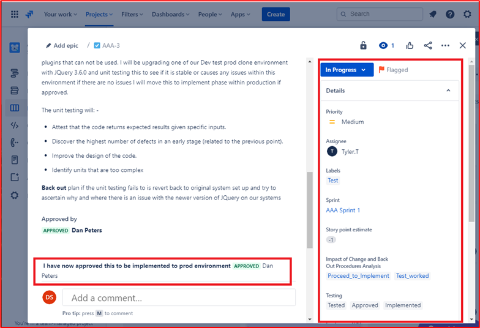
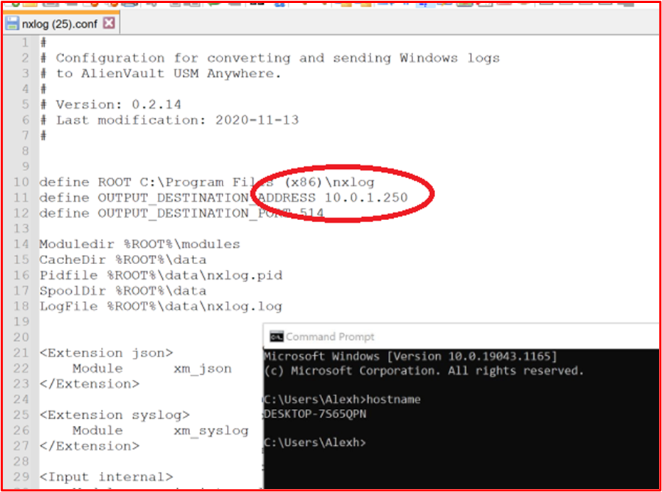
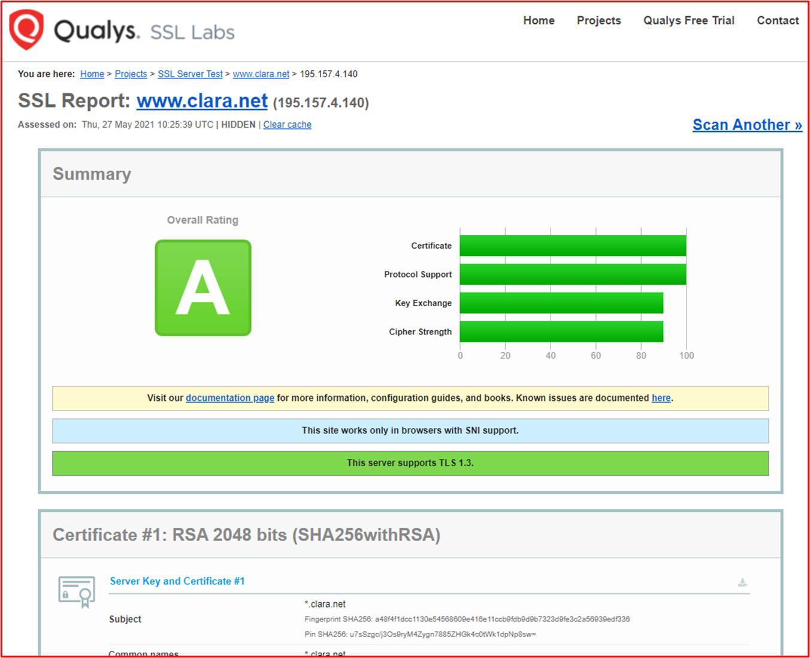
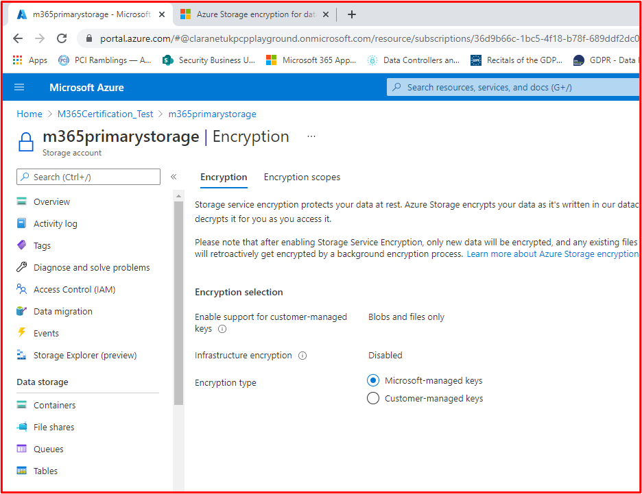
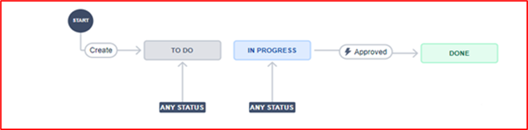
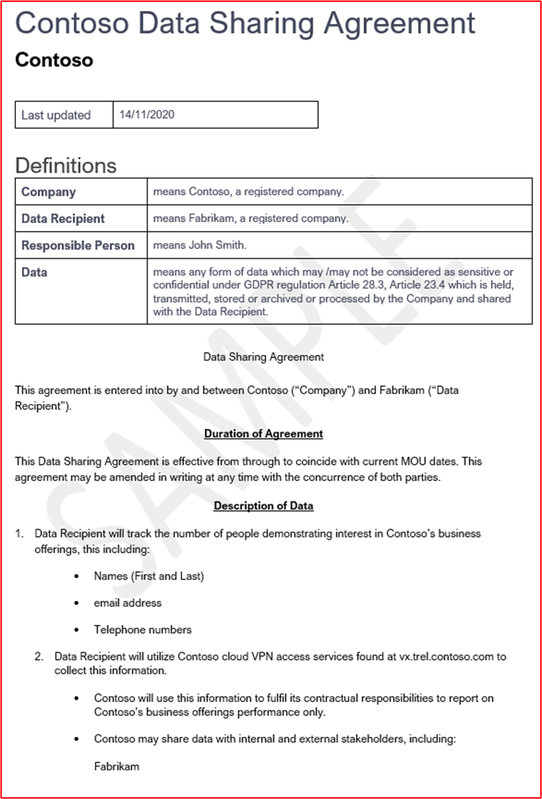
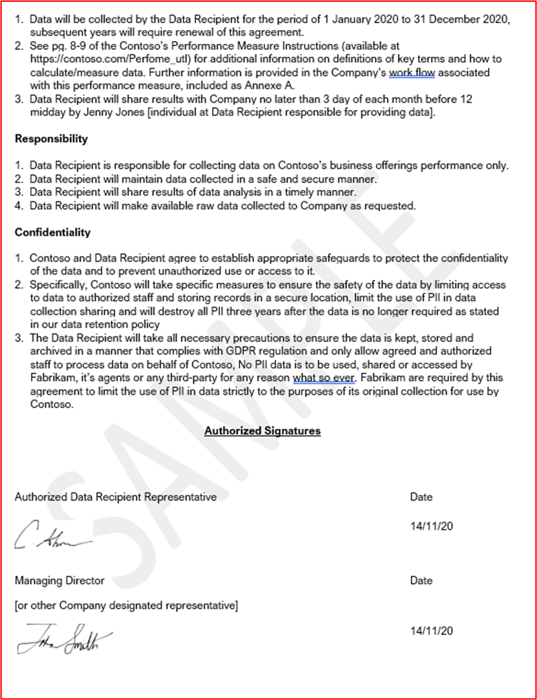

# Certificación de Microsoft 365: Guía de pruebas de ejemplo

## Información general

Esta guía se ha creado para proporcionar a los ISV ejemplos del tipo de evidencia y el nivel de detalle necesario para cada uno de los controles de certificación de Microsoft 365. Los ejemplos compartidos en este documento no representan la única evidencia que se puede usar para demostrar que se cumplen los controles, sino que actúan solo como una guía para el tipo de evidencia necesaria. 

Nota: Las interfaces, capturas de pantalla y documentación reales que se usan para satisfacer los requisitos variarán en función del uso del producto, la configuración del sistema y los procesos internos. Además, tenga en cuenta que cuando se requiera documentación de directiva o procedimiento, el ISV será necesario para enviar los documentos REALES y no capturas de pantalla como se muestra en algunos de los ejemplos. 

Hay dos secciones en la certificación que requieren envíos:
1. [**El envío inicial de documentos:**](../docs/initialdocumentsubguide.md) un pequeño conjunto de documentos de alto nivel necesarios para determinar el ámbito de la evaluación.
1. **El envío de pruebas:** el conjunto completo de pruebas necesarias para cada control en el ámbito de la evaluación de certificación. 

## Estructura 

Este documento se asigna directamente a los controles que se le presentarán durante la certificación en el centro de partners. Las instrucciones proporcionadas en este documento se detallan de la siguiente manera:
- Dominio de seguridad: los tres dominios de seguridad en los que se agrupan todos los controles: Seguridad de aplicaciones, Seguridad operativa y Seguridad y privacidad de datos.
- Control(s): = Descripción de la actividad de evaluación: estos controles y el número asociado (No.) se toman directamente de la lista de comprobación de certificación de Microsoft 365.  
- Intención: = la intención de por qué se incluye el control de seguridad dentro del programa y el riesgo específico que se pretende mitigar.  La esperanza es que esta información proporcione a los ISV el razonamiento que subyace al control para comprender mejor los tipos de pruebas que se deben recopilar y a qué ISV debe prestar atención y tener conocimiento y comprensión en la elaboración de sus pruebas.
- Directrices de evidencia de ejemplo: = Dado para ayudar a guiar las tareas de recopilación de evidencia en la hoja de cálculo de lista de comprobación de certificación Microsoft 365, esto permite a los ISV ver claramente ejemplos del tipo de evidencia que puede usar el analista de certificación que la usará para tomar una determinación segura de que un control está en su lugar y se mantiene , no es de ninguna manera exhaustiva en la naturaleza.
- Ejemplo de evidencia: = En esta sección se proporcionan capturas de pantalla de ejemplo e imágenes de posibles evidencias capturadas en cada uno de los controles de la hoja de cálculo Microsoft 365 lista de comprobación de certificación, específicamente para los dominios de seguridad operativa y seguridad de datos y privacidad (pestañas dentro de la hoja de cálculo). Tenga en cuenta que cualquier información con flechas rojas y cuadros dentro de los ejemplos es para ayudar a comprender aún más los requisitos necesarios para cumplir con cualquier control.

## Dominio de seguridad: Seguridad de aplicaciones

**Control 1 - Control 16**:

Los controles de dominio de Application Security se pueden satisfacer con un informe de prueba de penetración emitido en los últimos 12 meses que muestra que la aplicación no tiene vulnerabilidades pendientes. El único envío requerido es un informe limpio de una empresa independiente de buena reputación. 

## Dominio de seguridad: seguridad operativa/desarrollo seguro

El dominio de seguridad "Seguridad operativa y desarrollo seguro" está diseñado para garantizar que los ISV implementan un conjunto sólido de técnicas de mitigación de seguridad frente a un sinfín de amenazas a las que se enfrentan los actores de amenazas.  Esto está diseñado para proteger el entorno operativo y los procesos de desarrollo de software para crear entornos seguros.

#### Protección contra malware: antivirus

[Control n.º 1](#control-1): proporcione documentación de directivas que rigen los procedimientos y las prácticas antivirus.

- Intención: la intención de este control es evaluar la comprensión de un ISV de los problemas a los que se enfrentan al considerar la amenaza de virus informáticos. Mediante el establecimiento y el uso de procedimientos recomendados del sector para desarrollar una directiva y procesos antivirus, un ISV proporciona un recurso adaptado a la capacidad de su organización para mitigar los riesgos a los que se enfrenta el malware, enumerar los procedimientos recomendados en la detección y eliminación de virus, y proporciona pruebas de que la directiva documentada proporciona instrucciones de seguridad sugeridas para la organización y sus empleados. Al documentar una directiva y un procedimiento sobre cómo el ISV implementa las decencias antimalware, esto garantiza la implementación y el mantenimiento coherentes de esta tecnología para reducir el riesgo de malware para el entorno.

- Directrices de evidencia de ejemplo: proporcione una copia de la directiva antivirus/antimalware que detalla los procesos y procedimientos implementados dentro de la infraestructura para promover los procedimientos recomendados de Antivirus/Malware.
Evidencia de ejemplo

- Evidencia de ejemplo:

**Nota:** En esta captura de pantalla se muestra un documento de directiva o proceso, la expectativa es que los ISV compartan la documentación real de directivas o procedimientos auxiliares y no simplemente proporcionen una captura de pantalla.

[Control n.º 2](#control-2): proporcionar pruebas demostrables de que el software antivirus se está ejecutando en todos los componentes del sistema muestreados.

- Intención: Es importante que antivirus (AV) (o defensas antimalware) se ejecuten en su entorno para protegerse contra los riesgos de ciberseguridad que puede o no tener en cuenta, ya que los ataques potencialmente perjudiciales están aumentando, tanto en sofisticación como en números. Tener av implementado en todos los componentes del sistema que admiten su uso, ayudará a mitigar algunos de los riesgos de que el antimalware se introduzca en el entorno. Solo se necesita un único punto de conexión que se desproteja para proporcionar potencialmente un vector de ataque para que un actor de amenaza obtenga una posición en el entorno. Por lo tanto, AV debe usarse como una de varias capas de defensa para protegerse frente a este tipo de amenaza.

- Directrices de evidencia de ejemplo: para demostrar que una instancia activa de AV se está ejecutando en el entorno evaluado. Proporcione una captura de pantalla para _cada dispositivo_ de la muestra que admita el uso de antivirus que muestre el proceso antivirus en ejecución, el software antivirus está activo o, si tiene una consola de administración centralizada para antivirus, es posible que pueda demostrarlo desde esa consola de administración. Si usa la consola de administración, asegúrese de demostrar en una captura de pantalla que los dispositivos muestreados están conectados y funcionando.

- Ejemplo de evidencia 1: la captura de pantalla siguiente se ha tomado de Azure Security Center; muestra que se ha implementado una extensión antimalware en la máquina virtual denominada &quot;MSPGPRODAZUR01&quot;.

- Ejemplo de evidencia 2

La captura de pantalla siguiente se ha tomado de un dispositivo Windows 10, que muestra que &quot;la protección&quot; en tiempo real está activada para el nombre &quot;de host CLARANET-SBU-WM&quot;.

[Control n.º 3](#control-3): proporcione pruebas demostrables de que las firmas antivirus están actualizadas en todos los entornos (en un plazo de 1 día).

- Intención: cada día se identifican cientos de miles de nuevas aplicaciones de malware y potencialmente no deseadas (PUA). Para proporcionar una protección adecuada contra el malware recién publicado, las firmas antivirus deben actualizarse periódicamente para tener en cuenta el malware recién publicado.

- Este control existe para asegurarse de que el ISV ha tenido en cuenta la seguridad del entorno y el efecto que el antivirus obsoleto puede tener en la seguridad.

- Directrices de evidencia de ejemplo: proporcione archivos de registro antivirus desde cada dispositivo muestreado, que muestree que las actualizaciones se aplican diariamente.

- Evidencia de ejemplo: en la captura de pantalla siguiente se muestra la actualización de Microsoft Defender al menos diariamente mostrando &#39;Evento 2000, Windows Defender&#39; que es la actualización. Se muestra el nombre de host, que muestra que se ha tomado del sistema &quot;en el ámbito CLARANET-SBU-WM&quot;.

**Nota:** Las pruebas proporcionadas tendrían que incluir una exportación de los registros para mostrar actualizaciones diarias durante un período de tiempo mayor. Algunos productos antivirus generarán archivos de registro de actualización, por lo que estos archivos deben proporcionarse o exportar los registros de Visor de eventos.

[Control n.º 4](#control-4): proporcione pruebas demostrables de que el antivirus está configurado para realizar un examen a través del acceso o un examen periódico en todos los componentes del sistema muestreados.

**Nota:** Si el examen a acceso no está habilitado, **debe _be habilitar** un mínimo de examen diario y alerting_.

- Intención: la intención de este control es asegurarse de que el malware se identifica rápidamente para minimizar el efecto que esto puede tener en el entorno. Donde el escaneo en el acceso se lleva a cabo y junto con el bloqueo automático de malware, esto ayudará a detener las infecciones de malware que son conocidas por el software antivirus. Cuando el examen a través del acceso no es&#39;deseable debido a los riesgos de falsos positivos que provocan interrupciones del servicio, es necesario implementar mecanismos de análisis y alerta adecuados a diario (o más) para garantizar una respuesta oportuna a las infecciones de malware para minimizar los daños.

- Directrices de evidencia de ejemplo: proporcione una captura de pantalla para _cada dispositivo_ del ejemplo que admita antivirus, que muestre que el antivirus se está ejecutando en el dispositivo y que está configurado para el examen de acceso (análisis en tiempo real), **o proporcione** una captura de pantalla que muestre que el examen periódico está habilitado para el examen diario, se configuran las alertas y la última fecha de examen para _cada dispositivo_ del ejemplo.

- Evidencia de ejemplo: en la captura de pantalla siguiente se muestra que la protección en tiempo real está habilitada para el host, &quot;CLARANET-SBU-WM&quot;.

[Control n.º 5](#control-5): proporcione pruebas demostrables de que el antivirus está configurado para bloquear automáticamente el malware o la cuarentena y la alerta en todos los componentes del sistema muestreados.

- Intención: La sofisticación del malware está evolucionando todo el tiempo junto con los distintos grados de devastación que pueden traer. La intención de este control es impedir que se ejecute malware y, por tanto, impedir que ejecute su carga útil potencialmente devastadora, o bien si el bloqueo automático no es una opción, limitar la cantidad de tiempo que el malware puede causar estragos mediante alertas y responder inmediatamente a la posible infección de malware.

- Directrices de evidencia de ejemplo: proporcione una captura de pantalla para _cada dispositivo_ del ejemplo que admita antivirus, que muestra que el antivirus se está ejecutando en el equipo y está configurado para bloquear automáticamente el malware, alertar o poner en cuarentena y alertar.

- Evidencia de ejemplo 1: en la captura de pantalla siguiente se muestra que el host &quot;CLARANET-SBU-WM&quot; está configurado con la protección en tiempo real activada para Antivirus de Microsoft Defender. Como indica la configuración, esto localiza y evita que el malware se instale o se ejecute en el dispositivo.

[Control n.º 6](#control-6): proporcione pruebas demostrables de que las aplicaciones se aprueban antes de implementarse.

- Intención: con el control de la aplicación, la organización aprobará cada aplicación o proceso que pueda ejecutarse en el sistema operativo. La intención de este control es asegurarse de que se haya implementado un proceso de aprobación para autorizar qué aplicaciones o procesos se pueden ejecutar.

- Directrices de evidencia de ejemplo: se pueden proporcionar pruebas que muestren que se está siguiendo el proceso de aprobación. Esto se puede proporcionar mediante documentos firmados, seguimiento dentro de los sistemas de control de cambios o usando algo como Azure DevOps o JIRA para realizar el seguimiento de estas solicitudes y autorización.

- Evidencia de ejemplo: en la captura de pantalla siguiente se muestra una aprobación por parte de la administración de que cada aplicación puede ejecutarse dentro del entorno siguiendo un proceso de aprobación. Se trata de un proceso basado en papel en Contoso, pero se pueden usar otros mecanismos.

[Control 7](#control-7): proporcione pruebas demostrables de que existe una lista completa de aplicaciones aprobadas con justificación empresarial y se mantiene.

- Intención: es importante que las organizaciones mantengan una lista de todas las aplicaciones que se han aprobado, junto con información sobre por qué se ha aprobado la aplicación o el proceso. Esto ayudará a garantizar que la configuración permanece actualizada y se puede revisar con respecto a una línea base para garantizar que no se configuren aplicaciones o procesos no autorizados.

- Directrices de evidencia de ejemplo: proporcione la lista documentada de aplicaciones o procesos aprobados junto con la justificación empresarial.

- Evidencia de ejemplo: en la captura de pantalla siguiente se enumeran las aplicaciones aprobadas con justificación empresarial.

**Nota:** En esta captura de pantalla se muestra un documento, la expectativa es que los ISV compartan el documento auxiliar real y no proporcionen simplemente una captura de pantalla.

[Control n.º 8](#control-8): proporcione documentación complementaria en la que se detalla que el software de control de aplicaciones está configurado para cumplir mecanismos de control de aplicaciones específicos.

- Intención: la configuración de la tecnología de control de aplicaciones debe documentarse junto con un proceso de mantenimiento de la tecnología, es decir, agregar y eliminar aplicaciones o procesos. Como parte de esta documentación, el tipo de mecanismo utilizado debe detallarse para cada aplicación o proceso. Esto se alimentará en el siguiente control para asegurarse de que la tecnología está configurada como se documenta.

- Directrices de evidencia de ejemplo: proporcione documentación complementaria en la que se detalla cómo se ha configurado el control de aplicaciones y cómo se ha configurado cada aplicación o proceso dentro de la tecnología.

- Evidencia de ejemplo: en la captura de pantalla siguiente se muestra el mecanismo de control que se usa para implementar el control de aplicación. A continuación, puede ver que 1 aplicación usa controles Certificate y las demás mediante la ruta de acceso del archivo.

**Nota:** En esta captura de pantalla se muestra un documento, la expectativa es que los ISV compartan el documento auxiliar real y no proporcionen simplemente una captura de pantalla.

[Control n.º 9](#control-9): proporcione pruebas demostrables de que el control de aplicaciones está configurado como se documenta a partir de todos los componentes del sistema muestreados.

- Intención: la intención de esto es validar que el control de aplicación está configurado en todo el ejemplo según la documentación.

- Directrices de evidencia de ejemplo: proporcione una captura de pantalla para _cada dispositivo_ del ejemplo para mostrar que tiene los controles de aplicación configurados y activados. Esto debe mostrar los nombres de máquina, los grupos a los que pertenecen y las directivas de control de aplicaciones aplicadas a esos grupos y máquinas.

- Ejemplo de evidencia: en la captura de pantalla siguiente se muestra un objeto directiva de grupo con directivas de restricción de software habilitadas.

En esta captura de pantalla siguiente se muestra la configuración en línea con el control anterior.

En esta captura de pantalla siguiente se muestra el entorno de M365 y los equipos incluidos en el ámbito que se aplica a este objeto gpo &#39;equipo de dominio Configuración&#39;.

En esta captura de pantalla final se muestra el servidor &quot;de ámbito DBServer1&quot; dentro de la unidad organizativa dentro de la captura de pantalla anterior.

### Administración de revisiones: clasificación de riesgos

La rápida identificación y corrección de vulnerabilidades de seguridad ayuda a minimizar los riesgos de un actor de amenazas que pone en peligro el entorno o la aplicación. La administración de revisiones se divide en dos secciones: clasificación de riesgos y aplicación de revisiones. Estos tres controles cubren la identificación de vulnerabilidades de seguridad y las clasifican según el riesgo que suponen.

Este grupo de control de seguridad está en el ámbito de los entornos de hospedaje de plataforma como servicio (PaaS), ya que las bibliotecas de software y la base de código de terceros de aplicación o complemento se deben aplicar revisiones en función de la clasificación de riesgos.

[Control n.º 10](#control-10): proporcionar documentación de directivas que gobierne cómo se identifican y asignan una puntuación de riesgo a las nuevas vulnerabilidades de seguridad.

- Intención: la intención de este control es tener documentación complementaria para garantizar que las vulnerabilidades de seguridad se identifican rápidamente para reducir la ventana de oportunidad que los actores de amenazas tienen para aprovechar estas vulnerabilidades. Es necesario establecer un mecanismo sólido para identificar vulnerabilidades que abarquen todos los componentes del sistema que usan las organizaciones; por ejemplo, sistemas operativos (Windows Server, Ubuntu, etc.), aplicaciones (Tomcat, MS Exchange, SolarWinds, etc.), dependencias de código (AngularJS, jQuery, etc.). Las organizaciones no solo deben garantizar la identificación oportuna de las vulnerabilidades dentro del patrimonio, sino también clasificar las vulnerabilidades en consecuencia para garantizar que la corrección se lleva a cabo dentro de un período de tiempo adecuado en función del riesgo que presenta la vulnerabilidad.

**Nota** Incluso si se ejecuta dentro de un entorno puramente de plataforma como servicio, todavía tiene la responsabilidad de identificar vulnerabilidades dentro de la base de código: es decir, bibliotecas de terceros.

- Instrucciones de evidencia de ejemplo: proporcionar la documentación de soporte técnico (no capturas de pantalla)

- Evidencia de ejemplo: en esta captura de pantalla se muestra un fragmento de código de una directiva de clasificación de riesgos.

**Nota:** En esta captura de pantalla se muestra un documento de directiva o proceso, la expectativa es que los ISV compartan la documentación real de directivas o procedimientos auxiliares y no simplemente proporcionen un screenshot._

[Control n.º 11](#control-11): proporcione pruebas de cómo se identifican las nuevas vulnerabilidades de seguridad.

- Intención: la intención de este control es asegurarse de que el proceso se sigue y&#39;lo suficientemente sólido como para identificar nuevas vulnerabilidades de seguridad en todo el entorno. Puede que no sean solo los sistemas operativos; puede incluir aplicaciones que se ejecutan dentro del entorno y cualquier dependencia de código.

- Directrices de evidencia de ejemplo: la evidencia se puede proporcionar mediante la presentación de suscripciones a listas de correo, la revisión manual de los orígenes de seguridad para las vulnerabilidades recién publicadas (se debe realizar un seguimiento adecuado de las marcas de tiempo de las actividades, es decir, con JIRA o Azure DevOps), herramientas que encuentran software obsoleto (por ejemplo, podría ser Snyk al buscar bibliotecas de software obsoletas, o podría ser Nessus mediante el uso de Nessus  exámenes autenticados que identifican el software obsoleto).

**Nota** Si se usa Nessus, esto tendría que ejecutarse periódicamente para identificar vulnerabilidades rápidamente. Se recomienda al menos semanalmente.

- Evidencia de ejemplo: esta captura de pantalla muestra que se usa un grupo de correo para recibir notificaciones de vulnerabilidades de seguridad.

[Control n.º 12](#control-12): proporcione pruebas que demuestren que a todas las vulnerabilidades se les asigna una clasificación de riesgos una vez identificadas.

- Intención: la aplicación de revisiones debe basarse en el riesgo, cuanto más arriesgada sea la vulnerabilidad, más rápido debe corregirse. La clasificación de riesgos de las vulnerabilidades identificadas es una parte integral de este proceso. La intención de este control es asegurarse de que hay un proceso de clasificación de riesgos documentado que se sigue para garantizar que todas las vulnerabilidades identificadas se clasifiquen adecuadamente en función del riesgo. Las organizaciones suelen usar la clasificación CVSS (Common Vulnerability Scoring System) proporcionada por proveedores o investigadores de seguridad. Se recomienda que, si la organización se basa en CVSS, se incluya un mecanismo de nueva clasificación dentro del proceso para permitir que la organización cambie la clasificación en función de una evaluación interna de riesgos. A veces, es posible que la vulnerabilidad no sea una aplicación debido a la forma en que la aplicación se ha implementado en el entorno. Por ejemplo, se puede liberar una vulnerabilidad de Java que afecta a una biblioteca específica que no usa la organización.

- Directrices de evidencia de ejemplo: proporcione evidencia mediante captura de pantalla u otros medios, por ejemplo, DevOps/Jira, que demuestra que las vulnerabilidades pasan por el proceso de clasificación de riesgos y la organización le asigna una clasificación de riesgos adecuada.

- Evidencia de ejemplo: en esta captura de pantalla se muestra la clasificación de riesgos que se produce en la columna D y se vuelve a clasificar en las columnas F y G, en caso de que la organización realice una evaluación de riesgos y determine que el riesgo se puede degradar. La evidencia de la reevaluación de las evaluaciones de riesgo tendría que proporcionarse como pruebas complementarias

### Administración de revisiones: aplicación de revisiones

Los controles siguientes son para el elemento de aplicación de revisiones para la administración de revisiones. Para mantener un entorno operativo seguro, las aplicaciones o complementos y los sistemas auxiliares se deben aplicar revisiones adecuadamente. Es necesario administrar un período de tiempo adecuado entre la identificación (o la versión pública) y la aplicación de revisiones para reducir la ventana de oportunidad para que un actor de amenazas aproveche una vulnerabilidad. La certificación Microsoft 365 no estipula un&#39; de ventana de aplicación de revisiones de &#39;, pero los analistas de certificación rechazarán los períodos de tiempo que no sean razonables.

Este grupo de control de seguridad está en el ámbito de los entornos de hospedaje de plataforma como servicio (PaaS), ya que las bibliotecas de software y la base de código de terceros de aplicación o complemento se deben aplicar revisiones en función de la clasificación de riesgos.

[Control n.º 13](#control-13): proporcionar documentación de directivas para la aplicación de revisiones de componentes del sistema en el ámbito que incluyan un período de tiempo de aplicación de revisiones mínimo adecuado para vulnerabilidades críticas, de riesgo alto y medio; y retirada de cualquier software y sistemas operativos no admitidos.

- Intención: muchos marcos de cumplimiento de seguridad requieren la administración de revisiones, como PCI-DSS, ISO 27001, NIST (SP) 800-53. La importancia de una buena administración de revisiones no se puede sobrecargar, ya que puede corregir problemas de seguridad y funcionalidad en software, firmware y mitigar vulnerabilidades, lo que ayuda a reducir las oportunidades de explotación. La intención de este control es minimizar la ventana de oportunidad que un actor de amenazas tiene para aprovechar las vulnerabilidades que pueden existir en el entorno dentro del ámbito.

- Directrices de evidencia de ejemplo: proporcione una copia de todas las directivas y procedimientos que detallan el proceso de administración de revisiones. Esto debe incluir una sección en una ventana de aplicación de revisiones mínima y que no se deben usar sistemas operativos y software no compatibles dentro del entorno.

- Evidencia de ejemplo: a continuación se muestra un documento de directiva de ejemplo.

**Nota:** En esta captura de pantalla se muestra un documento de directiva o proceso, la expectativa es que los ISV compartan la documentación real de directivas o procedimientos auxiliares y no simplemente proporcionen un screenshot._

[Control n.º 14](#control-14): proporcione pruebas demostrables de que todos los componentes del sistema muestreados se están aplicando revisiones.

**Nota:** Incluya cualquier biblioteca de software o de terceros.

- Intención: las vulnerabilidades de aplicación de revisiones garantizan que los distintos módulos que forman parte de la infraestructura de tecnología de la información (hardware, software y servicios) se mantengan actualizados y sin vulnerabilidades conocidas. La aplicación de revisiones debe llevarse a cabo lo antes posible para minimizar el potencial de un incidente de seguridad entre la liberación de detalles de vulnerabilidad y la aplicación de revisiones. Esto es aún más crítico cuando se sabe que la explotación de vulnerabilidades está en estado salvaje.

- Directrices de evidencia de ejemplo: proporcione una captura de pantalla para _cada dispositivo_ del ejemplo y componentes de software auxiliares que muestren que las revisiones se instalan en línea con el proceso de revisión documentado.

- Evidencia de ejemplo: en la captura de pantalla siguiente se muestra que el componente &quot;del sistema de ámbito CLARANET-SBU-WM&quot; está realizando actualizaciones Windows en línea con la directiva de aplicación de revisiones.

**Nota:** La aplicación de revisiones de todos los componentes del sistema en el ámbito debe ser una prueba. Esto incluye cosas como; Actualizaciones del sistema operativo, actualizaciones de aplicaciones o componentes (i.e__.,_ _Apache Tomcat, OpenSSL, etc.), dependencias de software (por ejemplo, JQuery, AngularJS, etc.), etc._

[Control n.º 15](#control-15): proporcione pruebas demostrables de que los sistemas operativos no admitidos y los componentes de software no se usan en el entorno.

- Intención: el software que no mantienen los proveedores sufrirá, con el tiempo, vulnerabilidades conocidas que no se fijan. Por lo tanto, el uso de sistemas operativos y componentes de software no admitidos no se debe usar en entornos de producción.

- Directrices de evidencia de ejemplo: proporcione una captura de pantalla para _cada dispositivo_ del ejemplo que muestra la versión del sistema operativo en ejecución (incluido el nombre del servidor&#39;en la captura de pantalla). Además de esto, proporcione pruebas de que los componentes de software que se ejecutan en el entorno ejecutan versiones compatibles. Esto puede hacerse proporcionando la salida de informes de examen de vulnerabilidades internos (siempre que se incluya el examen autenticado) o la salida de herramientas que comprueben bibliotecas de terceros, como [Snyk](https://snyk.io/), [Trivy](https://github.com/aquasecurity/trivy) o [NPM Audit](https://docs.npmjs.com/cli/v7/commands/npm-audit). Si solo se ejecuta en PaaS, solo los grupos de control de aplicación de revisiones deben cubrir la aplicación de revisiones de biblioteca de terceros.

- Evidencia de ejemplo: la siguiente evidencia muestra que el componente de sistema de ámbito THOR está ejecutando software compatible con el proveedor, ya que Nessus no&#39;ha marcado ningún problema.

**Nota:** El informe completo debe compartirse con los analistas de certificación.

- Evidencia de ejemplo 2

En esta captura de pantalla se muestra que el componente &quot;del sistema en ámbito CLARANET-SBU-WM&quot; se ejecuta en una versión de Windows compatible.

- Evidencia de ejemplo 3

La captura de pantalla siguiente es de la salida [de Trivy](https://github.com/aquasecurity/trivy) , que el informe completo no&#39;enumerar ninguna aplicación no admitida.

**Nota:** El informe completo debe compartirse con los analistas de certificación.

### Detección de vulnerabilidades

Mediante la introducción de evaluaciones de vulnerabilidades periódicas, las organizaciones pueden detectar debilidades e inseguridades dentro de sus entornos, lo que puede proporcionar un punto de entrada para que un actor malintencionado ponga en peligro el entorno. El examen de vulnerabilidades puede ayudar a identificar las revisiones o configuraciones incorrectas que faltan en el entorno. Mediante la realización periódica de estos exámenes, una organización puede proporcionar una corrección adecuada para minimizar el riesgo de un riesgo debido a problemas que suelen detectar estas herramientas de análisis de vulnerabilidades.

[Control n.º 16](#control-16): proporcione los informes trimestrales de análisis de vulnerabilidades de la infraestructura y la aplicación web. El examen debe realizarse en toda la superficie pública (direcciones IP y direcciones URL) e intervalos IP internos.

**Nota:** Esto **DEBE** incluir el ámbito completo del entorno.

- Intención: el examen de vulnerabilidades busca posibles puntos débiles en un sistema informático, redes y aplicaciones web de las organizaciones para identificar agujeros que podrían dar lugar a infracciones de seguridad y a la exposición de datos confidenciales. El examen de vulnerabilidades suele ser necesario para los estándares del sector y las regulaciones gubernamentales, por ejemplo, PCI DSS (Estándar de seguridad de datos del sector de tarjetas de pago).

- Un informe de Métrica de seguridad titulado &quot;[2020 Security Metrics Guide to PCI DSS Compliance (Guía de métricas de seguridad de 2020 para el cumplimiento](https://info.securitymetrics.com/pci-guide-2020)&quot; de PCI DSS) indica que &#39;en promedio tardaron 166 días desde el momento en que se vio que una organización tenía vulnerabilidades para que un atacante ponera en peligro el sistema. Una vez en peligro, los atacantes tenían acceso a datos confidenciales durante un promedio de 127 días&#39; por lo tanto, este control tiene como objetivo identificar posibles debilidades de seguridad dentro del entorno dentro del ámbito.

- Directrices de evidencia de ejemplo: proporcione los informes de examen completos de cada trimestre&#39;los exámenes de vulnerabilidades que se han llevado a cabo en los últimos 12 meses. Los informes deben indicar claramente los destinos para validar que se incluye la superficie pública completa y, cuando corresponda, cada subred interna. Proporcione **todos los** informes de examen para **cada** trimestre.

- Evidencia de ejemplo: la evidencia de ejemplo sería proporcionar los informes de examen de la herramienta de examen que se usa. Cada trimestre&#39;los informes de examen deben proporcionarse para su revisión. El análisis debe incluir los componentes del sistema de entornos completos; cada subred interna y todas las direcciones IP o direcciones URL públicas que están disponibles para el entorno.

[Control n.º 17](#control-17): proporcione pruebas demostrables de que la corrección de las vulnerabilidades identificadas durante el examen de vulnerabilidades se aplica en consonancia con el período de tiempo de aplicación de revisiones documentado.

- Intención: si no se identifican, administran y corrigen rápidamente vulnerabilidades y configuraciones incorrectas, se puede aumentar una organización&#39;riesgo de un riesgo que conduce a posibles infracciones de datos. La identificación y corrección correctas de problemas se considera importante para una organización&#39;la posición de seguridad general y el entorno que está en consonancia con los procedimientos recomendados de varios marcos de seguridad para; ejemplo, iso 27001 y PCI DSS.

- Directrices de evidencia de ejemplo: proporcione artefactos adecuados (es decir, capturas de pantalla) que muestren que una muestra de vulnerabilidades detectadas del examen de vulnerabilidades se corrigen en consonancia con las ventanas de revisión ya proporcionadas en control 13 anterior.

- Evidencia de ejemplo: en la captura de pantalla siguiente se muestra un examen de Nessus del entorno en el ámbito (una sola máquina en este ejemplo denominada &quot;THOR&quot;) que muestra vulnerabilidades el 2 de agosto de 2021.

En la captura de pantalla siguiente se muestra que los problemas se resolvieron, 2 días después, que se encuentra dentro de la ventana de aplicación de revisiones definida dentro de la directiva de aplicación de revisiones.

**Nota:** Para este control, los analistas de certificación deben ver los informes de examen de vulnerabilidades y la corrección de cada trimestre durante los últimos doce meses.

### Cortafuegos

Los firewalls suelen proporcionar un límite de seguridad entre entornos de confianza (red interna), entornos que no son de confianza (Internet) y semiconfiar (DMZ). Estos suelen ser la primera línea de defensa dentro de una estrategia de seguridad de defensa en profundidad de las organizaciones, diseñada para controlar los flujos de tráfico para los servicios de entrada y salida y para bloquear el tráfico no deseado. Estos dispositivos deben estar estrechamente controlados para asegurarse de que funcionan de forma eficaz y no tienen una configuración incorrecta que pueda poner en riesgo el entorno.

[Control n.º 18](#control-18): proporcione documentación de directivas que rigen los procedimientos y las prácticas de administración del firewall.

- Intención: Los firewalls son una primera línea importante de defensa en una estrategia de seguridad por capas (defensa en profundidad), que protege los entornos frente a zonas de red menos confiables. Normalmente, los firewalls controlarán los flujos de tráfico en función de las direcciones IP y los protocolos o puertos; los firewalls más completos de características también pueden proporcionar defensas adicionales &quot;de la capa&quot; de aplicación mediante la inspección del tráfico de la aplicación para proteger contra el uso indebido, las vulnerabilidades y las amenazas en función de las aplicaciones a las que se accede. Estas protecciones son tan buenas como la configuración del firewall, por lo que es necesario establecer directivas de firewall seguras y procedimientos de soporte técnico para asegurarse de que están configurados para proporcionar una protección adecuada de los recursos internos. Por ejemplo, un firewall con una regla para permitir todo el tráfico desde cualquier origen a cualquier destino actúa como enrutador.

- Instrucciones de evidencia de ejemplo: proporcione toda la documentación de compatibilidad con la directiva o procedimiento de firewall. Este documento debe abarcar todos los puntos siguientes y los procedimientos recomendados adicionales aplicables a su entorno.

- Evidencia de ejemplo: a continuación se muestra un ejemplo del tipo de documento de directiva de firewall que se requiere (se trata de una demostración y puede que no esté completa).

[Control n.º 19](#control-19): proporcione pruebas demostrables de que las credenciales administrativas predeterminadas se cambian antes de la instalación en entornos de producción.

- Intención: las organizaciones deben tener en cuenta las credenciales administrativas predeterminadas proporcionadas por el proveedor que se configuran durante la configuración del dispositivo o software. Las credenciales predeterminadas suelen estar disponibles públicamente por los proveedores y pueden proporcionar a un actor de amenazas externo la oportunidad de poner en peligro un entorno. Por ejemplo, una búsqueda sencilla en Internet de las credenciales predeterminadas de iDrac (controlador de acceso remoto integrado de Dell) resaltará _root::calvin_ como nombre de usuario y contraseña predeterminados. Esto le dará a alguien acceso remoto a la administración remota del servidor. La intención de este control es asegurarse de que los entornos no son susceptibles a ataques a través de credenciales de proveedor predeterminadas que no se han cambiado durante la protección de dispositivos o aplicaciones.

- Directrices de pruebas de ejemplo

- Esto se puede evidenciar en una sesión de screensharing en la que el analista de certificación puede intentar autenticarse en los dispositivos dentro del ámbito mediante credenciales predeterminadas.

- Evidencia de ejemplo

En la captura de pantalla siguiente se muestra lo que vería el analista de certificación a partir de un nombre de usuario o contraseña no válidos de un firewall de WatchGuard.

[Control 20](#control-20): proporcione pruebas demostrables de que los firewalls están instalados en el límite del entorno en el ámbito e instalados entre la red perimetral (también conocida como DMZ, zona desmilitarizada y subred filtrada) y redes internas de confianza.

- Intención: los firewalls proporcionan la capacidad de controlar el tráfico entre diferentes zonas de red de distintos niveles de seguridad. Dado que todos los entornos están conectados a Internet, los firewalls deben instalarse en el límite, es decir, entre Internet y el entorno dentro del ámbito. Además, los firewalls deben instalarse entre las redes DMZ (zona desmilitarizada) menos confiables y las redes internas de confianza. Las redes perimetrales se usan normalmente para atender el tráfico desde Internet y, por lo tanto, es un objetivo de ataque. Mediante la implementación de una red perimetral y el uso de un firewall para controlar los flujos de tráfico, un riesgo de la red perimetral no&#39;significará necesariamente un peligro para las redes internas de confianza y los datos corporativos o de clientes. Debe haber un registro y alertas adecuados para ayudar a las organizaciones a identificar rápidamente un riesgo a fin de minimizar la oportunidad de que el actor de amenazas ponga en peligro aún más las redes internas de confianza. La intención de este control es asegurarse de que haya un control adecuado entre redes de confianza y menos confiables.

- Directrices de evidencia de ejemplo: la evidencia debe proporcionarse mediante archivos de configuración de firewall o capturas de pantalla que demuestren que hay una red perimetral en su lugar. Esto debe coincidir con los diagramas de arquitectura proporcionados que muestran las distintas redes que admiten el entorno. Una captura de pantalla de las interfaces de red en el firewall, junto con el diagrama de red ya proporcionado como parte del envío inicial de documentos debe proporcionar esta evidencia.

- Evidencia de ejemplo: a continuación se muestra una captura de pantalla de un firewall de WatchGuard que muestra dos DMZ, uno es para los servicios entrantes (denominados DMZ), el otro está sirviendo el jumpbox (Host bastián).

[Control 21](#control-21): Proporcionar pruebas demostrables de que todo el acceso público finaliza en la zona desmilitarizada (DMZ).

- Intención: los recursos accesibles públicamente están abiertos a una gran variedad de ataques. Como ya se ha explicado anteriormente, la intención de una red perimetral es segmentar redes menos confiables de redes internas de confianza que pueden contener datos confidenciales. Una red perimetral se considera menos confiable, ya que existe un gran riesgo de que los hosts a los que se pueda acceder públicamente no se vean comprometidos por los actores de amenazas externos. El acceso público siempre debe finalizar en estas redes de menos confianza que están segmentadas adecuadamente por el firewall para ayudar a proteger los datos y los recursos internos. La intención de este control es garantizar que todo el acceso público finalice dentro de estas redes perimetrales menos confiables como si los recursos de las redes internas de confianza fueran accesibles públicamente, un peligro de estos recursos proporciona a un actor de amenazas un punto de apoyo en la red donde se retienen datos confidenciales.

- Directrices de pruebas de ejemplo

- La evidencia proporcionada para esto podría ser configuraciones de firewall que muestran las reglas de entrada y dónde se terminan estas reglas, ya sea mediante el enrutamiento de direcciones IP públicas a los recursos o proporcionando la NAT (traducción de direcciones de red) del tráfico entrante.

- Evidencia de ejemplo

En la captura de pantalla siguiente, hay tres reglas entrantes, cada una de las cuales muestra la NAT en las subredes 10.0.3.x y 10.0.4.x, que son las subredes DMZ.

[Control 22](#control-22): proporcione pruebas demostrables de que todo el tráfico permitido a través del firewall pasa por un proceso de aprobación.

- Intención: dado que los firewalls son una barrera defensiva entre el tráfico que no es de confianza y los recursos internos, y entre redes de distintos niveles de confianza, los firewalls deben configurarse de forma segura y asegurarse de que solo se habilita el tráfico necesario para las operaciones empresariales. Al permitir un flujo de tráfico innecesario o un flujo de tráfico excesivamente permisivo, esto puede introducir debilidades dentro de la defensa en el límite de estas distintas zonas de red. Al establecer un proceso de aprobación sólido para todos los cambios de firewall, se reduce el riesgo de introducir una regla que introduce un riesgo significativo para el entorno. Verizon&#39;informe de investigación de [vulneración de datos de 2020](https://enterprise.verizon.com/en-gb/resources/reports/dbir/) resalta que &quot;los&#39;de&quot; error, que incluyen configuraciones incorrectas, es el único tipo de acción que aumenta constantemente año a año.

- Directrices de evidencia de ejemplo: la evidencia puede estar en forma de documentación que muestra que se autoriza una solicitud de cambio de firewall, que puede ser minutos de una reunión CAB (Cambiar Asesor Junta) o de un sistema de control de cambios que realiza el seguimiento de todos los cambios.

- Evidencia de ejemplo: en la captura de pantalla siguiente se muestra un cambio de regla de firewall que se solicita y se autoriza mediante un proceso basado en papel. Esto se podría lograr a través de algo como DevOps o Jira, por ejemplo.

[Control 23](#control-23): proporcione pruebas demostrables de que la base de reglas de firewall está configurada para quitar el tráfico no definido explícitamente.

- Intención: la mayoría de los firewalls procesarán las reglas en un enfoque descendente para intentar encontrar una regla coincidente. Si una regla coincide, se aplicará la acción de esa regla y se detendrá todo el procesamiento adicional de las reglas. Si no se encuentra ninguna regla coincidente, de forma predeterminada se deniega el tráfico. La intención de este control es, si el firewall no&#39;quita el tráfico de forma predeterminada si no se encuentra ninguna regla coincidente, la base de reglas debe incluir una &quot;regla Denegar todo&quot; al final de **TODAS** las listas de firewall. Esto es para asegurarse de que el firewall no&#39;un estado de permiso predeterminado al procesar las reglas, lo que permite que el tráfico que no&#39;se haya definido explícitamente.

- Directrices de evidencia de ejemplo: la evidencia se puede proporcionar mediante la configuración del firewall, o mediante capturas de pantalla que muestran todas las reglas de firewall que muestran una &quot;regla Denegar todo&quot; al final, o si el firewall quita el tráfico que no&#39;coincide con una regla de forma predeterminada, proporcione una captura de pantalla de todas las reglas de firewall y un vínculo a las guías administrativas del proveedor que resaltan que, de forma predeterminada, el firewall eliminará todo el tráfico no coincidente.

- Evidencia de ejemplo: a continuación se muestra una captura de pantalla de la base de reglas de firewall de WatchGuard que muestra que no hay ninguna regla configurada para permitir todo el tráfico. No hay ninguna regla de denegación al final porque WatchGuard quitará el tráfico que no&#39;coincide de forma predeterminada.

El siguiente vínculo del Centro de ayuda de WatchGuard; [https://www.watchguard.com/help/docs/help-center/en-US/Content/en-US/Fireware/policies/policies\_about\_c.html](https://www.watchguard.com/help/docs/help-center/en-US/Content/en-US/Fireware/policies/policies_about_c.html) incluye la siguiente información:

[Control 24](#control-24): proporcione pruebas demostrables de que el firewall solo admite criptografía fuerte en todas las interfaces administrativas que no son de consola.

- Intención: para mitigar los ataques man-in-the-middle del tráfico administrativo, todas las interfaces administrativas que no son de consola solo deben admitir criptografía fuerte. La intención principal de este control es proteger las credenciales administrativas, ya que se configura la conexión que no es de consola. Además, esto también puede ayudar a protegerse contra la interceptación en la conexión, intentando reproducir funciones administrativas para volver a configurar el dispositivo o como parte del reconocimiento.

- Instrucciones de evidencia de ejemplo: proporcione la configuración del firewall, si la configuración proporciona la configuración criptográfica de las interfaces administrativas que no son de consola (no todos los dispositivos incluirán esto como opciones configurables). Si no se&#39;dentro de la configuración, es posible que pueda emitir comandos al dispositivo para mostrar lo que está configurado para estas conexiones. Algunos proveedores pueden publicar esta información en artículos, por lo que también puede ser una manera de evidenciar esta información. Por último, es posible que tenga que ejecutar herramientas para generar el cifrado que se admite.

- Evidencia de ejemplo: en la captura de pantalla siguiente se muestra la salida de [SSLScan](https://github.com/rbsec/sslscan) en la interfaz de administración web del firewall de WatchGuard en el puerto TCP 8080. Esto muestra TLS 1.2 o superior con un cifrado de cifrado mínimo de AES de 128 bits.

**Nota**: Los firewalls de WatchGuard también admiten funciones administrativas mediante SSH (puerto TCP 4118) y WatchGuard System Manager (puertos TCP 4105 &amp; 4117). También sería necesario proporcionar pruebas de estas interfaces administrativas que no son de consola.

[Control 25](#control-25): proporcione pruebas demostrables de que está realizando revisiones de reglas de firewall al menos cada 6 meses.

- Intención: con el tiempo, existe el riesgo de que se produzca un desfase de configuración en los componentes del sistema con el entorno dentro del ámbito. Esto a menudo puede introducir inseguridades o configuraciones incorrectas que pueden aumentar el riesgo de peligro para el entorno. Se pueden introducir cambios de configuración por numerosas razones, como cambios temporales para ayudar a solucionar problemas, cambios temporales para cambios funcionales ad hoc, para introducir correcciones rápidas a problemas que a veces pueden ser excesivamente permisivos debido a las presiones de introducir una corrección rápida. Por ejemplo, puede introducir una regla &quot;de firewall temporal Permitir que todos&quot; superen un problema urgente. La intención de este control es doble, en primer lugar para identificar dónde hay configuraciones incorrectas que pueden introducir inseguridades y, en segundo lugar, para ayudar a identificar las reglas de firewall que ya no son necesarias y, por lo tanto, se pueden quitar, es decir, si se ha retirado un servicio pero la regla de firewall se ha quedado atrás.

- Directrices de evidencia de ejemplo: la evidencia debe ser capaz de demostrar que las reuniones de revisión se han producido. Esto se puede hacer compartiendo los minutos de reunión de la revisión del firewall y cualquier evidencia adicional de control de cambios que muestre las acciones realizadas en la revisión. Asegúrese de que las fechas están presentes, ya que&#39;necesitaríamos ver un mínimo de dos de estas reuniones (es decir, cada seis meses)

- Evidencia de ejemplo: en la captura de pantalla siguiente se muestran las pruebas de una revisión del firewall que tiene lugar en enero de 2021.

En la captura de pantalla siguiente se muestran las pruebas de una revisión del firewall que tiene lugar en julio de 2021.

### Firewalls: WAF

Es opcional implementar un Web Application Firewall (WAF) en la solución. Si se usa un WAF, esto contará como créditos adicionales para la matriz de puntuación dentro del dominio de seguridad de &#39;Operational Security&#39;. Los WAF pueden inspeccionar el tráfico web para filtrar y supervisar el tráfico web entre Internet y las aplicaciones web publicadas para identificar ataques específicos de aplicaciones web. Las aplicaciones web pueden sufrir muchos ataques específicos de aplicaciones web, como la inyección de SQL (SQLi), el scripting entre sitios (XSS), la falsificación de solicitudes entre sitios (CSRF/XSRF), etc., y los WAF están diseñados para protegerse frente a estos tipos de cargas útiles malintencionadas para ayudar a proteger las aplicaciones web frente a ataques y posibles riesgos.

[Control 26](#control-26): proporcione pruebas demostrables de que el Web Application Firewall (WAF) está configurado para supervisar, alertar y bloquear el tráfico malintencionado de forma activa.

- Intención: este control está implementado para confirmar que waf está en su lugar para todas las conexiones web entrantes y que está configurado para bloquear o alertar al tráfico malintencionado. Para proporcionar una capa adicional de defensa para el tráfico web, los WAF deben configurarse para todas las conexiones web entrantes; de lo contrario, los actores de amenazas externos podrían omitir los WAF diseñados para proporcionar esta capa adicional de protección. Si el WAF no&#39;configurado para bloquear activamente el tráfico malintencionado, waf debe ser capaz de proporcionar una alerta inmediata al personal que pueda reaccionar rápidamente ante el posible tráfico malintencionado para ayudar a mantener la seguridad del entorno y detener los ataques.

- Directrices de evidencia de ejemplo: proporcione la salida de configuración del WAF que resalta las conexiones web entrantes que se atienden y que la configuración bloquea activamente el tráfico malintencionado o está supervisando y alertando. Como alternativa, se pueden compartir capturas de pantalla de la configuración específica para demostrar que una organización cumple este control.

- Evidencia de ejemplo: en las capturas de pantalla siguientes se muestra que la directiva waf de producción de Contoso Azure Application Gateway está habilitada y que está configurada para &#39;modo de prevención&#39;, lo que quitará activamente el tráfico malintencionado.

En la captura de pantalla siguiente se muestra la configuración de IP de front-end.

**Nota:** La evidencia debe demostrar todas las direcciones IP públicas que usa el entorno para asegurarse de que se cubren todos los puntos de entrada, motivo por el que también se incluye esta captura de pantalla.

En la captura de pantalla siguiente se muestran las conexiones web entrantes con este WAF.

En la captura de pantalla siguiente se muestran las ContosoAppGWCoreRules\_\_ que muestran que esto es para el servicio api.contoso.com.

[Control 27](#control-27): proporcione pruebas demostrables de que waf admite la descarga SSL.

- Intención: la capacidad de configurar WAF para admitir la descarga ssl es importante; de lo contrario, waf no podrá inspeccionar el tráfico HTTPS. Dado que estos entornos necesitan admitir el tráfico HTTPS, esta es una función crítica para que WAF garantice que las cargas malintencionadas dentro del tráfico HTTPS se puedan identificar y detener.

- Directrices de evidencia de ejemplo: proporcione pruebas de configuración a través de una exportación de configuración o capturas de pantalla que muestren que se admite y configura la descarga de SSL.

- Evidencia de ejemplo: en Azure Application Gateway, configuración de una descarga SSL habilitada para agente de escucha SSL, consulte la página [Información general sobre la terminación TLS y TLS de un extremo a otro con Application Gateway](/azure/application-gateway/ssl-overview) página de documentos de Microsoft. En la captura de pantalla siguiente se muestra esta configuración para la Azure Application Gateway de producción de Contoso.

[Control 28](#control-28): "Proporcione pruebas demostrables de que waf está protegido contra algunas o todas las siguientes clases de vulnerabilidades según el conjunto de reglas principales de OWASP (3.0 o 3.1):
- problemas de protocolo y codificación,
- inserción de encabezados, contrabando de solicitudes y división de respuestas,
- ataques de recorrido de archivos y rutas de acceso,
- ataques de inclusión remota de archivos (RFI),
- ataques de ejecución remota de código,
- Ataques por inyección de PHP,
- ataques de scripting entre sitios,
- ataques por inyección de SQL,
- ataques de fijación de sesión.

- Intención: los WAF deben configurarse para identificar las cargas de ataque de las clases comunes de vulnerabilidades. Este control tiene la intención de garantizar que la detección adecuada de las clases de vulnerabilidades esté cubierta mediante el aprovechamiento del conjunto de reglas principal de OWASP.

- Directrices de evidencia de ejemplo: proporcionar pruebas de configuración a través de una exportación de configuración o capturas de pantalla demuestran que la mayoría de las clases de vulnerabilidad identificadas anteriormente están siendo cubiertas por el examen.

- Evidencia de ejemplo: en la captura de pantalla siguiente se muestra que la directiva de WAF Azure Application Gateway producción de Contoso está configurada para examinar la versión 3.2 del conjunto de reglas principal de OWASP.

### Cambiar control

Un proceso de control de cambios establecido y entendido es esencial para garantizar que todos los cambios pasan por un proceso estructurado que es repetible. Al garantizar que todos los cambios pasan por un proceso estructurado, las organizaciones pueden asegurarse de que los cambios se administran de forma eficaz, se revisan por igual y se prueban adecuadamente antes de que se firmen. Esto no solo ayuda a minimizar el riesgo de interrupciones del sistema, sino que también ayuda a minimizar el riesgo de posibles incidentes de seguridad a través de cambios incorrectos que se introducen.

[Control 29](#control-29): proporcione documentación de directivas que rigen los procesos de control de cambios.

- Intención: para mantener un entorno seguro y una aplicación segura, se debe establecer un proceso de control de cambios sólido para garantizar que todos los cambios de infraestructura y código se llevan a cabo con una supervisión fuerte y procesos definidos. Esto garantiza que los cambios estén documentados, se tengan en cuenta las implicaciones de seguridad, se haya pensado en qué impacto de seguridad tendrá el cambio, etc. La intención es asegurarse de que el proceso de control de cambios está documentado para garantizar que se adopte un enfoque seguro y coherente para todos los cambios dentro del entorno y las prácticas de desarrollo de aplicaciones.

- Directrices de evidencia de ejemplo: las directivas o procedimientos de control de cambios documentados deben compartirse con los analistas de certificación.

- Evidencia de ejemplo: a continuación se muestra el inicio de una directiva de administración de cambios de ejemplo. Proporcione sus políticas y procedimientos completos como parte de la evaluación.

**Nota:** En esta captura de pantalla se muestra un documento de directiva o proceso, la expectativa es que los ISV compartan la documentación real de directivas o procedimientos auxiliares y no simplemente proporcionen una captura de pantalla.

[Control 30](#control-30): proporcione pruebas demostrables de que los entornos de desarrollo y pruebas aplican la separación de las tareas del entorno de producción.

- Intención: la mayoría de los entornos de desarrollo y pruebas de la organización&#39;no están configurados con el mismo vigor que los entornos de producción y, por tanto, son menos seguros. Además, las pruebas no se deben realizar en el entorno de producción, ya que esto puede introducir problemas de seguridad o puede ser perjudicial para la entrega de servicios para los clientes. Al mantener entornos independientes que aplican una separación de tareas, las organizaciones pueden garantizar que los cambios se aplican a los entornos correctos, lo que reduce el riesgo de errores mediante la implementación de cambios en entornos de producción cuando se ha diseñado para el entorno de desarrollo y pruebas.

- Directrices de evidencia de ejemplo: se pueden proporcionar capturas de pantalla que muestran los diferentes entornos que se usan para entornos de desarrollo y pruebas y entornos de producción. Normalmente, tendría diferentes personas o equipos con acceso a cada entorno, o si esto no es posible, los entornos usarían diferentes servicios de autorización para asegurarse de que los usuarios no pueden iniciar sesión erróneamente en el entorno incorrecto para aplicar los cambios.

- Evidencia de ejemplo: en la captura de pantalla siguiente se muestra una suscripción de Azure para el entorno TEST de Contoso&#39;.

En esta captura de pantalla siguiente se muestra una suscripción de Azure independiente para el entorno &#39;PRODUCTION&#39; de Contoso&#39;.

[Control 31](#control-31): proporcione pruebas demostrables de que los datos de producción confidenciales no se usan en los entornos de desarrollo o pruebas.

- Intención: como ya se ha explicado anteriormente, las organizaciones no implementarán medidas de seguridad de un entorno de desarrollo o prueba con el mismo vigor que el entorno de producción. Por lo tanto, al usar datos de producción confidenciales en estos entornos de desarrollo y pruebas, aumenta el riesgo de un riesgo y debe evitar el uso de datos dinámicos o confidenciales dentro de estos entornos de desarrollo y pruebas.

**Nota:** Puede usar datos activos en entornos de desarrollo o pruebas, siempre que el desarrollo o la prueba se incluyan en el ámbito de la evaluación para que la seguridad se pueda evaluar con respecto a los controles de certificación Microsoft 365.

- Directrices de evidencia de ejemplo: la evidencia se puede proporcionar mediante el uso compartido de capturas de pantalla de la salida de la misma consulta de SQL en una base de datos de producción (redacta cualquier información confidencial) y la base de datos de desarrollo y pruebas. La salida de los mismos comandos debe generar diferentes conjuntos de datos. Donde se almacenan los archivos, la visualización del contenido de las carpetas dentro de ambos entornos también debe mostrar diferentes conjuntos de datos.

- Evidencia de ejemplo: en la captura de pantalla siguiente se muestran los tres registros principales (para el envío de pruebas, proporcione los 20 primeros) de la base de datos de producción.

En la captura de pantalla siguiente se muestra la misma consulta de la base de datos de desarrollo, en la que se muestran registros diferentes.

Esto muestra que los conjuntos de datos son diferentes.

[Control 32](#control-32): proporcionar pruebas demostrables de que las solicitudes de cambio documentadas contienen el impacto del cambio, detalles de los procedimientos de retroceso y de las pruebas que se van a realizar.

- Intención: la intención de este control es asegurarse de que el pensamiento ha entrado en el cambio que se solicita. El impacto que el cambio tiene en la seguridad del sistema o entorno debe tenerse en cuenta y documentarse claramente, los procedimientos de retroceso deben documentarse para ayudar en la recuperación en caso de que algo vaya mal y, por último, los detalles de las pruebas necesarias para validar que el cambio se ha realizado correctamente también deben considerarse y documentarse.

- Directrices de evidencia de ejemplo: las pruebas se pueden proporcionar exportando un ejemplo de solicitudes de cambio, proporcionando solicitudes de cambio en papel o proporcionando capturas de pantalla de las solicitudes de cambio que muestran estos tres detalles contenidos en la solicitud de cambio.

- Evidencia de ejemplo: en la imagen siguiente se muestra una nueva vulnerabilidad de scripting entre sitios (XSS) asignada y un documento para la solicitud de cambio.

Los vales siguientes muestran la información que se ha establecido o agregado al billete en su recorrido para que se resuelva.

 

Los dos vales siguientes muestran el impacto del cambio en el sistema y los procedimientos de retroceso que puedan ser necesarios en caso de un problema. Puede ver el impacto de los cambios y los procedimientos de retroceso han pasado por un proceso de aprobación y se han aprobado para las pruebas.

A la izquierda de la pantalla, puede ver que se ha aprobado la prueba de los cambios; a la derecha, verá que los cambios se han aprobado y probado.

A lo largo del proceso, tenga en cuenta que la persona que realiza el trabajo, la persona que informa sobre él y la persona que aprueba el trabajo que se va a realizar son personas diferentes.

El vale anterior muestra que los cambios ya se han aprobado para la implementación en el entorno de producción. El cuadro derecho muestra que la prueba funcionó y se realizó correctamente y que los cambios se han implementado ahora en Prod Environment.

[Control 33](#control-33): proporcione pruebas demostrables de que las solicitudes de cambio se someten a un proceso de autorización y firma.

- Intención: debe implementarse el proceso que prohíba que los cambios se realicen sin autorización y cierre de sesión adecuados. El cambio debe autorizarse antes de implementarse y el cambio debe firmarse una vez completado. Esto garantiza que las solicitudes de cambio se hayan revisado correctamente y que alguien de la autoridad haya firmado el cambio.

- Directrices de evidencia de ejemplo: la evidencia se puede proporcionar exportando un ejemplo de solicitudes de cambio, proporcionando solicitudes de cambio en papel o proporcionando capturas de pantalla de las solicitudes de cambio que muestran que el cambio se ha autorizado, antes de la implementación, y que el cambio se ha firmado después de completarse.

- Evidencia de ejemplo: en la captura de pantalla siguiente se muestra un vale jira de ejemplo que muestra que el cambio debe autorizarse antes de ser implementado y aprobado por alguien que no sea el desarrollador o solicitante. Puede ver que los cambios aquí están aprobados por alguien con autoridad. A la derecha, DP ha firmado una vez completado.

En el vale siguiente, puede ver que el cambio se ha cerrado una vez completado y muestra el trabajo completado y cerrado.

### Protección del desarrollo o la implementación de software

Las organizaciones implicadas en actividades de desarrollo de software a menudo se enfrentan a prioridades de la competencia entre la seguridad y las presiones de TTM (tiempo de comercialización), pero la implementación de actividades relacionadas con la seguridad a lo largo del ciclo de vida de desarrollo de software (SDLC) no solo puede ahorrar dinero, sino que también puede ahorrar tiempo. Cuando la seguridad se deja como un concepto posterior, los problemas normalmente solo se identifican durante la fase de prueba de (DSLC), que a menudo puede ser más lento y costoso de corregir. La intención de esta sección de seguridad es garantizar que se siguen prácticas seguras de desarrollo de software para reducir el riesgo de que se introduzcan errores de codificación en el software que se desarrolla. Además, en esta sección se busca incluir algunos controles para ayudar a la implementación segura de software.

[Control 34](#control-34): proporcione directivas y procedimientos que admitan el desarrollo y la implementación de software seguros, incluida la guía de procedimientos recomendados de codificación segura contra clases de vulnerabilidad comunes, como OWASP Top 10 o SANS Top 25 CWE.

- Intención: las organizaciones deben hacer todo lo que esté en su poder para garantizar que el software se desarrolle de forma segura y libre de vulnerabilidades. En un mejor esfuerzo por lograr esto, se debe establecer un ciclo de vida de desarrollo de software seguro (SDLC) sólido y procedimientos recomendados de codificación seguros para promover técnicas de codificación seguras y un desarrollo seguro a lo largo de todo el proceso de desarrollo de software. La intención es reducir el número y la gravedad de las vulnerabilidades en el software.

- Directrices de evidencia de ejemplo: proporcione la documentación documentada de SDLC o soporte técnico que demuestre que se está usando un ciclo de vida de desarrollo seguro y que se proporcionan instrucciones para que todos los desarrolladores promuevan procedimientos recomendados de codificación seguros. Eche un vistazo a [OWASP en SDLC](https://owasp.org/www-project-integration-standards/writeups/owasp_in_sdlc/) y al modelo de madurez de Software Assurance (SAMM) de [OWASP](https://owaspsamm.org/model/) .

- Evidencia de ejemplo: a continuación se muestra un extracto del procedimiento de desarrollo de software seguro de Contoso&#39;, que muestra prácticas de desarrollo y codificación seguras.

**Nota:** Estas capturas de pantalla muestran el documento de desarrollo de software seguro, la expectativa es que los ISV compartan la documentación de soporte técnico real y no simplemente proporcionen una captura de pantalla.

[Control 35](#control-35): proporcione pruebas demostrables de que los cambios de código se someten a un proceso de revisión y autorización por parte de un segundo revisor.

- Intención: la intención con este control es realizar una revisión de código por parte de otro desarrollador para ayudar a identificar los errores de codificación que podrían introducir una vulnerabilidad en el software. Se debe establecer la autorización para asegurarse de que se llevan a cabo revisiones de código, se realizan pruebas, etc. antes de la implementación. El paso de autorización puede validar que se han seguido los procesos correctos que sustentan el SDLC definido anteriormente.

- Directrices de evidencia de ejemplo: proporcione pruebas de que el código se somete a una revisión del mismo nivel y que se debe autorizar para que se pueda aplicar al entorno de producción. Esta evidencia puede ser a través de una exportación de vales de cambio, demostrando que se han realizado revisiones de código y los cambios autorizados, o podría ser a través de software de revisiones de código como Crucible ([https://www.atlassian.com/software/crucible](https://www.atlassian.com/software/crucible)).

- Evidencia de ejemplo

A continuación se muestra un vale que muestra los cambios de código sometidos a un proceso de revisión y autorización por parte de alguien que no sea el desarrollador original. Muestra que el asignado ha solicitado una revisión de código y que se asignará a otra persona para la revisión de código.

En la imagen siguiente se muestra que la revisión de código se asignó a alguien distinto del desarrollador original, como se muestra en la sección resaltada en el lado derecho de la imagen siguiente. En el lado izquierdo, puede ver que el revisor de código ha revisado el código y se le ha dado un estado &#39;REVISIÓN DE CÓDIGO PASADO&#39;.

El vale ahora debe obtener la aprobación de un administrador antes de que los cambios se puedan colocar en sistemas de producción en vivo.

 En la imagen anterior se muestra que se ha dado aprobación al código revisado para que se implemente en los sistemas de producción en directo.

 Una vez realizados los cambios de código, el trabajo final se cierra como se muestra en la imagen anterior.

Tenga en cuenta que a lo largo del proceso hay tres personas implicadas, el desarrollador original del código, el revisor de código y un administrador para dar aprobación y firmar. Para cumplir con los criterios de este control, sería una expectativa que sus vales sigan este proceso. De un mínimo de tres personas implicadas en el proceso de control de cambios para las revisiones de código.

[Control 36](#control-36): proporcione pruebas demostrables de que los desarrolladores se someten a un entrenamiento de desarrollo de software seguro anualmente.

- Intención: existen procedimientos recomendados y técnicas de codificación para todos los lenguajes de programación a fin de garantizar que el código se desarrolle de forma segura. Hay cursos de entrenamiento externos diseñados para enseñar a los desarrolladores los diferentes tipos de clases de vulnerabilidades de software y las técnicas de codificación que se pueden usar para dejar de introducir estas vulnerabilidades en el software. La intención de este control es enseñar estas técnicas a todos los desarrolladores y asegurarse de que estas técnicas no se olvidan, o las técnicas más recientes se aprenden realizando esto anualmente.

- Directrices de pruebas de ejemplo: proporcione pruebas mediante certificados si lo lleva a cabo una empresa de entrenamiento externa, o proporcionando capturas de pantalla de los diarios de entrenamiento u otros artefactos que muestran que los desarrolladores han asistido al entrenamiento. Si esta formación se lleva a cabo a través de recursos internos, proporcione también pruebas del material de formación.

- Evidencia de ejemplo: a continuación se muestra el correo electrónico que solicita que el personal del equipo de DevOps se inscriba en la formación anual de OWASP Top Ten

A continuación se muestra que la formación se ha solicitado con justificación y aprobación empresariales. A continuación, se muestran capturas de pantalla tomadas del entrenamiento y un registro de finalización que muestra que la persona ha terminado el entrenamiento anual.

[Control 37](#control-37): proporcione pruebas demostrables de que los repositorios de código están protegidos con la autenticación multifactor (MFA).

- Intención: si un actor de amenazas puede acceder y modificar un software&#39;código base, podría introducir vulnerabilidades, puertas traseras o código malintencionado en la base de código y, por tanto, en la aplicación. Ha habido varios casos de esto ya, con probablemente el más publicitado es el ataque ransomware NotPetya que se ha infectado a través de una actualización comprometida a software fiscal ucraniano llamado M.E.Doc (vea [Qué es NotPetya](https://www.itpro.co.uk/malware/34381/what-is-notpetya)).

- Directrices de evidencia de ejemplo: proporcione pruebas mediante capturas de pantalla del repositorio de código en las que **todos** los usuarios tengan MFA habilitado.

- Evidencia de ejemplo: en la captura de pantalla siguiente se muestra que MFA está habilitado en los 8 usuarios de GitLab.

[Control 38](#control-38): proporcione pruebas demostrables de que los controles de acceso están en su lugar para proteger los repositorios de código.

- Intención: a partir del control anterior, se deben implementar controles de acceso para limitar el acceso solo a usuarios individuales que trabajan en proyectos concretos. Al limitar el acceso, está limitando el riesgo de que se realicen cambios no autorizados y, por tanto, introducir cambios de código no seguros. Se debe adoptar un enfoque con privilegios mínimos para proteger el repositorio de código.

- Directrices de evidencia de ejemplo: proporcione pruebas mediante capturas de pantalla del repositorio de código que indican que el acceso está restringido a las personas necesarias, incluidos los distintos privilegios.

- Evidencia de ejemplo: en la captura de pantalla siguiente se muestran los miembros del &quot;proyecto Customers&quot; en GitLab, que es el Portal&quot; de clientes de Contoso&quot;. Como se puede ver en la captura de pantalla, los usuarios tienen diferentes &quot;roles&quot; para limitar el acceso al proyecto.

### Administración de cuentas

Las prácticas de administración de cuentas seguras son importantes, ya que las cuentas de usuario constituyen la base para permitir el acceso a los sistemas de información, los entornos del sistema y los datos. Las cuentas de usuario deben protegerse correctamente como un peligro para el usuario&#39;las credenciales pueden proporcionar no solo un punto de apoyo en el entorno y el acceso a datos confidenciales, sino que también pueden proporcionar control administrativo sobre todo el entorno o los sistemas de claves si las credenciales del usuario&#39;tienen privilegios administrativos.

[Control 39](#control-39): proporcione documentación de directivas que rigen los procedimientos y las prácticas de administración de cuentas.

- Intención: las cuentas de usuario siguen siendo el destino de los actores de amenazas y, a menudo, serán el origen de un riesgo de datos. Al configurar cuentas excesivamente permisivas, las organizaciones no solo aumentarán el grupo de &#39;cuentas&#39; con privilegios que puede aprovechar un actor de amenazas para realizar una vulneración de datos, sino que también pueden aumentar el riesgo de que se ejecute correctamente una vulnerabilidad que requeriría privilegios específicos para tener éxito.

-  BeyondTrust genera un &quot;informe&quot; de vulnerabilidades de Microsoft cada año que analiza las vulnerabilidades de seguridad de Microsoft del año anterior y detalla los porcentajes de estas vulnerabilidades que dependen de que la cuenta de usuario tenga derechos de administrador. En una publicación &quot; reciente del blog [Nuevo informe de vulnerabilidades de Microsoft revela un aumento del 48 % de las vulnerabilidades &amp; de la forma en que se podrían mitigar con privilegios mínimos](https://www.beyondtrust.com/blog/entry/microsoft-vulnerabilities-report)&quot;, el 90 % de las vulnerabilidades críticas en Internet Explorer, el 85 % de las vulnerabilidades críticas en Microsoft Edge y el 100 % de las vulnerabilidades críticas en Microsoft Outlook se habrían mitigado mediante la eliminación de derechos de administrador. Para admitir la administración segura de cuentas, las organizaciones deben asegurarse de que se aplican directivas y procedimientos que promueven procedimientos recomendados de seguridad para mitigar estas amenazas.

- Directrices de evidencia de ejemplo: proporcione las directivas documentadas y los documentos de procedimiento que cubren las prácticas de administración de cuentas. Como mínimo, los temas tratados deben alinearse con los controles de la certificación de Microsoft 365.

- Evidencia de ejemplo: en la captura de pantalla siguiente se muestra una directiva de administración de cuentas de ejemplo para Contoso.

**Nota:** En esta captura de pantalla se muestra un documento de directiva o proceso, la expectativa es que los ISV compartan la documentación real de directivas o procedimientos auxiliares y no simplemente proporcionen una captura de pantalla.

[Control 40](#control-40): proporcione pruebas demostrables de que las credenciales predeterminadas se deshabilitan, quitan o cambian en los componentes del sistema muestreados.

- Intención: aunque esto se está volviendo menos popular, todavía hay instancias en las que los actores de amenazas pueden aprovechar las credenciales de usuario predeterminadas y bien documentadas para poner en peligro los componentes del sistema de producción. Un ejemplo popular de esto es con Dell iDRAC (controlador de acceso remoto integrado de Dell). Este sistema se puede usar para administrar de forma remota un servidor Dell, que podría ser aprovechado por un actor de amenazas para obtener el control sobre el sistema operativo del servidor&#39;. La credencial predeterminada de root::calvin está documentada y, a menudo, los actores de amenazas pueden aprovecharla para obtener acceso a los sistemas utilizados por las organizaciones. La intención de este control es asegurarse de que estas credenciales predeterminadas estén deshabilitadas o eliminadas.

- Directrices de evidencia de ejemplo: hay varias maneras en que se pueden recopilar pruebas para respaldar este control. Las capturas de pantalla de los usuarios configurados en todos los componentes del sistema pueden ayudar, es decir, las capturas de pantalla de los archivos /etc/shadow y /etc/passwd de Linux le ayudarán a demostrar si las cuentas se han deshabilitado. Tenga en cuenta que el archivo /etc/shadow sería necesario para demostrar que las cuentas están realmente deshabilitadas observando que el hash de contraseña comienza con un carácter no válido, como &#39;!&#39; que indica que la contraseña no se puede usar. El consejo sería deshabilitar solo algunos caracteres de la contraseña y redactar el resto. Otras opciones serían para sesiones de screensharing en las que el evaluador pudiera probar manualmente las credenciales predeterminadas; por ejemplo, en la explicación anterior sobre Dell iDRAC, el evaluador debe intentar autenticarse en todas las interfaces de Dell iDRAC con las credenciales predeterminadas.

- Evidencia de ejemplo: en la captura de pantalla siguiente se muestran las cuentas de usuario configuradas para el componente &quot;del sistema en el ámbito CLARANET-SBU-WM&quot;. muestra varias cuentas predeterminadas; Administrador, DefaultAccount e Invitado, sin embargo, las capturas de pantalla siguientes muestran que estas cuentas están deshabilitadas.

En esta captura de pantalla siguiente se muestra que la cuenta de administrador está deshabilitada en el componente &quot;del sistema en el ámbito CLARANET-SBU-WM&quot;.

En esta captura de pantalla siguiente se muestra que la cuenta de invitado está deshabilitada en el componente &quot;del sistema en el ámbito CLARANET-SBU-WM&quot;.

En esta captura de pantalla siguiente se muestra que DefaultAccount está deshabilitado en el componente &quot;del sistema en el ámbito CLARANET-SBU-WM&quot;.

[Control 41](#control-41): proporcione pruebas demostrables de que la creación, modificación y eliminación de cuentas pasa por un proceso de aprobación establecido.

- Intención: la intención es tener un proceso establecido para asegurarse de que se aprueban todas las actividades de administración de cuentas, lo que garantiza que los privilegios de cuenta mantienen los principios de privilegios mínimos y que las actividades de administración de cuentas se pueden revisar y realizar un seguimiento adecuados.

- Directrices de evidencia de ejemplo: la evidencia normalmente sería en forma de vales de solicitud de cambio, las solicitudes de ITSM (ADMINISTRACIÓN de servicios de TI) o la documentación que muestra las solicitudes de cuentas que se van a crear, modificar o eliminar han pasado por un proceso de aprobación.

- Evidencia de ejemplo: las imágenes siguientes muestran la creación de cuentas para un nuevo inicio para el equipo de DevOps que debe tener la configuración de RBAC basada en los permisos del entorno de producción sin acceso al entorno de desarrollo y acceso estándar sin privilegios a todo lo demás.

La creación de la cuenta ha pasado por el proceso de aprobación y el proceso de cierre de sesión una vez creada la cuenta y cerrado el vale.

[Control 42](#control-42): proporcione pruebas demostrables de que se ha implementado un proceso para deshabilitar o eliminar cuentas que no se usan en un plazo de 3 meses.

- Intención: las cuentas inactivas a veces se pueden poner en peligro ya sea porque están dirigidas a ataques por fuerza bruta que no se pueden marcar, ya que el usuario no intentará iniciar sesión en las cuentas, o bien por una vulneración de la base de datos de contraseñas en la que se ha reutilizado la contraseña de un usuario&#39;y está disponible dentro de un volcado de nombre de usuario o contraseña en Internet. Las cuentas sin usar deben deshabilitarse o quitarse para reducir la superficie expuesta a ataques que un actor de amenazas tiene que llevar a cabo actividades de riesgo de cuenta. Estas cuentas pueden deberse a un proceso de permisos que no se lleva a cabo correctamente, a un miembro del personal que se encuentra en una enfermedad a largo plazo o a un miembro del personal que está de baja por maternidad o paternidad. Al implementar un proceso trimestral para identificar estas cuentas, las organizaciones pueden minimizar la superficie expuesta a ataques.

- Directrices de evidencia de ejemplo: la evidencia debe ser doble. En primer lugar, una captura de pantalla o exportación de archivos que muestra el &quot;último inicio de sesión&quot; de todas las cuentas de usuario dentro del entorno dentro del ámbito. Puede tratarse de cuentas locales, así como cuentas dentro de un servicio de directorio centralizado, como AAD (Azure Active Directory). Esto demostrará que no hay ninguna cuenta de más de 3 meses habilitada. En segundo lugar, pruebas del proceso de revisión trimestral que pueden ser pruebas documentales de la tarea que se está realizando dentro de ADO (Azure DevOps) o JIRA boletos, o a través de registros en papel que deben ser firmados.

- Evidencia de ejemplo: esta primera captura de pantalla muestra la salida del script que se ejecuta trimestralmente para ver el último atributo de inicio de sesión de los usuarios de AAD.

Como se puede ver en la captura de pantalla anterior, dos usuarios se muestran como que no han iniciado sesión durante algún tiempo. Las dos capturas de pantalla siguientes muestran que estos dos usuarios están deshabilitados.

[Control 43](#control-43): proporcione pruebas demostrables de que hay una directiva de contraseña segura u otras mitigaciones adecuadas para proteger las credenciales de usuario.  Lo siguiente debe usarse como una guía mínima:
- Longitud mínima de la contraseña de 8 caracteres
- Umbral de bloqueo de cuenta de no más de 10 intentos
- Historial de contraseñas de un mínimo de 5 contraseñas
- Aplicación del uso de contraseña segura

- Intención: como ya se ha explicado, las credenciales de usuario suelen ser el objetivo de ataque por parte de los actores de amenazas que intentan obtener acceso a una organización&#39;entorno. La intención de una directiva de contraseña segura es intentar forzar a los usuarios a elegir contraseñas seguras para mitigar las posibilidades de que los actores de amenazas puedan forzarlas brutamente. La intención de agregar u &quot;otras mitigaciones adecuadas es reconocer que las organizaciones&quot; pueden implementar otras medidas de seguridad para ayudar a proteger las credenciales de usuario en función de los desarrollos del sector, como &quot; la [publicación especial 800-63B](https://pages.nist.gov/800-63-3/sp800-63b.html)&quot; de NIST.

- Directrices de evidencia de ejemplo: la evidencia para demostrar una directiva de contraseña segura puede estar en forma de una captura de pantalla de una organización directiva de grupo directivas de cuenta de objeto o directiva &quot;de seguridad local à directivas&quot; de contraseña y &quot;directivas de cuenta à configuración de directiva de bloqueo de&quot; cuenta. La evidencia depende de las tecnologías que se utilicen; Es decir, para Linux podría ser el archivo de configuración /etc/pam.d/common-password, para BitBucket la &quot;sección Directivas&quot; de autenticación dentro del Portal de administración ([https://support.atlassian.com/security-and-access-policies/docs/manage-your-password-policy/](https://support.atlassian.com/security-and-access-policies/docs/manage-your-password-policy/)), etc.

- Evidencia de ejemplo: la evidencia siguiente muestra la directiva de contraseña configurada dentro de la &quot;directiva&quot; de seguridad local del componente &quot;del sistema en el ámbito CLARANET-SBU-WM&quot;.

En la captura de pantalla siguiente se muestra la configuración de bloqueo de cuenta para un firewall de WatchGuard.

A continuación se muestra un ejemplo de una longitud de frase de contraseña mínima para watchGaurd Firewall.

[Control 44](#control-44): proporcione pruebas demostrables de que se emiten cuentas de usuario únicas a todos los usuarios.

- Intención: la intención de este control es la responsabilidad. Al emitir usuarios con sus propias cuentas de usuario únicas, los usuarios serán responsables de sus acciones, ya que se puede realizar un seguimiento de la actividad del usuario a un usuario individual.

- Directrices de evidencia de ejemplo: la evidencia sería mediante capturas de pantalla que muestran las cuentas de usuario configuradas en los componentes del sistema en el ámbito que pueden incluir servidores, repositorios de código, plataformas de administración en la nube, Active Directory, firewalls, etc.

- Evidencia de ejemplo: en la captura de pantalla siguiente se muestran las cuentas de usuario configuradas para el componente &quot;del sistema en el ámbito CLARANET-SBU-WM&quot;.

En esta captura de pantalla siguiente se muestra que la cuenta de administrador está deshabilitada en el componente &quot;del sistema en el ámbito CLARANET-SBU-WM&quot;.

En esta captura de pantalla siguiente se muestra que la cuenta de invitado está deshabilitada en el componente &quot;del sistema en el ámbito CLARANET-SBU-WM&quot;.

En esta captura de pantalla siguiente se muestra que DefaultAccount está deshabilitado en el componente &quot;del sistema en el ámbito CLARANET-SBU-WM&quot;.

[Control 45](#control-45): proporcione pruebas demostrables de que se siguen los principios de privilegios mínimos dentro del entorno.

- Intención: solo se deben proporcionar a los usuarios los privilegios necesarios para cumplir su función de trabajo. Esto es para limitar el riesgo de que un usuario acceda intencionada o involuntariamente a los datos que no debería&#39;o llevar a cabo un acto malintencionado. Siguiendo este principio, también reduce la superficie de ataque potencial (es decir, las cuentas con privilegios) que puede ser dirigida por un actor de amenazas malintencionadas.

- Directrices de evidencia de ejemplo: la mayoría de las organizaciones usarán grupos para asignar privilegios basados en equipos de la organización. La evidencia podría ser capturas de pantalla que muestran los distintos grupos con privilegios y solo las cuentas de usuario de los equipos que requieren estos privilegios. Normalmente, se realizaría una copia de seguridad con directivas o procesos auxiliares que definen cada grupo definido con los privilegios necesarios y la justificación empresarial, y una jerarquía de miembros del equipo para validar que la pertenencia a grupos está configurada correctamente.

- Por ejemplo: en Azure, el grupo Propietarios debe ser muy limitado, por lo que debe documentarse y tener un número limitado de personas asignadas a ese grupo. Otro ejemplo podría ser un número limitado de personal con la capacidad de realizar cambios en el código; es posible que se configure un grupo con este privilegio con los miembros del personal que se considere que necesitan este permiso configurado. Esto debe documentarse para que el analista de certificación pueda hacer referencia cruzada al documento con los grupos configurados, etc.

- Evidencia de ejemplo: en la captura de pantalla siguiente se muestra que el entorno está configurado con grupos asignados según la función de trabajo.

En la captura de pantalla siguiente se muestra que los usuarios se asignan a grupos en función de su función de trabajo.

[Control 46](#control-46): proporcione pruebas demostrables de que se ha implementado un proceso para proteger o proteger las cuentas de servicio y que se está siguiendo el proceso.

- Intención: los actores de amenazas suelen dirigir las cuentas de servicio porque a menudo se configuran con privilegios elevados. Es posible que estas cuentas no sigan las directivas de contraseña estándar porque la expiración de contraseñas de cuenta de servicio a menudo interrumpe la funcionalidad. Por lo tanto, se pueden configurar con contraseñas o contraseñas débiles que se reutilizan dentro de la organización. Otro posible problema, especialmente en un entorno de Windows, puede ser que el sistema operativo almacene en caché el hash de contraseña. Esto puede ser un gran problema si: la cuenta de servicio está configurada dentro de un servicio de directorio, ya que esta cuenta se puede usar en varios sistemas con el nivel de privilegios configurado, o si la cuenta de servicio es local, lo más probable es que se use la misma cuenta o contraseña en varios sistemas dentro del entorno. Los problemas anteriores pueden dar lugar a que un actor de amenazas obtenga acceso a más sistemas dentro del entorno y puede dar lugar a una mayor elevación de privilegios o movimiento lateral. Por lo tanto, la intención es asegurarse de que las cuentas de servicio estén protegidas y protegidas correctamente para ayudar a protegerlas frente a la toma de control por parte de un actor de amenazas o limitando el riesgo en caso de que una de estas cuentas de servicio se vea comprometida.

- Directrices de evidencia de ejemplo: hay muchas guías en Internet para ayudar a proteger las cuentas de servicio. La evidencia puede estar en forma de capturas de pantalla que muestran cómo la organización ha implementado la protección segura de la cuenta. Algunos ejemplos (la expectativa es que se usarían varias técnicas) incluye:
- Restringir las cuentas a un conjunto de equipos dentro de Active Directory,
- Establecer la cuenta para que no se permita el inicio de sesión interactivo&#39;,
- Establecer una contraseña extremadamente compleja,
- Para Active Directory, habilitar la &quot;cuenta es confidencial y no se puede delegar&quot; la marca. Estas técnicas se describen en el siguiente artículo &quot;[Segmentación y Active Directory compartido para un entorno](https://pciramblings.com/2019/12/13/segmentation-and-shared-active-directory-of-a-cardholder-data-environment/)&quot; de datos de titulares de tarjetas.

- Evidencia de ejemplo: hay varias maneras de proteger una cuenta de servicio, que dependerán de cada entorno individual. Los mecanismos adecuados para su entorno, que se usan, se documentarían en el documento de procedimientos o directivas de administración de cuentas anterior, lo que ayudará a revisar esta evidencia. A continuación se muestran algunos de los mecanismos que se pueden emplear:

En la captura de pantalla siguiente se muestra que la cuenta de &#39;es confidencial y se delegada la conexión&#39; opción está seleccionada en la cuenta &quot;\_de servicio Prod SQL Cuenta&quot; de servicio.

En esta captura de pantalla siguiente se muestra que la cuenta &quot;\_de servicio Prod SQL cuenta&quot; de servicio está bloqueada en el SQL Server y solo puede iniciar sesión en ese servidor.

En esta captura de pantalla siguiente se muestra que la cuenta &quot;\_de servicio Prod SQL cuenta&quot; de servicio solo puede iniciar sesión como servicio.

[Control 47](#control-47): proporcione pruebas demostrables de que MFA está configurado para todas las conexiones de acceso remoto y todas las interfaces administrativas que no son de consola.

Términos definidos como:
- **Acceso remoto** : normalmente, esto hace referencia a las tecnologías que se usan para acceder al entorno de soporte técnico. Por ejemplo, VPN IPSec de acceso remoto, VPN SSL o Jumpbox/Bastian Host.
- **Interfaces administrativas que no son de consola** : normalmente, esto hace referencia a a través de las conexiones administrativas de red a los componentes del sistema. Esto podría ser a través de Escritorio remoto, SSH o una interfaz web.

- Intención: la intención de este control es proporcionar mitigaciones contra cuentas con privilegios forzados brutas y cuentas con acceso seguro al entorno. Al proporcionar la autenticación multifactor (MFA), una contraseña en peligro debe protegerse contra un inicio de sesión correcto, ya que el mecanismo de MFA debe protegerse. Esto ayuda a garantizar que todos los miembros del personal autorizado y de confianza realicen todas las acciones administrativas y de acceso.

- Directrices de evidencia de ejemplo: la evidencia debe mostrar que MFA está habilitado en todas las tecnologías que encajan en las categorías anteriores. Esto puede hacerse a través de una captura de pantalla que muestra que MFA está habilitado en el nivel del sistema. Por nivel de sistema, necesitamos pruebas de que está habilitada para todos los usuarios y no solo un ejemplo de una cuenta con MFA habilitado. Cuando la tecnología se respalda en una solución de MFA, necesitamos la evidencia para demostrar que está habilitada y en uso. Lo que significa esto es; donde la tecnología está configurada para la autenticación radius, que apunta a un proveedor de MFA, también debe demostrar que el servidor radius al que apunta, es una solución mfa y que las cuentas están configuradas para usarla.

- Evidencia de ejemplo 1: en las capturas de pantalla siguientes se muestran los dominios de autenticación configurados en Pulse Secure, que se usan para el acceso remoto al entorno. El servicio SaaS duo realiza una copia de seguridad de la autenticación para la compatibilidad con MFA.

En esta captura de pantalla se muestra que está habilitado un servidor de autenticación adicional que apunta a &quot;Duo-LDAP&quot; para el dominio de autenticación de &#39;Duo- Default Route&#39;.

En esta captura de pantalla final se muestra la configuración del servidor de autenticación Duo-LDAP, que muestra que apunta al servicio SaaS duo para MFA.

Evidencia de ejemplo 2: las capturas de pantalla siguientes muestran que todos los usuarios de Azure tienen MFA habilitado.

**Nota:** Tendrá que proporcionar pruebas para todas las conexiones que no son de consola para demostrar que MFA está habilitado para ellas. Por ejemplo, si rdp o SSH a servidores u otros componentes del sistema (es decir, firewalls).

[Control 48](#control-48): proporcione pruebas demostrables de que el cifrado seguro está configurado para todas las conexiones de acceso remoto y todas las interfaces administrativas que no son de consola, incluido el acceso a los repositorios de código y las interfaces de administración en la nube.

Términos definidos como:
- **Repositorios de código** : la base de código de la aplicación debe protegerse contra modificaciones malintencionadas que podrían introducir malware en la aplicación. MFA debe configurarse en el repositorio de código.
- **Interfaces de administración en la nube** : donde algunos o todos los entornos se hospedan dentro del proveedor de servicios en la nube (CSP), la interfaz administrativa para la administración en la nube se incluye aquí.

- Intención: La intención de este control es asegurarse de que todo el tráfico administrativo se cifre adecuadamente para protegerse frente a ataques de tipo "man in the middle".

- Directrices de evidencia de ejemplo: las capturas de pantalla podrían proporcionar pruebas que muestran la configuración de cifrado para las tecnologías de acceso remoto, RDP, SSH y interfaces de administración web. En el caso de las interfaces de administración web, se podría usar el analizador de Qualys SSL Labs (si es accesible públicamente, es decir, interfaces de administración en la nube, repositorios de código SaaS o conexiones VPN SSL).

- Evidencia de ejemplo: la evidencia siguiente muestra el nivel de cifrado RDP en &quot;Webserver01&quot; que se configura con una configuración de &#39;alto nivel&quot;. Como se muestra en el texto de ayuda, se usa un cifrado seguro de 128 bits (que es el nivel más alto para Microsoft Windows RDP.

La evidencia siguiente también muestra que la seguridad de transporte RDP está configurada para usar TLS 1.0 en &quot;Webserver01&quot; (que es la más alta para Windows Server).

[Control 49](#control-49): proporcione pruebas demostrables de que MFA se usa para proteger el portal de administración que usa para administrar y mantener todos los registros del servicio de nombres de dominio público (DNS).

- Intención: si un actor de amenazas malintencionadas puede obtener acceso a registros DNS públicos, existe el riesgo de que pueda modificar las direcciones URL usadas por la aplicación, o cuando el archivo de manifiesto apunte a introducir código malintencionado o a dirigir el tráfico de usuario a un punto de conexión bajo el control de actores. Esto podría dar lugar a una pérdida de datos de usuario o a infecciones de malware o ransomware en la base de usuarios de la aplicación.

- Directrices de evidencia de ejemplo: proporcione pruebas que muestren que los portales administrativos de DNS públicos están protegidos por MFA. Incluso si dns público está hospedado en servidores dentro del entorno dentro del ámbito (es decir, control y operado por la organización), puede que todavía haya un portal de administración en algún lugar donde se registró el nombre de dominio y los registros DNS se &#39;los&#39; administrados para apuntar los servidores DNS a su propia infraestructura. En este caso, MFA debe habilitarse en la interfaz administrativa del registrador de dominios si se pueden modificar los registros DNS de dominios. Se debe proporcionar una captura de pantalla que muestre que la interfaz administrativa está habilitada para MFA en el nivel de sistema (es decir, todas las cuentas con privilegios).

- Evidencia de ejemplo: en la captura de pantalla siguiente se muestra que el DNS de contoso.com se administra en Microsoft Azure para Contoso Corporation.

**Nota:** Las direcciones IP son direcciones RFC 1918 privadas y no se enrutan públicamente. Esto es solo para fines de demostración.

En las capturas de pantalla siguientes se muestra que todos los usuarios de Azure tienen mfa habilitado.

### Detección y prevención de intrusiones (opcional)

Los sistemas de detección y prevención de intrusiones (IDPS) en la puerta de enlace pueden proporcionar una capa adicional de protección contra una gran variedad de amenazas internas y basadas en Internet. Estos sistemas pueden ayudar a evitar que estas amenazas se realicen correctamente y pueden proporcionar funcionalidades de alerta cruciales para alertar a las organizaciones de intentos de peligro en vivo para permitir que las organizaciones implementen estrategias defensivas adicionales para proteger aún más el entorno frente a estas amenazas activas.

**Esta sección es para créditos adicionales y, por lo tanto, es opcional. No es un requisito, pero si lo completa, la evaluación mostrará una imagen más completa del entorno y los controles y estándares que ha implementado.**

[Control 50](#control-50): proporcione pruebas demostrables de que los sistemas de detección y prevención de intrusiones (IDPS) se implementan en el perímetro de los entornos dentro del ámbito.

- Intención: aunque algunas fuentes describen las amenazas internas como amenazas que ahora superan las amenazas de los actores de amenazas externas, las amenazas internas también incluyen negligencia, con un error humano que aumenta en porcentaje año a año. La intención de instalar IDPS en el perímetro de los entornos dentro del ámbito es que las amenazas externas se pueden detectar a menudo a través de mecanismos IDPS debido a la naturaleza y técnicas utilizadas por estos tipos de amenazas.

- Directrices de evidencia de ejemplo: se deben proporcionar pruebas que demuestren que idps está instalado en el perímetro, esto podría estar directamente en el firewall si se ejecuta un firewall de NextGen o podría ser mediante sensores IDPS de implementación que están configurados en los puertos del conmutador reflejado para asegurarse de que todos los sensores implementados ven todo el tráfico. Si se usan sensores IDPS, es posible que sea necesario proporcionar pruebas adicionales para demostrar que los sensores pueden ver todos los flujos de tráfico externo.

- Evidencia de ejemplo: en la captura de pantalla siguiente se muestra que la funcionalidad de IDPS está habilitada en el firewall de WatchGuard.

En la captura de pantalla adicional siguiente se muestra que IDPS está habilitado en todas las reglas dentro de la configuración del firewall de WatchGuard&#39;.

[Control 51](#control-51): proporcione pruebas demostrables de que las firmas idPS se mantienen actualizadas (en un plazo de 24 horas).

- Intención: hay varios modos de operación para IDPS, el más común es usar firmas para identificar el tráfico de ataque. A medida que evolucionan los ataques y se identifican vulnerabilidades más recientes, es importante que las firmas IDPS estén actualizadas para proporcionar una protección adecuada. La intención de este control es asegurarse de que se mantiene el IDPS.

- Directrices de evidencia de ejemplo: la evidencia probablemente se realizará mediante una captura de pantalla que muestra que el IDPS está configurado para actualizar firmas al menos diariamente y que muestra la última actualización.

- Evidencia de ejemplo: aunque esta captura de pantalla no&#39;mostrar que las firmas IDPS se han actualizado en las últimas 24 horas, sí demuestra que se ha instalado la versión más reciente, que era de hace una semana (_evidencia recopilada en el 18__th_ _de mayo_). Esto, combinado con la captura de pantalla siguiente, muestra que las firmas estarán actualizadas dentro de un período de 24 horas.

[Control 52](#control-52): proporcione pruebas demostrables de que IDPS está configurado para admitir la inspección tls de todo el tráfico web entrante.

- Intención: dado que IDPS se basa en firmas, debe poder inspeccionar todos los flujos de tráfico para identificar el tráfico de ataque. El tráfico TLS está cifrado y, por tanto, IDPS no podría inspeccionar correctamente el tráfico. Esto es fundamental para el tráfico HTTPS, ya que hay una gran variedad de amenazas que son comunes a los servicios web. La intención de este control es asegurarse de que los flujos de tráfico cifrados también se puedan inspeccionar en busca de IDPS.

- Directrices de evidencia de ejemplo: la evidencia debe proporcionarse mediante capturas de pantalla, lo que demuestra que la solución IDPS también está inspeccionando el tráfico TLS cifrado.

- Evidencia de ejemplo: esta captura de pantalla muestra las reglas HTTPS en el firewall

En esta captura de pantalla siguiente se muestra que IDPS está habilitado en estas reglas.

En la captura de pantalla siguiente se muestra una &quot;acción&quot; de proxy aplicada a la &#39;regla de&#39; InboundBotTraffic\_\_, que se usa para activar la inspección de contenido.

En la captura de pantalla siguiente se muestra que la inspección de contenido está habilitada.

[Control 53](#control-53): proporcione pruebas demostrables de que el IDPS está configurado para supervisar todos los flujos de tráfico entrantes.

- Intención: como ya se ha explicado, es importante que idPS supervise todos los flujos de tráfico entrantes para identificar cualquier forma de tráfico de ataque.

- Directrices de evidencia de ejemplo: se deben proporcionar pruebas mediante capturas de pantalla para demostrar que se supervisan todos los flujos de tráfico entrantes. Esto puede usar el firewall de NextGen, que muestra que todas las reglas entrantes están habilitadas para IDPS, o puede ser mediante el uso de sensores IDPS y la demostración de que todo el tráfico está configurado para llegar al sensor IDPS.

- Evidencia de ejemplo: esta captura de pantalla muestra que IDPS está configurado en todas las reglas (directivas) del firewall de WatchGuard&#39;.

[Control 54](#control-54): proporcione pruebas demostrables de que IDPS está configurado para supervisar todos los flujos de tráfico salientes.

- Intención: como ya se ha explicado, es importante que idPS supervise todos los flujos de tráfico salientes para identificar cualquier forma de tráfico de ataque. Algunos sistemas IDPS también pueden identificar posibles infracciones internas mediante la supervisión de todo el tráfico saliente. Esto se puede hacer mediante la identificación del tráfico destinado a &#39;puntos de conexión de&#39; de comandos y control.

- Directrices de evidencia de ejemplo: se debe proporcionar evidencia mediante capturas de pantalla para demostrar que se supervisan todos los flujos de tráfico salientes. Esto puede usar el firewall de NextGen, que muestra que todas las reglas salientes están habilitadas para IDPS, o bien puede ser mediante el uso de sensores IDPS y la demostración de que todo el tráfico está configurado para llegar al sensor IDPS.

- Evidencia de ejemplo: esta captura de pantalla muestra que IDPS está configurado en todas las reglas (directivas) del firewall de WatchGuard&#39;.

- Evidencia de ejemplo 2: Azure ofrece IDPS a través de aplicaciones de terceros. En el ejemplo siguiente, se ha usado la captura de paquetes de Netwatcher para capturar paquetes y se ha usado junto con Suricata, que es una herramienta Open-Source IDS.

Al combinar la captura de paquetes proporcionada por Network Watcher y las herramientas de IDS de código abierto, como Suricata, puede realizar la detección de intrusiones de red para una amplia gama de amenazas. En la imagen siguiente se muestra la interfaz Suricata.

Las firmas se usan para desencadenar alertas y se pueden instalar y actualizar fácilmente. En la imagen siguiente se muestra una instantánea de algunas de las firmas.

En la imagen siguiente se muestra cómo supervisaría la configuración de IDPS de Netwatcher y software de terceros de Suricata mediante SIEM/SOAR de Sentinel.

- Evidencia de ejemplo 3: la imagen siguiente muestra cómo agregar una firma de intrusión de invalidación o una regla de omisión para la detección de intrusiones mediante la CLI

En la imagen siguiente se muestra cómo enumerar toda la configuración de detección de intrusiones mediante la CLI.

- Evidencia de ejemplo 4: Azure comenzó recientemente a ofrecer IDPS denominado Azure Firewall Premium que permitirá la configuración de TLS, Threat Intelligence, IDPS a través de directivas, pero tenga en cuenta que deberá seguir usando Front Door o application Gateway para la descarga SSL del tráfico entrante como Azure Firewall Premium  no admite IDPS en conexiones SSL entrantes.

En el ejemplo siguiente se ha usado la configuración premium predeterminada para la configuración de las reglas de directiva y la inspección de TLS, el modo IDPS, la inteligencia sobre amenazas se ha habilitado junto con la protección de la red virtual.

### Registro de eventos de seguridad

El registro de eventos de seguridad es una parte integral de una organización&#39;programa de seguridad. El registro adecuado de eventos de seguridad junto con los procesos de alerta y revisión optimizados ayudan a las organizaciones a identificar infracciones o intentos de infracciones que la organización puede usar para mejorar las estrategias de seguridad defensiva y de seguridad. Además, el registro adecuado será fundamental para una capacidad de respuesta a incidentes de las organizaciones que puede alimentarse en otras actividades, como poder identificar con precisión qué y quién&#39;datos se ha puesto en peligro, el período de compromiso, proporcionar informes de análisis detallados a las agencias gubernamentales, etc.

[Control 55](#control-55): proporcione documentación de directiva para procedimientos recomendados y procedimientos que rigen el registro de eventos de seguridad.

- Intención: el registro de eventos de seguridad es una función importante de cualquier organización&#39;programa de seguridad. Las directivas y los procedimientos deben estar implementados para proporcionar claridad y coherencia para ayudar a las organizaciones a implementar controles de registro en consonancia con las prácticas recomendadas por el proveedor y el sector. Esto ayudará a garantizar que se consumen registros pertinentes y detallados que no solo son útiles para identificar eventos de seguridad potenciales o reales, sino que también pueden ayudar a una actividad de respuesta a incidentes a identificar el alcance de una infracción de seguridad.

- Directrices de evidencia de ejemplo: proporcione los documentos de procedimientos y directivas documentados de las organizaciones que cubren el procedimiento recomendado de registro de eventos de seguridad.

- Evidencia de ejemplo: a continuación se muestra un extracto de la directiva o procedimiento de registro.

**Nota:** En esta captura de pantalla se muestra un documento de directiva o proceso, la expectativa es que los ISV compartan la documentación real de directivas o procedimientos auxiliares y no simplemente proporcionen una captura de pantalla.

[Control 56](#control-56): proporcione pruebas demostrables que muestren que el registro de eventos de seguridad está configurado en todos los componentes del sistema muestreados para registrar los siguientes eventos:
- Acceso de usuario a componentes del sistema y a la aplicación
- Todas las acciones realizadas por un usuario con privilegios elevados
- Intentos de acceso lógico no válidos
- Creación o modificación de cuentas con privilegios
- Manipulación del registro de eventos
- Deshabilitación de herramientas de seguridad, como antimalware o registro de eventos
- Registro antimalware, como actualizaciones, detección de malware y errores de examen
- Eventos IDPS y WAF, si están configurados

- Intención: para identificar las infracciones intentadas y reales, es importante que todos los sistemas que componen el entorno recopilen los registros de eventos de seguridad adecuados. La intención de este control es asegurarse de que se capturan los tipos correctos de eventos de seguridad que, a continuación, pueden pasar a procesos de revisión y alerta para ayudar a identificar y responder a estos eventos.

- Directrices de evidencia de ejemplo: se deben proporcionar pruebas mediante capturas de pantalla o opciones de configuración en todos los dispositivos muestreados y los componentes del sistema de relevancia para demostrar cómo se configura el registro para garantizar que se capturan estos tipos de eventos de seguridad.

- Evidencia de ejemplo 1: en la captura de pantalla siguiente se muestran los valores de configuración de uno de los dispositivos muestreados denominado &quot;VICTIM1-WINDOWS&quot;. La configuración muestra varias opciones de auditoría habilitadas en la configuración&#39; directiva de seguridad local de &#39; Directivas locales  Directiva de auditoría.

En esta captura de pantalla siguiente se muestra un evento en el que un usuario ha borrado un registro de eventos de uno de los dispositivos muestreados denominado &quot;VICTIM1-WINDOWS&quot;.

En esta captura de pantalla final se muestra el mensaje de registro que aparece en la solución de registro centralizado.

**Nota**: Las capturas de pantalla son necesarias en todos los componentes del sistema muestreados **Y** **DEBEN** evidenciar todos los eventos de seguridad detallados anteriormente.

[Control 57](#control-57): proporcione pruebas demostrables de que los eventos de seguridad registrados contienen la siguiente información mínima:
- User
- Tipo de evento
- Fecha y hora
- Indicadores de éxito o error
- Etiqueta que identifica el sistema afectado

- Intención: los eventos de seguridad registrados deben proporcionar suficiente información para ayudar a determinar si el tráfico de ataques se ha realizado correctamente, a qué información se ha accedido, a qué nivel, quién era responsable, dónde se originó, etc.

- Directrices de evidencia de ejemplo: la evidencia debe mostrar ejemplos de registros de todos los componentes del sistema que muestran estos tipos de eventos de seguridad. Los registros deben incluir toda la información enumerada anteriormente.

- Evidencia de ejemplo: en la captura de pantalla siguiente se muestra la información de los eventos de seguridad dentro de Windows Visor de eventos del componente &quot;de sistema dentro del ámbito SEGSVR02&quot;.

**Nota**: Las capturas de pantalla son necesarias en todos los componentes del sistema muestreados **Y DEBEN** evidenciar todos los eventos de seguridad detallados en el control anterior. Es probable que las pruebas recopiladas para el control anterior también cumplan este control, proporcionando los detalles adecuados de la información de registro.

[Control 58](#control-58): proporcione pruebas demostrables de que todos los componentes del sistema muestreados están sincronizados en el tiempo con los mismos servidores primarios y secundarios.

- Intención: un componente crítico del registro es garantizar que los registros de todos los sistemas tengan relojes del sistema que estén sincronizados. Esto es importante cuando se necesita una investigación para realizar un seguimiento de un riesgo o una vulneración de datos. El seguimiento de los eventos a través de varios sistemas puede ser casi imposible si los registros tienen distintos grados de marcas de tiempo, ya que se podrían perder registros importantes y será difícil de realizar el seguimiento.

- Directrices de evidencia de ejemplo: idealmente, se debe mantener una topología de sincronización de hora que muestre cómo se sincroniza el tiempo en todo el patrimonio. A continuación, se pueden proporcionar pruebas mediante capturas de pantalla de la configuración de sincronización de hora en los componentes del sistema muestreados. Esto debe mostrar que toda la sincronización de tiempo es en el mismo servidor principal (o si está en contexto secundario).

- Evidencia de ejemplo: en este diagrama se muestra la topología de sincronización de hora en uso.

En la captura de pantalla siguiente se muestra el WatchGuard configurado como servidor NTP y apuntando a time.windows.com como&#39;origen de hora.

En esta captura de pantalla final se muestra el componente del sistema en el ámbito, &quot;CLARANET-SBU-WM&quot; está configurado para que NTP apunte al servidor principal, que es watchguard firewall (10.0.1.1).

[Control 59](#control-59): proporcione pruebas demostrables cuando los sistemas accesibles al público estén en uso de que los registros de eventos de seguridad se envían a una solución de registro centralizada no dentro de la red perimetral.

- Intención: la intención con este control es garantizar una separación lógica o física entre la red perimetral y el punto de conexión de registro. Con la red perimetral accesible públicamente, esto se expone a actores de amenazas externos y, por lo tanto, a más riesgo que otros componentes dentro del entorno. Si se pone en peligro un componente de red perimetral, es necesario mantener la integridad de los datos de registro para evitar que el actor de amenazas altere los registros para ocultar el riesgo, sino también para ayudar en cualquier trabajo de investigación forense que pueda ser necesario. Al registrarse en sistemas fuera de la red perimetral, los controles de seguridad empleados para restringir el tráfico desde la red perimetral a estos sistemas de seguridad deben ayudar a protegerlos de actividades malintencionadas e intentos de manipulación.

- Directrices de evidencia de ejemplo: la evidencia debe proporcionarse mediante capturas de pantalla o opciones de configuración, lo que demuestra que los registros están configurados para enviarse inmediatamente (o cerca de inmediato) a una solución de registro centralizado que está fuera de la red perimetral. Estamos buscando el envío casi inmediato de registros porque cuanto más tiempo tarden los registros en enviarse a la solución de registro centralizado, más tiempo tendrá un actor de tratamiento para manipular los registros locales antes de que se produzca el envío.

- Evidencia de ejemplo: los sistemas CONTOSO DMZ usan NXLog para el envío de archivos de registro. En la captura de pantalla siguiente se muestra el &#39;servicio nxlog&#39; que se ejecuta en el &quot;jumpbox DESKTOP-7S65PN&quot; DMZ, que se usa para administrar todos los servidores DMZ.

En la captura de pantalla siguiente se muestra un extracto del archivo nxlog.conf, que muestra que el destino es un recopilador de registros interno dentro de la subred de aplicación en 10.0.1.250 que se usa para enviar a AlienVault.

La siguiente dirección URL de NXLog ([https://nxlog.co/documentation/nxlog-user-guide/modes.html](https://nxlog.co/documentation/nxlog-user-guide/modes.html)) muestra que el trasvase de registros está en tiempo real a través del siguiente extracto:

[Control 60](#control-60): proporcione pruebas demostrables para mostrar que la solución de registro centralizada está protegida contra alteraciones no autorizadas de los datos de registro.

- Intención: aunque la separación lógica o física suele estar en vigor entre los dispositivos de registro y la solución de registro centralizada, todavía existe el riesgo de que alguien intente manipular los registros para ocultar sus actividades. La intención de este control es asegurarse de que existen mecanismos de autorización adecuados para limitar el número de usuarios que pueden realizar acciones administrativas contra la solución de registro centralizado.

- Directrices de evidencia de ejemplo: la evidencia suele ser mediante capturas de pantalla que muestran la configuración de autorización y autenticación de la solución de registro centralizado, lo que demuestra que los usuarios están limitados a los necesarios para su rol o función de trabajo.

- Evidencia de ejemplo: el SOC subcontratado de Contoso utiliza AlienVault como herramientas SIEM centralizadas. AlienVault fue comprado por ATT&amp; en 2018 y ahora pasa por USM Anywhere. En la página web siguiente ([https://cybersecurity.att.com/documentation/usm-anywhere/deployment-guide/admin/usm-anywhere-data-security.htm](https://cybersecurity.att.com/documentation/usm-anywhere/deployment-guide/admin/usm-anywhere-data-security.htm)) se describe cómo USM Anywhere protege los datos contra alteraciones no autorizadas. El siguiente vínculo ([https://cybersecurity.att.com/documentation/usm-appliance/raw-logs/raw-log-management.htm](https://cybersecurity.att.com/documentation/usm-appliance/raw-logs/raw-log-management.htm)) resalta cómo el producto USM Anywhere también garantiza la integridad de los registros archivados.

**Nota:** Si SIEM es interno, deberá proporcionarse evidencia para demostrar que el acceso a los datos de registro está restringido a un número selecto de usuarios en función de sus necesidades de trabajo y que la propia plataforma está protegida contra alteraciones (la mayoría de las soluciones lo compilarán en la funcionalidad de la solución de registro).

[Control 61](#control-61): proporcione pruebas demostrables de que un mínimo de 30 días de datos de registro de eventos de seguridad están disponibles inmediatamente, con 90 días de registros de eventos de seguridad retenidos.

- Intención: a veces, hay una diferencia de tiempo entre un evento de riesgo o seguridad y una organización que lo identifica. La intención de este control es asegurarse de que la organización tiene acceso a datos de eventos históricos para ayudar con la respuesta a incidentes y cualquier trabajo de investigación forense que pueda ser necesario.

- Directrices de evidencia de ejemplo: la evidencia suele ser mediante la presentación de la solución de registro centralizado&#39;los valores de configuración que muestran cuánto tiempo se conservan los datos. Los datos de registro de eventos de seguridad de 30 días deben estar disponibles inmediatamente dentro de la solución; sin embargo, cuando se archivan los datos, es necesario demostrar que hay 90 días disponibles. Esto podría deberse a que se muestran carpetas de archivo con fechas de datos exportados.

- Evidencia de ejemplo 1: las capturas de pantalla siguientes muestran que hay registros de 30 días disponibles en AlienVault.

**Nota**: Dado que se trata de un documento público, se ha redactado el número de serie del firewall; sin embargo, no&#39;prevemos que los ISV admitan capturas de pantalla redactadas, a menos que contenga información de identificación personal.

En esta captura de pantalla siguiente se muestra que los registros están disponibles mostrando un extracto de registro que se remonta a 5 meses.

**Nota**: Dado que se trata de un documento público, se han redactado las direcciones IP públicas; sin embargo, no&#39;prevemos que los ISV admitan capturas de pantalla redactadas, a menos que contenga información de identificación personal.

- Evidencia de ejemplo 2: la captura de pantalla siguiente muestra que los eventos de registro se mantienen durante 30 días disponibles en vivo y 90 días en almacenamiento en frío en Azure.

### Revisión (datos de registro de eventos de seguridad)

La revisión de los registros de seguridad es una función importante para ayudar a las organizaciones a identificar eventos de seguridad que pueden indicar una infracción de seguridad o actividades de reconocimiento que pueden ser una indicación de algo por venir. Esto se puede realizar a través de un proceso manual diariamente o mediante el uso de una solución SIEM (Administración de eventos e información de seguridad) que ayuda a analizar los registros de auditoría, buscar correlaciones y anomalías que se pueden marcar para una inspección manual.

[Control 62](#control-62): proporcione documentación de directivas que rigen los procedimientos y las prácticas de revisión de registros.

- Intención: un informe de IBM titulado &quot;[Costo de un informe de vulneración de datos 2020](https://www.ibm.com/security/digital-assets/cost-data-breach-report/#/)&quot; resalta que el tiempo medio para identificar y contener una vulneración de datos puede tardar 280 días, esto es mayor cuando la vulneración es por un actor de amenazas malintencionadas que se notifica como 315 días. Dado que el costo medio de una vulneración de datos se notifica en millones de dólares, es fundamental que este ciclo de vida de vulneración de datos se reduzca no solo para minimizar la ventana de exposición a los datos, sino también para reducir el período de tiempo que un actor de amenazas tiene que filtrar los datos del entorno. Al reducir esta ventana, las organizaciones pueden reducir el costo general de una vulneración de datos.

- Al implementar un proceso sólido de revisión y alertas, las organizaciones están mucho mejor equipadas para identificar las infracciones mucho antes en el ciclo de vida de la vulneración de datos para minimizar su impacto en la organización. Además, un proceso sólido puede ayudar a identificar los intentos de vulneración, lo que permite a las organizaciones reforzar los mecanismos de defensa de seguridad para mitigar este aumento de la amenaza a fin de reducir aún más las posibilidades de un peligro por la campaña de ataque.

- Directrices de evidencia de ejemplo: proporcione los documentos de procedimientos y directivas documentados de las organizaciones que cubren el procedimiento recomendado de revisión de registros.

- Evidencia de ejemplo: a continuación se muestra un extracto de la directiva o procedimiento de revisión del registro.

**Nota:** En esta captura de pantalla se muestra un documento de directiva o proceso, la expectativa es que los ISV compartan la documentación real de directivas o procedimientos auxiliares y no simplemente proporcionen una captura de pantalla.

[Control 63](#control-63): proporcionar pruebas demostrables de que los registros son revisados diariamente por una herramienta humana o automatizada para identificar posibles eventos de seguridad.

- Intención: la intención de este control es asegurarse de que se están realizando revisiones de registros diarias. Esto es importante para identificar las anomalías que pueden no ser detectadas por los scripts o consultas de alertas que están configurados para proporcionar alertas de eventos de seguridad.

- Directrices de evidencia de ejemplo: la evidencia normalmente se proporcionaría mediante una captura de pantalla o un recurso compartido de pantalla, lo que demuestra que se están realizando revisiones de registros. Esto puede ser a través de formularios que se completan cada día, o a través de un JIRA o DevOps ticket con comentarios pertinentes que se publican para demostrar que esto se lleva a cabo diariamente. Por ejemplo, un vale de JIRA semanal se puede crear &quot;el 26 de junio de 2021&quot;, cada día que alguien publique los resultados de la revisión diaria del registro. Si se marca alguna anomalía, esto se puede documentar dentro de este mismo vale para mostrar el siguiente control todo en un solo JIRA.

- Si se usan herramientas automatizadas, se pueden proporcionar pruebas de captura de pantalla para demostrar la automatización configurada y proporcionar pruebas adicionales para mostrar que la automatización se está ejecutando y que alguien está revisando la salida automatizada.

- Evidencia de ejemplo: Contoso utiliza un proveedor de SOC de terceros, Claranet Cyber Security, para la correlación y las revisiones de registros. AlienVault lo usa el proveedor SOC, que tiene las capacidades de proporcionar análisis de registros automatizados para registros anómalos y eventos encadenados que podrían resaltar un evento de seguridad potencial. En las tres capturas de pantalla siguientes se muestran las reglas de correlación dentro de AlienVault.

En esta primera captura de pantalla se identifica dónde se ha agregado un usuario al grupo&#39; administradores de dominio de &#39;.

En esta captura de pantalla siguiente se identifica dónde se producen varios intentos de inicio de sesión con errores seguidos de un inicio de sesión correcto que puede resaltar un ataque por fuerza bruta correcto.

En esta captura de pantalla final se identifica dónde se ha producido un cambio de directiva de contraseña al establecer la directiva, por lo que las contraseñas de cuenta no&#39;expiran.

En esta captura de pantalla siguiente se muestra que se genera automáticamente un vale dentro de la herramienta de ServiceNow de SOC&#39;, lo que desencadena la regla anterior.

[Control 64](#control-64): proporcione pruebas demostrables de que se investigan y corrigen posibles eventos de seguridad y anomalías.

- Intención: la intención es que se investiguen las anomalías que se identifiquen durante el proceso diario de revisión del registro y se lleve a cabo la corrección o acción adecuada. Normalmente, esto implicará un proceso de evaluación de prioridades para identificar si las anomalías requieren acción y, a continuación, pueden necesitar invocar el proceso de respuesta a incidentes.

- Directrices de evidencia de ejemplo: la evidencia debe proporcionarse mediante una captura de pantalla que muestra que se siguen las anomalías identificadas como parte de la revisión diaria del registro. Como ya se ha comentado anteriormente, esto puede ser a través de JIRA vales que muestran una anomalía que se marca y luego detallan qué actividades se llevaron a cabo posteriormente. Esto puede provocar que se eleve un vale de JIRA específico para realizar un seguimiento de todas las actividades que se llevan a cabo, o que simplemente se documente en el vale diario de revisión de registros. Si se requiere una acción de respuesta a incidentes, debe documentarse como parte del proceso de respuesta a incidentes y se deben proporcionar pruebas para demostrarlo.

- Evidencia de ejemplo: en el siguiente ejemplo de captura de pantalla se muestra un seguimiento de una alerta de seguridad dentro de ServiceNow por el SOC de Claranet Cyber Security MDR (Managed Detection and Response).

En esta captura de pantalla siguiente se muestra la confirmación de que David Ashton @ Contoso ha resuelto esto a través de una actualización en el portal de clientes de ServiceNow.

### Alertas de eventos de seguridad

Los eventos de seguridad críticos deben investigarse inmediatamente para minimizar el impacto en los datos y el entorno operativo. Las alertas ayudan a resaltar inmediatamente posibles infracciones de seguridad para el personal para garantizar una respuesta oportuna para que la organización pueda contener el evento de seguridad lo antes posible. Al garantizar que las alertas funcionan de forma eficaz, las organizaciones pueden minimizar el impacto de una infracción de seguridad, lo que reduce la posibilidad de una infracción grave que podría dañar la marca de las organizaciones e imponer pérdidas financieras a través de multas y daños a la reputación.

[Control 65](#control-65): proporcione documentación de directivas que rigen los procedimientos y procedimientos de alertas de eventos de seguridad.

- Intención: las alertas deben usarse para eventos de seguridad clave que requieran una respuesta inmediata de una organización, ya que existe la posibilidad de que el evento sea indicativo de una vulneración del entorno o de una vulneración de datos. Se debe documentar un proceso sólido en torno al proceso de alertas para asegurarse de que esto se lleva a cabo de forma coherente y repetible. Con suerte, esto ayudará a reducir la escala de tiempo del &quot;ciclo de vida de la vulneración de&quot; datos.

- Directrices de evidencia de ejemplo: proporcione los documentos de procedimientos y directivas documentados de las organizaciones que cubren el procedimiento recomendado de alertas de eventos de seguridad.

- Evidencia de ejemplo: a continuación se muestra un extracto de la directiva o procedimiento de alertas de eventos de seguridad. Proporcione los documentos completos de la directiva y el procedimiento para respaldar su evaluación.

**Nota:** En esta captura de pantalla se muestra un documento de directiva o proceso, la expectativa es que los ISV compartan la documentación real de directivas o procedimientos auxiliares y no simplemente proporcionen una captura de pantalla.

[Control 66](#control-66): proporcionar pruebas demostrables de que se desencadenan alertas para la evaluación de prioridades inmediata para los siguientes tipos de eventos de seguridad:
- Creación o modificación de cuentas con privilegios
- Eventos de virus o malware
- Manipulación del registro de eventos
- Eventos IDPS o WAF, si están configurados

- Intención: anteriormente se muestra una lista de algunos tipos de eventos de seguridad que podrían resaltar que se ha producido un evento de seguridad que puede apuntar a una vulneración del entorno o una vulneración de datos.

- Directrices de evidencia de ejemplo: la evidencia debe proporcionarse mediante capturas de pantalla de la configuración de **alertas y** pruebas de las alertas que se reciben. Las capturas de pantalla de configuración deben mostrar la lógica que desencadena las alertas y cómo se envían las alertas. Las alertas se pueden enviar a través de SMS, correo electrónico, canales de Teams, canales de Slack, etc.

- Evidencia de ejemplo: Contoso usa un SOC de terceros proporcionado por [Claranet Cyber Security](https://www.claranet.co.uk/services/cybersecurity/managed-detection-and-response). En el ejemplo siguiente se muestra que las alertas dentro de AlienVault, utilizadas por el SOC, están configuradas para enviar una alerta a un miembro del equipo de SOC, Dan Turner en Claranet Cyber Security.

En esta captura de pantalla siguiente se muestra una alerta recibida por Dan.

[Control 67](#control-67): proporcione pruebas demostrables que muestren que el personal siempre está disponible, todo el día, todos los días, para responder a las alertas de seguridad.

- Intención: es importante que las alertas de seguridad se triagen lo antes posible para limitar la exposición al entorno o a los datos. El personal siempre debe estar disponible para responder a las alertas y proporcionar un trabajo de investigación crítico si se identifica una infracción. Cuanto más rápido se inicia este proceso, más rápido se puede contener el incidente de seguridad para proteger los datos o para limitar el impacto de la infracción.

- Directrices de evidencia de ejemplo: se deben proporcionar pruebas que demuestren que los miembros del personal están disponibles las 24 horas del día para responder a las alertas de seguridad. Esto puede ser por medio de una rotación de guardia.

- Evidencia de ejemplo: en la captura de pantalla siguiente se muestra una rotación de llamada para diciembre de 2020 para Contoso. El equipo de SOC de Claranet Cyber Security alertaría a los miembros del equipo de llamada de Contoso.

### Administración de riesgos de seguridad de la información

Administración de riesgos de seguridad de la información es una actividad importante que todas las organizaciones deben llevar a cabo al menos anualmente. Las organizaciones deben comprender sus amenazas y riesgos para mitigarlas de forma eficaz. Sin una administración eficaz de riesgos, las organizaciones pueden implementar procedimientos recomendados de seguridad en áreas que perciben importantes y, por lo tanto, invertir recursos, tiempo y dinero en estas áreas, cuando otras amenazas son mucho más probables y, por lo tanto, deben mitigarse. La administración eficaz de riesgos ayudará a las organizaciones a centrarse en los riesgos que representan la mayor amenaza para la empresa. Esto debe llevarse a cabo anualmente, ya que el panorama de seguridad está cambiando y, por tanto, las amenazas y los riesgos pueden cambiar con el tiempo. Un buen ejemplo de esto se puede ver con COVID-19, que vio un aumento masivo de ataques de phishing y la implementación masiva (y rápida) del trabajo remoto para cientos o miles de trabajadores.

[Control 68](#control-68): Proporcionar pruebas demostrables de que se establece un proceso formal de administración de riesgos de seguridad de la información.

- Intención: como hemos descrito anteriormente, un sólido proceso de administración de riesgos de seguridad de la información es importante para ayudar a las organizaciones a administrar los riesgos de forma eficaz. Esto ayudará a las organizaciones a planear mitigaciones eficaces contra amenazas para el entorno.

**Es importante que la evaluación de riesgos incluya el riesgo de seguridad de la información y no solo los riesgos empresariales&quot; generales&quot;.**

- Directrices de evidencia de ejemplo: se debe proporcionar el proceso de administración de la evaluación de riesgos formalmente documentado.

- Evidencia de ejemplo: la siguiente evidencia es una captura de pantalla de parte del proceso de evaluación de riesgos de Contoso&#39;.

**Nota:** En esta captura de pantalla se muestra un documento de directiva o proceso, la expectativa es que los ISV compartan la documentación real de directivas o procedimientos auxiliares y no simplemente proporcionen una captura de pantalla.

[Control 69](#control-69): Proporcionar pruebas demostrables de que se produce una evaluación formal del riesgo anualmente, como mínimo.

- Intención: las amenazas de seguridad cambian constantemente en función de los cambios en el entorno, los cambios en los servicios ofrecidos, las influencias externas, la evolución del panorama de amenazas de seguridad, etc. Las organizaciones deben pasar por este proceso al menos anualmente. Se recomienda que este proceso también se lleve a cabo con cambios significativos, ya que las amenazas pueden cambiar.

- Directrices de evidencia de ejemplo: la evidencia puede ser mediante el seguimiento de versiones o la evidencia con fecha. Se deben proporcionar pruebas que muestren el resultado de la evaluación de riesgos de seguridad de la información y las fechas **NOT** en el propio proceso de evaluación de riesgos de seguridad de la información.

- Evidencia de ejemplo: en esta captura de pantalla se muestra una reunión de evaluación de riesgos programada para cada seis meses.

Estas dos capturas de pantalla muestran los minutos de reunión de dos reuniones de evaluación de riesgos.

[Control 70](#control-70): proporcione pruebas demostrables de que la evaluación del riesgo de seguridad de la información incluye amenazas, vulnerabilidades o equivalentes.

- Intención: las evaluaciones de riesgos de seguridad de la información deben llevarse a cabo contra amenazas contra el entorno y los datos, y contra posibles vulnerabilidades que puedan estar presentes. Esto ayudará a las organizaciones a identificar la infinidad de amenazas o vulnerabilidades que pueden suponer un riesgo significativo.

- Directrices de evidencia de ejemplo: la evidencia debe proporcionarse no solo por medio del proceso de evaluación de riesgos de seguridad de la información ya suministrado, sino también por la salida de la evaluación de riesgos (a modo de registro de riesgos o plan de tratamiento de riesgos) que debe incluir riesgos y vulnerabilidades.

- Evidencia de ejemplo: en la captura de pantalla siguiente se muestra el registro de riesgos que muestra las amenazas y vulnerabilidades que se incluyen.

**Nota:** Se debe proporcionar la documentación completa de evaluación de riesgos en lugar de una captura de pantalla.

[Control 71](#control-71): proporcionar pruebas demostrables de que la evaluación de riesgos de seguridad de la información incluye el impacto, la matriz de riesgo de probabilidad o el equivalente.

- Intención: las evaluaciones de riesgos de seguridad de la información deben documentar las clasificaciones de impacto y probabilidad. Estas matrices se usarán normalmente para ayudar a identificar un valor de riesgo que puede usar la organización para priorizar el tratamiento del riesgo a fin de ayudar a reducir el valor del riesgo.

- Directrices de evidencia de ejemplo: las pruebas deben proporcionarse no solo mediante el proceso de evaluación de riesgos de seguridad de la información ya suministrado, sino también el resultado de la evaluación de riesgos (mediante un registro de riesgos o plan de tratamiento de riesgos) que debe incluir clasificaciones de impacto y probabilidad.

- Evidencia de ejemplo: en la captura de pantalla siguiente se muestra el registro de riesgos que muestra el impacto y las probabilidades.

**Nota:** Se debe proporcionar el assessment_ _document__ation de riesgo completo en lugar de una captura de pantalla.

[Control 72](#control-72): Proporcionar pruebas demostrables de que la evaluación de riesgos de seguridad de la información incluye un registro de riesgos y un plan de tratamiento.

- Intención: las organizaciones deben administrar los riesgos de forma eficaz. Esto debe realizarse correctamente para proporcionar un registro de uno de los cuatro tratamientos de riesgo que se están aplicando. Los tratamientos de riesgo son:

- **Evitar/finalizar** : la empresa puede determinar que el costo de tratar con el riesgo es mayor que los ingresos generados por el servicio. Por lo tanto, la empresa puede optar por dejar de realizar el servicio.
- **Transferencia o uso compartido** : la empresa puede optar por transferir el riesgo a un tercero moviendo el procesamiento a un tercero.
- **Aceptar, tolerar o conservar** : la empresa puede decidir que el riesgo es aceptable. Esto depende en gran medida del apetito de riesgo de las empresas y puede variar según la organización.
- **Tratar, mitigar o modificar** : la empresa decide implementar controles de mitigación para reducir el riesgo a un nivel aceptable.

- La intención de este control es obtener la garantía de que la organización está realizando la evaluación de riesgos y actuando en consecuencia.

- Directrices de evidencia de ejemplo: se debe proporcionar el plan de tratamiento de riesgos o el registro de riesgos (o algo equivalente) para demostrar que el proceso de evaluación de riesgos se está llevando a cabo correctamente.

- Evidencia de ejemplo: a continuación se muestra un registro de riesgo para Contoso.

**Nota:** Se debe proporcionar la documentación completa de evaluación de riesgos en lugar de una captura de pantalla.

En la captura de pantalla siguiente se muestra un plan de tratamiento de riesgos.

### Respuesta a incidentes de seguridad

Una respuesta a incidentes de seguridad es importante para todas las organizaciones, ya que esto puede reducir el tiempo empleado por una organización para contener un incidente de seguridad y limitar el nivel de exposición de las organizaciones a la filtración de datos. Al desarrollar un plan de respuesta a incidentes de seguridad completo y detallado, esta exposición se puede reducir significativamente desde el momento de la identificación hasta el momento de la contención.

Un informe de IBM titulado &quot;[Cost of a data breach Report 2020](https://www.ibm.com/security/digital-assets/cost-data-breach-report/#/)&quot; destaca que, en promedio, el tiempo necesario para contener una infracción fue de 73 días. Además, el mismo informe identifica el mayor ahorro de costos para las organizaciones que sufrieron una infracción, fue la preparación para la respuesta a incidentes, lo que proporciona un ahorro promedio de 2000 000 USD.

Las organizaciones deben seguir los procedimientos recomendados para el cumplimiento de seguridad mediante marcos estándar del sector como ISO 27001, NIST, SOC 2, PCI DSS, etc.

[Control 73](#control-73): proporcione el plan de respuesta a incidentes de seguridad (IRP).

- Intención: como ya se ha explicado, la intención de este control es requerir un plan de respuesta a incidentes documentado formalmente. Esto ayudará a administrar una respuesta a incidentes de seguridad más eficaz que, en última instancia, puede limitar la exposición a la pérdida de datos de las organizaciones y reducir los costos del riesgo.

- Instrucciones de evidencia de ejemplo: proporcione la versión completa del plan o procedimiento de respuesta a incidentes. Esto debe incluir un proceso de comunicaciones documentado que se trata en el control siguiente.

- Evidencia de ejemplo: en la captura de pantalla siguiente se muestra el inicio del plan de respuesta a incidentes de Contoso&#39;. Como parte del envío de pruebas, debe proporcionar todo el plan de respuesta a incidentes.

**Nota:** En esta captura de pantalla se muestra un documento de directiva o proceso, la expectativa es que los ISV compartan la documentación real de directivas o procedimientos auxiliares y no simplemente proporcionen una captura de pantalla.

[Control 74](#control-74): Proporcionar pruebas demostrables de que el IRP de seguridad incluye un proceso de comunicación documentado para garantizar una notificación oportuna a las partes interesadas clave, como las marcas de pago y los adquirentes, los organismos reguladores, las autoridades de supervisión, los directores y los clientes.

- Intención: las organizaciones pueden tener obligaciones de notificación de incumplimiento basadas en el país o países en los que operan (por ejemplo, el Reglamento General de Protección de Datos; RGPD), o en función de la funcionalidad que se ofrezca (por ejemplo, PCI DSS si se controlan los datos de pago). La falta de notificación oportuna puede conllevar graves consecuencias, por lo que, para garantizar que se cumplan las obligaciones de notificación, los planes de respuesta a incidentes deben incluir un proceso de comunicación que incluya la comunicación con todas las partes interesadas, los procesos de comunicación de los medios de comunicación y quién puede y no puede hablar con los medios de comunicación.

- Directrices de evidencia de ejemplo: proporcione la versión completa del plan o procedimiento de respuesta a incidentes, que debe incluir una sección que abarca el proceso de comunicación.

- Evidencia de ejemplo: en la captura de pantalla siguiente se muestra un extracto del plan de respuesta a incidentes que muestra el proceso de comunicación.

[Control 75](#control-75): proporcione pruebas demostrables de que todos los miembros del equipo de respuesta a incidentes han completado el entrenamiento anual o un ejercicio de tabla superior.

- Intención: como ya se ha explicado anteriormente, cuanto más tiempo tarde una organización en contener un riesgo, mayor será el riesgo de filtración de datos, lo que podría dar lugar a un mayor volumen de datos filtrados y mayor será el costo general del compromiso. Es importante que los equipos de respuesta a incidentes de la organización&#39;estén equipados para responder a los incidentes de seguridad de forma oportuna. Mediante la realización de entrenamientos regulares y la realización de ejercicios de mesa, esto equipa al equipo para controlar los incidentes de seguridad de forma rápida y eficaz.

- La recomendación es llevar a cabo tanto entrenamiento interno de respuesta a incidentes para el equipo de respuesta a incidentes **como** para llevar a cabo ejercicios normales de tabletop, que deben vincularse a la evaluación de riesgos de seguridad de la información para identificar los incidentes de seguridad que tienen más probabilidades de producirse. De este modo, el equipo sabrá qué pasos debe seguir para contener e investigar rápidamente los incidentes de seguridad más probables.

- Directrices de evidencia de ejemplo: se deben proporcionar pruebas que demuestren que el entrenamiento se ha llevado a cabo mediante el uso compartido del contenido de entrenamiento, y registros que muestran quién asistió (que debe incluir todo el equipo de respuesta a incidentes). Como alternativa, o también, registros que muestran que se ha llevado a cabo un ejercicio de mesa. Todo esto debe haberse completado en un plazo de 12 meses a partir del momento en que se presenten las pruebas.

- Evidencia de ejemplo: Contoso llevó a cabo un ejercicio de tabla de respuesta a incidentes mediante una empresa de seguridad externa llamada Claranet Cyber Security. A continuación se muestra una muestra del informe generado como parte de la consultoría.

**Nota:** El informe completo tendría que compartirse. Este ejercicio también podría llevarse a cabo internamente, ya que no existe Microsoft 365 requisito para que esto sea llevado a cabo por una empresa de terceros.

[Control 76](#control-76): proporcione pruebas demostrables para mostrar que el IRP de seguridad se actualiza en función de las lecciones aprendidas o de los cambios de la organización.

- Intención: con el tiempo, el plan de respuesta a incidentes (IRP) debe evolucionar en función de los cambios de la organización o en función de las lecciones aprendidas al aplicar el IRP. Los cambios en el entorno operativo pueden requerir cambios en el IRP, ya que las amenazas pueden cambiar o los requisitos normativos pueden cambiar. Además, a medida que se realizan ejercicios de tabletop y respuestas reales a incidentes de seguridad, esto a menudo puede identificar áreas del IRP que se pueden mejorar. Esto debe integrarse en el plan y la intención de este control es asegurarse de que este proceso se incluye dentro del IRP.

- Directrices de evidencia de ejemplo: esto se demostrará a menudo mediante la revisión de los resultados de incidentes de seguridad o ejercicios de tabletop en los que se han identificado y dado como resultado lecciones aprendidas dentro de una actualización del IRP. El IRP debe mantener un registro de cambios, que también debe hacer referencia a los cambios que se implementaron en función de las lecciones aprendidas o de los cambios de la organización.

- Evidencia de ejemplo: las capturas de pantalla siguientes proceden del IRP proporcionado, que incluye una sección sobre la actualización del IRP en función de las lecciones aprendidas o de los cambios en la organización.

El registro de cambios de IRP muestra una actualización realizada en la parte posterior del ejercicio de tabletop realizado en julio de 2021.

## Dominio de seguridad: seguridad y privacidad del control de datos

Este dominio de seguridad se incluye para garantizar que los datos consumidos desde M365 estén protegidos adecuadamente tanto en tránsito como en reposo. Este dominio también garantiza que las preocupaciones de privacidad de los consumidores (interesados) están siendo atenidas por el ISV, de conformidad con el Reglamento General de Protección de Datos (RGPD) que se ocupa de la privacidad de los ciudadanos de la UE.

### Datos en tránsito

Debido a los requisitos de conectividad de aplicaciones o complementos desarrollados por M365, la comunicación se producirá a través de redes públicas, es decir, Internet. Por este motivo, los datos en tránsito deben protegerse adecuadamente. En esta sección se trata la protección de las comunicaciones de datos a través de Internet.

[Control 1](#control-1b): proporcione pruebas demostrables de que la configuración de TLS cumple o supera los requisitos de cifrado dentro de los [requisitos de configuración del perfil TLS](../docs/certification-submission-guide.md#appendix-a).

- Intención: la intención de este control es asegurarse de que los datos M365 que consume la organización se transmiten de forma segura. La configuración del perfil TLS define requisitos específicos de TLS para ayudar a garantizar que el tráfico sea seguro frente a ataques de tipo "man in the middle".

- Directrices de evidencia de ejemplo: la manera más fácil de demostrar esto es ejecutar la herramienta [de prueba del servidor SSL de Qualys](https://www.ssllabs.com/ssltest/) en **TODOS los** agentes de escucha web, incluidos los que se ejecutan en puertos no estándar.

- Recuerde marcar la &quot;opción No mostrar los resultados en los paneles&quot; , lo que impide que la dirección URL se agregue al sitio web.

- También puede proporcionar pruebas para demostrar las comprobaciones individuales dentro de los requisitos de configuración del perfil TLS. Se pueden usar opciones de configuración, junto con scripts y herramientas de software para ayudar a proporcionar pruebas de algunas de las opciones específicas, es decir, la compresión TLS está deshabilitada.

- Evidencia de ejemplo: en la captura de pantalla siguiente se muestran los resultados del agente de escucha web [de www.clara.net:443](http://www.clara.net:443/) .

**Nota**: Los analistas de certificación revisarán la salida completa para confirmar que se cumplen todos los requisitos de configuración del perfil TLS (proporcione capturas de pantalla de la salida del examen completo). Depending_ _en_ _what se han proporcionado pruebas, los analistas pueden ejecutar su propio examen qualys.

- Evidencia de ejemplo 2: en la captura de pantalla siguiente se muestra que TLS 1.2 está configurado en el almacenamiento.

**Nota:** Esta captura de pantalla por sí sola no podría satisfacer este requisito.

- Evidencia de ejemplo 3: las capturas de pantalla siguientes muestran que TLS V1.3 solo está habilitado en el servidor.

En este ejemplo se usan las claves del Registro para deshabilitar o habilitar un protocolo ajustando los valores como se indica a continuación:

Binario: 0 - off 1 - on

Hexadecimal: 0x00000000- off 0xffffffff - on

**Nota** : - No use esta metodología si no la entiende, ya que nosotros (Microsoft) no somos responsables de que use o siga este ejemplo o de los efectos que su uso pueda tener en sus sistemas. Está aquí para ilustrar simplemente otra manera de mostrar si TLS está habilitado o deshabilitado.

**Nota**: Estas capturas de pantalla por sí solas no podrían satisfacer este requisito.

[Control 2](#control-2b): proporcione pruebas demostrables de que la compresión TLS está deshabilitada en todos los servicios accesibles desde el público que controlan las solicitudes web.

- Intención: hay una vulnerabilidad específica de TLS, CRIME ([CVE-2012-4929](https://nvd.nist.gov/vuln/detail/CVE-2012-4929)), que afecta a la compresión TLS. Por este motivo, las recomendaciones del sector son desactivar esta funcionalidad.

- Directrices de evidencia de ejemplo: esto puede ser evidencia a través de la herramienta Qualys SSL Labs.

- Evidencia de ejemplo: la siguiente captura de pantalla muestra esto a través de la herramienta Qualys SSL Labs.

[Control 3](#control-3b): proporcione pruebas demostrables de que la seguridad de transporte estricta de TLS HTTP está habilitada y configurada para >= 15552000 en todos los sitios.

- Intención: Http Strict Transport Security (HSTS) es un mecanismo de seguridad diseñado para proteger los sitios web frente a ataques de tipo "man in the middle" al forzar conexiones TLS mediante un campo de encabezado de respuesta HTTPS denominado &quot;Strict-Transport-Security&quot;.

- Directrices de evidencia de ejemplo: esto puede ser evidencia a través de la herramienta Qualys SSL Labs u otras herramientas y complementos de explorador web.

- Evidencia de ejemplo: la siguiente captura de pantalla muestra esto a través de un complemento del explorador web denominado &#39;&#39; de spy de encabezado HTTP para el sitio web [de www.microsoft.com](https://www.microsoft.com/) .

### Datos en reposo

Cuando los ISV almacenan los datos consumidos desde la plataforma de Microsoft 365, los datos deben protegerse adecuadamente. En esta sección se tratan los requisitos de protección de los datos almacenados en bases de datos y almacenes de archivos.

[Control 4](#control-4b): proporcione pruebas demostrables de que los datos en reposo se cifran en línea con los requisitos de perfil de cifrado, mediante algoritmos de cifrado como AES, Blowfish, TDES y tamaños de clave de cifrado de 128 bits y 256 bits.

- Intención: se sabe que algunos algoritmos de cifrado antiguos contienen algunas debilidades criptográficas, lo que aumenta las posibilidades de que un actor de amenazas pueda descifrar los datos sin conocimiento de la clave. Por este motivo, la intención de este control es garantizar que solo se usen algoritmos de cifrado aceptados por el sector para proteger los datos almacenados de M365.

- Directrices de evidencia de ejemplo: la evidencia se puede proporcionar mediante capturas de pantalla, que muestran el cifrado que se emplea para proteger los datos M365 dentro de bases de datos y otras ubicaciones de almacenamiento. La evidencia debe demostrar que la configuración de cifrado está en consonancia con los [requisitos de configuración del perfil de cifrado](../docs/certification-submission-guide.md#appendix-b) de la certificación de Microsoft 365.

- Evidencia de ejemplo: en la captura de pantalla siguiente se muestra que TDE (Cifrado de datos transparente) está habilitado en la base de datos de Contoso. En la segunda captura de pantalla se muestra la página de documentos de Microsoft &#39;[Cifrado de datos transparente para SQL Database, SQL Managed Instance y Azure Synapse Analytics](/azure/azure-sql/database/transparent-data-encryption-tde-overview?view=sql-server-ver15&amp;tabs=azure-portal)&#39; que muestra que se usa el cifrado AES 256 para Azure TDE.

- Evidencia de ejemplo 2: en la captura de pantalla siguiente se muestran Azure Storage configurados con cifrado para blobs y archivos. En la captura de pantalla siguiente se muestra la página &quot; de documentos de Microsoft [Azure Storage cifrado de datos en reposo](/azure/storage/common/storage-service-encryption)&quot; que muestra que Azure Storage usa AES-256 para el cifrado.

[Control 5](#control-5b): proporcione pruebas demostrables de que la función hash o la autenticación de mensajes (HMAC-SHA1) solo se usan para proteger los datos en reposo en línea con los requisitos de perfil de cifrado.

- Intención: al igual que con los algoritmos de cifrado, algunas funciones hash y algoritmos de autenticación de mensajes se basan en algoritmos con debilidades criptográficas. La intención de este control es asegurarse de que los datos M365 están protegidos con funciones hash seguras si se usa el hash como mecanismo de protección de datos. Si el entorno o la aplicación no lo usan, es preciso proporcionar pruebas que puedan corroborarlo.

- Directrices de evidencia de ejemplo: la evidencia puede estar en forma de capturas de pantalla que muestran fragmentos de código en los que funciona la función de hash.

- Evidencia de ejemplo: Contoso usa la funcionalidad de hash dentro de su aplicación. En la captura de pantalla siguiente se muestra que SHA256 se usa como parte de la función de hash.

[Control 6](#control-6b): proporcione un inventario de todos los datos almacenados, incluida la ubicación de almacenamiento y el cifrado que se usan para proteger los datos.

- Intención: para proteger correctamente los datos, las organizaciones deben tener en cuenta qué datos consume su entorno o sistemas y dónde se almacenan los datos. Una vez que esto se comprenda y documente por completo, las organizaciones podrán no solo implementar una protección de datos adecuada, sino también consolidar dónde se encuentran los datos para implementar la protección de forma más eficaz. Además, cuando los datos se consolidan en el menor número posible, es mucho más fácil implementar un control de acceso basado en rol (RBAC) adecuado para limitar el acceso al menor número de empleados que sea necesario.

- Directrices de evidencia de ejemplo: la evidencia debe proporcionarse mediante un documento o exportar desde un sistema interno, es decir, SharePoint o Confluence, detallando todos los datos consumidos, todas las ubicaciones de almacenamiento y qué nivel de cifrado se implementa.

- Evidencia de ejemplo: en la captura de pantalla siguiente se muestra un ejemplo del aspecto que podría tener un documento que muestra los tipos de datos.

### Retención y eliminación de datos

Cuando los ISV consumen y almacenan datos M365, esto corre el riesgo de que se produzca un riesgo de datos si un actor de amenazas pone en peligro el entorno de ISV. Para minimizar este riesgo, las organizaciones solo deben mantener los datos que necesitan para los servicios de entrega y no los datos que &quot;puedan&quot; ser de uso en el futuro. Además, los datos solo se deben conservar durante el tiempo necesario para proporcionar los servicios para los que se capturaron los datos. La retención de datos debe definirse y comunicarse con los usuarios. Una vez que los datos superan el período de retención definido, se deben eliminar de forma segura para que los datos no se puedan reconstruir ni recuperar.

[Control 7](#control-7b): proporcione pruebas demostrables de que se ha establecido formalmente un período de retención de datos aprobado y documentado.

- Intención: una política de retención documentada y seguida es importante no solo para cumplir algunas obligaciones legales, como la legislación de privacidad de datos, como, entre otras, el Reglamento general de protección de datos (RGPD de la UE) y la Ley de protección de datos (DPA del Reino Unido 2018), sino también para limitar el riesgo de las organizaciones. Al comprender los requisitos de datos de las organizaciones y cuánto tiempo se necesitan para que la empresa realice sus funciones, las organizaciones pueden asegurarse de que los datos se eliminen correctamente una vez que expire su utilidad. Al reducir los volúmenes de datos almacenados, las organizaciones reducen la cantidad de datos que se exponen en caso de que se produzca un riesgo de datos. Esto limitará el impacto general.

- A menudo, las organizaciones almacenarán datos simplemente porque&#39;es &quot;agradable tener solo en caso&quot; de que, sin embargo, si la organización no&#39;necesita los datos para realizar su servicio o función empresarial, los datos no deben almacenarse, ya que esto aumenta los riesgos innecesarios de las organizaciones.

- Directrices de evidencia de ejemplo: proporcione la directiva de retención de datos completa que detalle claramente cuánto tiempo deben conservarse los datos (debe cubrir todos los tipos de datos) para que la empresa pueda realizar sus funciones empresariales.

- Evidencia de ejemplo: en la captura de pantalla siguiente se muestra la directiva de retención de datos de Contoso&#39;.

**Nota:** En esta captura de pantalla se muestra un documento de directiva o proceso, la expectativa es que los ISV compartan la documentación real de directivas o procedimientos auxiliares y no simplemente proporcionen una captura de pantalla.

[Control 8](#control-8b): proporcione pruebas demostrables que indiquen que los datos retenidos coinciden con el período de retención definido.

- Intención: la intención de este control es simplemente validar que se cumplen los períodos de retención de datos definidos. Como ya se ha comentado, las organizaciones pueden tener la obligación legal de cumplir esto, pero también manteniendo los datos necesarios y durante el tiempo necesario ayuda a reducir el riesgo para la organización en caso de que se produzca una vulneración de datos.

- Directrices de evidencia de ejemplo: proporcione pruebas de captura de pantalla (o a través de un recurso compartido de pantalla) que muestren que los datos almacenados (en todas las distintas ubicaciones de datos, es decir, bases de datos, recursos compartidos de archivos, archivos, etc.) no&#39;superar la directiva de retención de datos definida. Algunos ejemplos pueden ser capturas de pantalla de registros de base de datos con un campo de fecha, búsquedas en el orden de registro más antiguo o ubicaciones de almacenamiento de archivos que muestran marcas de tiempo que se encuentran dentro del período de retención.

**Nota:** Los datos personales o confidenciales de los clientes deben redactarse en la captura de pantalla.

- Evidencia de ejemplo: la siguiente evidencia muestra una consulta SQL que muestra el contenido de la tabla de base de datos ordenada en orden ascendente en el campo&#39; &#39;DATETRANSACTION\_ para mostrar los registros más antiguos de la base de datos. Estos datos deben tener dos meses de antigüedad, lo que no&#39;superar el período de retención definido.

**Nota:** Se trata de una base de datos de prueba, por lo que no hay&#39;muchos datos históricos dentro de ella.

[Control 9](#control-9b): proporcione pruebas demostrables de que los procesos están en vigor para eliminar datos de forma segura después de su período de retención.

- Intención: la intención de este control es asegurarse de que el mecanismo utilizado para eliminar datos que superan el período de retención lo está haciendo de forma segura. Los datos eliminados a veces se pueden recuperar; por lo tanto, el proceso de eliminación debe ser lo suficientemente sólido como para garantizar que los datos no se puedan recuperar una vez eliminados.

- Instrucciones de evidencia de ejemplo: si el proceso de eliminación se realiza mediante programación, proporcione una captura de pantalla del script que se usa para realizarlo. Si&#39;ejecuta según una programación, proporcione una captura de pantalla que muestre la programación. Por ejemplo, un script para eliminar archivos dentro de un recurso compartido de archivos se puede configurar como un trabajo CRON, captura de pantalla del trabajo CRON que muestra la programación y el script que se ejecuta y proporciona el script que muestra el comando usado.

- Evidencia de ejemplo 1: se trata de un script simple que se podría usar para eliminar todos los registros de datos retenidos en función de la fecha -WHERE DateAdd es de -30 días, lo que purgará todos los registros retenidos anteriores a 30 días después de la fecha de retención de datos seleccionada. Tenga en cuenta que necesitaremos el script, pero también pruebas del trabajo que se está ejecutando y los resultados.

- Evidencia de ejemplo 2: se ha tomado lo siguiente del plan de retención de datos de Contoso en desde control 7: esto muestra los procedimientos usados para la destrucción de datos.

**Nota:** En esta captura de pantalla se muestra un documento de directiva o proceso, la expectativa es que los ISV compartan la documentación real de directivas o procedimientos auxiliares y no simplemente proporcionen una captura de pantalla.

- Evidencia de ejemplo 3: en este ejemplo se ha creado un Runbook y una programación correspondiente en Azure para eliminar de forma segura los registros que tienen una fecha de finalización creada a partir de los 30 días posteriores a la expiración de la directiva de retención de registros de datos. Este trabajo se establece para ejecutarse cada mes el último día del mes.

En la ventana siguiente se muestra que el runbook se ha editado para buscar registros y que tiene comandos de eliminación que no están en la vista, como el script. Tenga en cuenta que la dirección URL y el nombre de usuario completos deben estar en la vista para estas capturas de pantalla y el ISV&#39;s será necesario para mostrar una captura de pantalla de antes del recuento de registros de eliminación y una captura de pantalla del recuento de registros después de la eliminación. Estas capturas de pantalla son simplemente ejemplos de las distintas formas en que se puede abordar esto.

### Administración del acceso a datos

El acceso a datos necesita limitarse a tan pocas personas como sea necesario para reducir las posibilidades de que los datos se vean comprometidos de forma malintencionada o accidental. El acceso a los datos y las claves de cifrado debe limitarse a los usuarios con una necesidad empresarial legítima de acceso para cumplir su rol de trabajo. Esto debe estar bien documentado y se debe implementar un proceso bien establecido para solicitar acceso. El acceso a los datos y las claves de cifrado debe seguir el principio de privilegios mínimos.

[Control 10](#control-10b):P rovide una lista de todas las personas con acceso a datos o claves de cifrado, incluida la justificación empresarial.

- Intención: las organizaciones deben limitar el acceso a los datos y las claves de cifrado al menor número posible de empleados. La intención de este control es garantizar que el acceso de los empleados a los datos o las claves de cifrado esté restringido a los empleados con una necesidad empresarial clara de dicho acceso.

- Directrices de evidencia de ejemplo: se debe proporcionar documentación o capturas de pantalla de sistemas internos que documenta a todos los empleados con acceso a datos o claves de cifrado, junto con la justificación empresarial de por qué estas personas tienen acceso. El analista de certificación usará esta lista para muestrear a los usuarios para los controles siguientes.

- Evidencia de ejemplo: en el documento siguiente se muestra la lista documentada de usuarios con acceso a los datos y la justificación empresarial.

[Control 11](#control-11b): proporcione pruebas demostrables de que las personas muestreadas que tienen acceso a datos o claves de cifrado se aprobaron formalmente, detallando los privilegios necesarios para su función de trabajo.

- Intención: el proceso para conceder acceso a datos o claves de cifrado debe incluir la aprobación, lo que garantiza que se requiere acceso de un&#39;individual para su función de trabajo. Esto garantiza que los empleados sin un motivo de acceso genuino no&#39;obtener acceso innecesario.

- Directrices de evidencia de ejemplo: normalmente, la evidencia proporcionada para el control anterior puede ayudar a admitir este control. Si no hay&#39;una aprobación formal en la documentación proporcionada, las pruebas pueden constar de que se ha planteado y aprobado una solicitud de cambio para el acceso dentro de una herramienta como, Azure DevOps o Jira.

- Evidencia de ejemplo: este conjunto de imágenes muestra jira tickets creados y aprobados para la lista anterior en control 10 para conceder o denegar el acceso a datos confidenciales o claves de cifrado.

Esta imagen muestra que se ha creado una solicitud en Jira para obtener la aprobación diaria de Sam para las claves de cifrado en el entorno de back-end de los sistemas. Esto se hace como el siguiente paso para controlar 10 anteriormente donde se ha obtenido la autorización por escrito.

Esto muestra que jon smith ha aprobado la solicitud para dar acceso diario a Sam una persona de la administración que se puede ver en el control 10. (Tenga en cuenta que la aprobación debe proceder de alguien con autoridad suficiente para permitir la solicitud de cambio, no puede ser otro desarrollador).

En lo anterior se muestra un flujo de trabajo en Jira para este proceso, tenga en cuenta que no se puede agregar nada como Hecho a menos que haya pasado por el proceso de aprobación que está automatizado, por lo tanto, no se puede pasar.

El panel de Project anterior muestra ahora que se ha aprobado el acceso de Sam Daily&#39;a las claves de cifrado. Debajo del trabajo pendiente se muestra la aprobación de la solicitud de Sam Daily&#39;y la persona asignada para realizar el trabajo.

Para cumplir los requisitos de este control, debe mostrar todas estas capturas de pantalla o similares con una explicación para demostrar que ha cumplido el requisito de control.

- Evidencia de ejemplo 2: en el ejemplo siguiente, se han solicitado permisos de acceso de administrador y control total para un usuario a la base de datos de producción. La solicitud se ha enviado para su aprobación como se puede ver a la derecha de la imagen y esto se ha aprobado como se puede ver a la izquierda.

Anteriormente, puede ver que el acceso se ha aprobado y firmado tal como se ha hecho.

[Control 12](#control-12b): proporcione pruebas demostrables de que las personas muestreadas que tienen acceso a datos o claves de cifrado solo tienen los privilegios incluidos en la aprobación.

- Intención: la intención de este control es confirmar que el acceso a los datos o a la clave de cifrado está configurado según lo documentado.

- Directrices de evidencia de ejemplo: la evidencia se puede proporcionar mediante una captura de pantalla que muestra los datos o los privilegios de acceso de clave de cifrado concedidos a los individuos muestreados. La evidencia debe cubrir todas las ubicaciones de datos.

- Evidencia de ejemplo: en esta captura de pantalla se muestran los permisos concedidos al usuario &quot;John Smith&quot; a los que se haría referencia cruzada con la solicitud de aprobación de este mismo usuario según las pruebas del control anterior.

[Control 13](#control-13b): proporcione una lista de todos los terceros con los que se comparten los datos del cliente.

- Intención: cuando se usan terceros para el almacenamiento o el procesamiento de datos M365, estas entidades pueden suponer un riesgo significativo. Las organizaciones deben desarrollar un buen proceso de administración y diligencia debida de terceros para garantizar que estos terceros almacenan o procesan datos de forma segura y para asegurarse de que respetarán las obligaciones legales que puedan tener, por ejemplo, como procesador de datos en virtud del RGPD.

- Las organizaciones deben mantener una lista de todos los terceros con los que comparten datos con algunos o todos los siguientes:

- qué servicios se están prestando,
- qué datos se comparten,
- por qué se comparten los datos,
- información de contacto clave (es decir, contacto principal, contacto de notificación de infracción, DPO, etc.),
- renovación o expiración del contrato
- obligaciones legales o de cumplimiento (es decir, RGPD, HIPPA, PCI DSS, FedRamp, etc.)

- Directrices de evidencia de ejemplo: proporcione documentación que detalla **todos los** terceros con los que se comparten los datos de M365.

**Nota:** Si terceros no están en uso, será necesario confirmarlo por escrito (correo electrónico) por un miembro del equipo directivo sénior.

- Evidencia de ejemplo 1

- Evidencia de ejemplo 2: en esta captura de pantalla se muestra un ejemplo de correo electrónico de un miembro del equipo directivo sénior que confirma que no se usan terceros para procesar datos de M365.

[Control 14](#control-14b): proporcione pruebas demostrables de que todos los terceros que consumen datos de clientes tienen acuerdos de uso compartido en vigor.

- Intención: cuando los datos de M365 se comparten con terceros, es importante que los datos se administren de forma adecuada y segura. Los acuerdos de uso compartido de datos deben establecerse para garantizar que terceros solo procesan datos según sea necesario y que comprenden sus obligaciones de seguridad. La seguridad de las organizaciones es tan fuerte como el vínculo más débil. La intención de este control es asegurarse de que los terceros no se conviertan en un vínculo débil de las organizaciones.

- Directrices de evidencia de ejemplo: comparta los acuerdos de uso compartido de datos que están en vigor con terceros.

- Evidencia de ejemplo: en la captura de pantalla siguiente se muestra un acuerdo de uso compartido de datos de ejemplo simplista.

**Nota:** El acuerdo completo debe compartirse y no una captura de pantalla.

### RGPD

La mayoría de las organizaciones procesarán datos que potencialmente sean datos de ciudadanos europeos&#39;(interesados). Cuando se procesen los datos de **CUALQUIER** interesado, las organizaciones deberán cumplir con el Reglamento general de protección de datos (RGPD). Esto se aplica tanto a los controladores de datos (está capturando directamente dichos datos) como a los procesadores de datos (está procesando estos datos en nombre de un controlador de datos). Aunque esta sección no&#39;cubre toda la regulación, aborda algunos de los elementos clave del RGPD para ayudar a obtener cierta seguridad de que la organización se está tomando en serio el RGPD.

[Control 15](#control-15b): proporcione un proceso de solicitud de acceso de sujeto documentado (SAR) y proporcione pruebas que demuestren que los interesados pueden generar SAR.

- Intención: el RGPD incluye obligaciones específicas que deben cumplir las organizaciones que procesan los interesados&#39; datos. La obligación de las organizaciones de administrar solicitudes de acceso de sujetos (SAR) se incluye en el artículo 12, que, en virtud del Artículo 12.3, concede a un responsable de los datos un mes después de recibir el SAR para responder a la solicitud. Se permite una extensión durante otros dos meses cuando sea necesario. Incluso si su organización actúa como procesador de datos, esto seguirá siendo necesario para ayudar a sus clientes (el responsable del tratamiento de datos) a cumplir sus obligaciones de SAR.

- Directrices de evidencia de ejemplo: proporcione el proceso documentado para controlar los SAR.

- Evidencia de ejemplo: en el ejemplo siguiente se muestra un proceso documentado para el control de los SAR.

**Nota:** En esta captura de pantalla se muestra un documento de directiva o proceso, la expectativa es que los ISV compartan la documentación real de directivas o procedimientos auxiliares y no simplemente proporcionen una captura de pantalla.

[Control 16](#control-16b): proporcione pruebas demostrables de que puede identificar todas las ubicaciones de los datos de los interesados al responder a un SAR.

- Intención: la intención de este control es asegurarse de que la organización tiene un mecanismo sólido para identificar a todos los interesados&#39; datos. Puede tratarse de un proceso manual porque todo el almacenamiento de datos está bien documentado o se pueden usar otras herramientas para asegurarse de que todos los datos se encuentran como parte del proceso de SAR.

- Directrices de evidencia de ejemplo: la evidencia se puede proporcionar mediante una lista de todas las ubicaciones de datos y un proceso documentado para buscar datos en todas las ubicaciones de datos. Esto incluiría los comandos necesarios para buscar datos, es decir, si se incluyen SQL ubicaciones, se detallarían instrucciones SQL específicas para asegurarse de que los datos se encuentran correctamente.

- Evidencia de ejemplo: la siguiente captura de pantalla es un fragmento de código del procedimiento anterior de SAR&#39;que muestra cómo se encontrarán los datos.

En las cuatro imágenes siguientes se muestra cómo las ubicaciones de datos de ISV donde se consultan y, a continuación, Storage explorador se usan para explorar en profundidad los archivos o blobs que se debían quitar del almacenamiento para cumplir con la solicitud de SAR.

Esta consulta confirma las cuentas de almacenamiento en uso. Puede consultar y quitar almacenamiento, blobs o archivos mediante Resource Graph Explorer (Kusto) o PowerShell (consulte a continuación).

En la imagen anterior se muestran los datos que se han encontrado en el contenedor de blobs del cliente que se deben quitar y, a continuación, se muestra la acción para eliminar o eliminar temporalmente la información del blob.

[Control 17](#control-17b): Proporcione un vínculo al aviso de privacidad que debe contener todos los elementos necesarios como se indica a continuación:

- Detalles de las empresas (nombre, dirección, etc.).
- Detalla los tipos de datos personales que se están procesando.
- Detalla la legalidad del tratamiento de datos personales.
- Detalles de los derechos del interesado&#39;:
  - - Derecho a ser informado,
  - - Derecho de acceso por parte del interesado,
  - - Derecho a borrar,
  - - Derecho a la restricción del procesamiento,
  - - Derecho a la portabilidad de datos,
  - - Derecho a objeto,
  - - Derechos en relación con la toma de decisiones automatizada, incluida la generación de perfiles.
- Detalla cuánto tiempo se conservarán los datos personales.

- Intención: El artículo 13 del RGPD incluye información específica que debe proporcionarse a los interesados en el momento en que se obtienen los datos personales. La intención de este control es garantizar que el aviso de privacidad de datos de las organizaciones proporciona a los interesados parte de la información clave incluida en el artículo 13.

- Directrices de evidencia de ejemplo: esto normalmente se proporcionaría proporcionando el aviso de privacidad de datos. Los analistas de certificación lo revisarán para asegurarse de que toda la información proporcionada dentro del control está incluida en el aviso de privacidad de datos.

- Evidencia de ejemplo

Las imágenes de un Aviso de privacidad anterior y adyacente muestran un ejemplo de una política de privacidad en línea con el artículo 13 del RGPD incluido.

A continuación se muestra una directiva de protección de datos que se puede usar junto con el aviso de privacidad mostrado anteriormente.

En la imagen anterior de Azure se muestra cómo se ha configurado Azure para cumplir los requisitos de cumplimiento del RGPD para los datos almacenados en un entorno back-end. La directiva (_que se puede personalizar o compilar a partir de Azure Blueprints_) permite al ISV asegurarse de que los datos del cliente&#39;se almacenan correctamente y de que solo se puede acceder a ellos mediante las métricas y alertas establecidas para garantizar el cumplimiento y mostrará datos no compatibles o acceso de usuario en el panel de Compliance Manager.

Libros

Murdoch D. (2018) Blue Team Handbook: Incident Response Edition: A condensed field guide for the Cyber Security Incident Responder. 2.ª edición, Publisher: CreateSpace Independent Publishing Platform.

Referencias

- Informes de ciberdelincuencia de fraudes de acción disponibles en: [https://www.actionfraud.police.uk/](https://www.actionfraud.police.uk/) (Acceso el 08/02/21).
- UE. (2021) Lista de comprobación del RGPD para los controladores de datos Disponible en: [https://gdpr.eu/checklist/](https://gdpr.eu/checklist/) (Se accede al 01/02/21).
- Microsoft. (2018) Registro de eventos (instalador de Windows) Disponible en: docs.microsoft.com/en-us/windows/win32/msi/event-logging (acceso: 23/12/20).
- Tecnologías positivas. (2020) Enfoque del desarrollo seguro de software Disponible en: [https://www.ptsecurity.com/ww-en/analytics/knowledge-base/how-to-approach-secure-software-development/](https://www.ptsecurity.com/ww-en/analytics/knowledge-base/how-to-approach-secure-software-development/)(Acceso: 21/12/20).
- Reglamento (UE) 2016/679 del Parlamento Europeo y del Consejo, de 27 de abril de 2016, relativo a la protección de las personas físicas en lo que respecta al tratamiento de datos personales y a la libre circulación de dichos datos, y por la que se deroga la Directiva 95/46/CE (Reglamento General de Protección de Datos) (Texto pertinente para el EEE) (2016) disponible en: [https://www.legislation.gov.uk/eur/2016/679/contents](https://www.legislation.gov.uk/eur/2016/679/contents) (Accessed: 11/01/2021).
- Métricas de seguridad. (2020) Guía de métricas de seguridad para el cumplimiento de PCI DSS. Disponible en : [https://info.securitymetrics.com/pci-guide-2020](https://info.securitymetrics.com/pci-guide-2020)(Accesible: 01/06/21).
- Clasificación de riesgo de Williams J. OWASP disponible en: [https://owasp.org/www-community/OWASP\_Risk\_Rating\_Methodology](https://owasp.org/www-community/OWASP_Risk_Rating_Methodology) (Acceso: 12/08/20).
- Qualys. (2014) SSL Labs: Nuevos grados de confianza (T) y problemas de discrepancia (M) disponibles en: [https://blog.qualys.com/product-tech/2014/06/17/ssl-labs-new-grades-for-trust-t-and-mismatch-m-issues](https://blog.qualys.com/product-tech/2014/06/17/ssl-labs-new-grades-for-trust-t-and-mismatch-m-issues) (Accesible: 29/01/21).
- NIST SP800-61r2: Guía de control de incidentes de seguridad del equipo disponible en:[https://csrc.nist.gov/publications/detail/sp/800-61/rev-2/final](https://csrc.nist.gov/publications/detail/sp/800-61/rev-2/final) (Se accede el 24/01/21).

**Imágenes tomadas de documentos de Microsoft**

- [https://www.sans.org/information-security-policy/](https://www.sans.org/information-security-policy/)(Consultado el 18/02/21).
- [https://docs.microsoft.com/cloud-app-security/anomaly-detection-policy](/cloud-app-security/anomaly-detection-policy)(Acceso el 16/02/21).
- [https://docs.microsoft.com/azure/azure-monitor/alerts/alerts-overview](/azure/azure-monitor/alerts/alerts-overview) (Acceso el 17/02/21).
- [https://docs.microsoft.com/cloud-app-security/anomaly-detection-policy](/cloud-app-security/anomaly-detection-policy) (Acceso el 22/02/21).
- [https://docs.microsoft.com/azure/security-center/security-center-managing-and-responding-alerts](/azure/security-center/security-center-managing-and-responding-alerts) (Acceso el 24/02/21).
- [https://docs.microsoft.com/azure/security-center/security-center-managing-and-responding-alerts](/azure/security-center/security-center-managing-and-responding-alerts) (Acceso el 24/02/21).
- [https://microsoft.github.io/AzureTipsAndTricks/blog/tip272.html](https://microsoft.github.io/AzureTipsAndTricks/blog/tip272.html)
- [https://docs.microsoft.com/azure/information-protection/what-is-information-protection](/azure/information-protection/what-is-information-protection)
- [https://docs.microsoft.com/azure/azure-sql/database/transparent-data-encryption-tde-overview?tabs=azure-portal](/azure/azure-sql/database/transparent-data-encryption-tde-overview?tabs=azure-portal)
- [https://docs.microsoft.com/azure/governance/policy/assign-policy-portal](/azure/governance/policy/assign-policy-portal)
- [https://docs.microsoft.com/azure/azure-sql/database/threat-detection-configure](/azure/azure-sql/database/threat-detection-configure)
