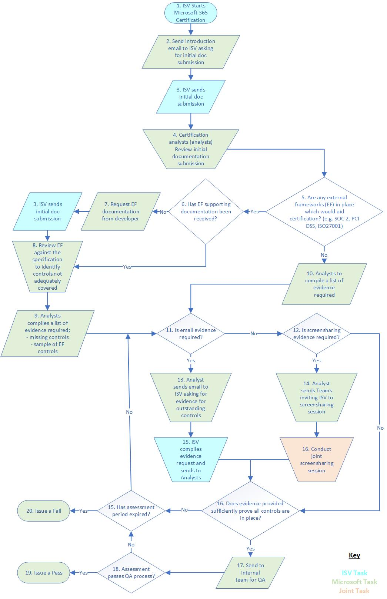

# Guía de envío de certificación de Microsoft 365Microsoft 365 Certification Submission Guide

**En este artículo:****In this article:**
- [IntroducciónIntroduction](#introduction)
- [Requisitos previosPrerequisites](#prerequisites) 
- [Actualizaciones de especificación de certificación de Microsoft 365Microsoft 365 Certification Specification Updates](#microsoft-365-certification-specification-updates)
- [Ámbito de certificaciónCertification Scope](#certification-scope)
- [Proceso de certificaciónCertification Process](#certification-process)
- [Evidencia de cumplimientoCompliance Evidence](#compliance-evidence) 
- [Envío de documento inicialInitial Document submission](#initial-document-submission) 
- [Actividades de recolección y evaluación de evidenciasEvidence Collection and Assessment Activities](#evidence-collection-and-assessment-activities)
- [Criterios de certificaciónCertification Criteria](#app-certification-criteria)
- [Application SecurityApplication Security](#application-security)
- [Seguridad operativaOperational Security](#operational-security) 
- [Seguridad y privacidad de tratamiento de datosData Handling Security and Privacy](#data-handling-security-and-privacy)
- [Revisión de marcos de cumplimiento externo opcionalOptional External Compliance Frameworks Review](#optional-external-compliance-frameworks-review)
- [Apéndice AAppendix A](#appendix-a)
- [Apéndice BAppendix B](#appendix-b) 
- [Apéndice CAppendix C](#appendix-c) 
- [Apéndice DAppendix D](#appendix-d) 
- [Apéndice EAppendix E](#appendix-e) 
- [Apéndice FAppendix F](#appendix-f) 
- [Apéndice G Appendix G ](#appendix-g)
- [Más informaciónLearn more](#learn-more) 
- [GlosarioGlossary](#glossary) 

## IntroducciónIntroduction

Como parte del programa de cumplimiento de aplicaciones de Microsoft 365, la certificación de Microsoft 365 ofrece garantía y confianza a las organizaciones empresariales de que los datos y la privacidad están protegidos y protegidos adecuadamente al integrar aplicaciones y complementos para desarrolladores de terceros en la plataforma de Microsoft 365.Part of the Microsoft 365 App Compliance program, the Microsoft 365 Certification offers assurance and confidence to enterprise organizations that data and privacy are adequately secured and protected when integrating third-party developer apps/add-ins into the Microsoft 365 platform. Las aplicaciones y complementos que pasen la validación se designarán Certificados de **Microsoft 365** en todo el ecosistema de Microsoft 365.Applications and add-ins that pass validation will be designated **Microsoft 365 Certified** throughout the Microsoft 365 ecosystem. 

Al participar en el programa de certificación de Microsoft 365, acepta estos términos complementarios y cumple con cualquier documentación que se aplique a su participación en el programa de certificación de Microsoft 365 con Microsoft Corporation ("Microsoft", "nosotros", "nos" o "nuestro").By participating in the Microsoft 365 Certification  program, you are agreeing to these supplemental terms and to comply with any accompanying documentation that applies to your participation in the Microsoft 365 Certification program with Microsoft Corporation ("Microsoft", "we", "us",  or "our"). Usted nos declara y nos garantiza que tiene la autoridad para aceptar estos términos complementarios de certificación de Microsoft 365 en su nombre, una empresa u otra entidad, según corresponda.You represent and warrant to us that you have the authority to accept these Microsoft 365 Certification supplemental terms on behalf of yourself, a company, and/or other entity, as applicable. Podemos cambiar, modificar o terminar estos términos complementarios en cualquier momento.We may change, amend or terminate these supplemental terms at any time. Su participación continua en el programa de certificación de Microsoft 365 después de cualquier cambio o modificación significa que acepta los nuevos términos complementarios.Your continued participation in the Microsoft 365 Certification program after any change or amendment means you agree to the new supplemental terms. Si no está de acuerdo con los nuevos términos complementarios o si terminamos estos términos complementarios, debe dejar de participar en el programa de certificación de Microsoft 365.If you do not agree to the new supplemental terms or if we terminate these supplemental terms, you must stop participating in the Microsoft 365 Certification program.

Este documento está dirigido a los ISV (proveedores de software independientes) para proporcionar información sobre el proceso de certificación de Microsoft 365, los requisitos previos para iniciar el proceso y los detalles de los controles de seguridad específicos que deben tener los ISV.This document is aimed at ISVs (Independent Software Vendors) to provide information on the Microsoft 365 Certification process, prerequisites to starting the process and details of specific security controls that ISVs must have in place.  Puede encontrar información general del programa de cumplimiento de aplicaciones de Microsoft 365 en la página del programa de cumplimiento de aplicaciones [de](https://docs.microsoft.com/microsoft-365-app-certification/overview)Microsoft 365 .General information of the Microsoft 365 App Compliance program can be found under the Microsoft 365 App Compliance program [page](https://docs.microsoft.com/microsoft-365-app-certification/overview). 

> [!IMPORTANT]
> Actualmente, la certificación de Microsoft 365 está limitada:Currently, Microsoft 365 Certification is limited:
>* Aplicaciones de Microsoft Teams (pestañas, bots, etc.).Microsoft Teams applications (Tabs, Bots, etc.) .
>* Aplicaciones/complementos de SharepointSharepoint Apps/Add-ins
>* Complementos de Office (Word, Excel, PowerPoint, Outlook, Project, OneNote)Office Add-ins (Word, Excel, PowerPoint, Outlook, Project, OneNote)

## Requisitos previosPrerequisites

### Atestación de editorPublisher Attestation

Antes de obtener el proceso de certificación de Microsoft 365, debe haber completado la Atestación de editor.Before being awarded the Microsoft 365 Certification process you must have completed Publisher Attestation. Sin embargo, puede iniciar el proceso de certificación de Microsoft 365 antes de completar la atestación de publisher.However, you may start the Microsoft 365 Certification process prior to completing Publisher Attestation.  

### Leer la especificación de certificación de Microsoft 365Read the Microsoft 365 Certification Specification

Microsoft recomienda que todos los ISV (proveedor de software independiente) lean esta especificación de certificación de Microsoft 365 en su totalidad para garantizar que el entorno del ámbito y la aplicación o el complemento cumplen todos los controles aplicables.Microsoft recommends all ISVs (Independent Software Vendor) to read this Microsoft 365 Certification Specification in its entirety to ensure all applicable controls are being met by the in-scope environment and the app/add-in. Esto ayudará a garantizar un proceso de evaluación sin problemas.This will help ensure a smooth assessment process.

## Actualizaciones de especificación de certificación de Microsoft 365Microsoft 365 Certification Specification Updates 

Las actualizaciones de la especificación de certificación de Microsoft 365 se prevén aproximadamente cada seis o doce meses.Updates to the Microsoft 365 Certification specification are anticipated approximately every six to twelve months. Estas actualizaciones pueden introducir nuevos dominios de seguridad de destino y/o controles de seguridad.These updates might introduce new target security domains and / or security controls. Las actualizaciones se basarán en los comentarios de los desarrolladores, los cambios en el panorama de amenazas y para aumentar la línea base de seguridad del programa a medida que madura.Updates will be based on developer feedback, changes to the threat landscape, and to increase the security baseline of the program as it matures. 

Los ISV que ya han iniciado la evaluación de certificación de Microsoft 365 pueden continuar la evaluación con la versión de la especificación de certificación de Microsoft 365 que era válida cuando se inició la evaluación.ISVs that have already started the Microsoft 365 Certification assessment can continue the assessment with the version of the Microsoft 365 Certification Specification that was valid when the assessment was started. Todos los nuevos envíos, incluida la recertificación anual, tendrán que evaluarse con respecto a la versión publicada.All new submissions, including annual recertification, will be required to be assessed against the version published.

> [!NOTE]
> No es necesario que cumpla con todos los controles de esta especificación de certificación de Microsoft 365 para obtener una certificación.You are not required to comply with all the controls within this Microsoft 365 Certification Specification to be awarded a certification. Sin embargo, se han establecido umbrales de paso (que no se divulgarán) para cada uno de los dominios de seguridad analizados en esta especificación de certificación de Microsoft 365.However, passing thresholds (which will not be disclosed) are in place for each of the security domains discussed within this Microsoft 365 Certification Specification. Algunos controles se clasificarán como un **"error** duro", lo que significa que la falta de estos controles de seguridad dará como resultado una evaluación con errores.Some controls will be classed as a ‘**Hard Fail**’ which means the lack of these security controls will result in a failed assessment. 

## Ámbito de certificaciónCertification Scope

El **entorno en el** ámbito es el entorno que admite la entrega del código de aplicación o complemento y admite los sistemas back-end con los que la aplicación o el complemento se puedan comunicar.The **in-scope environment** is the environment that supports delivery of the app/add-in code and supports any backend systems that the app/add-in may be communicating with. Los entornos conectados adicionales también se incluirán en el ámbito a menos que haya una segmentación adecuada y los entornos conectados no puedan afectar a la seguridad del entorno en el ámbito.Any additional connected-to environments will also be included in scope unless adequate segmentation is in place AND the connected-to environments cannot impact the security of the in-scope environment. Los entornos de recuperación ante desastres también tendrán que incluirse en el ámbito de la evaluación, ya que estos entornos tendrían que cumplir el servicio en caso de que algo sucediera en el entorno principal.Any disaster recovery environments will also need to be included within the scope of the assessment as these environments would be required to fulfil the service should anything happen to the primary environment.  El término **componentes del sistema en el** ámbito hace referencia a TODOS los dispositivos y sistemas que se usan en el entorno del   ámbito. The term  **in-scope system components** reference **ALL** devices and systems that are used within the in-scope environment. Los componentes del ámbito incluyen, entre otros:In-scope components include, but are not limited to:
* Las aplicaciones web.The web application(s).
* Servidores.Servers.
* Firewalls (o equivalentes).Firewalls (or equivalent).
* Modificadores.Switches.
* Equilibradores de carga.Load balancers.
* Infraestructura virtual.Virtual infrastructure.
* Portales de administración web del proveedor de nubeCloud provider web management portals 

> [!IMPORTANT]
> El entorno en el ámbito, debe tener una DMZ y el entorno de soporte de la aplicación o complemento debe segmentarse desde los sistemas empresariales internos y los entornos corporativos, limitando así el ámbito de las actividades de evaluación a los sistemas de ámbito únicamente.The in-scope environment, must have a DMZ and the supporting environment of the app/add-in must be segmented from the internal business systems and corporate environments thus limiting the scope of the assessment activities to the in-scope systems only. Los analistas de certificación validarán técnicas de segmentación durante la evaluación junto con la revisión de informes de pruebas de penetración que deberían haber incluido pruebas para validar la eficacia de las técnicas de segmentación en uso.Certification analysts will validate segmentation techniques during the assessment along with reviewing penetration testing reports which should have included testing to validate the effectiveness of any segmentation techniques in use.

### Infraestructura como servicio (IaaS), Plataforma como servicio (PaaS) y Software como servicio (SaaS)Infrastructure as a Service (IaaS), Platform as a Service (PaaS) and Software as a Service (SaaS) 
Cuando IaaS y/o PaaS se usen para admitir la infraestructura de la aplicación o la entrega de código de complemento en revisión, el proveedor de la plataforma en la nube será responsable de algunos de los controles de seguridad evaluados durante todo el proceso de certificación.Where IaaS and/or PaaS is used to support the infrastructure of the application or add-in code delivery under review, the Cloud platform provider will be responsible for some of the security controls assessed throughout the certification process. Por lo tanto, el proveedor de la plataforma en la nube deberá proporcionar a los analistas de certificación la comprobación externa independiente de los procedimientos recomendados de seguridad a través de informes de cumplimiento externos, como los informes de certificación de cumplimiento   (AOC), ISO27001 o [SOC 2](bookmark://soc-2)   Tipo II.Therefore, certification analysts will need to be provided with independent external verification of security best practices by the Cloud platform provider through external compliance reports such as [PCI DSS](bookmark://pci-dss) Attestation of Compliance (AOC), ISO27001 or [SOC 2](bookmark://soc-2) Type II reports. 

El Apéndice F proporciona detalles sobre qué controles de seguridad probablemente se aplicarán en función de los siguientes tipos de implementación y en función de si la aplicación o el complemento filtra o no los datos de M365:Appendix F provides details of what security controls will likely be applicable based on the following deployment types and based upon whether the app/add-in exfiltrates M365 data or not: 
* ISV hospedadoISV Hosted 
* IaaS hospedadoIaaS Hosted 
* PaaS/Serverless HostedPaaS/Serverless Hosted 
* Hosted híbridoHybrid Hosted 
* Hosted compartidoShared Hosted 

Cuando se implemente IaaS o PaaS, deberá proporcionar pruebas del entorno que se hospeda en estos tipos de implementación.Where IaaS or PaaS is deployed, you will need to provide evidence of the environment being hosted within these deployment types.

### MuestreoSampling

Las solicitudes de prueba que admitan la evaluación de certificación deben basarse en una muestra de los componentes del sistema en el ámbito en consideración de los diferentes sistemas operativos, la función principal del dispositivo y los distintos tipos de dispositivo.Requests for evidence in support of the certification assessment should be based on a sample of the in-scope system components in consideration of different operating systems, primary function of the device, and different device types. Al principio del proceso de certificación se seleccionará una muestra adecuada.A suitable sample will be selected at the start of the certification process. La siguiente tabla debe usarse como guía sobre el tamaño de la muestra:The following table should be used as a guide on what the sample size may be:

|Tamaño de la poblaciónPopulation Size              | MuestraSample                  |
|---------------------------- |-------------------------|
|<5<5|11|
|>5 & <10>5 & <10|22|
|>9 & <25>9 & <25|33|
|>24>24|4 4|

> [!NOTE]
>Si se identifican discrepancias entre los dispositivos incluidos en la muestra inicial, el tamaño de la muestra puede aumentar durante la evaluación.If discrepancies are identified between devices included within the initial sample, the sample size may be increased during the assessment. 

## Proceso de certificaciónCertification Process

Antes de iniciar el proceso de certificación, tendrías que haber iniciado o completado correctamente la certificación de publisher.Before starting the certification process, you would need to have successfully started or completed your Publisher Attestation. Las respuestas de atestación se usarán como soporte del proceso de certificación de Microsoft 365 y procede de la siguiente manera:Your attestation responses will be used in support of the Microsoft 365 Certification process and proceeds as follows: 

1. Revise la documentación sobre la atestación de publisher para garantizar la alineación con el entorno actualReview your Publisher Attestation documentation to ensure alignment with your current environment 
2. Solicitud para avanzar a la certificación de Microsoft 365 por correo electrónico <AppCert@microsoft.com>Request to progress to the Microsoft 365 Certification by emailing <AppCert@microsoft.com> 
3. Los analistas de certificación abrirán un diálogo antes de iniciar el proceso de certificación de Microsoft 365Certification analysts will open a dialogue before starting the Microsoft 365 Certification process   
4. Enviar el [envío inicial del documento](#initial-document-submission)Submit your [Initial Document Submission](#initial-document-submission)
5. El analista de certificación proporcionará una lista de los controles para los que se requiere evidencia, lo que inicia formalmente el proceso de certificación de Microsoft 365Certification analyst will provide a listing of controls for which evidence is required, which formally starts the Microsoft 365 Certification process
6. Enviar pruebas que demuestren que todos los controles de certificación de Microsoft 365 en el ámbito se han cumplido en una ventana de 60 días para completar la certificación de Microsoft 365Submit evidence that demonstrates that all in-scope Microsoft 365 Certification controls have been met within a 60-day window to complete Microsoft 365 Certification 

> [!IMPORTANT]
> **Período de tiempo de envío:** Se prevé que, en promedio, el proceso de evaluación tarde 15 días, siempre y cuando pueda responder a las solicitudes de prueba en tiempo y forma.**Submission time frame:** It is anticipated that on average the assessment process should take 15 days, provided you are able to respond to evidence requests within a timely manner. Microsoft recomienda asegurarse de que se ha leído esta guía de envío de certificación y estar seguro de que puede cumplir con los controles establecidos en ella y puede proporcionar suficiente evidencia antes de iniciar el proceso de certificación.Microsoft recommends that you ensure this certification submission guide has been read and be confident that you can meet the controls set out within it, and you can provide enough evidence before starting the certification process. Al iniciar el proceso de certificación, se permite un máximo de 60 días para completar la evaluación, de lo contrario, la evidencia ya recopilada se vuelve obsoleta.Upon starting the certification process, a maximum of 60 days is permitted to complete the assessment, otherwise evidence already collected becomes stale. Si, después del período de tiempo de 60 días, no se alcanza una evaluación correcta, se emitirá un error en el envío y el proceso debe iniciarse de nuevo.If, after the 60-day time-period, a successful assessment is not reached, the submission will be issued a fail and the process must start again. Si se produce un error debido a que microsoft 365 Certification Specification no cumple la especificación de certificación de Microsoft 365 o porque se alcanza el período de tiempo de 60 días y no se proporciona suficiente evidencia, Microsoft no hará públicos los resultados con errores.If a fail is issued due to failing to meet the Microsoft 365 Certification Specification or because the 60-day time-period is reached and enough evidence is not provided, failing results will not be made public by Microsoft. 

## Evidencia de cumplimientoCompliance Evidence

Aunque no es necesario, si actualmente cumple con otros marcos de seguridad externos, puede optar por usar estas certificaciones para satisfacer algunos de los controles de certificación de Microsoft 365.Although it is not required, if you are currently in compliance with other external security frameworks, you can elect to use these certifications to satisfy some of the Microsoft 365 Certification controls. Los analistas de certificación revisarán el ámbito y la cobertura de control de seguridad de los marcos de seguridad externos admitidos para determinar qué controles se pueden excluir de la evaluación de certificación de Microsoft 365, siempre que el ámbito de los marcos de seguridad externos incluya los entornos dentro del ámbito de la evaluación de certificación de Microsoft 365.Certification analysts will review the scope and security control coverage of any supported external security frameworks to determine which controls can be excluded from the Microsoft 365 Certification assessment, providing the scope of the external security frameworks include the in-scope environments for the Microsoft 365 Certification assessment. 

Los analistas de certificación intentarán alinear los marcos de seguridad externos existentes con la especificación de certificación de Microsoft 365.Certification analysts will try to align existing external security frameworks to the Microsoft 365 Certification specification. Sin embargo, si la documentación de soporte no puede proporcionar garantías de que los controles de certificación de Microsoft 365 se evaluaron como parte de la auditoría y evaluación de marcos de seguridad externos, deberá proporcionar pruebas adicionales de la implementación de estos controles.However, if supporting documentation is unable to provide assurance that Microsoft 365 Certification controls were assessed as part of the external security frameworks audit/assessment you will need to provide additional evidence of the said controls being in place. 

Actualmente, los marcos de seguridad externos que se pueden usar como soporte de la evaluación de certificación de Microsoft 365 incluyen:Currently, the external security frameworks that can be used in support of the Microsoft 365 Certification assessment include:

*  [ISMS](#isms) / [IEC:](#iec) especificación IS0/IEC 27001[ISMS](#isms)/[IEC](#iec) - IS0/IEC 27001 specification 
*  [PCI DSSPCI DSS](#pci-dss)
*  [SOC 2SOC 2](#soc-2)

La documentación debe demostrar adecuadamente que el entorno en el ámbito de la certificación de Microsoft 365 se incluyó dentro del ámbito de estos marcos de seguridad externos.Documentation must adequately demonstrate that the in-scope environment for the Microsoft 365 Certification was included within the scope of these external security frameworks. La validación de estos marcos de seguridad se cumplirá aceptando pruebas de certificaciones válidas realizadas por empresas externas de confianza.Validation of these security frameworks will be fulfilled by accepting evidence of valid certifications conducted by reputable external third-party companies. Estas empresas de confianza deben ser miembros de organismos internacionales de acreditación para los programas de cumplimiento relevantes.These reputable companies must be members of international accreditation bodies for relevant compliance programs.Consulte [Iso Certification and Conformy Standards](https://www.iso.org/certification.html) for ISO 27001 and Qualified Security [Assessors](https://www.pcisecuritystandards.org/assessors_and_solutions/qualified_security_assessors) (QSA) for PCI DSS. See [ISO Certification and Conformity Standards](https://www.iso.org/certification.html) for ISO 27001 and [Qualified Security Assessors](https://www.pcisecuritystandards.org/assessors_and_solutions/qualified_security_assessors) (QSA) for PCI DSS. 

En la siguiente tabla se destaca la documentación requerida por los analistas de certificación como parte de este proceso de validación:The following table highlights documentation required by certification analysts as part of this validation process:

| **Estándar****Standard** | **Requisitos** **Requirements** |
| ----- | ----- |
| **[ISO 27001](#iso-27001)****[ISO 27001](#iso-27001)** | Se requiere una versión pública de la **declaración** de aplicabilidad (SOA) y una copia del certificado ISO 27001 emitido.A public facing version of the **Statement of Applicability** (SOA) and a copy of the ISO 27001 certificate issued will be required.  El SOA resume su posición en cada uno de los 114 controles de seguridad de la información y se usará para identificar si alguna exclusión de controles que no se detalla satisfactoriamente en el certificado ISO 27001.The SOA summarizes your position on each of the 114 information security controls and  will be used to identify if any exclusion of controls that are not satisfactorily detailed in the ISO 27001 certificate. Si esto no se puede determinar revisando la versión pública de la SOA, es posible que el analista necesite acceso al SOA completo si se usará ISO 27001 para validar algunos de los controles de especificación de certificación de Microsoft 365.If this can't be determined by reviewing the public facing version of the SOA, the analyst might need access to the full SOA if ISO 27001 will be used to validate some of the Microsoft 365 Certification Specification controls.  Además de validar el ámbito de las actividades de evaluación iso 27001, los analistas también confirmarán la validez de la compañía de auditoría como se describió anteriormente.In addition to validating the scope of the ISO 27001 assessment activities, the analysts will also confirm the validity of the audit company as described above.|
|**[PCI DSS](#pci-dss)****[PCI DSS](#pci-dss)**| Debe **proporcionarse** un documento de certificación de cumplimiento (AOC) válido de nivel 1 que identifique claramente los componentes del sistema y la aplicación en el ámbito.A valid **Level 1 Attestation of Compliance** (AOC) document must be provided clearly identifying the in-scope application and system components.  No se aceptará una **AOC** de autoevaluación como prueba de los procedimientos recomendados de seguridad de reuniones.A self-assessment AOC **will not** be accepted as evidence of meeting security best practices. La AOC se usará para determinar cuál de los controles de especificación de certificación de Microsoft 365 se ha evaluado y confirmado como parte de la evaluación de PCI DSS.The AOC will be used to determine which of the Microsoft 365 Certification Specification controls have been evaluated and confirmed as part of the PCI DSS assessment.|
|**[SOC 2](#soc-2)****[SOC 2](#soc-2)**|El informe **SOC 2 (tipo I** o tipo II) debe estar actual (emitido en los últimos 15 meses y el período de tiempo declarado iniciado en los últimos 27 meses) para usarse como prueba de conformidad con cualquiera de los controles de evaluación de esta especificación de certificación de Microsoft 365.The **SOC 2 (Type I or Type II)** report must be current (issued within the last 15 months and the declared time period started within the last 27 months) to be used as evidence of conformity with any of the assessment controls within this Microsoft 365 Certification Specification.|

## Certificación de Microsoft 365Microsoft 365 Certification

Los marcos de seguridad externos compatibles se pueden usar como prueba de cumplir algunos de los controles de certificación de Microsoft 365.Supported external security frameworks can be used as evidence of meeting some of the Microsoft 365 Certification controls. Antes de que se puedan considerar los marcos de seguridad externos, los analistas de certificación revisarán el ámbito y la cobertura de control de seguridad del marco de seguridad externo mediante la documentación enviada anteriormente.Before external security frameworks can be considered, certification analysts will review the scope and security control coverage of the external security framework using the documentation submitted above. 

Los apéndices siguientes se pueden usar para identificar dónde existen posibles diferencias entre el marco de seguridad externo y la especificación de certificación de Microsoft 365 de la siguiente manera:The following appendixes can be used to identify where potential gaps between the external security framework and the Microsoft 365 Certification specification exist as follows: 

|**Marco****Framework** | **Consideraciones adicionales****Additional considerations** |
|-------------- | --------------------|
|ISO 27001ISO 27001| [**Apéndice C**](#appendix-c): Colección de evidencias: deltas para ISO 27001.[**Appendix C**](#appendix-c): Evidence Collection – Deltas for ISO 27001.|
|PCI DSSPCI DSS | [**Apéndice D**](#appendix-d): Colección de evidencias: deltas para PCI DSS.[**Appendix D**](#appendix-d): Evidence Collection – Deltas for PCI DSS.|
|SOC 2SOC 2| [**Apéndice E**](#appendix-e): Colección de evidencias: deltas para SOC 2.[**Appendix E**](#appendix-e): Evidence Collection – Deltas for SOC 2.|

> [!NOTE]
> Aunque los estándares y marcos de seguridad externos mencionados anteriormente se pueden enviar como prueba para cumplir algunos de los controles de certificación de Microsoft 365, pasar la certificación de Microsoft 365 no significa que pase correctamente una auditoría con esos estándares o marcos.Although the above-mentioned external security standards/frameworks can be submitted as evidence to meet some of the Microsoft 365 Certification controls, passing the Microsoft 365 Certification doesn't mean that you will successfully pass an audit against those standards/frameworks. La especificación de certificación de Microsoft 365 es solo un pequeño subconjunto de esos estándares o marcos de seguridad que permite a Microsoft obtener un nivel de seguridad en referencia a su posición de seguridad.The Microsoft 365 Certification Specification is only a small subset of those security standards/frameworks that allows Microsoft to gain a level of assurance in reference to your security posture.

## Envío inicial de documentosInitial document submission

El envío inicial del documento ayudará a los analistas de certificación a realizar el ámbito y a determinar lo que estará en el ámbito de su evaluación.The initial document submission will help certification analysts perform scoping and determine what will be in scope for your assessment. Después de lo cual tendrá que enviar la documentación de soporte y las pruebas usadas para llevar a cabo la evaluación.After which you will be required to submit supporting documentation and evidence used to carry out the assessment. El envío inicial debe incluir la información especificada a continuación:Your initial submission must include the information specified below:

| **Introducción a &nbsp; la documentación****Documentation&nbsp;Overview**     |   **Detalles de la documentación****Documentation Details**  |
| -------------------------| -----------------------------|
|**Descripción de la aplicación/complemento****App/Add-in Description** | Una descripción del propósito y la funcionalidad de la aplicación/complemento.A description of the app/add-in’s purpose and functionality. Esto debe proporcionar al analista de certificación una buena comprensión de cómo funciona la aplicación o el complemento y cuál es su uso previsto.This should provide the certification analyst with a good understanding of how the app/add-in functions and what it is intended use is
|**Informe de pruebas de penetración****Penetration Testing Report** |Un informe de pruebas de penetración completado en los últimos 12 meses.A penetration testing report completed within the last 12 months. Este informe debe incluir el entorno que admite la implementación de la aplicación o la adición junto con cualquier entorno adicional que admita el funcionamiento de la aplicación o el complemento.This report must include the environment that supports the deployment of the app/add along with any additional environment that supports the operation of the app/add-in. **Nota:** si no realiza pruebas de penetración anuales, puede elegir que se realicen a través del proceso de certificación.**Note:** if you do not do annual penetration testing, you can elect to have them done through the certification process.|
|**Diagramas de arquitectura****Architecture diagrams**|Diagrama de arquitectura lógica que representa una descripción general de alto nivel de la infraestructura de soporte técnico de la aplicación/ complemento.A logical architecture diagram representing a high-level overview of your app's / add-in’s supporting infrastructure. Esto debe incluir todos **los entornos** de hospedaje y la infraestructura compatible con la aplicación o el complemento.This must include **all** hosting environments and supporting infrastructure supporting the app/add-in. Este diagrama DEBE representar todos los diferentes componentes del sistema de soporte en el entorno para ayudar a los analistas de certificación a comprender los sistemas en el ámbito y ayudar a determinar el muestreo.This diagram MUST depict all the different supporting system components within the environment to help certification analysts understand systems in scope and help to determine sampling. Indique también qué tipo de entorno de hospedaje se usa; ISV hospedado, IaaS, PaaS o híbrido.Please also indicate what hosting environment type is used; ISV Hosted, IaaS, PaaS, or Hybrid. **Nota:** Donde se usa SaaS, indique los distintos servicios SaaS que se usan para proporcionar los servicios de soporte técnico en el entorno.**Note:** Where SaaS is used, please indicate the various SaaS services that are used to provide the supporting services within the environment.|
|**Huella pública****Public Footprint** | Detalle de **todas las** direcciones IP públicas y direcciones URL usadas por la infraestructura compatible.Detailing **all** public IP Addresses and URLs used by the supporting infrastructure. Esto debe incluir el intervalo IP enrutable completo asignado al entorno a menos que se haya implementado una segmentación adecuada para dividir el intervalo en uso (se requiere una evidencia adecuada de segmentación)This must include the full routable IP range allocated to the environment unless adequate segmentation has been implemented to split the range in use (adequate evidence of segmentation will be required)|
|**Diagramas de flujo de datos****Data flow diagrams** |Diagramas de flujo que detallan lo siguiente:Flow diagrams detailing the following:
||&#x2713; M365 Los datos fluyen hacia y desde la aplicación o el complemento [(incluidos EUII](#euii) y [OII](#oii) ).&#x2713; M365 Data flows to and from the App / Add-in (including [EUII](#euii) and [OII](#oii) ).|
||&#x2713; M365 Flujos de datos dentro de la infraestructura de soporte (cuando corresponda)&#x2713; M365 Data flows within the supporting infrastructure(where applicable)|
||&#x2713; diagramas que resaltan dónde y qué datos se almacenan, cómo se pasan los datos a terceros externos (incluidos los detalles de qué terceros) y cómo se protegen los datos en tránsito a través de redes abiertas/públicas y en reposo.&#x2713; Diagrams highlighting where and what data is stored, how data is passed to external third parties(including details of what third parties) , and how data is protected in transit over open/public networks and at rest.|
|**Detalles del extremo de la API****API Endpoint Details**| Una lista completa de todos los puntos de conexión de API usados por la aplicación.A complete listing of all API Endpoints used by your app. Para ayudar a comprender el ámbito del entorno, proporcione ubicaciones de extremo de API dentro del entorno.To help understand the environment scope, provide API endpoint locations within your environment.                                
|**Permisos de api de Microsoft****Microsoft API Permissions**| Proporcionar documentación que detalle **todas** las API de Microsoft que se usan junto con los permisos que se solicitan para que la aplicación o el complemento funcionen junto con una justificación de los permisos solicitadosProvide documentation detailing **ALL** the Microsoft APIs that are used along with what permissions are being requested for the app/add-in to function along with a justification for the requested permissions|
|**Tipos de almacenamiento de datos****Data storage types** |Almacenamiento de datos y tratamiento de documentos que describen:Data storage and handling documents describing:|
||&#x2713; En qué medida se reciben y almacenan sus clientes M365 Data [EUII](#euii) y [OII](#oii)&#x2713; To what extent is your customers M365 Data [EUII](#euii) and [OII](#oii) is being received and stored|
||&#x2713; el período de retención de datos.&#x2713; The data retention period.|
||&#x2713; por qué se capturan los datos M365 del cliente.&#x2713; Why the customer M365 Data is being captured.|
||&#x2713; donde se almacenan los datos M365 del cliente (debe incluirse en los diagramas de flujo de datos proporcionados anteriormente).&#x2713; Where customer M365 Data is stored (should be included within data flow diagrams supplied above).|
|**Confirmación de cumplimiento****Compliance confirmation**|Documentación de soporte técnico para marcos de seguridad externos incluidos en el envío de atestación de publisher o que se debe tener en cuenta al revisar los controles de certificación de Microsoft 365.Supporting documentation for external security frameworks included within the Publisher Attestation submission or to be considered when reviewing Microsoft 365 Certification controls. Actualmente, se admiten los tres siguientes:Currently, the following three are supported:|
||&#x2713; certificación de cumplimiento [(AOC) de PCI DSS.](#pci-dss)&#x2713; [PCI DSS](#pci-dss) Attestation of Compliance (AOC).|
||&#x2713; [soc 2](#soc-2) tipo I/type II informes.&#x2713; [SOC 2](#soc-2) Type I/Type II reports.|
||&#x2713; [ISMS](#isms)  /  [IEC-](#iec) 1S0/IEC 27001 Declaración de aplicabilidad (SoA) y certificación.&#x2713; [ISMS](#isms) / [IEC](#iec) - 1S0/IEC 27001 Statement of Applicability (SoA) and Certification.|
|**Dependencias web****Web Dependencies**|Documentación que enumera todas las dependencias usadas por la aplicación o el complemento con las versiones en ejecución actuales.Documentation listing all dependencies used by the app / add-in with the current running versions.|
|**Inventario de software****Software Inventory**|Un inventario de software actualizado que incluye todo el software usado en el entorno del ámbito junto con las versiones.An up-to-date software inventory which includes all software used within the in-scope environment along with the versions.|
|**Inventario de hardware****Hardware Inventory**| Un inventario de hardware actualizado usado por la infraestructura de soporte técnico.An up-to-date hardware inventory used by the supporting infrastructure. Esto se usará para ayudar con el muestreo al realizar la fase de evaluación.This will be used to help with sampling when performing the assessment phase. Si el entorno incluye PaaS, proporcione detalles de los servicios consumidos.If your environment includes PaaS provide details of services consumed.|

## Actividades de recolección y evaluación de evidenciasEvidence Collection and Assessment Activities

A través de actividades sólidas de recopilación y evaluación de pruebas, los analistas de certificación podrán evaluar su posición de seguridad para obtener un nivel adecuado de seguridad de datos y cumplimiento de los controles de especificación de certificación de Microsoft 365.Through robust evidence collection and assessment activities, certification analysts will be able to assess your security posture to obtain an adequate level of data security assurance and adherence to the Microsoft 365 Certification Specification controls. Los analistas de certificación lograrán esto de la siguiente manera:Certification analysts will achieve this as follows: 

**Colección Evidence****Evidence Collection**

* Documentación inicial, resaltada en la sección [De envío de documentación](#initial-document-submission) inicial anteriorInitial documentation, highlighted within the [Initial Documentation Submission](#initial-document-submission) section above 
* Documentos de directivaPolicy documents 
* Procesar documentosProcess documents 
* Opciones de configuración del sistemaSystem configuration settings 
* Cambiar valesChange tickets 
* Cambiar registros de controlChange control records 
* Informes del sistemaSystem reports

Se usarán varios métodos para recopilar las pruebas necesarias para completar el proceso de evaluación.Various methods will be used to collect the evidence necessary to complete the assessment process.  Esta colección de pruebas puede tener la forma de:This evidence collection may be in the form of: 
* DocumentosDocuments 
* Capturas de pantallaScreenshots 
* EntrevistasInterviews 
* ScreensharingScreensharing 

Las técnicas de recolección de evidencias usadas se determinarán durante el proceso de evaluación.The evidence collection techniques used will be determined during the assessment process. 

**Actividades de evaluación****Assessment Activities**

Los analistas de certificación revisarán las pruebas que proporcione para determinar si ha cumplido adecuadamente los controles dentro de esta especificación de certificación de Microsoft 365.Certification analysts will review evidence you provide to determine if you have adequately met controls within this Microsoft 365 Certification Specification. 

Siempre que sea posible y para reducir la cantidad de tiempo necesaria para completar la evaluación, se debe proporcionar con antelación toda o toda la documentación detallada en el envío   de documentación inicial.Where possible and to reduce the amount of time required to complete the assessment, any or all of the documentation detailed in the [Initial Documentation Submission](#initial-document-submission) should be provided in advance.

Los analistas de certificación revisarán primero las pruebas proporcionadas en el envío de documentación inicial y la información de atestación del editor para identificar las líneas de investigación adecuadas, el tamaño del muestreo y la necesidad de obtener más pruebas como se ha detallado anteriormente.Certification analysts will first review the evidence provided from the initial documentation submission and the Publisher Attestation information to identify appropriate lines of inquiry, sampling size, and the need for further evidence to be obtained as detailed above.  Los analistas de certificación analizarán toda la información recopilada para extraer conclusiones sobre cómo y si va a cumplir los controles de esta especificación de certificación de Microsoft 365.Certification analysts will analyze all information gathered to draw conclusions as to how and if you are meeting the controls within this Microsoft 365 Certification Specification. 

## Criterios de certificación de aplicacionesApp Certification Criteria

La aplicación, la infraestructura de soporte técnico y la documentación de soporte técnico se evaluarán en los siguientes dominios de seguridad:Your app, supporting infrastructure, and supporting documentation will be assessed across the following security domains:

1. [**Application Security****Application Security**](#application-security)
1. [**Seguridad operativa /Implementación segura****Operational Security / Secure Deployment**](#operational-security)
1. [**Seguridad y privacidad de tratamiento de datos****Data Handling Security and Privacy**](#data-handling-security-and-privacy)
1. [**Revisión opcional del marco de cumplimiento externo****Optional External Compliance Framework Review**](#optional-external-compliance-frameworks-review)

Cada uno de estos dominios de seguridad incluye controles clave específicos que abarcan uno o más requisitos específicos que se evaluarán como parte del proceso de evaluación.Each of these security domains include specific key controls encompassing one or more specific requirements that will be evaluated as part of the assessment process. Para garantizar que la certificación de Microsoft 365 sea inclusiva para desarrolladores de todos los tamaños, cada uno de los cuatro dominios de seguridad se evalúa mediante un sistema de puntuación para determinar una puntuación general de cada uno de los dominios.To ensure that Microsoft 365 Certification is inclusive to developers of all sizes, each of the four security domains is assessed using a scoring system to determine an overall score from each of the domains. Las puntuaciones de cada uno de los controles de certificación de Microsoft 365 se asignan entre 1 (bajo) y 3 (alto) en función del riesgo percibido de que ese control no se cumple.Scores for each of the Microsoft 365 Certification controls are allocated between 1 (low) and 3 (high) based upon the perceived risk of that control not being met. Cada uno de los cuatro dominios de seguridad tendrá una marca de porcentaje mínima que se considerará un pase.Each of the four security domains will have a minimum percentage mark to be deemed a pass. Algunos elementos de esta especificación incluyen algunos criterios de error automáticos:Certain elements of this specification include some automatic fail criteria:

- Los permisos de api no se apea al principio de privilegios mínimos (PoLP).API permissions not following the principle of least privilege (PoLP).  
- No hay informe de pruebas de penetración cuando es necesario.No penetration testing report when it is required.
- Sin defensas antimalwareNo anti-malware defenses
- La autenticación multifactor no se usa para proteger el acceso administrativo.Multi-Factor authentication not being used to protect administrative access.  
- No hay procesos de revisión.No patching processes.  
- No hay aviso [de privacidad del RGPD](#gdpr) adecuado.No suitable [GDPR](#gdpr) privacy notice.  

## Application SecurityApplication Security

El dominio de seguridad de la aplicación se centra en las tres áreas siguientes:The application security domain focuses upon the follow three areas: 
* Validación de permisos de GraphAPIGraphAPI Permission Validation 
* Comprobaciones de conectividad externaExternal Connectivity Checks
* Pruebas de seguridad de aplicacionesApplication Security Testing 

**Validación de permisos de GraphAPI****GraphAPI Permission Validation**

La validación de permisos graphAPI se lleva a cabo para validar que la aplicación o el complemento no solicita permisos muy permisivos.GraphAPI permission validation is carried out to validate the app/add-in does not request overly permissive permissions. Esto se lleva a cabo comprobando manualmente qué permisos se solicitan.This is carried out by manually checking what permissions are requested. Los analistas de certificación harán referencia a estas comprobaciones en el envío de la atestación de publisher y evaluarán el nivel de acceso que se solicita para garantizar que se cumplen las prácticas de "privilegios mínimos".Certification analysts will cross reference these checks against the Publisher Attestation submission and evaluate the level of access being requested to ensure ‘least privilege’ practices are being met. Cuando los analistas de certificación creen que no se cumplen estas prácticas de "privilegios mínimos", los analistas de certificación tendrán una discusión abierta con usted para validar la justificación empresarial de los permisos que se solicitan.Where certification analysts believe these ‘least privilege’ practices are not being met, certification analysts will have an open discussion with you to validate the business justification for the permissions being requested. Las discrepancias con el envío de atestación de editor que se haya encontrado durante esta revisión también recibirán comentarios para que se pueda actualizar la Atestación del editor.Any discrepancies against your Publisher Attestation submission found during this review will also get feedback so your Publisher Attestation can be updated. 

**Comprobaciones de conectividad externa****External Connectivity Checks**

Como parte de la evaluación, un analista realizará un recorrido ligero por la funcionalidad de las aplicaciones para identificar conexiones fuera de M365.As part of the assessment, an Analyst will perform a light walk through of the applications functionality to identify connections outside of M365.  Las conexiones que no se identifiquen como Microsoft o conexiones directas al servicio se marcarán y se analizarán durante la evaluación.Any connections which are not identified as being Microsoft or direct connections to your service will be flagged and discussed during the assessment.

**Pruebas de seguridad de aplicaciones****Application Security Testing**

Una revisión adecuada de los riesgos asociados con la aplicación/complemento y el entorno de soporte técnico es esencial para proporcionar a los clientes garantías en la seguridad de la aplicación/complemento.An adequate review of the risks associated with your app/add-in and supporting environment is essential in providing customers with assurance in the security of the app/add-in. Las pruebas de seguridad de aplicaciones en forma de pruebas de penetración DEBEN realizarse si la aplicación tiene conectividad con cualquier servicio no publicado por Microsoft.Application security testing in the form of penetration testing MUST be carried out if your application has any connectivity to any service not published by Microsoft. Si la aplicación funciona de forma independiente sin conectividad a ningún servicio o back-end que no sea de Microsoft, no es necesario realizar pruebas de penetración.If your app operates standalone without connectivity to any non-Microsoft service or backend, then penetration testing is not required.

### Ámbito de pruebas de penetraciónPenetration Testing Scope

Las actividades  de prueba de penetración DEBEN incluir el entorno que admite la implementación de la aplicación o el complemento (por ejemplo, donde se hospeda el código de aplicación o complemento que normalmente será el recurso dentro del archivo de manifiesto) junto con cualquier entorno adicional que admita el funcionamiento de la aplicación o el complemento (por ejemplo, si la aplicación o el complemento habla con otras aplicaciones web fuera de Microsoft 365).Penetration testing activities **MUST** include the environment that supports the deployment of the app/add-in (for example; where the app/add-in code is hosted which will typically be the resource within the manifest file) along with any additional environment that supports the operation of the app/add-in (for example; if the app/add-in talks to other web applications outside of Microsoft 365).  Al definir el ámbito, es necesario tener cuidado para asegurarse de que todos los sistemas o entornos "conectados" que puedan afectar a la seguridad del entorno en el ámbito también se incluyan en TODAS las actividades de prueba de penetración.When defining the scope, care needs to be taken to ensure that any “connected-to” systems or environments that can impact upon the security of the in-scope environment is also included within ALL penetration testing activities. 

Cuando se usan técnicas para segmentar los entornos del ámbito desde otros entornos, las actividades de prueba de penetración DEBEN validar la eficacia de estas técnicas de segmentación.Where techniques are used to segment the in-scope environments from other environments, penetration testing activities MUST validate the effectiveness of said segmentation techniques. Esto debe detallarse en el informe de pruebas de penetración.This must be detailed within the penetration testing report. 
 

### Especificación de pruebaTest Specification 

|PruebaTest | ControlesControls |
|-------|-----------|
|**Pruebas de penetración****Penetration testing**| Las pruebas de penetración de aplicaciones e infraestructuras **DEBEN** realizarse anualmente (cada 12 meses) y realizadas por una compañía independiente de confianza.Application and infrastructure penetration testing **MUST** take place annually (every 12 months) and conducted by a reputable independent company. La corrección de las vulnerabilidades  críticas y de alto riesgo identificadas DEBE completarse en el plazo de un mes a la finalización de las pruebas de penetración, o antes, según el proceso de revisión documentado.Remediation of identified critical and high-risk vulnerabilities **MUST** be completed within one month of the conclusion of the penetration testing, or sooner depending on the documented patching process.La superficie externa completa (direcciones IP, direcciones URL, extremos de API, etc.) DEBE incluirse dentro del ámbito de las pruebas de penetración y debe estar documentado en el informe de pruebas de penetración. La superficie externa completa (direcciones IP, direcciones URL, extremos de API, etc.) **DEBE** incluirse dentro del ámbito de las pruebas de penetración y debe estar documentado en el informe de pruebas de penetración. The full external footprint (IP Addresses, URLs, API Endpoints, etc.) MUST be included within the scope of penetration testing and must be documented within the penetration testing report.The full external footprint (IP Addresses, URLs, API Endpoints, etc.) *\*MUST** be included within the scope of penetration testing and must be documented within the penetration testing report.                                                                                                                                                                           Las pruebas de penetración de aplicaciones web DEBEN incluir todas las clases de vulnerabilidad; por ejemplo, el OWASP top 10 o SANS top 25 CWE más actual.Web application penetration testing MUST include all vulnerability classes; for example, the most current OWASP Top 10 or SANS Top 25 CWE.                                                                                                                                                                                No es necesario volver a probar las vulnerabilidades identificadas por la compañía de pruebas de  penetración: la corrección y la autoexaminación son suficientes, sin embargo, deben proporcionarse pruebas adecuadas para demostrar la corrección suficiente durante la evaluación.Retesting of identified vulnerabilities by the penetration testing company is not required — remediation and self-review is sufficient however, adequate evidence to demonstrate sufficient remediation **MUST** be provided during the assessment.|

### Revisión del informe de pruebas de seguridad de aplicacionesApplication Security Testing Report Review

Se revisarán los informes de pruebas de penetración para asegurarse de que no hay vulnerabilidades que cumplan los siguientes criterios **de error automático:**Penetration testing reports will be reviewed to ensure there are no vulnerabilities that meet the following **automatic failure criteria:**

* Presencia de un sistema operativo no compatible.Presence of an unsupported operating system. 

* Presencia de cuentas administrativas predeterminadas, enumerables o adivinables.Presence of default, enumerable, or guessable administrative accounts.

* Presencia de SQL de inyección.\*Presence of SQL injection risks.\*

* Presencia de scripting entre sitios.\*Presence of cross-site scripting.\*

* Presencia de vulnerabilidades de recorrido de directorio (ruta de acceso de archivo).\*Presence of directory traversal (file path) vulnerabilities.\*

* Presencia de vulnerabilidades HTTP, por ejemplo, división de respuesta de encabezado, contrabando de solicitudes y ataques de desincronización.\*Presence of HTTP vulnerabilities, e.g., Header response splitting, Request smuggling, and Desync attacks.\*

* Presencia de divulgación de código fuente [(incluida LFI](#lfi)).\*Presence of source code disclosure (including [LFI](#lfi)).\*

* Cualquier puntuación crítica o alta definida por las directrices de administración de revisiones de CVSS.Any critical or high score as defined by the CVSS patch management guidelines.

* Cualquier vulnerabilidad técnica significativa que se pueda aprovechar fácilmente para poner en peligro una gran cantidad de EUII o OUI.Any significant technical vulnerability which can be readily exploited to compromise a large amount of EUII or OUI.

\*Independientemente de las vulnerabilidades cvss score\*Regardless of the vulnerabilities CVSS Score

> [!IMPORTANT]
>Los informes deben poder proporcionar la suficiente garantía de que se puede demostrar todo lo que se detalla en la sección Application Security Test Specification.Reports must be able to provide enough assurance that everything detailed within the Application Security Test Specification section can be demonstrated.

### Requisitos y costo de las pruebas de penetraciónPenetration Testing Requirements and Cost

Para los ISV que actualmente no participan en pruebas de penetración, las pruebas de penetración se incluyen en la certificación de Microsoft 365.For ISVs that currently do not engage in penetration testing, penetration testing is included under the Microsoft 365 Certification. Microsoft organizará y cubrirá el costo de una prueba de penetración durante un máximo de 12 días de pruebas manuales.Microsoft will arrange and cover the cost of a penetration test for up to 12 days of manual testing. Los costos de las pruebas de penetración se calculan en función del número de días necesarios para probar el entorno.Penetration tests costs are calculated based on the number of days required to test the environment. Los gastos que superen los 12 días de pruebas serán responsabilidad del ISV.Any expenses exceeding 12 days of testing will be the responsibility of the ISV. The ISV will also be responsible for demonstrating that vulnerabilities identified in the penetration test have been remediated prior to a certification being awarded, but do not need to produce a clean report.The ISV will also be responsible for demonstrating that vulnerabilities identified in the penetration test have been remediated prior to a certification being awarded, but do not need to produce a clean report.

Una vez que se organiza una prueba de penetración, el ISV es responsable de las tarifas asociadas con la reprogramación y las cancelaciones de la siguiente manera:Once a penetration test is arranged, the ISV is responsible for fees associated with rescheduling and cancellations as follows:

| **Rescheduling Fee Timescale****Rescheduling Fee Timescale** | **Proporciones pagaderas****Proportion Payable** |
|------------------|------------------------|
| Volver a programar la solicitud recibida más de 30 días antes de la fecha de inicio programada.Re-schedule request received more than 30 days prior to scheduled start date. | 0% pagadero0% Payable |
| Volver a programar la solicitud recibida de 8 a 30 días antes de la fecha de inicio programada.Re-schedule request received 8 to 30 days prior to scheduled start date. | 25% pagadero25% Payable |
| Vuelva a programar la solicitud recibida entre 2 y 7 días antes de la fecha de inicio programada con una fecha de reserva de empresa.Re-schedule request received within 2 to 7 days prior to scheduled start date with a firm re-booking date.| 50% pagadero50% Payable |
| Volver a programar la solicitud recibida menos de 2 días antes de la fecha de inicio.Re-schedule request received less than 2 days before the start date. | 100% pagadero100% Payable |

| **Escala temporal de la cuota de cancelación****Cancellation Fee Timescale** | **Proporciones pagaderas****Proportion Payable** |
|------------------|------------------------|
| Solicitud de cancelación recibida más de 30 días antes de la fecha de inicio programada.Cancellation request received more than 30 days prior to scheduled start date. | 25% pagadero25% Payable |
| Solicitud de cancelación recibida de 8 a 30 días antes de la fecha de inicio programada.Cancellation request received 8 to 30 days days prior to scheduled start date. | 50% pagadero50% Payable |
| Solicitud de cancelación recibida dentro de los 7 días anteriores a la fecha de inicio programada.Cancellation request received within 7 days prior to scheduled start date. | 90% pagadero90% Payable |

## Seguridad operativaOperational Security

Este dominio mide la alineación de la infraestructura y los procesos de implementación compatibles de la aplicación con los procedimientos recomendados de seguridad.This domain measures the alignment of your app's supporting infrastructure and deployment processes with security best practices.

### Especificación de pruebaTest Specification

|PruebaTest | ControlesControls |
| ------------------------|------------------------------ |
| **Protección contra malware****Malware Protection** | Debe implementar mecanismos de protección contra malware en todos los sistemas del ámbito que se ven afectados por el malware.You must deploy malware protection mechanisms on all in-scope systems that are commonly affected by malware. Estos mecanismos de protección pueden incluir el uso de software antivirus o técnicas de control de aplicaciones que protegen contra malware.These protection mechanisms can include the use of anti-virus software or application control techniques that protect against malware. Cuando se usa software antivirus o control de aplicaciones, debe cumplir los siguientes criterios.Where anti-virus software or application control is used, it MUST meet the following criteria.                                                                                            Los antivirus (también incluidos los productos antimalware) DEBEN cumplir lo siguiente:Anti-virus (also including anti-malware products) MUST meet the following: |
||&#x2713; software antivirus se ejecuta en todos los componentes del sistema dentro del ámbito.&#x2713; Anti-virus software is running on all system components within scope.|
||&#x2713; el software antivirus se mantiene actualizado (en un plazo de 30 días).&#x2713; Anti-virus software is kept up to date (within 30 days).|
||&#x2713; las firmas antivirus se mantienen actualizadas (en un plazo de 1 día).&#x2713; Anti-virus signatures are kept up to date (within 1 day).|
||&#x2713; debe configurarse el examen en tiempo real o los exámenes periódicos con notificaciones.&#x2713; Either on-access scanning and/or periodic scans with notifications must be configured.  Cuando se usa el examen  en tiempo real, también deben configurarse los exámenes semanales, pero si el examen en tiempo real no está configurado, se debe configurar el examen diario.Where on-access scanning is used, weekly scans **MUST** also be configured, however if on-access scanning is not configured, daily scanning must be configured.|
||&#x2713; el **software** antivirus debe configurarse de la siguiente manera.&#x2713; Anti-virus software **MUST** be configured as follows.|
||&emsp;&#x25fc; bloquear el malware sospechoso.&emsp;&#x25fc; Block suspected malware.|
||&emsp;&#x25fc; cuarentena sospecha de malware.&emsp;&#x25fc; Quarantine suspected malware.|
||&emsp;&#x25fc; proporcionar una alerta sobre el malware sospechoso.&emsp;&#x25fc; Provide an alert on suspected malware.|
||&#x2713; el **software** antivirus debe configurarse para registrar todas las actividades.&#x2713; Anti-virus software **MUST** be configured to log all activities.
||&#x2713; deben establecerse  directivas y procedimientos para promover prácticas antimalware seguras.&#x2713; Policies and procedures **MUST** be in place to promote strong anti-malware practices.|
||oor|
||Los controles de aplicación DEBEN configurarse en todos los sistemas del ámbito para que cumplan lo siguiente:Application controls MUST be configured on all in-scope system to meet the following:|
||&#x2713; Todas las aplicaciones permitidas para ejecutarse en componentes del sistema en el ámbito deben ser aprobadas formalmente por la organización.&#x2713; All allowed applications permitted to execute on in-scope system components MUST be formally approved by the organization..|
||&#x2713; La organización DEBE mantener una lista completa de aplicaciones aprobadas con justificación empresarial para la aplicación.&#x2713; The organization MUST maintain a complete list of approved applications with business justification for the application.|
||&#x2713; deben documentarse completamente los mecanismos de control de aplicaciones específicos: es decir, ubicaciones en la lista blanca; firma de código, etc.&#x2713; Specific application control mechanisms MUST be fully documented: i.e. whitelisted locations; code signing, etc.|
||&#x2713; control de aplicación debe configurarse como documento.&#x2713; Application control MUST be configured as document.|
||&#x2713; proceso documentado para las aprobaciones de aplicaciones debe estar en marcha y auditable.&#x2713; Documented process for application approvals must be in place and auditable.|
|**Administración de parches****Patch Management**|DEBE **tener** documentadas directivas y procedimientos de revisión que garanticen que la revisión se realice de forma oportuna.You **MUST** have documented patching policies and procedures in place that ensure patching is conducted in a timely manner. Debe haber  un proceso sólido que identifique, clasifice y parchee nuevas vulnerabilidades de seguridad según las puntuaciones de clasificación de riesgos recomendadas de CVSS V3.1 o la taxonomía de puntuación equivalente:A robust process **MUST** be in place that identifies, ranks, and patches new security vulnerabilities based on the CVSS V3.1 **Recommended Risk Ranking Scores**, or equivalent scoring taxonomy: 
||**Puntuaciones de clasificación de riesgos** recomendadas (intervalo de puntuación base de CVSS v3.1)**Recommended Risk Ranking Scores** (CVSS v3.1 Base Score Range)|
||&emsp;**Crítico**: 9.0 - 10.0.&emsp; **Critical**: 9.0 - 10.0.|
||&emsp;**High**: 7.0 - 8.9.&emsp; **High**: 7.0 - 8.9.|
||&emsp;**Medium**: 4.0 - 6.9.&emsp; **Medium**: 4.0 - 6.9.|
||&emsp;**Bajo**: 0,1 - 3,9.&emsp; **Low**: 0.1 - 3.9.|
||&emsp;**None**: 0.0&emsp; **None**: 0.0 |
|| **IMPORTANTE:** El proceso para identificar nuevas vulnerabilidades debe ser lo suficientemente sólido como para permitir la identificación y revisión de vulnerabilidades en línea con la ventana de revisión documentada que haya definido.**IMPORTANT**: The process to identify new vulnerabilities must be robust enough to allow for the identification and patching of vulnerabilities in line with the documented patching window you have defined. |
|**Patching****Patching**|&#x2713; Los problemas de riesgo crítico,  alto o medio deben ser corregidos dentro de un período predefinido y documentado decidido por el ISV, que representa la ventana mínima de tiempo antes de que se resuelva el **problema.**&#x2713; Any Critical, High, or Medium risk issues **MUST** be patched within a pre-determined and documented period decided by the ISV which represents the minimal window of time before the issue **must be** resolved.  Aunque la ventana de revisión está definida por el ISV, la ventana debe estar dentro de un plazo razonable.Although the patching window is defined by the ISV, the window needs to be within a reasonable timeframe. Por ejemplo, tres meses para corregir una vulnerabilidad crítica no sería razonable y, por lo tanto, se rechazaría dentro de la evaluación de certificación de Microsoft 365.For example, three months to patch a Critical vulnerability would not be reasonable and therefore rejected within your Microsoft 365 Certification assessment.|
||&#x2713; directivas y procedimientos que detallan cómo  se lleva  a cabo la revisión DEBEN estar en funcionamiento y DEBEN incluir todos los sistemas operativos, aplicaciones y componentes de software aplicables que se usan en el entorno.&#x2713; Policies and procedures detailing how patching is conducted **MUST** be in place and **MUST** include all applicable operating systems, applications and software components used within the environment. Esto incluye todas las dependencias web usadas dentro de la aplicación o el complemento.This includes any web dependencies used within the app/add-in.|
||&#x2713; componentes de software y sistemas operativos que ya no son compatibles con el proveedor **NO** DEBEN usarse en el entorno.&#x2713; Software components and operating systems no longer supported by the vendor **MUST** not be used within the environment. Las directivas  de soporte deben estar en su lugar para garantizar que los componentes de software no admitidos o los sistemas operativos se quitarán del entorno y debe haber un proceso para identificar cuándo los componentes de software terminan su vida útil.Supporting policies **MUST** be in place to ensure unsupported software components / operating systems will be removed from the environment and a process to identify when software components go end-of-life must be in place.|
|**Análisis de vulnerabilidades****Vulnerability scanning**|El examen de vulnerabilidades debe incluir:Vulnerability scanning must include:|
||&#x2713; análisis trimestral de vulnerabilidades externas llevado  a cabo en la superficie pública completa del entorno en el ámbito (direcciones URL Y direcciones IP para el examen de la infraestructura y la aplicación web).&#x2713; Quarterly external vulnerability scanning carried out against the **FULL** public footprint of the in-scope environment (URLs AND IP Addresses for Infrastructure and Web Application scanning).|
||&#x2713; análisis de vulnerabilidad interna autenticado trimestralmente realizado en componentes del sistema en el ámbito (no para PaaS).&#x2713; Quarterly authenticated internal vulnerability scanning carried out against in-scope system components (not for PaaS).|
||&#x2713; Debe haber una directiva de  corrección de vulnerabilidades documentada para garantizar que los componentes del sistema estén libres de vulnerabilidades conocidas, detallando la escala de tiempo para corregir vulnerabilidades en función de las puntuaciones de clasificación de riesgos recomendadas de CVSS \*\*\*\* definidas (vea más arriba).&#x2713; A documented vulnerability remediation policy **MUST** be in place to ensure system components are free from known vulnerabilities by detailing the timeline to fix vulnerabilities based upon your defined CVSS **Recommended Risk Ranking Scores**(see above).|
||&#x2713; Deben realizarse exámenes  en curso hasta que se solucione la vulnerabilidad clasificada por riesgo identificado dentro de la escala de tiempo necesaria, tal como se define en la directiva de corrección del ISV.&#x2713; Ongoing re-scans **MUST** be carried out until identified risk ranked vulnerabilities are remediated within the required timeline, as defined by the ISV’s remediation policy. Aunque la escala de tiempo de corrección está definida por el ISV, la ventana debe estar en un plazo razonable.Although the remediation timeline is defined by the ISV, the window needs to be within a reasonable timeframe. Por ejemplo, tres meses para corregir una vulnerabilidad crítica no sería razonable y, por lo tanto, se rechazaría dentro de la evaluación de certificación de Microsoft 365.For example, three months to remediate a Critical vulnerability would not be reasonable and therefore rejected within your Microsoft 365 Certification assessment.|
|**Firewalls****Firewalls**|Se espera que la infraestructura de soporte técnico tenga configurado un firewall (o equivalente donde se consumen los servicios en la nube) de la siguiente manera:Your supporting infrastructure will be expected to have a firewall (or equivalent where Cloud services are being consumed) configured as follows:|
||&#x2713; **debe** instalarse en todas las conexiones a Internet que expongan los entornos del ámbito.&#x2713; **MUST** be installed on all internet connections exposing the in-scope environments.|
||&#x2713; **debe** instalarse entre todas las DMZ (zonas desmilitarizadas) y las redes de confianza.&#x2713; **MUST** be installed between all DMZs (Demilitarized Zones) and any trusted networks.|
||&#x2713; Todo el acceso público **DEBE** finalizar en una DMZ (zona desmilitarizada).&#x2713; All public access **MUST** terminate in a DMZ (Demilitarized Zone). |
||&#x2713; Deben cambiarse las credenciales **administrativas** predeterminadas antes de la instalación en entornos de producción.&#x2713; Default administrative credentials **MUST** be changed, prior to installation into production environments.|
||&#x2713; Todo el tráfico permitido a través de firewalls en el ámbito (en cualquier **dirección)** DEBE pasar por un proceso de aprobación y todos los protocolos, servicios y puertos deben documentarse con justificaciones empresariales.&#x2713; ­All traffic permitted through in-scope firewalls (in either direction) **MUST** go through an approval process and all protocols, services and ports must be documented with business justifications.|
||&#x2713; reglas de firewall deben configurarse en línea con las reglas permitidas documentadas.&#x2713; Firewall rules must be configured in-line with the documented permitted rules.|
||&#x2713; Criptografía segura, en línea con  el Apéndice **B,** DEBE estar habilitada en todas las interfaces administrativas de firewall que no sean de consola.&#x2713; ­Strong cryptography, in line with **Appendix B**, **MUST** be enabled on all firewall non-console administrative interfaces.|
||&#x2713; la autenticación multifactor (MFA) **DEBE** estar habilitada para el acceso administrativo del firewall.&#x2713; Multi-factor authentication (MFA) **MUST** be enabled for firewall administrative access..|
||&#x2713; las revisiones del firewall **deben** realizarse al menos cada seis meses.&#x2713;­ Firewall reviews **MUST** be conducted at least every six months.|
||El análisis de certificación revisará la base de reglas de firewall para la presencia de flujos de tráfico de salida a terceros potenciales para validar el uso compartido de datos de terceros externos.Certification analysis will review the firewall rules base for the presence of egress traffic flows to potential third parties to validate external third-party data sharing.  |
||**Firewall de aplicaciones web (WAF).****Web Application Firewall (WAF)**. Se dará crédito adicional si se implementa una medida DESA o equivalente para ayudar a proteger contra las amenazas y vulnerabilidades de las aplicaciones web.Additional credit will be given if a WAF or equivalent measure is deployed to help protect against web application threats and vulnerabilities. Si está presente, las directivas y procedimientos de soporte **deben** estar en su lugar junto con las siguientes configuraciones de WAF:If present, supporting policies and procedures **SHOULD** be in place along with the following WAF configurations: |
||&#x2713; DEBLE DEBE funcionar en modo de defensa activa (bloqueo automático de ataques identificados) o en modo de supervisión (supervisión e investigación activa de alertas).&#x2713; WAF SHOULD operate in active defense mode (automatically blocking identified attacks) or in monitoring mode (actively monitoring/investigating alerts).|
||&#x2713; DEBLE configurado para admitir la descarga de [SSL.](#ssl)&#x2713; WAF configured to support [SSL](#ssl) offloading.|
||&#x2713; DEBA configurarse según el conjunto de reglas principales de [OWASP](#owasp) \*\*\*\*   (3.0 o 3.1) para protegerse contra la mayoría de lo siguiente:&#x2713; WAF SHOULD be configured as per the [OWASP](#owasp) **Core Rule Set** (3.0 or 3.1) to protect against the majority of the following:|
||&emsp;&#x25fc; de protocolo y codificación.&emsp;&#x25fc; Protocol and encoding issues.|
||&emsp;&#x25fc; inserción de encabezado, contrabando de solicitudes y división de respuesta.&emsp;&#x25fc; Header injection, request smuggling, and response splitting.|
||&emsp;&#x25fc; ataques de recorrido de archivos y rutas de acceso.&emsp;&#x25fc; File and path traversal attacks.|
||&emsp;&#x25fc; de inclusión remota de archivos (RFI).&emsp;&#x25fc; Remote file inclusion (RFI) attacks.|
||&emsp;&#x25fc; de ejecución remota de código.&emsp;&#x25fc; Remote code execution attacks.|
||&emsp;&#x25fc; ataques de inyección de PHP.&emsp;&#x25fc; PHP-injection attacks.|
||&emsp;&#x25fc; ataques de scripting entre sitios.&emsp;&#x25fc; Cross-site scripting attacks.|
||&emsp;&#x25fc; SQL de inyección.&emsp;&#x25fc; SQL-injection attacks.|
||&emsp;&#x25fc; de fijación de sesión.&emsp;&#x25fc; Session-fixation attacks.|
|**Control De cambios****Change Control**|Las directivas y  procedimientos de control de cambios deben estar en marcha para garantizar que los cambios se implementan de manera que se mantenga la seguridad, la estabilidad y la integridad del entorno.Change control policies and procedures **MUST** be in place to ensure that changes are implemented in a manner aimed at maintaining the security, stability, and integrity of the environment. Se requieren los siguientes criterios de control **de** cambios:The following change control criteria **ARE** required:|
||&#x2713; separación de tareas: los **entornos** de desarrollo y prueba deben ser independientes de los entornos de producción.&#x2713; Separation of duties—development and test environments **MUST** be separate from the production environments.|
||&#x2713; datos confidenciales de entornos de producción **NO DEBEN** usarse en entornos de desarrollo o prueba.&#x2713; Sensitive data from production environments **MUST** not be used within development/test environments.|
||&#x2713; Todos los cambios DEBEN probarse en un entorno de prueba o desarrollo antes de introducirse en el entorno de producción.&#x2713; All changes MUST be tested within a test/development environment prior to being introduced into the production environment.|
||&#x2713; solicitudes de cambio **se** genera y se autoriza **ANTES** de entrar en producción.&#x2713; Change requests **ARE** raised and authorized **PRIOR** to going into production.|
||&#x2713; Como mínimo, las solicitudes de cambio **DEBEN** incluir:&#x2713; At a minimum, change requests **MUST** include:|
||&emsp;&#x25fc; documentación del impacto.&emsp;&#x25fc; Documentation of impact.|
||&emsp;&#x25fc; procedimientos de back-out documentados.&emsp;&#x25fc; Documented back-out procedures.|
||&#x2713; las solicitudes de cambio **deben** marcarse como completas, solo **después** de que se hayan llevado a cabo las pruebas de funcionalidad correctas.&#x2713; Change requests **MUST** be marked as complete, only **AFTER** successful functionality testing has been carried out.|
|**Desarrollo e implementación de software seguro****Secure Software Development/Deployment**|La seguridad debe estar a la vanguardia de las prácticas de desarrollo de software para minimizar el riesgo de introducir vulnerabilidades de codificación en la aplicación o el complemento, manteniendo así un entorno seguro y protegiendo los datos.Security needs to be at the forefront of software development practices to minimize the risk of introducing coding vulnerabilities into the app / add-in, thereby maintaining a secure environment, and securing data. Las siguientes prácticas seguras de desarrollo de software **DEBEN** estar en marcha:The following software development secure practices **MUST** be in place: |
||&#x2713; debe tener un proceso de desarrollo de software establecido y documentado que cubra todo el ciclo de vida de desarrollo de software.&#x2713; You MUST have an established and documented software development process covering the entire software-development lifecycle.|
||&#x2713; Todos los cambios de código DEBEN pasar por un proceso de revisión y autorización por parte de otra persona que no sea el desarrollador original.&#x2713; All code changes MUST go through a review and authorization process by someone other than the original developer.|
||&#x2713; Prácticas de codificación segura **y** técnicas de revisión DEBEN abordar las 10 principales clases de vulnerabilidad de [OWASP](https://owasp.org/www-project-top-ten) o [SANS Top 25 CWE.](https://www.sans.org/top25-software-errors)&#x2713; Secure coding practices and review techniques **MUST** address the [OWASP Top 10](https://owasp.org/www-project-top-ten) or [SANS Top 25 CWE](https://www.sans.org/top25-software-errors) Vulnerability Classes.|
||&#x2713; desarrolladores **deben someterse** a un aprendizaje seguro de codificación de software al menos anualmente.&#x2713; Developers **MUST** undergo secure software coding training at least annually.|
||&#x2713; repositorios de **código deben** protegerse mediante MFA.&#x2713; Code repositories **MUST** be secured by MFA.|
||&#x2713; deben haber controles **de** acceso adecuados para proteger los repositorios de código contra modificaciones de código malintencionadas.&#x2713; Adequate access controls **MUST** be in place to protect code repositories against malicious code modifications.|
||**Nota:** Microsoft ha  publicado el Ciclo de vida de desarrollo de seguridad (SDL) que Microsoft sigue para admitir los requisitos de seguridad y cumplimiento dentro de sus productos.**Note**: Microsoft has published the [Security Development Lifecycle](https://www.microsoft.com/en-us/securityengineering/sdl/) (SDL) that Microsoft follows to support security assurance and compliance requirements within its products. SDL ayuda a los desarrolladores a crear software más seguro al reducir el número y la gravedad de las vulnerabilidades del software, al tiempo que reduce el costo de desarrollo.The SDL helps developers build more secure software by reducing the number and severity of vulnerabilities in software, while reducing development cost.|
|**Administración de cuentas****Account Management**| La administración de cuentas de componentes del sistema en el ámbito, así como las directivas y procedimientos de soporte técnico **DEBEN** cumplir lo siguiente:In-scope system component account management as well as supporting policies and procedures **MUST** meet the following: |
||&#x2713; credenciales predeterminadas (proveedor o ISV) **se** deshabilitan o quitan en todos los componentes del sistema del ámbito.&#x2713; Default credentials (Vendor or ISV) **ARE** either disabled or removed across all in-scope system components.|
||&#x2713; creación, modificación y eliminación de cuentas **DEBEN** pasar por un proceso de aprobación establecido.&#x2713; Account creation, modification and deletion **MUST** go through an established approval process.|
||&#x2713; las cuentas que no se han usado  durante más de 3 meses deben deshabilitarse o eliminarse, por lo tanto, ISV debe tener un mecanismo para lograrlo.&#x2713; Accounts that have not been used for over 3 months **MUST** be disabled or deleted, therefore, ISV needs to have a mechanism of achieving this.|
||&#x2713;directivas de contraseña segura u otra mitigación adecuada **DEBEN** configurarse para proteger las credenciales de usuario.&#x2713;Strong password policies or other suitable mitigation **MUST** be configured to protect user credentials. La siguiente directiva de contraseñas debe usarse como guía:The following password policy should be used as a guideline:|
||&emsp;&#x25fc; longitud mínima de contraseña de ocho caracteres&emsp;&#x25fc; Minimum password length of eight characters|
||&emsp;&#x25fc; umbral de bloqueo de cuenta de no más de 10 intentos&emsp;&#x25fc; Account lockout threshold of no more than 10 attempts|
||&emsp;&#x25fc; historial de contraseñas de un mínimo de cinco contraseñas&emsp;&#x25fc; Password history of a minimum of five passwords|
||&emsp;&#x25fc; cumplimiento del uso de contraseñas seguras&emsp;&#x25fc; Enforcement of the use of strong passwords|
||&#x2713; deben emitirse cuentas de usuario únicas para cada usuario; no se van a usar cuentas compartidas.&#x2713; Unique user accounts MUST be issued to each user; no shared accounts are to be used.|
||&#x2713; **principios** de privilegios mínimos DEBEN aplicarse a todos los usuarios, el mecanismo usado para lograrlo debe documentarse (es decir, el uso de grupos).&#x2713; Least privilege principles **MUST** apply to all users, the mechanism used to achieve this should be documented (i.e. the use of groups). |
||&#x2713; se debe documentar y  llevar a cabo el endurecimiento adecuado de la cuenta de servicio, por ejemplo, el inicio de sesión interactivo deshabilitado, los inicios de sesión limitados a hosts específicos, etc.&#x2713; Suitable service account hardening **MUST** be documented and carried out, for example, interactive logon disabled, logons limited to specific hosts, etc. |
||&#x2713; soluciones de acceso remoto **DEBEN:**&#x2713; Remote Access solutions **MUST**: |
||&emsp;&#x25fc; mfa (autenticación multifactor)&emsp;&#x25fc; utilize MFA (Multi Factor Authentication)|
||&emsp;&#x25fc; un perfil de protección de tránsito que cumpla o supere el perfil de configuración de datos en tránsito, tal como se describe en el Apéndice A&emsp;&#x25fc; utilize a data in transit protection profile that meets or exceeds the data-in-transit configuration profile as described in Appendix A|
||&#x2713; Donde la administración de DNS público está fuera del entorno en el ámbito, todas las cuentas de usuario que puedan realizar modificaciones dns deben configurarse para usar MFA.&#x2713; Where the management of Public DNS is outside of the in-scope environment, all user accounts able to make DNS modifications MUST be configured to use MFA.|
||**Nota:** Los portales de administración en la nube también tendrán que cumplir los requisitos de administración de cuentas aplicables, consulte el Apéndice F para obtener más detalles.**Note** : Cloud Management Portals will also need to meet applicable account management requirements, see Appendix F for further details.|
|**Detección y prevención de intrusiones (OPCIONAL)****Intrusion Detection and Prevention (OPTIONAL)**| Se dará crédito adicional donde se usa IDPS (Sistema de detección y prevención de intrusiones) en el perímetro de los entornos de soporte técnico en el ámbito.Extra credit will be given where IDPS (Intrusion Detection and Prevention System) is used at the perimeter of the in-scope supporting environments.  Los siguientes controles recomendados incluyen:The following recommended controls include: |
||&#x2713; IDPS deben implementarse en el perímetro del entorno de soporte técnico&#x2713; IDPS SHOULD be deployed at the perimeter of the supporting environment |
||&#x2713; las firmas idps deben mantenerse actualizadas en el último día&#x2713; IDPS signatures SHOULD be kept current, within the past day |
||&#x2713; IDPS deben configurarse para la inspección tls&#x2713; IDPS SHOULD be configured for TLS inspection |
||&#x2713; IDPS deben configurarse para TODO el tráfico entrante y saliente&#x2713; IDPS SHOULD be configured for ALL inbound and outbound traffic |
||&#x2713; IDPS deben configurarse para alertas&#x2713; IDPS SHOULD be configured for alerting |
|**Registro de eventos****Event Logging** |La cobertura de registro **DEBE** incluir **TODOS los** componentes y aplicaciones del sistema en el ámbito, incluidos los mecanismos de protección contra malware.Logging coverage **MUST** include **ALL** in-scope system components and applications, including malware protection mechanisms. Se deben **registrar los siguientes** eventos:The following events **MUST** be logged:|
||&emsp;&#x25fc; Acceso de los usuarios a los componentes del sistema y la aplicación&emsp;&#x25fc; Users access to system components and the application|
||&emsp;&#x25fc; Todas las acciones realizadas por un usuario con privilegios altos&emsp;&#x25fc; All actions taken by a high-privileged user|
||&emsp;&#x25fc; intentos de acceso lógico no válidos&emsp;&#x25fc; Invalid logical access attempts|
||&emsp;&#x25fc; o modificación de cuentas con privilegios&emsp;&#x25fc; Privileged account creation / modification|
||&emsp;&#x25fc; de registro de eventos&emsp;&#x25fc; Event log tampering|
||&emsp;&#x25fc; deshabilitación de herramientas de seguridad; por ejemplo, antimalware o registro de eventos&emsp;&#x25fc; Disabling of security tools; for example, Anti-Malware or event logging|
||&emsp;&#x25fc; registro antimalware; por ejemplo, actualizaciones, detección de malware, errores de examen&emsp;&#x25fc; Anti-Malware logging; for example, updates, malware detection, scan failures|
||&emsp;&#x25fc; eventos IDPS/WAF (si están configurados)&emsp;&#x25fc; IDPS/WAF events (if configured)|
||Los registros **de eventos** DEBEN incluir la siguiente información:­Event logs **MUST** include the following information:|
||&emsp;&#x25fc; de usuario&emsp;&#x25fc; User Identification |
||&emsp;&#x25fc; tipo de evento&emsp;&#x25fc; Type of event |
||&emsp;&#x25fc; fecha y hora&emsp;&#x25fc; Date and time |
||&emsp;&#x25fc; correcto/error&emsp;&#x25fc; Success/Failure indicator|
||&emsp;&#x25fc; etiqueta para identificar el sistema afectado&emsp;&#x25fc; Label to identify the affected system |
||La sincronización de **tiempo DEBE** usarse en todos los componentes del sistema en el ámbito para ayudar en las investigaciones forenses.­Time-synchronization **MUST** be used across all in-scope system components to aid in forensic investigations.|
||La sincronización de **tiempo DEBE** configurarse para usar el mismo origen de tiempo principal (y secundario si es necesario)Time-synchronization **MUST** be configured to utilize the same primary (and secondary if required) time source|
||Los sistemas públicos (sistemas dentro de la DMZ) **DEBEN** escribir registros en un repositorio de registro centralizado interno.­Public facing systems (systems within the DMZ) **MUST** write logs to an internal centralized logging repository. El repositorio de registro centralizado no debe estar dentro de la DMZ.The centralized logging repository must not be within the DMZ.|
||Los seguimientos **de auditoría** DEBEN protegerse para garantizar que un actor de amenazas no pueda modificar los datos de registro.­ Audit trails **MUST** be secured to ensure log data cannot be altered by a threat actor. El acceso al repositorio de registro centralizado debe limitarse únicamente al personal autorizado.Access to the centralized logging repository must be limited to authorized personnel only.|
||Los **registros DEBEN** estar disponibles inmediatamente durante 30 días.­ Logs **MUST** be immediately available for 30 days. Los datos de **registro** DEBEN conservarse durante un mínimo de 90 días.Logging data **MUST** be retained for a minimum of 90 days.|
|**Revisión****Reviewing** |Revisar los procesos, así como las directivas y procedimientos de soporte **técnico DEBEN** cumplir lo siguiente:Review processes as well as supporting policies and procedures **MUST** meet the following:|
||&#x2713; realizar revisiones diarias de registros o usar la tecnología de análisis de registro automatizado y alertas para revisar los eventos de todos los componentes del sistema en el ámbito para identificar posibles eventos de seguridad.&#x2713; Perform daily log reviews or utilize automated log analysis and alerting technology to review events from all in-scope system components to identify any potential security events.|
||&#x2713; Debe **realizarse** un seguimiento inmediato de los posibles eventos de seguridad.&#x2713; Potential security events **MUST** be immediately followed up.|
|**Alertas****Alerting** |Los procesos de alerta, así como las directivas y procedimientos de soporte técnico **DEBEN** cumplir lo siguiente:Alerting processes as well as supporting policies and procedures **MUST** meet the following: |
||&#x2713; eventos de seguridad registrados que representan un riesgo para la seguridad de sus sistemas, operaciones o datos DEBE desencadenar una alerta inmediata, por ejemplo (no una lista exhaustiva):&#x2713; Logged security events that pose a risk to the security of your systems, operations or data MUST trigger an immediate alert, for example (not an exhaustive list):|
||&emsp;&#x25fc;/ modificaciones de cuentas de privilegios&emsp;&#x25fc; Privilege account creation / modifications|
||&emsp;&#x25fc; malware&emsp;&#x25fc; Malware events|
||&emsp;&#x25fc; deshabilitar herramientas de seguridad&emsp;&#x25fc; Disabling security tools|
||&emsp;&#x25fc; de registro de eventos&emsp;&#x25fc; Event log tampering|
||&emsp;&#x25fc; eventos IDPS/WAF (si están configurados)&emsp;&#x25fc; IDPS / WAF events (if configured) |
||&#x2713; personal debe estar siempre disponible (24/7) para reaccionar ante alertas desencadenadas.&#x2713; Staff MUST always be available (24/7) to react to triggered alerts.|
|**Administración de riesgos****Risk management**|Se debe desarrollar y llevar a cabo una metodología de evaluación de riesgos que incluya lo siguiente:A risk-assessment methodology must be developed and conducted that includes the following:|
||&#x2713; Un proceso definido formalmente.&#x2713; A formally defined process.|
||&#x2713; se realiza al menos anualmente.&#x2713; Performed at least annually.|
||&#x2713; Incluye todos los activos dentro del entorno del ámbito.&#x2713; Includes all assets within the in-scope environment.|
||&#x2713; Identifica las amenazas y vulnerabilidades de todos los activos incluidos.&#x2713; Identifies threats and vulnerabilities against all included assets.|
||&#x2713; incluye el uso de matrices de impacto y probabilidad definidas.&#x2713; Includes the use of defined impact and likelihood matrices.|
||&#x2713; resultados en la creación de un registro de riesgos y el correspondiente plan de tratamiento de riesgos.&#x2713; Results in the creation of a risk register and corresponding risk treatment plan.|
|**Respuesta a incidentes****Incident response**|Un plan de respuesta a **incidentes exhaustivo es** necesario y **DEBE** incluir como mínimo:A thorough incident response plan **IS** required and **MUST** include as a minimum:|
||&#x2713;, como mínimo, la cobertura de los componentes y aplicaciones de sistemas en el ámbito.&#x2713; At a minimum, coverage of the in-scope systems components and applications.|
||&#x2713; procedimientos de respuesta a incidentes específicos para modelos de amenazas esperados.&#x2713; Specific incident response procedures for expected threat models.|
||&#x2713; de comunicaciones documentadas, lo que garantiza la notificación a tiempo de todas las partes interesadas clave y de todos los organismos externos relevantes, como; marcas de pago/adquirentes, organismos reguladores y autoridades de supervisión[(RGPD)](#gdpr)de acuerdo con los requisitos de informes obligatorios.&#x2713; Documented communications process, ensuring the timely notification of all key stakeholders and any relevant external bodies such as; payment brands/acquirers, regulatory bodies and supervisory authorities ([GDPR](#gdpr)) in line with mandated reporting requirements.|
||&#x2713; La respuesta a incidentes se actualiza en función de las lecciones aprendidas, los cambios organizativos y para incorporar los desarrollos del sector.&#x2713; The incident response is updated based upon lessons learned, organizational changes and to incorporate industry developments.|
||&#x2713; curso anual para los miembros del equipo de respuesta a incidentes.&#x2713; Annual training for members of the incident response team.|

## Seguridad y privacidad de tratamiento de datosData Handling Security and Privacy

Los datos en tránsito entre el usuario de la aplicación, los servicios intermediarios y los sistemas de ISV tendrán que protegerse mediante cifrado a través de una conexión TLS que admita un mínimo de TLS v1.1. *Vea* [**el Apéndice A**](#appendix-a).Data in transit between the application user, intermediary services, and ISV’s systems will be required to be protected by encryption through a TLS connection supporting a minimum of TLS v1.1.*See* [**Appendix A**](#appendix-a).

Cuando la aplicación recupere y almacena datos M365, tendrá que implementar un esquema de cifrado de almacenamiento de datos que siga la especificación definida en el Apéndice [**B**](#appendix-a).Where your application retrieves and stores M365 data you will be required to implement a data storage encryption scheme that follows the specification as defined in [**Appendix B**](#appendix-a).

### Especificación de pruebaTest Specification

|PruebaTest | ControlesControls |
| -----------------------|-------------------------------- |
|**Datos en tránsito****Data in Transit**| La transmisión de datos confidenciales DEBE usar un mínimo de TLS 1.1 con algunas excepciones descritas en el Apéndice A.Transmission of sensitive data MUST use a minimum of TLS 1.1 with a few exceptions described in Appendix A.|
||La transmisión de datos **confidenciales DEBE** cifrarse adecuadamente en línea con los perfiles de cifrado descritos en el Apéndice B.Transmission of sensitive data **MUST** be suitably encrypted in line with encryption profiles described in Appendix B.|
||La compresión TLS debe deshabilitarse.TLS compression must be disabled.|
||HSTS (HTTP Strict Transport Security) **DEBE** configurarse para >= 15552000HSTS (HTTP Strict Transport Security) **MUST** be configured to >= 15552000|
|**Datos en rest****Data at Rest**| El almacenamiento de datos **confidenciales** DEBE protegerse de acuerdo con los perfiles de cifrado descritos en el Apéndice B que cubren los requisitos mínimos de cifrado, algoritmos, tamaños de clave, hash y autenticación de mensajes.Sensitive data storage **MUST** be protected in line with the encryption profiles described in Appendix B covering minimum requirements of encryption, algorithms, key sizes, hashing and message authentication.|
||Todos los tipos de datos almacenados DEBEN estar documentados.All stored data types MUST be documented.|
|**Retención y eliminación de datos****Data Retention and Disposal**|El almacenamiento de **datos confidenciales DEBE** mantenerse al mínimo mediante la implementación de directivas, procedimientos y procesos de eliminación y retención de datos que incluyan mínimamente:Sensitive data storage **MUST** be kept to a minimum by implementing data retention and disposal policies, procedures and processes that minimally include:|
||&#x2713; documente y limite la cantidad de almacenamiento de datos y el tiempo de retención a los requisitos legales, normativos o empresariales.&#x2713; Document and limit data storage amount and retention time to that which is required for legal, regulatory, and/or business requirements.|
||&#x2713; documente e implemente procesos para la eliminación segura de datos confidenciales cuando ya no sea necesario, en línea con las directivas documentadas.&#x2713; Document and deploy processes for secure deletion of sensitive data when no longer needed, in-line with documented policies.|
||&#x2713; documente e implemente un proceso trimestral para identificar y eliminar de forma segura los datos confidenciales almacenados que superen el período de retención definido.&#x2713; Document and deploy a quarterly process for identifying and securely deleting stored sensitive data that exceeds the defined retention period.|
|**Administración de acceso a datos****Data Access Management**|Limitar el acceso a los datos a las personas con una razón comercial legítima ayuda a las organizaciones a evitar el mal manejo de datos confidenciales a través de la inexperiencia o la malicia.Limiting data access to those with a legitimate business reason helps organizations prevent mishandling of sensitive data through inexperience or malice. Los datos confidenciales, recibidos por la aplicación/complemento y el acceso a claves de cifrado requieren la aprobación documentada (electrónica o por escrito) para que las partes autorizadas en todos los niveles de acceso accedan y deben incluir una lista de privilegios aprobados y comprobados que demuestren que la directiva incorpora los requisitos especificados de la siguiente manera:Sensitive data, received by the app/add-in and access to encryption keys requires documented approval (electronic or in writing) for authorized parties at all access levels to access and must include a listing of approved and verified privileges demonstrating the policy incorporates the specified requirements as follows: |
||&#x2713; Definición de necesidades de acceso y asignaciones de privilegios solo a roles que requieran específicamente dicho acceso con privilegios.&#x2713; Defining access needs and privilege assignments only to roles that specifically require such privileged access. |
||&#x2713; restringir el acceso a los privilegios mínimos necesarios para desempeñar responsabilidades laborales.&#x2713; Restricting access to the least privileges necessary to perform job responsibilities.|
||&#x2713; asegúrese de que los acuerdos de uso compartido de datos están en marcha con todos los terceros que consumen datos M365.&#x2713; Ensure data sharing agreements are in place with all third-parties consuming M365 data.|
|**RGPD****GDPR**| Como parte del proceso de certificación de Microsoft 365, debe demostrar el cumplimiento del RGPD, ya sea mediante:As part of the Microsoft 365 Certification process, you must demonstrate adherence to the GDPR, either by:|
||&#x2713; Proporcionar una revisión independiente de la conformidad del RGPD por parte de una compañía de auditoría externa con experiencia.&#x2713; Providing an independent review of the GDPR conformance by an experienced external audit company. Deberá enviar el informe para su revisión o permitir que el analista vea el informe.You will be required to submit the report for review or allow the analyst to view the report. El informe debe proporcionar suficientes detalles para no solo validar la evaluación del auditor externo, sino también proporcionar suficiente confianza en que la revisión externa ha confirmado la conformidad con el RGPD.The report should provide enough details to not only validate the external auditor’s assessment but also provide enough confidence that the external review has confirmed conformance to the GDPR.|
||oor|
||&#x2713; enviar más pruebas para proporcionar garantía adicional de su compromiso con las leyes de privacidad de datos, de la siguiente manera:&#x2713; Submitting further evidence to provide additional assurance of your commitment to data privacy laws, as follows:|
||&#x25fc; un proceso de solicitud de acceso de sujeto (SAR) documentado diseñado para satisfacer las solicitudes de los clientes y cumplir con los requisitos de treinta días del RGPD.&#x25fc; A documented subject access request (SAR) process designed to meet the requests of customers and meet the thirty-day requirement of the GDPR. Se recomienda que haya herramientas de detección de datos adecuadas para garantizar que se cumpla una RAE en estos períodos de tiempo.It is recommended that adequate data discovery tooling is in place to ensure a SAR is fulfilled within these time frames. **Nota:** Cuando no se usan estas herramientas, deberá demostrar cómo funciona esto y demostrar cómo los procesos pueden garantizar el descubrimiento de toda la información del interesado.**Note** : Where these tools are not used, you will need to demonstrate how this works and demonstrate how the processes are able to guarantee discovery of all data subject’s information.|
||&#x25fc;avisos de privacidad deben estar presentes en el sitio web y contener la siguiente información:&#x25fc;Privacy Notices must be present on the website and contain the following information:
||
||Cuando no hay disponible un informe de RGPD independiente, debe haber lo siguiente para que se revise como parte de la evaluación de certificación M365:Where an independent GDPR report isn’t available, the following must be in place to be reviewed as part of the M365 Certification assessment: |
||&#x2713; un proceso de solicitud de acceso de sujeto (SAR) documentado diseñado para satisfacer las solicitudes de los clientes y cumplir con los requisitos de treinta días del RGPD.&#x2713; A documented subject access request (SAR) process designed to meet the requests of customers and meet the thirty-day requirement of the GDPR.  Se recomienda que haya herramientas de detección de datos adecuadas para garantizar que se cumpla un SAR en estos períodos de tiempo, donde no se usan estas herramientas, deberá demostrar cómo funciona esto y demostrar cómo los procesos pueden garantizar el descubrimiento de toda la información del interesado.It is recommended that adequate data discovery tooling is in place to ensure a SAR is fulfilled within these time frames, where these tools aren't used, you will need to demonstrate how this works and demonstrate how the processes are able to guarantee discovery of all data subject’s information.|
||&#x2713; avisos de privacidad deben estar presentes en el sitio web y contener la siguiente información:&#x2713; Privacy Notices must be present on the website and contain the following information:|
||&emsp;&emsp;&#x25a1; de contacto de organizaciones.&emsp;&emsp;&#x25a1; Organizations contact details.|
||&emsp;&emsp;&#x25a1; tipo de datos personales que se están procesando.&emsp;&emsp;&#x25a1; Type of personal data being processed.|
||&emsp;&emsp;&#x25a1; legalización del tratamiento de datos personales (*artículo 6*).&emsp;&emsp;&#x25a1; Lawfulness of processing personal data (*Article 6*).|
||&emsp;&emsp;&#x25a1; detalles de los derechos del interesado:&emsp;&emsp;&#x25a1; Details of data subject's rights:|
||&emsp;&emsp;&#x25a1; derecho a ser informado (*Artículos13 y 14*).&emsp;&emsp;&#x25a1; Right to be informed (*Articles13 and 14*).
||&emsp;&emsp;&#x25a1; derecho de acceso del interesado (*artículo 15*).&emsp;&emsp;&#x25a1; Right of access by the data subject (*Article 15*).|
||&emsp;&emsp;&#x25a1; derecho de rectificación (*artículo 16*).&emsp;&emsp;&#x25a1; Right of rectification (*Article 16*).|
||&emsp;&emsp;&#x25a1; derecho a la supresión (*artículo 17*).&emsp;&emsp;&#x25a1; Right to erasure (*Article 17*).|
||&emsp;&emsp;&#x25a1; derecho a la restricción del procesamiento (*artículo 18*).&emsp;&emsp;&#x25a1; Right to restriction of processing (*Article 18*).|
||&emsp;&emsp;&#x25a1; derecho a la portabilidad de datos (*artículo 20*).&emsp;&emsp;&#x25a1; Right to data portability (*Article 20*).|
||&emsp;&emsp;&#x25a1; right to object (*Artículo 21*).&emsp;&emsp;&#x25a1; Right to object (*Article 21*).|
||&emsp;&emsp;&#x25a1; derechos en relación con el marcado automatizado de decisiones, incluida la generación de perfiles (*artículo 22*).&emsp;&emsp;&#x25a1; Rights in relation to automated decision-marking, including profiling (*Article 22*).|
||&#x2713; uso compartido de información con terceros debe tener acuerdos para garantizar que el procesamiento de los datos del interesado se alinee con las leyes de privacidad de datos.&#x2713; Information sharing with third-parties must have agreements in place to ensure processing of data subject’s data are in line with data privacy laws.|

## Revisión de marcos de cumplimiento externo opcionalOptional External Compliance Frameworks Review

Si se han incluido marcos de seguridad externos en la Atestación de publisher, los analistas de certificación tendrán que comprobar la validez de esos marcos de cumplimiento de seguridad como parte de la evaluación de certificación de Microsoft 365.If external security frameworks have been included within the Publisher Attestation, certification analysts will need to check the validity of those security compliance frameworks as part of the Microsoft 365 Certification assessment.
Entre las pruebas de los siguientes marcos de cumplimiento de seguridad externos admitidos se incluyen:Evidence for the following supported external security compliance frameworks include:

* [ISMS](#isms) /  [IEC:](#iec) especificación IS0/IEC 27001[ISMS](#isms)/ [IEC](#iec) - IS0/IEC 27001 specification</h5>
* [PCI DSSPCI DSS](#pci-dss)
* [SOC 2SOC 2](#soc-2)

La documentación identificada en la [sección Pruebas de](#compliance-evidence) cumplimiento se usará para realizar esta revisión.Documentation identified within the [Compliance Evidence](#compliance-evidence) section will be used to perform this review.

### Especificaciones de pruebaTest Specifications

&#x2713; El entorno de soporte técnico  de aplicaciones/complementos  Y los procesos empresariales compatibles DEBEN incluirse en el ámbito de los marcos de cumplimiento de seguridad externos admitidos y deben estar claramente indicados en la documentación proporcionada.&#x2713; The App/Add-in supporting environment **AND** any supporting business processes **MUST** be included within the scope of any supported external security compliance frameworks and must be clearly indicated in supplied documentation.

&#x2713; los marcos de cumplimiento de seguridad externa **admitidos** DEBEN estar actuales, es decir, en los últimos 12 meses (o en un plazo de 15 meses si la reevaluación se está llevando a cabo actualmente y se pueden proporcionar pruebas).&#x2713; Supported external security compliance frameworks **MUST** be current, i.e. within the past 12 months (or within 15months if the re-assessment is currently being carried out and evidence can be provided).

&#x2713; los marcos de cumplimiento de seguridad externos admitidos **deben** realizarse por una empresa independiente acreditada.&#x2713; Supported external security compliance frameworks **MUST** be carried out by an independent accredited company.

## Apéndice AAppendix A

### Requisitos de configuración de perfil TLSTLS Profile configuration requirements

Todo el tráfico de red, ya sea dentro de una red virtual, un servicio en la nube o un centro de datos, debe protegerse con un mínimo de TLS v1.1 (se recomienda TLS v1.2+) u otro protocolo aplicable.All network traffic, whether within a virtual network, cloud service, or a data center, must be protected with a minimum of TLS v1.1 (TLS v1.2+ is recommended) or other applicable protocol. Las excepciones a este requisito son:Exceptions to this requirement are:

* **Redireccionamiento HTTP-to-HTTPS**.**HTTP-to-HTTPS redirect**. La aplicación puede responder a través de HTTP para redirigir clientes a HTTPS, pero la respuesta no debe contener datos confidenciales (cookies, encabezados, contenido).Your app can respond over HTTP to redirect clients to HTTPS, but the response must not contain any sensitive data (cookies, headers, content). No se permiten otras respuestas HTTP que no sean redirecciones a HTTPS y que respondan a sondeos de mantenimiento.No other HTTP responses other than redirects to HTTPS and responding to health probes are allowed. Véalo a continuación.See below.
* **Sondeos de mantenimiento**.**Health probes**. La aplicación solo puede responder a sondeos de mantenimiento a través de **HTTP** si la entidad de comprobación no admite sondeos de mantenimiento HTTPS.Your app can respond to health probes over HTTP **only if** HTTPS health probes are not supported by the checking party.
* **Acceso a certificados**.**Certificate access**. El acceso a puntos de conexión CRL, OCSP y AIA para fines de validación de certificados y comprobación de revocación se permite a través de HTTP.Access to CRL, OCSP, and AIA endpoints for the purposes of certificate validation and revocation checking is allowed over HTTP.
* **Comunicaciones locales**.**Local communications**. La aplicación puede usar HTTP (u otros protocolos no protegidos) para comunicaciones que no salen del sistema operativo, por ejemplo.Your app can use HTTP (or other non-protected protocols) for communications that do not leave the operating system, e. g.g. conexión a un extremo de servidor web expuesto en localhost.connecting to a web server endpoint exposed on localhost.

La compresión **TLS DEBE** estar deshabilitada.TLS Compression **MUST** be disabled.

## Apéndice BAppendix B

### Requisitos de configuración de perfiles de cifradoEncryption Profile Configuration Requirements

Solo se permiten los primitivos y parámetros criptográficos de la siguiente manera:Only cryptographic primitives and parameters are permitted as follows:

### Criptografía simétricaSymmetric cryptography

**Cifrado****Encryption**

&emsp;&#x2713; Solo se permiten AES, BitLocker, Blowfish o TDES.&emsp;&#x2713; Only AES, BitLocker, Blowfish or TDES are allowed. Cualquiera de las longitudes de clave admitidas >=128 se permiten (128, 192 y 256 bits) y se pueden usar (se recomiendan claves de 256 bits).Any of the supported key lengths >=128 are allowed (128, 192, and 256 bits) and may be used (256-bit keys are recommended).

&emsp;&#x2713; solo se permite el modo CBC.&emsp;&#x2713; Only CBC mode is allowed. Cada operación de cifrado debe usar un vector de inicialización (IV) generado aleatoriamente.Every encryption operation must use a fresh, randomly generated initialization vector (IV).

&emsp;&#x2713; uso de cifrados de secuencias, como RC4, **NO ESTÁ** permitido.&emsp;&#x2713; Use of stream ciphers, such as RC4, **IS NOT** allowed.

**Funciones hash****Hash functions**

&emsp;&#x2713; Todo el código nuevo debe usar SHA-256, SHA-384 o SHA-512 (denominado colectivamente SHA-2).&emsp;&#x2713; All new code must use SHA-256, SHA-384, or SHA-512 (collectively referred to as SHA-2). La salida puede truncarse a no menos de 128 bitsOutput may be truncated to no less than 128 bits

&emsp;&#x2713; SHA-1 solo se puede usar por motivos de compatibilidad.&emsp;&#x2713; SHA-1 may only be used for compatibility reasons.

&emsp;&#x2713; USO DE MD5, MD4, MD2 y otras funciones hash NO ESTÁ permitido, incluso para aplicaciones no criptográficas.&emsp;&#x2713; Use of MD5, MD4, MD2 and other hash functions IS NOT allowed, even for non-cryptographic applications.

**Autenticación de mensajes****Message authentication**

&emsp;&#x2713; Todo el código nuevo DEBE usar HMAC con una de las funciones hash aprobadas.&emsp;&#x2713; All new code MUST use HMAC with one of the approved hash functions. La salida de HMAC puede truncarse a no menos de 128 bits.Output of HMAC may be truncated to no less than 128 bits.

&emsp;&#x2713; HMAC-SHA1 solo se puede usar por motivos de compatibilidad.&emsp;&#x2713; HMAC-SHA1 may only be used for compatibility reasons.

&emsp;&#x2713; clave HMAC DEBE tener al menos 128 bits.&emsp;&#x2713; HMAC key MUST be at least 128 bits. Se recomiendan claves de 256 bits.256-bit keys are recommended.

### Algoritmos asimétricosAsymmetric algorithms

**Cifrado****Encryption**

&emsp;&#x2713; RSA está permitido.&emsp;&#x2713; RSA is allowed. La **clave DEBE** tener al menos 2048 bits y se debe usar el relleno de OAEP.Key **MUST** be at least 2048 bits and OAEP padding must be used. El uso del relleno PKCS solo se permite por motivos de compatibilidad.Use of PKCS padding only allowed for compatibility reasons.

**Signatures****Signatures**

&emsp;&#x2713; RSA está permitido.&emsp;&#x2713; RSA is allowed. La **clave DEBE** tener al menos 2048 bits y debe usarse el relleno PSS.Key **MUST** be at least 2048 bits and PSS padding must be used. El uso del relleno PKCS solo se permite por motivos de compatibilidad.Use of PKCS padding only allowed for compatibility reasons.

&emsp;&#x2713;ecdsa está permitido.&emsp;&#x2713;ECDSA is allowed. La **clave DEBE** tener al menos 256 bits.Key **MUST** be at least 256 bits. Se debe usar la curva NIST P-256, P-384 o P-521.NIST P-256, P-384 or P-521 curve must be used.

**Key Exchange****Key Exchange**

&emsp;&#x2713; ecdh está permitido.&emsp;&#x2713; ECDH is allowed. La **clave DEBE** tener al menos 256 bits.Key **MUST** be at least 256 bits. Se debe usar la curva NIST P-256, P-384 o P-521.NIST P-256, P-384 or P-521 curve must be used.

&emsp;&#x2713; ecdh está permitido.&emsp;&#x2713; ECDH is allowed. La **clave DEBE** tener al menos 256 bits.Key **MUST** be at least 256 bits. Se debe usar la curva NIST P-256, P-384 o P-521.NIST P-256, P-384 or P-521 curve must be used.

## Apéndice CAppendix C

### Colección Evidence: Delta para ISO 27001Evidence Collection – Delta for ISO 27001

Cuando ya haya alcanzado el cumplimiento de iso27001, los siguientes deltas (vacíos) no cubiertos totalmente por iso 27001 tendrán que revisarse, como mínimo, como parte de esta certificación de Microsoft 365.Where you have already attained ISO27001 compliance, the following delta’s (gaps) not wholly covered by ISO 27001 will, at a minimum, need to be reviewed as part of this Microsoft 365 Certification.

> [!NOTE]
> Como parte de la evaluación de certificación de Microsoft 365, el analista de certificación determinará si alguno de los controles ISO 27001 asignados no se incluyeron como parte de la evaluación ISO 27001 y también puede decidir probar los controles que se encontraron que se incluyeron para proporcionar más garantías.As part of your Microsoft 365 Certification assessment, the certification analyst will determine if any of the mapped ISO 27001 controls were not included as part of the ISO 27001 assessment and may also decide to sample controls that were found to be included to provide further assurance. Los requisitos que falte en la ISO 27001 tendrán que incluirse en las actividades de evaluación de certificación de Microsoft 365.Any requirements missing from the ISO 27001 will need to be included within your Microsoft 365 Certification assessment activities.

**Protección contra malware: antivirus****Malware Protection – Anti Virus**

Si la protección contra malware se aplica mediante el control de aplicaciones y se atestigua en el informe ISO 27001, no es necesario realizar ninguna investigación adicional.If malware protection is in place using application control and is attested to within ISO 27001 Report no further investigation is necessary. Si no hay ningún control de aplicaciones, los analistas de certificación tendrán que identificar y evaluar la evidencia de los mecanismos de control de aplicaciones para evitar la detonación de malware en el entorno.If no application control is in place, certification analysts will need to identify and assess evidence of application control mechanisms to prevent detonation of malware within the environment. Esto requerirá que:This will require you to:

* Demostrar que el software antivirus se está ejecutando en todos los componentes del sistema muestreados.Demonstrate that anti-virus software is running across all sampled system components.

* Demostrar que el antivirus está configurado en todos los componentes del sistema muestreados para bloquear automáticamente malware, poner en cuarentena & alerta o alertar.Demonstrate that anti-virus is configured across all sampled system components to either automatically block malware, to quarantine & alert or to alert.

* El software antivirus **DEBE** configurarse para registrar todas las actividades.Anti-virus software **MUST** be configured to log all activities.

**Administración de revisiones: revisión****Patch Management – Patching**

Como las auditorías ISO 27001 no evalúan específicamente esta categoría, esto requerirá que:As ISO 27001 audits do not specifically assess this category, this will require you to:

* Los componentes de software y los sistemas operativos que ya no son compatibles con el proveedor **no** deben usarse en el entorno.Software components and operating systems no longer supported by the vendor **MUST** not be used within the environment. Las directivas de soporte deben estar en funcionamiento para garantizar que los componentes de software no admitidos o los sistemas operativos se quitarán del entorno y un proceso para identificar cuándo deben estar en funcionamiento los componentes de softwareSupporting policies MUST be in place to ensure unsupported software components / operating systems will be removed from the environment and a process to identify when software components go end-of-life must be in place

**Detección de vulnerabilidades****Vulnerability Scanning**  

Como las auditorías ISO 27001 no evalúan específicamente esta categoría, esto requerirá que:As ISO 27001 audits do not specifically assess this category, this will require you to:

* Demostrar que se lleva a cabo el examen trimestral de vulnerabilidades internas y externas.Demonstrate that quarterly internal and external vulnerability scanning is conducted.

* Confirme que la documentación de soporte técnico está en su lugar para la corrección de vulnerabilidades en función de la clasificación de riesgos y en línea con la especificación siguiente:Confirm supporting documentation is in place for vulnerability remediation based on risk ranking and in line with the specification as follows:
 
 &#x2713; solucionar todos los problemas de riesgo crítico y alto en línea con la clasificación de riesgos para el examen interno.&#x2713; Fix all Critical and Highs risk issues in-line with the risk ranking for Internal scanning.
 
 &#x2713; solucionar todos los problemas de riesgo crítico, máximo y medio en línea con la clasificación de riesgos para el análisis externo.&#x2713; Fix all Critical, Highs and Medium risk issues in-line with the risk ranking for external scanning.
 
 &#x2713; demostrar que la corrección se lleva a cabo en línea con la directiva de corrección de vulnerabilidad documentada.&#x2713; Demonstrate that remediation is conducted in-line with the documented vulnerability remediation policy.

**Firewall: firewalls (o tecnologías equivalentes)****Firewall – Firewalls (or equivalent technologies)**

Como las auditorías ISO 27001 no evalúan específicamente esta categoría, esto requerirá que:As ISO 27001 audits do not specifically assess this category, this will require you to:

* Demostrar que los firewalls están instalados en el límite del entorno en el ámbito.Demonstrate that firewalls are installed on the boundary of the in-scope environment.

* Demostrar que los firewalls están instalados entre la DMZ y las redes de confianza.Demonstrate that firewalls are installed between the DMZ and trusted networks.

*   Demostrar que todo el acceso público finaliza en la DMZ.Demonstrate that all public access terminates in the DMZ.

*   Demostrar que las credenciales administrativas predeterminadas se cambian antes de la instalación en el entorno en directo.Demonstrate that default administrative credentials are changed prior to installation into the live environment.

*   Demostrar que todo el tráfico permitido a través de los firewalls pasa por un proceso de autorización que da como resultado la documentación de todo el tráfico con una justificación empresarial.Demonstrate that all permitted traffic through the firewall(s) goes through an authorization process which results in the documentation of all traffic with a business justification.

*   Demostrar que todos los firewalls están configurados para quitar tráfico no definido explícitamente.Demonstrate that all firewalls are configured to drop traffic not explicitly defined.

*   Demostrar que los firewalls solo admiten criptografía segura en todas las interfaces administrativas que no son de consola.Demonstrate that firewalls support only strong cryptography on all non-console administrative interfaces.

*   Demostrar que las interfaces administrativas que no son de consola del firewall expuestas a la MFA de Soporte técnico de Internet.Demonstrate that firewall's non-console administrative interfaces exposed to the Internet support MFA.

*   Demostrar que las revisiones de reglas de firewall se realizan al menos cada 6 mesesDemonstrate that firewall rule reviews are conducted at least every 6 months

**Firewall: firewalls de aplicaciones web (WAF)****Firewall – Web Application Firewalls (WAF)**  

Se proporciona crédito adicional si se implementa un ARCHIVO DESA para ayudar a proteger contra la gran cantidad de amenazas y vulnerabilidades de aplicaciones web a las que se puede exponer la aplicación.Additional credit will be provided if a WAF is deployed to help protect against the myriad of web application threats and vulnerabilities that the application can be exposed to. Cuando esté presente una OSC o similar, esto requerirá lo siguiente:When a WAF or similar is present, this will require you to:

* Demostrar que ELSC está configurado en modo de defensa activa o supervisar más con alertas.Demonstrate the WAF is configured in active defense mode or monitoring more with alerting.

* Demostrar que el SISTEMABLE está configurado para admitir la descarga de SSL.Demonstrate the WAF is configured to support SSL Offloading.

* Se configura según el conjunto de reglas principales de OWASP (3.0 o 3.1) para protegerse contra la mayoría de los tipos de ataque siguientes:Is configured as per the OWASP Core Rule Set (3.0 or 3.1) to protect against most of the following attack types:

&#x2713; de protocolo y codificación.&#x2713; Protocol and encoding issues.

&#x2713; inserción de encabezado, contrabando de solicitudes y división de respuesta.&#x2713; Header injection, request smuggling, and response splitting.

&#x2713; ataques de recorrido de archivo y ruta de acceso.&#x2713; File and path traversal attacks.

&#x2713; de inclusión remota de archivos (RFI).&#x2713; Remote file inclusion (RFI) attacks.

&#x2713; de ejecución remota de código.&#x2713; Remote code execution attacks.

&#x2713; ataques de inyección de PHP.&#x2713; PHP-injection attacks.

&#x2713; ataques de scripting entre sitios.&#x2713; Cross-site scripting attacks.

&#x2713; SQL de inyección de datos.&#x2713; SQL-injection attacks.

&#x2713; de fijación de sesión.&#x2713; Session-fixation attacks.

**Control De cambios****Change Control**

Como las auditorías ISO 27001 no evalúan específicamente algunos elementos de los procesos de solicitud de cambio, esto requerirá que:As ISO 27001 audits do not specifically assess some elements of Change Request processes, this will require you to:

* Demostrar que las solicitudes de cambio tienen los siguientes detalles:Demonstrate that change requests have the following details:

&#x2713; impacto documentado.&#x2713; Documented impact.

&#x2713; detalles de qué pruebas de funcionalidad se deben llevar a cabo.&#x2713; Details of what functionality testing is to be conducted.

&#x2713; detalles de los procedimientos de back-out.&#x2713; Details of any back-out procedures.

* Demostrar que las pruebas de funcionalidad se llevan a cabo una vez completados los cambios.Demonstrate that functionality testing is conducted after changes are completed.

* Demostrar que las solicitudes de cambio están desactivadas después de realizar pruebas de funcionalidad.Demonstrate that change requests are signed off after functionality testing is conducted.

**Administración de cuentas****Account Management**

Como las auditorías ISO 27001 no evalúan específicamente algunos elementos de los procesos de administración de cuentas, esto requerirá que:As ISO 27001 audits do not specifically assess some elements of account management processes, this will require you to:

*   Demostrar cómo &#x2713;se implementan para mitigar los ataques de reproducción (por ejemplo, MFA, Kerberos).Demonstrate how &#x2713;s are implemented to mitigate replay attacks (e.g. MFA, Kerberos).
*   Muestra cómo se deshabilitan o eliminan las cuentas que no se han usado en 3 meses.Demonstrate how accounts that have not been used in 3 months are either disabled or deleted.
*   &#x2713; u otras mitigaciones adecuadas deben configurarse para proteger las credenciales de usuario.&#x2713;  or other suitable mitigations must be configured to protect user credentials. La siguiente directiva de contraseña mínima debe usarse como una directriz:The following minimum password policy should be used as a guideline:

&#x2713; longitud mínima de contraseña de 8 caracteres.&#x2713; Minimum password length of 8 characters.

&#x2713; umbral de bloqueo de cuenta de no más de 10 intentos.&#x2713; Account lockout threshold of no more than 10 attempts.
 
&#x2713; historial de contraseñas de un mínimo de cinco contraseñas.&#x2713; Password history of a minimum of five passwords.
 
&#x2713; aplicación del uso de contraseñas seguras.&#x2713; Enforcement of the use of strong passwords.
 
*   Demostrar que MFA está configurado para todas las soluciones de acceso remoto.Demonstrate that MFA is configured for all remote access solutions.

*   Demostrar que el cifrado seguro está configurado en todas las soluciones de acceso remoto.Demonstrate that strong encryption is configured on all remote access solutions.

*   Cuando la administración de DNS público está fuera del entorno del ámbito, todas las cuentas de usuario que puedan realizar modificaciones dns deben configurarse para usar MFA.Where the management of Public DNS is outside of the in-scope environment, all user accounts able to make DNS modifications MUST be configured to use MFA.

**Detección y prevención de intrusiones (OPCIONAL)****Intrusion Detection and Prevention (OPTIONAL)**

Como las auditorías ISO 27001 no evalúan específicamente algunos elementos de los procesos de los Servicios de detección y prevención de intrusiones (IDPS), esto requerirá que:As ISO 27001 audits do not specifically assess some elements of Intrusion Detection and Prevention Services (IDPS) processes, this will require you to:

*   IDPS **DEBE** implementarse en el perímetro del entorno de soporte técnico.IDPS **SHOULD** be deployed at the perimeter of the supporting environment.

*   Las firmas IDPS **DEBEN** mantenerse actualizadas en el último día.IDPS signatures **SHOULD** be kept current, within the past day.

*   IDPS **DEBE** configurarse para la inspección TLS.IDPS **SHOULD** be configured for TLS inspection.

*   IDPS **DEBE configurarse** para TODO el tráfico entrante y saliente.IDPS **SHOULD** be configured for ALL inbound and outbound traffic.

*   IDPS **DEBE** configurarse para alertar.IDPS **SHOULD** be configured for alerting.

**Registro de eventos****Event Logging**

Como las auditorías ISO 27001 no evalúan específicamente algunos elementos de los procesos de registro de eventos de seguridad, esto requerirá que:As ISO 27001 audits do not specifically assess some elements of security event logging processes, this will require you to:

* Demostrar que los sistemas públicos inician sesión en una solución de registro centralizada que no está dentro de la DMZ.Demonstrate that public facing systems are logging to a centralized logging solution which isn't within the DMZ.

* Muestra cómo un mínimo de 30 días de datos de registro están disponibles inmediatamente, con 90 días reteniendo.Demonstrate how a minimum of 30 days’ worth of logging data is immediately available, with 90 days being retained.

**Revisión (datos de registro)****Reviewing (Logging Data)**

Como las auditorías ISO 27001 no evalúan específicamente algunos elementos de esta categoría, esto requerirá que:As ISO 27001 audits do not specifically assess some elements of this category, this will require you to:

*   Muestra cómo se realizan las revisiones diarias de registros y cómo se identifican excepciones y anomalías que muestran cómo se administran.Demonstrate how daily log reviews are conducted and how exceptions and anomalies are identified showing how these are handled.

**Alertas****Alerting**

Como las auditorías ISO 27001 no evalúan específicamente algunos elementos de esta categoría, esto requerirá que:As ISO 27001 audits do not specifically assess some elements of this category, this will require you to:

* Muestra cómo se configuran los eventos de seguridad para desencadenar alertas para el triaje inmediato.Demonstrate how security events are configured to trigger alerts for immediate triage.

* Muestra cómo el personal está disponible las 24 horas del día, los 7 días de la noche, para responder a las alertas de seguridad.Demonstrate how staff are available 24/7 to respond to security alerts.

**Administración de riesgos****Risk Management**

Como las auditorías ISO 27001 no evalúan específicamente algunos elementos de los procesos de evaluación de riesgos, esto requerirá que:As ISO 27001 audits do not specifically assess some elements of risk assessment processes, this will require you to:

* Demostrar que se ha establecido un proceso formal de administración de riesgos.Demonstrate that a formal risk management process is established.

**Respuesta a incidentes****Incident Response**

Como las auditorías iso 27001 no evalúan específicamente algunos elementos de las directivas y procesos de respuesta a incidentes, esto requerirá que:As ISO 27001 audits do not specifically assess some elements of incident response policies and processes, this will require you to:

*   Demostrar que el plan o procedimiento de respuesta a incidentes incluye:Demonstrate that the incident response plan/procedure includes:

&#x2713; procedimientos de respuesta específicos para los modelos de amenazas esperados.&#x2713; Specific response procedures for expected threat models.

&#x2713; capacidades de tratamiento de incidentes alineadas con NIST Cybersecurity Framework (Identificar, proteger, detectar, responder, recuperar).&#x2713; Incident handling capabilities aligning to NIST Cybersecurity Framework (Identify, Protect, Detect, Respond, Recover).
 
&#x2713; La IRP cubre los sistemas en el ámbito.&#x2713; The IRP covers the in-scope systems.
 
&#x2713; curso anual para el equipo de respuesta a incidentes.&#x2713; Annual training for the incident response team.

## Apéndice DAppendix D

### Colección evidence: deltas para PCI DSSEvidence Collection – Deltas for PCI DSS

Cuando ya haya alcanzado el cumplimiento de PCI DSS, los siguientes deltas (vacíos) no cubiertos totalmente por PCI DSS tendrán que revisarse, como mínimo, como parte de esta certificación de Microsoft 365.Where you have already attained PCI DSS compliance, the following delta’s (gaps) not wholly covered by PCI DSS will, at a minimum, need to be reviewed as part of this Microsoft 365 Certification.

> [!NOTE]
> Como parte de la evaluación de certificación de Microsoft 365, el analista de certificación determinará si alguno de los controles PCI DSS asignados no se incluyeron como parte de la evaluación de PCI DSS y también puede decidir muestrear los controles que se encontraron que se incluyeron para proporcionar más garantías.As part of the Microsoft 365 Certification assessment, the certification analyst will determine if any of the mapped PCI DSS controls were not included as part of the PCI DSS assessment and may also decide to sample controls that were found to be included to provide further assurance. Los requisitos que falte en el PCI DSS tendrán que incluirse en las actividades de evaluación de certificación de Microsoft 365.Any requirements missing from the PCI DSS will need to be included into the Microsoft 365 Certification assessment activities.

**Protección contra malware: control de aplicaciones****Malware Protection - Application Control**

Si la protección contra malware se ha puesto en marcha mediante el uso de antivirus y se atestigua en el informe de DSS de PCI, no es necesario realizar ninguna investigación adicional.If malware protection is in place through use of anti-virus and is attested to within PCI DSS Report no further investigation is necessary. Si no hay antivirus, los analistas de certificación tendrán que identificar y evaluar evidencias de mecanismos de control de aplicaciones para evitar la detonación de malware en el entorno.If no anti-virus is in place, certification analysts will need to identify and assess evidence of application control mechanisms to prevent detonation of malware within the environment. Esto requerirá que:This will require you to: 

*   Muestra cómo se lleva a cabo la aprobación de la aplicación y confirma que se ha completado.Demonstrate how the application approval is conducted and confirm that this is completed.

*   Demostrar que existe una lista completa de aplicaciones aprobadas con justificación empresarial.Demonstrate that a complete list of approved applications with business justification exists.

*   Proporcionar o demostrar documentación de soporte técnico está en su lugar detallando cómo se configura el software de control de aplicaciones para cumplir con mecanismos de control de aplicaciones específicos (por ejemplo, listas blancas, firma de código, etc.).Provide or demonstrate supporting documentation is in place detailing how application control software is configured to meet specific application control mechanisms (i.e. whitelisting, code signing, etc.).

*   Demostrar que en todos los componentes del sistema muestreados, el control de aplicaciones se configura como documentado.Demonstrate that across all sampled system components, application control is configured as documented.

**Administración de revisiones: clasificación de riesgos****Patch Management – Risk Ranking**

Como las auditorías de PCI DSS no evalúan específicamente esta categoría, esto requerirá que:As PCI DSS audits do not specifically assess this category, this will require you to:

* Demostrar cómo se lleva a cabo la clasificación de riesgos de vulnerabilidades.Demonstrate how risk ranking of vulnerabilities is conducted.

**Detección de vulnerabilidades****Vulnerability Scanning**

Como las auditorías de PCI DSS no evalúan específicamente esta categoría, esto requerirá que:As PCI DSS audits do not specifically assess this category, this will require you to:

* Demostrar que la corrección se lleva a cabo en línea con la directiva de corrección de vulnerabilidad documentada.Demonstrate that remediation is conducted in-line with the documented vulnerability remediation policy.

**Firewall: firewalls (o tecnologías equivalentes)****Firewall – Firewalls (or equivalent technologies)**

Como las auditorías de PCI DSS no evalúan específicamente esta categoría, esto requerirá que:As PCI DSS audits do not specifically assess this category, this will require you to:

* Demostrar que los firewalls solo admiten criptografía segura en todas las interfaces administrativas que no son de consola.Demonstrate that firewalls support only strong cryptography on all non-console administrative interfaces.

* Demostrar que las interfaces administrativas que no son de consola del firewall expuestas a la MFA de Soporte técnico de Internet.Demonstrate that firewall's non-console administrative interfaces exposed to the Internet support MFA.

Se proporciona crédito adicional si se implementa un Firewall de aplicaciones web (WAF) para ayudar a proteger contra la gran cantidad de amenazas y vulnerabilidades de aplicaciones web a las que se puede exponer la aplicación.Additional credit will be provided if a Web Application Firewall (WAF) s deployed to help protect against the myriad of web application threats and vulnerabilities that the application can be exposed to. Cuando esté presente una OSC o similar, esto requerirá lo siguiente:When a WAF or similar is present, this will require you to:

* Demostrar que ELSC está configurado en modo de defensa activa o supervisar más con alertas.Demonstrate the WAF is configured in active defense mode or monitoring more with alerting.

* Demostrar que el SISTEMABLE está configurado para admitir la descarga de SSL.Demonstrate the WAF is configured to support SSL offloading.

* Se configura según el conjunto de reglas principales de OWASP (3.0 o 3.1) para protegerse contra la mayoría de los tipos de ataque siguientes:Is configured as per the OWASP Core Rule Set (3.0 or 3.1) to protect against most of the following attack types:

&#x2713; de protocolo y codificación.&#x2713; Protocol and encoding issues.

&#x2713; inserción de encabezado, contrabando de solicitudes y división de respuesta.&#x2713; Header injection, request smuggling, and response splitting.

&#x2713; ataques de recorrido de archivo y ruta de acceso.&#x2713; File and path traversal attacks.

&#x2713; de inclusión remota de archivos (RFI).&#x2713; Remote file inclusion (RFI) attacks.

&#x2713; de ejecución remota de código.&#x2713; Remote code execution attacks.

&#x2713; ataques de inyección de PHP.&#x2713; PHP-injection attacks.

&#x2713; ataques de scripting entre sitios.&#x2713; Cross-site scripting attacks.

&#x2713; SQL de inyección de datos.&#x2713; SQL-injection attacks.

&#x2713; de fijación de sesión.&#x2713; Session-fixation attacks.

**Control De cambios****Change Control**

Como las auditorías de PCI DSS no evalúan específicamente algunos elementos de los procesos de solicitud de cambio, esto requerirá que:As PCI DSS audits do not specifically assess some elements of Change Request processes, this will require you to:

* Demostrar que las solicitudes de cambio se elevan antes de realizarse en entornos de producción.Demonstrate that change requests are raised before being made in production environments.

* Demostrar que los cambios están autorizados antes de entrar en producción.Demonstrate that changes are authorized before going into production.

* Demostrar que las pruebas de funcionalidad se llevan a cabo una vez completados los cambios.Demonstrate that functionality testing is conducted after changes are completed.

* Demostrar que las solicitudes de cambio están desactivadas después de realizar pruebas de funcionalidad.Demonstrate that change requests are signed off after functionality testing is conducted.

**Desarrollo e implementación de software seguro****Secure Software Development/Deployment**

Como las auditorías de PCI DSS no tienen acceso específicamente a algunos elementos de los procesos de implementación y desarrollo de software seguro; esto requerirá para usted:As PCI DSS audits do not specifically access some elements of secure software development and deployment processes; this will require to you:

* Los repositorios de código DEBEN estar protegidos por MFA.Code repositories MUST be secured by MFA.

*   Deben haber controles de acceso adecuados para proteger los repositorios de código contra modificaciones de código malintencionadas.Adequate access controls MUST be in place to protect code repositories against malicious code modifications.

**Administración de cuentas****Account Management**

Como las auditorías de PCI DSS no evalúan específicamente algunos elementos de los procesos de administración de cuentas, esto requerirá que:As PCI DSS audits do not specifically assess some elements of account management processes, this will require you to:

* Demostrar cómo se implementan los mecanismos de autorización para mitigar los ataques de reproducción (por ejemplo, MFA, Kerberos).Demonstrate how the authorization mechanisms are implemented to mitigate replay attacks (e.g. MFA, Kerberos).

* Las directivas de contraseña segura u otras mitigaciones adecuadas deben configurarse para proteger las credenciales de usuario.Strong password policies or other suitable mitigations must be configured to protect user credentials. La siguiente directiva de contraseña mínima debe usarse como una directriz:The following minimum password policy should be used as a guideline: 

&#x2713; longitud mínima de contraseña de 8 caracteres.&#x2713; Minimum password length of 8 characters.

&#x2713; umbral de bloqueo de cuenta de no más de 10 intentos.&#x2713; Account lockout threshold of no more than 10 attempts.

&#x2713; historial de contraseñas de un mínimo de cinco contraseñas.&#x2713; Password history of a minimum of five passwords.

&#x2713; aplicación del uso de contraseñas seguras.&#x2713; Enforcement of the use of strong passwords.

* Demostrar que el cifrado seguro está configurado en todas las soluciones de acceso remoto.Demonstrate that strong encryption is configured on all remote access solutions.

* Cuando la administración de DNS público está fuera del entorno del ámbito, todas las cuentas de usuario que puedan realizar modificaciones dns deben configurarse para usar MFA.Where the management of Public DNS is outside of the in-scope environment, all user accounts able to make DNS modifications MUST be configured to use MFA.

**Detección y prevención de intrusiones (OPCIONAL)****Intrusion Detection and Prevention (OPTIONAL)**

Como las auditorías de PCI DSS no evalúan específicamente algunos elementos de los procesos de los Servicios de detección y prevención de intrusiones (IDPS), esto requerirá que:As PCI DSS audits do not specifically assess some elements of Intrusion Detection and Prevention Services (IDPS) processes, this will require you to:

* IDPS DEBE configurarse para la inspección TLS.IDPS SHOULD be configured for TLS inspection.

*   IDPS DEBE configurarse para TODO el tráfico entrante y saliente.IDPS SHOULD be configured for ALL inbound and outbound traffic.

**Administración de riesgos****Risk Management**

Como las auditorías de PCI DSS no evalúan específicamente algunos elementos de los procesos de evaluación de riesgos, esto requerirá que:As PCI DSS audits do not specifically assess some elements of risk assessment processes, this will require you to:

* Demostrar que la evaluación de riesgos incluye matrices de impacto y de probabilidad.Demonstrate the risk assessment includes impact and likelihood matrices.

**Respuesta a incidentes****Incident Response**

Como las auditorías de PCI DSS no evalúan específicamente algunos elementos de los procesos y directivas de respuesta a incidentes, esto requerirá que el desarrollador:As PCI DSS audits don't specifically assess some elements of incident response policies and processes, this will require the developer to:

* Demostrar capacidades de control de incidentes alineadas con NIST Cybersecurity Framework (Identificar, proteger, detectar, responder, recuperar).Demonstrate Incident handling capabilities align to NIST Cybersecurity Framework (Identify, Protect, Detect, Respond, Recover).

## Apéndice EAppendix E

### Colección evidence: deltas para SOC 2Evidence Collection - Deltas for SOC 2

Cuando ya haya alcanzado el cumplimiento de SOC 2, los siguientes deltas (vacíos) no cubiertos totalmente por SOC 2 tendrán que revisarse como parte de esta certificación de Microsoft 365.Where you have already attained SOC 2 compliance, the following delta’s (gaps) not wholly covered by SOC 2 will need to be reviewed as part of this Microsoft 365 Certification.

> [!NOTE]
> Como parte de la evaluación de certificación de Microsoft 365, el analista de certificación determinará si alguno de los controles SOC 2 asignados no se incluyeron como parte de la evaluación de SOC 2 y también puede decidir probar los controles que se encontraron que se incluyeron para proporcionar más garantías.As part of the Microsoft 365 Certification assessment, the certification analyst will determine if any of the mapped SOC 2 controls were not included as part of your SOC 2 assessment and may also decide to sample controls that were found to be included to provide further assurance. Los requisitos que falte en la evaluación de SOC 2 tendrán que incluirse como parte de las actividades de evaluación de certificación de Microsoft 365.Any requirements missing from your SOC 2 assessment will need to be included as part of the Microsoft 365 Certification assessment activities.

**Protección contra malware: control de aplicaciones****Malware Protection - Application Control**

Si la protección contra malware se ha puesto en marcha mediante el uso de antivirus y se atestigua en el informe de SOC 2, no es necesario realizar ninguna investigación adicional.If malware protection is in place through use of anti-virus and is attested to within your SOC 2 report no further investigation is necessary. Si no hay antivirus, los analistas de certificación tendrán que identificar y evaluar evidencias de mecanismos de control de aplicaciones para evitar la detonación de malware en el entorno.If no anti-virus is in place, certification analysts will need to identify and assess evidence of application control mechanisms to prevent detonation of malware within the environment. Esto requerirá que:This will require you to:

* Proporcionar o demostrar documentación de soporte técnico está en su lugar detallando cómo se configura el software de control de aplicaciones para cumplir con mecanismos de control de aplicaciones específicos (por ejemplo, listas blancas, firma de código, etc.).Provide or demonstrate supporting documentation is in place detailing how application control software is configured to meet specific application control mechanisms (i.e. whitelisting, code signing, etc.).

* Muestra cómo se lleva a cabo la aprobación de la aplicación y confirma que se ha completado.Demonstrate how the application approval is conducted and confirm that this is completed.

*   Demostrar que existe una lista completa de aplicaciones aprobadas con justificación empresarial.Demonstrate that a complete list of approved applications with business justification exists.

*   Demostrar que en todos los componentes del sistema muestreados, el control de aplicaciones se configura como documentado.Demonstrate that across all sampled system components, application control is configured as documented.

**Administración de revisiones: revisión****Patch Management – Patching**

Como las auditorías de SOC 2 no evalúan específicamente esta categoría, esto requerirá que:As SOC 2 audits do not specifically assess this category, this will require you to:

*   Cualquier problema bajo, medio, alto o crítico debe estar parcheado dentro de las ventanas de actividad de revisión normal.Any Low, Medium, High, or Critical issue must be patched within normal patching activity windows.

*   Los componentes de software y los sistemas operativos que ya no son compatibles con el proveedor no deben usarse en el entorno.Software components and operating systems no longer supported by the vendor MUST not be used within the environment. Las directivas de soporte deben estar en su lugar para garantizar que los componentes de software no admitidos o los sistemas operativos se quitarán del entorno y debe haber un proceso para identificar cuándo los componentes de software terminan su vida útil.Supporting policies MUST be in place to ensure unsupported software components / operating systems will be removed from the environment and a process to identify when software components go end-of-life must be in place.

**Firewall: firewalls****Firewall – Firewalls**

Como las auditorías de SOC 2 no evalúan específicamente los controles de cambio en las listas de control de acceso de firewall, esto requerirá que:As SOC 2 audits do not specifically assess change controls to firewall access control lists, this will require you to:

* Demostrar que todo el tráfico permitido a través de los firewalls pasa por un proceso de autorización que da como resultado la documentación de todo el tráfico con una justificación empresarial.Demonstrate that all permitted traffic through the firewall(s) goes through an authorization process which results in the documentation of all traffic with a business justification.

* Demostrar que las revisiones de reglas de firewall se realizan al menos cada seis meses.Demonstrate that firewall rule reviews are conducted at least every six months.

Se proporciona crédito adicional si se implementa un Firewall de aplicaciones web (WAF) o similar para ayudar a proteger contra la gran cantidad de amenazas y vulnerabilidades de aplicaciones web a las que se puede exponer la aplicación.Additional credit will be provided if a Web Application Firewall (WAF) or similar is deployed to help protect against the myriad of web application threats and vulnerabilities that the application can be exposed to. Cuando esté presente una OSC o similar, esto requerirá lo siguiente:When a WAF or similar is present, this will require you to:

* Demostrar que ELSC está configurado en modo de defensa activa o supervisar más con alertas.Demonstrate the WAF is configured in active defense mode or monitoring more with alerting.

* Demostrar que el SISTEMABLE está configurado para admitir la descarga de SSL.Demonstrate the WAF is configured to support SSL offloading.

* Se configura según el conjunto de reglas principales de OWASP ((3.0 o 3.1) para protegerse contra la mayoría de los tipos de ataque siguientes:Is configured as per the OWASP Core Rule Set ((3.0 or 3.1) to protect against the majority of the following attack types:

&emsp;&#x2713; de protocolo y codificación.&emsp;&#x2713; Protocol and encoding issues.

&emsp;&#x2713; inserción de encabezado, contrabando de solicitudes y división de respuesta.&emsp;&#x2713; Header injection, request smuggling, and response splitting.

&emsp;&#x2713; ataques de recorrido de archivos y rutas de acceso.&emsp;&#x2713; File and path traversal attacks.

&emsp;&#x2713; de inclusión remota de archivos (RFI).&emsp;&#x2713; Remote file inclusion (RFI) attacks.

&emsp;&#x2713; de ejecución remota de código.&emsp;&#x2713; Remote code execution attacks.

&emsp;&#x2713; ataques de inyección de PHP.&emsp;&#x2713; PHP-injection attacks.

&emsp;&#x2713; ataques de scripting entre sitios.&emsp;&#x2713; Cross-site scripting attacks.

&emsp;&#x2713; SQL de inyección.&emsp;&#x2713; SQL-injection attacks.

&emsp;&#x2713; de fijación de sesión.&emsp;&#x2713; Session-fixation attacks.

**Control De cambios****Change Control**

Como las auditorías de SOC 2 no evalúan específicamente algunos elementos de los procesos de solicitud de cambio, esto requerirá que el desarrollador:As SOC 2 audits don't specifically assess some elements of Change Request processes, this will require the developer to:

* Demostrar cómo los entornos de desarrollo y prueba son independientes del entorno de producción que obliga a la separación de tareas.Demonstrate how development / test environments are separate from the production environment enforcing separation of duties.

* Muestra cómo no se usan los datos en directo en los entornos de desarrollo y prueba.Demonstrate how live data isn't used within the development / test environments.

* Demostrar que las pruebas de funcionalidad se llevan a cabo una vez completados los cambios.Demonstrate that functionality testing is conducted after changes are completed.

* Demostrar que las solicitudes de cambio están desactivadas después de realizar pruebas de funcionalidad.Demonstrate that change requests are signed off after functionality testing is conducted.

**Desarrollo e implementación de software seguro****Secure Software Development/Deployment**

Como las auditorías de SOC 2 no tienen acceso específicamente a algunos elementos de los procesos de implementación y desarrollo de software seguro; esto requerirá para usted:As SOC 2 audits do not specifically access some elements of secure software development and deployment processes; this will require to you:

*   Debe tener un proceso de desarrollo de software establecido y documentado que cubra todo el ciclo de vida de desarrollo de software.You MUST have an established and documented software development process covering the entire software-development lifecycle.

*   Los desarrolladores DEBEN recibir un aprendizaje seguro de codificación de software al menos anualmente.Developers MUST undergo secure software coding training at least annually.

*   Los repositorios de código DEBEN estar protegidos por MFA.Code repositories MUST be secured by MFA.

*   Deben haber controles de acceso adecuados para proteger los repositorios de código contra modificaciones de código malintencionadas.Adequate access controls MUST be in place to protect code repositories against malicious code modifications.

**Administración de cuentas****Account Management**

Como las auditorías de SOC2 no evalúan específicamente algunos elementos de los procesos de administración de cuentas, esto requerirá que:As SOC2 audits do not specifically assess some elements of account management processes, this will require you to:

*   Demostrar cómo se implementan los mecanismos de autorización para mitigar los ataques de reproducción (por ejemplo, MFA, Kerberos).Demonstrate how the authorization mechanisms are implemented to mitigate replay attacks (e.g. MFA, Kerberos).

*   Muestra cómo se deshabilitan o eliminan las cuentas que no se han usado en 3 meses.Demonstrate how accounts that have not been used in 3 months are either disabled or deleted.

*   Las directivas de contraseña segura u otras mitigaciones adecuadas deben configurarse para proteger las credenciales de usuario.Strong password policies or other suitable mitigations must be configured to protect user credentials. La siguiente directiva de contraseña mínima debe usarse como una directriz:The following minimum password policy should be used as a guideline:

&emsp;&#x2713; longitud mínima de contraseña de 8 caracteres.&emsp;&#x2713; Minimum password length of 8 characters.

&emsp;&#x2713; umbral de bloqueo de cuenta de no más de 10 intentos.&emsp;&#x2713; Account lockout threshold of no more than 10 attempts.

&emsp;&#x2713; historial de contraseñas de un mínimo de 5 contraseñas.&emsp;&#x2713; Password history of a minimum of 5 passwords.

&emsp;&#x2713; cumplimiento del uso de contraseñas seguras&emsp;&#x2713; Enforcement of the use of strong passwords

*   Demostrar que las cuentas de usuario únicas se emiten a todos los usuarios.Demonstrate that unique user accounts are issued to all users.

*   Cuando la administración de DNS público está fuera del entorno del ámbito, todas las cuentas de usuario que puedan realizar modificaciones dns deben configurarse para usar MFA.Where the management of Public DNS is outside of the in-scope environment, all user accounts able to make DNS modifications MUST be configured to use MFA.

**Detección y prevención de intrusiones (OPCIONAL).****Intrusion Detection and Prevention (OPTIONAL).**

Como las auditorías de SOC 2 no evalúan específicamente algunos elementos de los procesos de los Servicios de detección y prevención de intrusiones (IDPS), esto requerirá que:As SOC 2 audits do not specifically assess some elements of Intrusion Detection and Prevention Services (IDPS) processes, this will require you to:

*   Las firmas IDPS DEBEN mantenerse actualizadas en el último díaIDPS signatures SHOULD be kept current, within the past day

*   IDPS DEBE configurarse para la inspección tlsIDPS SHOULD be configured for TLS inspection

*   IDPS DEBE configurarse para TODO el tráfico entrante y salienteIDPS SHOULD be configured for ALL inbound and outbound traffic

**Registro de eventos****Event Logging**

Como las auditorías de SOC 2 no evalúan específicamente algunos elementos de los procesos de registro de eventos de seguridad, esto requerirá que:As SOC 2 audits do not specifically assess some elements of security event logging processes, this will require you to:

* Demostrar cómo, en todos los componentes del sistema del conjunto de ejemplo, el siguiente sistema está configurado para registrar los siguientes eventosDemonstrate how, on all system components within the sample set the following system are configured to log the following events

&emsp;&#x2713; Acceso del usuario a los componentes del sistema y las aplicaciones.&emsp;&#x2713; User access to system components and the application(s).

&emsp;&#x2713; Todas las acciones realizadas por un usuario con privilegios altos.&emsp;&#x2713; All actions taken by a high privileged user.

&emsp;&#x2713; intentos de acceso lógico no válidos.&emsp;&#x2713; Invalid logical access attempts.

Demostrar que los eventos registrados contienen; como mínimo, la siguiente información:Demonstrate that logged events contain; at a minimum, the following information:

&emsp;&#x2713; usuario.&emsp;&#x2713; User.

&emsp;&#x2713; tipo de evento.&emsp;&#x2713; Type of Event.

&emsp;&#x2713; fecha y hora.&emsp;&#x2713; Date and Time.

&emsp;&#x2713; correcto/error.&emsp;&#x2713; Success/Failure indicator.

&emsp;&#x2713; etiqueta para identificar el sistema afectado.&emsp;&#x2713; Label to identify the affected system.

*   Demostrar que todos los componentes del sistema del conjunto de ejemplo están configurados para usar la sincronización de tiempo y que son los mismos que los servidores de hora principal/secundario.Demonstrate that all system components within the sample set are configured to utilize time-synchronization and that these are the same as the primary/secondary time servers.

* Demostrar que los sistemas públicos inician sesión en una solución de registro centralizada que no está dentro de la DMZ.Demonstrate that public facing systems are logging to a centralized logging solution which isn't within the DMZ.

*   Demostrar que los sistemas públicos inician sesión en una solución de registro centralizada que no está dentro de la DMZ.Demonstrate that public facing systems are logging to a centralized logging solution which isn't within the DMZ.

* Demostrar cómo la solución de registro centralizado está protegida contra la manipulación no autorizada de los datos de registro.Demonstrate how the centralized logging solution is protected from unauthorized tampering of logging data.

* Muestra cómo un mínimo de 30 días de datos de registro están disponibles inmediatamente, con 90 días o más reteniendo.Demonstrate how a minimum of 30 days’ worth of logging data is immediately available, with 90 days’ or more being retained.

**Administración de riesgos****Risk Management**

Como las auditorías de SOC2 no evalúan específicamente algunos elementos de los procesos de evaluación de riesgos, esto requerirá que:As SOC2 audits do not specifically assess some elements of risk assessment processes, this will require you to:

* Demostrar que se realiza una evaluación formal de riesgos al menos anualmente.Demonstrate that a formal risk assessment is conducted at least annually.

*Respuesta a incidentes.**Incident Response.*

Como las auditorías de SOC2 no evalúan específicamente algunos elementos de los procesos y directivas de respuesta a incidentes, esto requerirá que:As SOC2 audits do not specifically assess some elements of incident response policies and processes, this will require you to:

* Demostrar que el plan o procedimiento de respuesta a incidentes incluye:Demonstrate that the incident response plan/procedure includes:

&emsp;&#x2713; procedimientos de respuesta específicos para los modelos de amenazas esperados.&emsp;&#x2713; Specific response procedures for expected threat models.

&emsp;&#x2713; de comunicaciones documentadas para garantizar la notificación a tiempo de las partes interesadas clave (marcas de pago/adquirentes, organismos reguladores, autoridades de supervisión, directores, clientes, etc.).&emsp;&#x2713; Documented communications process to ensure timely notification of key stakeholders (payment brands/acquirers, regulatory bodies, supervisory authorities, directors, customers, etc.

## Apéndice FAppendix F

### Tipos de implementación de hospedajeHosting Deployment Types

Microsoft reconoce que implementará aplicaciones y almacenará código de aplicación o complemento en diferentes entornos de hospedaje.Microsoft acknowledges you will deploy applications and store app/add-in code within different hosting environments. Las responsabilidades generales de algunos de los controles de seguridad dentro de la certificación de Microsoft 365 dependerán del entorno de hospedaje que se esté utilizando.The overall responsibilities of some of the security controls within the Microsoft 365 Certification will depend on the hosting environment being used. El Apéndice F examina los tipos de implementación comunes y los asigna a los controles de seguridad que se evalúan como parte del proceso de evaluación.Appendix F looks at common deployment types and maps these against the security controls that are evaluated as part of the assessment process. Se han identificado los siguientes tipos de implementación de hospedaje:The following hosting deployment types have been identified:

|  |  |
|-----|------|
|**ISV hospedado****ISV Hosted**|Los tipos hospedados por ISV se pueden definir como donde eres responsable de la infraestructura usada para admitir el entorno de aplicación o complemento.ISV hosted types can be defined as where you are responsible for the infrastructure used to support the app/add-in environment. Esto puede estar físicamente ubicado dentro de sus propios centros de datos o centros de datos de terceros con un servicio de ubicación local.This can be physically located within your own data centers or third-party data centers with a co-location service. En última instancia, tiene plena propiedad y control administrativo sobre la infraestructura auxiliar y el entorno operativo.Ultimately, you have full ownership and administrative control over the supporting infrastructure and operating environment.|
|**Infraestructura como servicio (IaaS)** (https://azure.microsoft.com/en-gb/overview/what-is-iaas/)**Infrastructure as a Service (IaaS)** (https://azure.microsoft.com/en-gb/overview/what-is-iaas/)|Infraestructura como servicio es un servicio que se proporciona mediante el cual el proveedor de servicios en la nube (CSP) administra y mantiene la infraestructura de soporte físico en su nombre.Infrastructure as a Service is a service that is provided whereby the physical supporting infrastructure is managed and maintained on their behalf by the cloud service provider (CSP). Normalmente, las redes, el almacenamiento, los servidores físicos y la infraestructura de virtualización son responsabilidad del CSP.Typically, networking, storage, physical servers, and the virtualization infrastructure is all the responsibility of the CSP. El sistema operativo, middleware, tiempo de ejecución, datos y aplicaciones son las responsabilidades de usted.The Operating System, Middleware, Runtime, Data and Applications are the responsibilities of you. Las capacidades de firewall también serían administradas y mantenidas por el tercero, pero el mantenimiento de la base de reglas de firewall normalmente seguiría siendo responsabilidad de los consumidores.Firewalling capabilities would also be managed and maintained by the third-party, however maintenance of the firewall rule base would usually be still the consumers responsibility.|
|**Plataforma como servicio/sin servidor (PaaS)** (https://azure.microsoft.com/en-gb/overview/what-is-paas/)**Platform as a Service/Serverless (PaaS)** (https://azure.microsoft.com/en-gb/overview/what-is-paas/)| Con Plataforma como servicio, se le aprovisiona con una plataforma administrada que presenta un servicio que se puede consumir.With Platform as a Service, you are provisioned with a managed platform presenting a service that can be consumed. No es necesario realizar funciones sysadmin, ya que el CSP administra el sistema operativo y la infraestructura de soporte técnico.You do not need to perform sysadmin functions as the operating system and supporting infrastructure is managed by the CSP. Esto suele usarse cuando las organizaciones no quieren preocuparse por presentar un servicio web y, en su lugar, pueden concentrarse en crear el código fuente de la aplicación web y publicar la aplicación web en los servicios web administrados en la nube.This would typically be used when organizations do not want to be concerned with presenting a web service and instead can concentrate on creating the web application source code and publishing the web application on the cloud managed web services.  Otro ejemplo puede ser un servicio de base de datos en el que se proporciona conectividad a una base de datos, pero la infraestructura y la aplicación de base de datos compatibles se abstrae del consumidor.Another example may be a database service where connectivity is given to a database, however the supporting infrastructure and database application is abstracted from the consumer.   **Nota: Serverless y PaaS son similares, por lo que para el propósito del Tipo de implementación de hospedaje de certificación de Microsoft 365 sin servidor y PasS se consideran iguales****Note: Serverless and PaaS are similar so for the purpose of the Microsoft 365 Certification Hosting Deployment Type's Serverless and PasS are deemed the same**|
|**Hosted híbrido****Hybrid Hosted**|Con el tipo hospedado híbrido, puede usar varios tipos hospedados para admitir varias partes del entorno de soporte.With the hybrid hosted type, you may utilize multiple hosted types to support various parts of the supporting environment. Esto puede ser más el caso en el que las aplicaciones/complementos se usan en varias pilas M365.This may be more the case where apps/add-ins are utilized across multiple M365 stacks. Aunque la certificación de Microsoft 365 admitirá dónde se desarrollan aplicaciones o complementos en varios servicios M365, es necesario evaluar todo el entorno de soporte técnico (entre aplicaciones y complementos) de acuerdo con cada una de las "asignaciones de tipos hospedados" aplicables.Although the Microsoft 365 Certification will support where apps/add-ons across multiple M365 services are developed, an assessment of the entire (across app/add-ins) supporting environment would need to be assessed in line with each of the applicable "Hosted Type Mappings". En ocasiones, puede usar distintos tipos hospedados para un solo complemento, donde esto se está llevando a cabo, la aplicabilidad de criterios tendrá que seguir los criterios de "Asignaciones de tipos hospedados" en los distintos tipos hospedados.Occasionally, you may utilize different hosted types for a single add-in, where this is being carried out, applicability of criteria will need to still follow the "Hosted Type Mappings" criteria across the various hosted types.|
|**Hospedaje compartido****Shared Hosting**|El hospedaje compartido es donde hospeda el entorno dentro de una plataforma que comparten varios consumidores individuales.Shared hosting is where you are hosting the environment within a platform that shared by multiple individual consumers. La especificación de certificación de Microsoft 365 no se escribió para tener en cuenta esto debido a la adopción de la nube, el hospedaje compartido no es común.The Microsoft 365 Certification Specification was not written to account for this due to the adoption of cloud, shared hosting is not common. Si cree que se está utilizando, póngase en contacto con Microsoft, ya que es necesario crear requisitos adicionales para tener en cuenta los riesgos adicionales en este tipo de hospedaje.If you believe this is being used please contact Microsoft as additional requirements will need to be created to account for the additional risks under this type of hosting type.|

## Apéndice GAppendix G

### Flujo de trabajo del proceso de certificación de Microsoft 365Microsoft 365 Certification Process Workflow

## Más informaciónLearn more

[Introducción al programa de cumplimiento de aplicaciones de Microsoft 365Microsoft 365 App Compliance Program Overview](~/overview.md)  
[¿Qué es Microsoft 365 App Publisher Attestation?What is Microsoft 365 App Publisher Attestation?](~/docs/attestation.md)  
[¿Qué es la certificación de Microsoft 365?What is Microsoft 365 Certification?](~/docs/enterprise-app-certification-guide.md)

## GlosarioGlossary

### AIAAIA

\*Authority Information Access es un descriptor de ubicación de servicio que se usa para buscar el certificado de la entidad de certificación emisora.\*Authority Information Access is a service location descriptor used to find the certificate of the issuing certificate authority.

### CRLCRL

\*La lista de revocación de certificados proporciona un medio para que un extremo de capa de sockets seguros (SSL) compruebe que un certificado recibido de un host remoto es válido y confiable.\*Certificate Revocation List provide a means for a Secure Sockets Layer (SSL) endpoint to verify that a certificate received from a remote host is valid and trustworthy.

### Puntuación CVSSCVSS score

\*Common Vulnerability Scoring System es un estándar publicado que mide la vulnerabilidad y calcula una puntuación numérica en función de su gravedad.\*Common Vulnerability Scoring System is a published standard that measures vulnerability and calculates a numerical score based on its severity.

### Directrices de administración de revisiones de CVSSCVSS patch management guidelines

* Crítico (9.0 - 10.0)Critical (9.0 - 10.0)
* Alto (7,0 - 8,9)High (7.0 - 8.9)
* Mediano (4.0 - 6.9)Medium (4.0 - 6.9)
* Bajo (0,0 - 3,9)Low (0.0 - 3.9)

### DMZDMZ

\*La zona desmilitarizada es una red intermedia física o lógica que interactúa directamente con redes externas o que no son proppropias mientras se mantiene separada y aislada la red privada interna del host.\*Demilitarized zone is a physical or logical intermediate network that interacts directly external or non-propriety networks while keeping the host's internal, private network separate and isolated.

### EUIIEUII

*Información de identificación del usuario final*.*End-user identifiable information*.

### RGPDGDPR

\*El Reglamento general de protección de datos es un reglamento de privacidad y protección de datos de la Unión Europea (UE) para todos los datos de los ciudadanos de la UE, independientemente de dónde se encuentra su sitio de aplicación.\*General Data Protection Regulation is a European Union (EU) privacy and data protection regulation for all EU citizens’ data regardless of where your application site is located.

### HSTSHSTS

\*HTTP Strict Transport Security usa un encabezado de respuesta HTTP que indica al explorador web que solo tenga acceso al contenido a través de HTTPS.\*HTTP Strict Transport Security utilizes a HTTP response header instructing the web browser to only access content over HTTPS.  Esto está diseñado para proteger contra ataques de degradación y el secuestro de cookies.This is designed to protect against downgrade attacks and cookie hijacking.

### IECIEC

\*Comisión Electrotécnica Internacional.\*International Electrotechnical Commission.

### ISMSISMS

\*Sistema de administración de seguridad de la información.\*Information Security Management System.

### ISVISV

Los proveedores de seguridad independientes son personas y organizaciones que desarrollan, comercializan y venden software que se ejecuta en plataformas de software y hardware de terceros.Independent Security Vendors are individuals and organizations who develop, market and sell software that runs on third-party software and hardware platforms.

### ISO 27001ISO 27001

Marco de especificación del sistema de administración de seguridad de la información para todos los controles técnicos en procesos de procedimientos y directivas de administración de riesgos de una organización.An information security management system specification framework for all technical controls in an organizations risk management policies and procedures processes.

### LFILFI

*La inclusión de* archivos local permite que un atacante incluya archivos en un servidor a través del explorador web.*Local File Inclusion* allows an attacker to include files on a server through the web browser.

### NISTNIST

El  Instituto Nacional de Estándares (NIST), una agencia no reglamentaria del Departamento de Comercio de Estados Unidos, proporciona instrucciones para que las organizaciones del sector privado en los Estados Unidos evalúen y aprueben su capacidad para prevenir, detectar y responder a los ataques cibernéticos.The *National Institute of Standards* (NIST), a non-regulatory agency of the U.S. Department of Commerce  provides guidance for private sector organizations in the US to assess and approve their ability to prevent, detect, and respond to cyber attacks.

### Cambios no significativosNon-Significant changes

* Correcciones de errores menores.Minor Bug fixes.
* Mejoras de rendimiento secundarias.Minor performance improvements.
* Sistemas operativos/bibliotecas/revisiones de aplicaciones cliente y servidor.Operating systems/libraries/client and server application patches.

### OCSPOCSP

*El protocolo de estado de certificado* en línea se usa para comprobar el estado de revocación de los certificados digitales X.509.*Online Certificate Status Protocol* is used to check the revocation status of X.509 digital certificates.

### OIIOII

*Información identificable de la organización*.*Organizational identifiable information*.

### OWASPOWASP

*Open Web Application Security Project*.*Open Web Application Security Project*.

### PCI DSSPCI DSS

*Payment Card Industry Data Security Standard*, una organización que mantiene estándares para la seguridad de los datos de los titulares de tarjetas en todo el mundo.*Payment Card Industry Data Security Standard*, an organization that maintains standards for the safety of cardholder data worldwide.

### Pruebas de lápizPen testing

*Las pruebas* de penetración son un método para probar una aplicación web simulando ataques malintencionados para encontrar vulnerabilidades de seguridad que un atacante podría aprovechar.*Penetration testing* is a method of testing a web app by simulating malicious attacks to find security vulnerabilities that an attacker could exploit.

### SAMLSAML

*Security Assertion Markup Language* es un estándar abierto para intercambiar datos de autenticación y autorización entre el usuario, el proveedor de identidades y el proveedor de servicios.*Security Assertion Markup Language* is s an open standard for exchanging authentication and authorization data between the user, the identity provider and the service provider.

### Datos confidencialesSensitive Data

* Datos de control de acceso.Access control data.
* Contenido del cliente.Customer content.
* Información de identidad del usuario final.End-user identity information.
* Datos de soporte técnico.Support data.
* Datos personales públicos.Public personal data.
* Información seudónima del usuario final.End-user pseudonymous information.

### Cambios significativosSignificant changes

* Reubicación del entorno de hospedaje.Relocation of the hosting environment.
* Actualizaciones principales a la infraestructura de soporte técnico; por ejemplo, la implementación de un nuevo firewall, actualizaciones principales a los servicios front-facing, etc.Major upgrades to the supporting infrastructure; for example, implementation of a new firewall, major upgrades to front facing services, etc.
* Adición de funcionalidades y /o extensiones a la aplicación.Addition of capabilities and /or extensions to your app.
* Actualizaciones de la aplicación que capturan datos confidenciales adicionales.Updates to your app that capture additional sensitive Data.
* Cambios en los modelos de autorización o flujos de datos de la aplicaciónChanges to your app's data flows or authorization models
* Adición de extremos de API o funciones de extremo de API.Addition of API endpoints or API endpoint functions.

### SOC 2SOC 2

*Control de organización* de servicios 2 , un procedimiento de auditoría técnica compuesto por cinco principios de servicio de confianza para garantizar que los proveedores de servicios administren de forma segura los datos y la privacidad de los clientes de una organización.*Service Organization Control 2*, a technical auditing procedure comprised of five Trust Service Principles to ensure that service providers securely manage the data and privacy for an organization's clients.

### SSLSSL

*Capa de sockets seguros*.*Secure Sockets Layer*.

### TLSTLS

*Seguridad de la capa de transporte*.*Transport Layer Security*.
