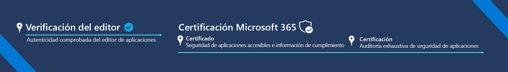

# Cumplimiento de Aplicaciones de Microsoft 365

El programa de cumplimiento de aplicaciones de Microsoft 365 es un enfoque de dos pasos para la seguridad y el cumplimiento de aplicaciones e incluye la verificación de Publisher y la certificación de Microsoft 365. Cada nivel se basa en el anterior y ofrece un programa escalonado para dar a los usuarios la confianza que necesitan al usar aplicaciones del ecosistema de Microsoft 365.  

Nuestra misión: proporcionar a los clientes de Microsoft una forma de confiar completamente en las aplicaciones que ejecutan sus organizaciones.

## Verificación del editor

[La verificación de editor](/azure/active-directory/develop/publisher-verification-overview) ayuda a los administradores y usuarios a comprender la autenticidad de la integración de los desarrolladores de aplicaciones con la Plataforma de identidad de Microsoft. Cuando se marca en una aplicación el "editor verificado", significa que el editor ha verificado su identidad con una cuenta de Microsoft Partner Network que ha completado el proceso de verificación y que ha asociado esta cuenta de MPN al registro de la aplicación.
La verificación de editor se usa con las aplicaciones que cumplan las condiciones siguientes:  
- Usar OAuth 2.0 y OpenID Connect para iniciar las sesiones de los usuarios y solicitar acceso a los datos con una API del servicio, como Microsoft Graph. 
- Registrarse en Azure AD como multiempresa.  

> [!IMPORTANT]
> La verificación de editor no impide que un desarrollador de aplicaciones inicie o complete la Certificación de editor o la Atestación de Microsoft 365. Si no se aplica a la comprobación de la aplicación, puede omitirse e iniciarse la atestación.

## Certificación Microsoft 365
El proceso de certificación de Microsoft 365 tiene dos fases: la **atestación** y la **certificación.**
1.  La **atestación** implica completar un cuestionario sobre los atributos de seguridad, control de datos y cumplimiento de una aplicación de vital importancia para los clientes. A continuación, toda la información se publica en un solo lugar y en un formato coherente y fácil de leer. El objetivo es acelerar el proceso de adopción de aplicaciones, mientras se asegura a los clientes que las aplicaciones que usan en sus espacios empresariales cumplen con los estándares de la organización.
1.  La **certificación** implica una auditoría exhaustiva de una aplicación contra un conjunto de controles derivados de marcos estándar líderes de la industria. Se pedirá a los ISV que proporcionen pruebas para demostrar que cumplen con cada control antes de obtener una certificación. El objetivo es dar a los clientes la seguridad de que pueden confiar en la aplicación porque las aplicaciones que han recibido una certificación de Microsoft 365 mostraron prácticas de seguridad y cumplimiento sólidas para proteger la seguridad de los datos y la privacidad.

La certificación Microsoft 365 se aplica a todas las aplicaciones que se integran con los siguientes productos de Microsoft:
-   Teams
-   Word
-   Excel
-   PowerPoint 
-   Outlook
- SharePoint
- Project
- OneNote
- **Webapps** (aplicaciones SaaS publicadas a través del marketplace comercial en Centro de partners se encuentran actualmente en una versión preliminar privada), si está interesado en participar, rellene este [formulario](https://forms.microsoft.com/Pages/ResponsePage.aspx?id=v4j5cvGGr0GRqy180BHbR3Om82jEdWlAkFiVJRhmM_xUQkY0SjVVOVVLR0RUN0RYNlRWMDRTSjVQRy4u).

### Introducción
- [Cómo completar la verificación de Publisher](/azure/active-directory/develop/mark-app-as-publisher-verified)
- [Cómo completar la certificación de Microsoft 365](/microsoft-365-app-certification/docs/certification)

