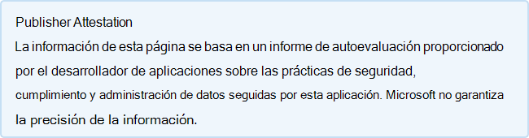

# ezTeam

Última actualización por el desarrollador el: 24 de febrero de 2021

* <a href="https://teams.microsoft.com/l/app/b02f0b53-d3b7-4d53-85a9-f820f5ab33c7" target="_blank">Ver en Teams tienda</a>
* <a href="https://appsource.microsoft.com/product/office/WA200002546" target="_blank">Ver en AppSource</a>

::: zone pivot="general"

### Información general

Información proporcionada por EnterprizID Inc a Microsoft:

| **Information** | **Respuesta** |
|:----------------|:-------------|
| Nombre de la aplicación | ezTeam |
| ID | WA200002546 |
| Office 365 clientes compatibles | Microsoft Teams |
| Nombre de la empresa asociada | EnterprizID Inc |
| URL del sitio web de socios | [https://enterprizid.com](https://enterprizid.com) |
| URL de Teams página de información de la aplicación | [https://enterprizid.com/discover/](https://enterprizid.com/discover/) |
| URL de la Política de Privacidad | [https://enterprizid.com/privacy-policy/](https://enterprizid.com/privacy-policy/) |
| URL de los Términos de uso | [https://enterprizid.com/terms-of-use/](https://enterprizid.com/terms-of-use/) |

 [!INCLUDE [Corrections or suggestions contact information](../includes/corrections-or-suggestions.md)]

::: zone-end

::: zone pivot="data"

### Cómo maneja la aplicación los datos

EnterprizID Inc ha proporcionado esta información sobre cómo esta aplicación recopila y almacena datos de organización y el control que su organización tendrá sobre los datos que recopila la aplicación.

#### Acceso a datos mediante Microsoft Graph

Enumere los [permisos de Microsoft Graph](https://docs.microsoft.com/graph/permissions-reference) que requiere esta aplicación.

>| **Permiso**  | **Tipo de permiso (Delegado/Aplicación)** | **¿Se recopilan datos? ¿Justificación para recogerlo?** | **¿Se almacenan los datos? ¿Justificación para almacenarlo?** | **Identificador de aplicación de Azure AD** |
>|:----------------|:--------------------|:---------------------------------------------------|:--------------------------|:--------------------------|
>| AppCatalog.Read.All | Delegado | Lista de aplicaciones disponibles en Teams para que podamos mostrarla en Teams proceso de creación de solicitudes | N/D | 2b1fb18f-54e4-4b08-9ef2-5610d0fffa8b |
>| Application.Read.All | Delegado | Permite que la aplicación lea las aplicaciones y entidades de servicio en nombre del usuario que ha iniciado sesión. | N/D | 2b1fb18f-54e4-4b08-9ef2-5610d0fffa8b |
>| Directory.AccessAsUser.All | Delegado | Permite que la aplicación tenga el mismo acceso a la información del directorio que el usuario que ha iniciado sesión. | N/D | 2b1fb18f-54e4-4b08-9ef2-5610d0fffa8b |
>| Directory.Read.All | Delegado | Permite que la aplicación lea los datos del directorio de su organización, como los usuarios, los grupos y las aplicaciones. | Teams Información sobre la propiedad y la membresía  | 2b1fb18f-54e4-4b08-9ef2-5610d0fffa8b |
>| Directory.Read.All | aplicación | Permite que la aplicación lea los datos del directorio de su organización, como los usuarios, los grupos y las aplicaciones sin iniciar sesión con ningún usuario. | N/D | 2b1fb18f-54e4-4b08-9ef2-5610d0fffa8b |
>| Directory.ReadWrite.All | Delegado | Permite a la aplicación leer y escribir datos en el directorio de su organización, como usuarios y grupos | N/D | 2b1fb18f-54e4-4b08-9ef2-5610d0fffa8b |
>| Directory.ReadWrite.All | aplicación | Permite que la aplicación lea y escriba los datos del directorio de su organización, como los usuarios y los grupos sin iniciar sesión con ningún usuario. No se permite la eliminación de un usuario o un grupo. | N/D | 2b1fb18f-54e4-4b08-9ef2-5610d0fffa8b |
>| Files.Read.All | aplicación | Permite que la aplicación lea todos los archivos de todas las colecciones de sitios sin la necesidad de que un usuario haya iniciado sesión. | Cantidad de datos bajo la gobernanza del usuario final en GB | 2b1fb18f-54e4-4b08-9ef2-5610d0fffa8b |
>| Group.Create | aplicación | Permite a la aplicación crear grupos sin un usuario que haya iniciado sesión. | Nuevos detalles de propiedades de grupo. | 2b1fb18f-54e4-4b08-9ef2-5610d0fffa8b |
>| Group.Read.All | Delegado | Permite que la aplicación enumere grupos y lea sus propiedades y todas las pertenencias a los grupos en nombre del usuario que ha iniciado sesión. Se utiliza para determinar Mi Teams  | N/D | 2b1fb18f-54e4-4b08-9ef2-5610d0fffa8b |
>| Group.Read.All | aplicación | Permite a la aplicación leer las propiedades y pertenencias del grupo, y leer el calendario y las conversaciones para todos los grupos, sin un usuario que haya iniciado sesión. | N/D | 2b1fb18f-54e4-4b08-9ef2-5610d0fffa8b |
>| Group.ReadWrite.All | Delegado | Permite que la aplicación cree grupos y lea todas las propiedades de los grupos y las pertenencias en nombre del usuario que ha iniciado sesión.  | N/D | 2b1fb18f-54e4-4b08-9ef2-5610d0fffa8b |
>| Group.ReadWrite.All | aplicación | Permite a la aplicación crear grupos, leer todas las propiedades y pertenencias de grupo, actualizar las propiedades y pertenencias del grupo y eliminar grupos. También permite a la aplicación leer y escribir calendario de grupo y conversaciones.  | Última actividad del Equipo. | 2b1fb18f-54e4-4b08-9ef2-5610d0fffa8b |
>| GroupMember.Read.All | aplicación | Permite que la aplicación lea pertenencias y propiedades de grupo básicas para todos los grupos sin un usuario que haya iniciado sesión. | N/D | 2b1fb18f-54e4-4b08-9ef2-5610d0fffa8b |
>| GroupMember.ReadWrite.All | aplicación | Permite que la aplicación enumere grupos, lea propiedades básicas, lea y actualice la pertenencia a los grupos a los que tiene acceso esta aplicación sin un usuario que haya iniciado sesión. | N/D | 2b1fb18f-54e4-4b08-9ef2-5610d0fffa8b |
>| People.Read.All | aplicación | Permite a la aplicación leer la lista puntuado de personas relevantes de cualquier usuario, sin un usuario que haya iniciado sesión. | N/D | 2b1fb18f-54e4-4b08-9ef2-5610d0fffa8b |
>| Reports.Read.All | Delegado | Permite a una aplicación leer todos los informes de uso de servicio en nombre del usuario que ha iniciado sesión. | N/D | 2b1fb18f-54e4-4b08-9ef2-5610d0fffa8b |
>| Reports.Read.All | aplicación | Permite a una aplicación leer todos los informes de uso de servicio sin necesidad de que un usuario haya iniciado sesión. | Última actividad de usuario por grupo | 2b1fb18f-54e4-4b08-9ef2-5610d0fffa8b |
>| Sites.ReadWrite.All | aplicación | Permite que la aplicación cree, lea, actualice y elimine documentos y elementos de lista de todas las colecciones de sitios sin necesidad de que un usuario haya iniciado sesión. | Los 10 mejores sitios por tamaño para cada usuario | 2b1fb18f-54e4-4b08-9ef2-5610d0fffa8b |
>| User.Read | Delegado | Permite a los usuarios iniciar sesión en la aplicación y permite a la aplicación leer el perfil de los usuarios que han iniciado sesión. | N/D | 2b1fb18f-54e4-4b08-9ef2-5610d0fffa8b |
>| User.Read.All | aplicación | Permite a la aplicación leer perfiles de usuario sin un usuario iniciado en sesión. | N/D | 2b1fb18f-54e4-4b08-9ef2-5610d0fffa8b |
>| offline_access | Delegado | Permite a la aplicación ver y actualizar los datos a los que le dio acceso, incluso cuando los usuarios no están utilizando actualmente la aplicación.  | Notificaciones de bots | 2b1fb18f-54e4-4b08-9ef2-5610d0fffa8b |
>| OpenID | Delegado | Permite que los usuarios inicien sesión en la aplicación con sus cuentas profesionales o educativas y permite que la aplicación vea la información básica del perfil del usuario. | N/D | 2b1fb18f-54e4-4b08-9ef2-5610d0fffa8b |
>| perfil | Delegado | Permite que la aplicación vea el perfil básico de los usuarios (nombre, imagen, nombre de usuario) | N/D | 2b1fb18f-54e4-4b08-9ef2-5610d0fffa8b |

#### No servicios Microsoft utilizado

Si la aplicación transfiere o comparte datos de organización con servicios que no son de Microsoft, enumere el servicio que no es de Microsoft que usa la aplicación, qué datos se transfieren e incluya una justificación de por qué la aplicación necesita transferir esta información.

>No se utilizan servicios Microsoft.

#### Acceso a datos a través de bots

Si esta aplicación contiene un bot o una extensión de mensajería, puede acceder a la información de identificación del usuario final (EUII): la lista (nombre, apellido, nombre para mostrar, dirección de correo electrónico) de cualquier miembro del equipo de un equipo o chat al que se agrega. ¿Esta aplicación hace uso de esta capacidad?

>| **¿Justificación para acceder a la EUII?**  | **¿Euii se almacena en bases de datos?** | **¿Justificación para almacenar EUII?** |
>|:--------------------------------|:---------------------|:--------------------------|
>| Mensajes de bienvenida, aprobación y notificaciones de procesos de certificación | Almacenamos el nombre para mostrar de las identidades  | Nuestra herramienta permite a los usuarios finales crear solicitudes de diferentes elementos de servicio y almacenamos el nombre para mostrar del solicitante. Una solicitud seguiría un flujo de trabajo de aprobación y necesitamos el nombre para mostrar del aprobador para mostrar los detalles de la solicitud. Además, en los miembros de un proceso de certificación de equipo enumeramos el nombre para mostrar de los miembros. |

#### Datos de telemetría

¿Aparece alguna información de identificación organizacional (OII) o información identificable por el usuario final (EUII) en la telemetría o los registros de esta aplicación? En caso afirmativo, describa qué datos se almacenan y cuáles son las directivas de retención y eliminación?

>EndUser y nombre completo de la organización. Las políticas de retención y eliminación se pueden encontrar en https://enterprizid.com/privacy-policy la sección Retención de sus datos &quot; personales &quot;

#### Controles organizativos para los datos almacenados por el socio

¿Describir cómo los administradores de la organización pueden controlar su información en los sistemas asociados? por ejemplo, eliminación, retención, auditoría, archivado, política de usuario final, etc.

>Hemos habilitado Privileged Access Management (PMA) dentro de Azure y las identidades con privilegios para conectarse a los recursos usan 2FA para aumentar la seguridad. Usamos Azure como nuestro proveedor de socios en la nube y estamos sujetos a la privacidad y los términos de uso de Azure

#### Revisión humana de la información organizacional

¿Están los seres humanos involucrados en la revisión o análisis de cualquier información de identificación organizacional (OII) datos que es recogido o almacenado por esta aplicación?

>Sí

[!INCLUDE [Corrections or suggestions contact information](../includes/corrections-or-suggestions.md)]

::: zone-end

::: zone pivot="mcas"

A continuación aparece información del catálogo [de Microsoft Cloud App Security.](https://www.microsoft.com/enterprise-mobility-security/cloud-app-security)

<iframe height='1020' title='Microsoft Cloud App Security información' src='https://appmcasinfoprod.azurewebsites.net/#/dashboard/36552' frameborder='no' style='width: 100%;'></iframe>

<a href="https://appmcasinfoprod.azurewebsites.net/#/dashboard/36552" target="_blank">Ver en una pestaña nueva</a>

[!INCLUDE [Corrections or suggestions contact information](../includes/corrections-or-suggestions.md)]

::: zone-end

::: zone pivot="identity"

### Información de identidad

EnterprizID Inc ha proporcionado esta información sobre cómo esta aplicación controla la autenticación, la autorización, las prácticas recomendadas de registro de aplicaciones y otros criterios de identidad.

| **Information** | **Respuesta** |
|:----------------|:-------------|
| ¿Se integra con Microsoft Identify Platform (Azure AD)?  | Sí |
| ¿Ha revisado y cumplido con todas las prácticas recomendadas aplicables descritas en la lista de verificación de integración de Plataforma de identidad de Microsoft?  | Sí |
| ¿La aplicación usa MSAL (Biblioteca de autenticación de Microsoft) para la autenticación? | No |
| ¿La aplicación admite directivas de acceso condicional? | No |
| ¿La aplicación solicita permisos de privilegios mínimos para su escenario? | Sí |
| ¿Los permisos registrados estáticamente de la aplicación reflejan con precisión los permisos que la aplicación solicitará de forma dinámica e incremental? | Sí |
| ¿La aplicación admite multi-tenencia? | Sí |
| ¿La aplicación tiene un cliente confidencial? | No |
| ¿Es propietario de toda la redirección del identificador unificado de recursos (URI) registrado para la aplicación? | Sí |
| Para la aplicación, ¿qué evitas usar? | - Uris de redirección comodín, - OAuth2 Flow implícitas, a menos que sea necesario para un SPA - Flujo de credenciales de contraseña del propietario de recursos (ROPC) |
| ¿La aplicación expone alguna API web? | Sí |
| ¿Su modelo de permisos solo permite que las llamadas se realicen correctamente si la aplicación cliente recibe el consentimiento adecuado? | Sí |
| ¿La aplicación usa API de vista previa? | Sí |
| ¿La aplicación usa API en desuso? | No |

[!INCLUDE [Corrections or suggestions contact information](../includes/corrections-or-suggestions.md)]

::: zone-end
